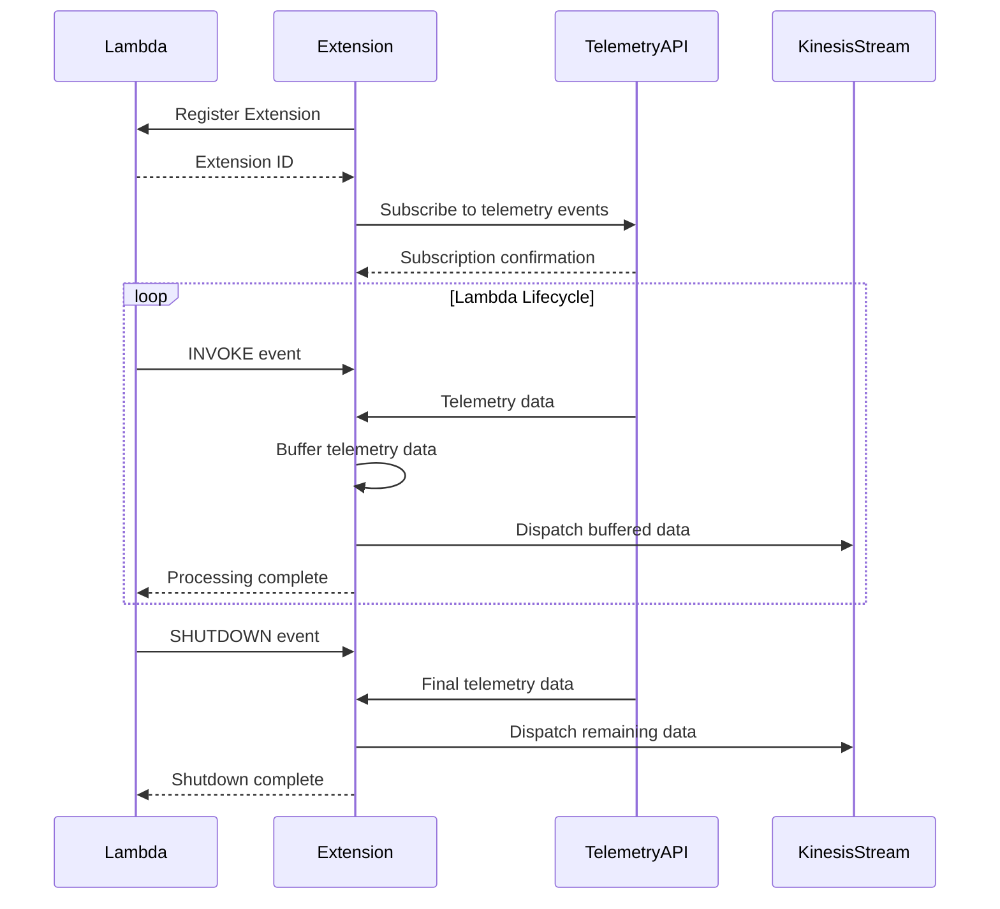

# Lambda Extensions Architecture

## Functionality Summary

The Lambda Extensions project provides a centralized repository for AWS Lambda Extensions that address various operational needs. The primary extension currently implemented is the Kinesis Telemetry Extension, which captures telemetry data from Lambda functions and forwards it to Amazon Kinesis Data Streams for real-time processing and analysis.

The Kinesis Telemetry Extension:
- Registers with the Lambda Extensions API to participate in the Lambda lifecycle
- Subscribes to the Lambda Telemetry API to receive function telemetry data
- Buffers telemetry events and dispatches them to a Kinesis stream
- Ensures all telemetry data is sent even during function shutdown
- Provides necessary IAM permissions through managed policies

## Process Sequence Diagram

## Infrastructure Diagram

## Infrastructure Dependency Table

### Inter-stack Dependencies

| Component | Depends On | Purpose |
|-----------|------------|---------|
| Kinesis Telemetry Extension | Lambda Extensions API | Registers extension and receives lifecycle events |
| Kinesis Telemetry Extension | Lambda Telemetry API | Subscribes to and receives telemetry data |
| Kinesis Telemetry Extension | IAM Managed Policy | Provides necessary permissions to write to Kinesis |
| Lambda Function | Kinesis Telemetry Extension Layer | Attaches the extension to the function |
| Lambda Function | IAM Managed Policy | Grants the function permission to use the extension |

### External Dependencies

| Component | External Dependency | Purpose |
|-----------|---------------------|---------|
| Kinesis Telemetry Extension | Kinesis Data Streams | Destination for telemetry data |
| Kinesis Telemetry Extension | CloudWatch Logs | Logs extension operations and errors |
| Kinesis Telemetry Extension | SSM Parameter Store | Stores extension ARN and policy ARN |
| Deployment Pipeline | AWS CDK | Infrastructure as code deployment |
| Deployment Pipeline | AWS CloudFormation | Underlying deployment mechanism |

## WAR Summary

### Warnings
- Extension shares the same memory and resources with the Lambda function
- Extension initialization must succeed before function initialization can start
- Extension execution time counts toward the function's timeout
- Failed Kinesis records are logged but not retried, which could lead to data loss

### Assumptions
- Lambda function uses a compatible runtime (Node.js 20.x or 22.x)
- Lambda function has sufficient permissions to use the extension
- Kinesis stream exists and is properly configured
- Extension has network connectivity to AWS services

### Risks
- Extension adds to the cold start time of Lambda functions
- Extension increases the memory footprint of the Lambda function
- High volume of telemetry data could impact function performance
- Extension timeout configuration must be carefully managed to avoid data loss
- Kinesis throttling could impact telemetry data delivery