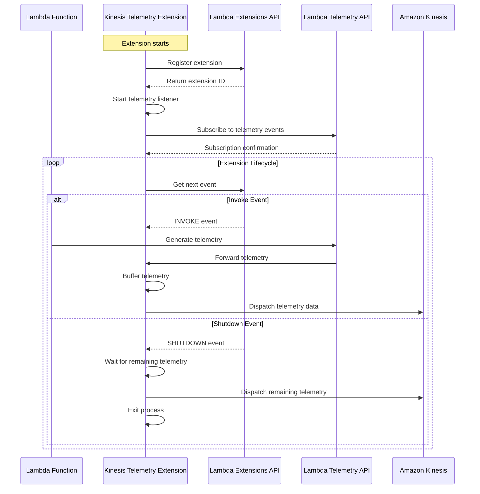
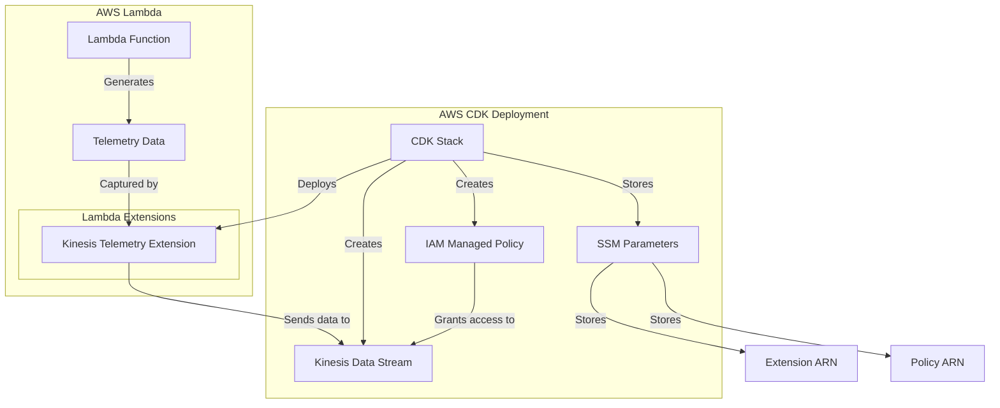

# Lambda Extensions Architecture Documentation

## Functionality Summary

The Lambda Extensions project provides a centralized repository for various AWS Lambda Extensions that serve different needs. Currently, it includes a Kinesis Telemetry Extension that captures telemetry data from Lambda functions and forwards it to Amazon Kinesis Data Streams.

### Kinesis Telemetry Extension

The Kinesis Telemetry Extension is designed to:

1. Register as an external extension with the Lambda Extensions API
2. Subscribe to the Lambda Telemetry API to receive telemetry events
3. Buffer telemetry events in memory
4. Dispatch collected telemetry data to a Kinesis Data Stream
5. Handle the complete Lambda extension lifecycle (init, invoke, shutdown)

This extension runs in a separate process from the Lambda function and can continue processing telemetry data even after the function execution has completed. It shares the same security boundaries, memory, and resources with the Lambda function.

## Process Sequence Diagram

## Infrastructure Diagram

## Infrastructure Dependency Table

### Inter-stack Dependencies

| Component | Type | Description | Dependencies |
|-----------|------|-------------|--------------|
| Kinesis Telemetry Extension | Lambda Layer | Extension that captures telemetry and sends to Kinesis | None |
| Kinesis Data Stream | AWS Kinesis | Stream that receives telemetry data | None |
| Extension IAM Managed Policy | IAM Policy | Grants permissions for the extension to write to Kinesis | Kinesis Data Stream |
| Extension ARN Parameter | SSM Parameter | Stores the ARN of the extension layer | Kinesis Telemetry Extension |
| Policy ARN Parameter | SSM Parameter | Stores the ARN of the managed policy | Extension IAM Managed Policy |

### External Dependencies

| External Dependency | Type | Purpose |
|--------------------|------|---------|
| Lambda Extensions API | AWS Service API | Enables extension registration and lifecycle management |
| Lambda Telemetry API | AWS Service API | Provides access to Lambda function telemetry data |
| AWS Kinesis | AWS Service | Destination for telemetry data |
| AWS IAM | AWS Service | Manages permissions for the extension |
| AWS SSM Parameter Store | AWS Service | Stores extension ARN and policy ARN |

## WAR Summary (Warnings, Assumptions, Risks)

### Warnings
- The extension shares the same memory and resources with the Lambda function, which could impact function performance
- Extension initialization must be successful before function initialization can start
- Extension timeout is tied to the function timeout
- Failed Kinesis records are logged but not retried, which could lead to data loss

### Assumptions
- Lambda functions using this extension will have JSON logging format enabled
- The extension assumes a specific structure for telemetry data
- The extension assumes it has sufficient permissions to write to Kinesis
- The extension assumes the Kinesis stream exists and is properly configured

### Risks
- High volume of telemetry data could exceed Kinesis throughput limits
- Network issues could prevent telemetry data from reaching Kinesis
- Extension errors could impact Lambda function execution
- Memory constraints could limit the buffer size for telemetry data
- Extension cold start adds latency to function initialization