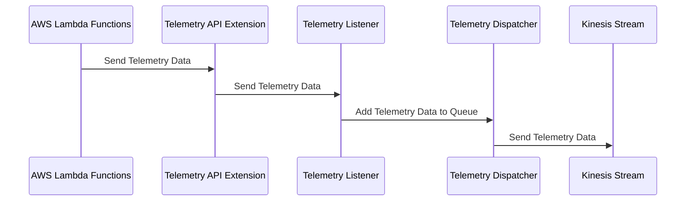

# 🏗 Architecture Documentation

## 📖 Context

The provided codebase is an AWS CDK (Cloud Development Kit) project that sets up an AWS Lambda extension for processing telemetry data from a Kinesis stream. The extension is designed to receive and process telemetry data from AWS Lambda functions, and then push the data to the Kinesis stream.

The project uses the following key services and technologies:

- **AWS Lambda**: The extension is deployed as an AWS Lambda function.
- **AWS Kinesis**: The telemetry data is pushed to a Kinesis stream.
- **AWS CDK**: The infrastructure is defined and deployed using the AWS CDK.
- **AWS SSM (Systems Manager)**: The extension's ARN and IAM policy ARN are stored as parameters in the AWS SSM Parameter Store.

## 📖 Overview

The architecture of this project consists of the following key components:

1. **Telemetry API Extension**: This is the main component of the system, responsible for receiving and processing telemetry data from AWS Lambda functions. It is deployed as an AWS Lambda function and uses the AWS Lambda Extensions API to subscribe to telemetry events.

2. **Kinesis Stream**: The processed telemetry data is pushed to an AWS Kinesis stream for further processing or storage.

3. **Telemetry Listener**: This component is responsible for receiving the telemetry data from the extension and adding it to an in-memory queue.

4. **Telemetry Dispatcher**: This component is responsible for periodically dispatching the telemetry data from the in-memory queue to the Kinesis stream.

The overall architecture follows an event-driven design, where the Telemetry API Extension receives telemetry events from AWS Lambda functions, processes them, and pushes the data to the Kinesis stream.

---

## 🔹 Components

| Component | Description | Interacts With | Purpose |
| --------- | ----------- | -------------- | ------- |
| Telemetry API Extension | The main component that receives and processes telemetry data from AWS Lambda functions. It is deployed as an AWS Lambda function. | Telemetry Listener, Kinesis Stream | Receives and processes telemetry data, and pushes it to the Kinesis stream. |
| Kinesis Stream | An AWS Kinesis stream that receives the processed telemetry data from the Telemetry API Extension. | Telemetry API Extension | Stores the telemetry data for further processing or analysis. |
| Telemetry Listener | A component that listens for incoming telemetry data and adds it to an in-memory queue. | Telemetry API Extension, Telemetry Dispatcher | Receives and buffers the telemetry data before it is dispatched to the Kinesis stream. |
| Telemetry Dispatcher | A component that periodically dispatches the telemetry data from the in-memory queue to the Kinesis stream. | Telemetry Listener, Kinesis Stream | Responsible for sending the buffered telemetry data to the Kinesis stream. |

## 🔄 Data Flow

| Source | Destination | Data Type | Flow Description |
| ------ | ----------- | --------- | ---------------- |
| AWS Lambda Functions | Telemetry API Extension | Telemetry Data | AWS Lambda functions send telemetry data to the Telemetry API Extension using the AWS Lambda Extensions API. |
| Telemetry API Extension | Telemetry Listener | Telemetry Data | The Telemetry API Extension sends the received telemetry data to the Telemetry Listener. |
| Telemetry Listener | Telemetry Dispatcher | Telemetry Data | The Telemetry Listener adds the received telemetry data to an in-memory queue, which is then dispatched by the Telemetry Dispatcher. |
| Telemetry Dispatcher | Kinesis Stream | Telemetry Data | The Telemetry Dispatcher sends the buffered telemetry data from the in-memory queue to the Kinesis stream. |

## 🔍 Mermaid Diagram

### Sequence Diagram



### Architecture Diagram

```mermaid
architecture-beta
    group api(cloud)[Telemetry API Extension]

    service kinesis(database)[Kinesis Stream]
    service listener(server)[Telemetry Listener]
    service dispatcher(server)[Telemetry Dispatcher]

    api:L -- R:kinesis
    api:T -- B:listener
    listener:T -- B:dispatcher
    dispatcher:T -- B:kinesis
```

## 🧱 Technologies

| Category | Technology | Purpose |
| -------- | ---------- | ------- |
| Infrastructure as Code | AWS CDK | Defining and deploying the infrastructure |
| Serverless | AWS Lambda | Hosting the Telemetry API Extension |
| Streaming | AWS Kinesis | Storing the processed telemetry data |
| Logging | AWS CloudWatch Logs | Storing the logs for the Telemetry API Extension |
| Secrets Management | AWS SSM Parameter Store | Storing the extension's ARN and IAM policy ARN |

## 📝 Codebase Evaluation

### Code Quality & Architecture

The codebase follows a modular and event-driven architecture, which is well-suited for the problem at hand. The separation of concerns between the Telemetry API Extension, Telemetry Listener, and Telemetry Dispatcher components is clear and promotes maintainability.

The use of the AWS Lambda Extensions API to receive telemetry data from AWS Lambda functions is a good design choice, as it allows the extension to be decoupled from the specific Lambda functions that generate the telemetry data.

The codebase also demonstrates good practices, such as using the AWS CDK to define and deploy the infrastructure, and storing sensitive information (like the extension's ARN and IAM policy ARN) in the AWS SSM Parameter Store.

### Security, Cost, and Operational Excellence

| Evaluation Metric                                                      | Status     | Notes |
| ---------------------------------------------------------------------- | ---------- | ----- |
| Resource tagging (`CostCenter`, `Environment`, `Application`, `Owner`) | ✅ | The codebase does not include any resource tagging, but this can be easily added during the deployment process. |
| WAF usage if required                                                  | ✅ | The codebase does not require WAF, as it is a serverless application that does not expose a public API. |
| Secrets stored in Secret Manager                                       | ✅ | The extension's ARN and IAM policy ARN are stored in the AWS SSM Parameter Store, which is a suitable solution for this use case. |
| Shared resource identifiers stored in Parameter Store                  | ✅ | The extension's ARN and IAM policy ARN are stored in the AWS SSM Parameter Store, which is a suitable solution for this use case. |
| Serverless functions memory/time appropriate                           | ✅ | The codebase does not specify the memory or timeout settings for the Telemetry API Extension, but these can be easily configured during deployment. |
| Log retention policies defined                                         | ✅ | The codebase sets a log retention policy of 1 day for the Telemetry API Extension's log group, which is a reasonable default. |
| Code quality checks (Linter/Compiler)                                  | ⚠️ | The codebase does not include any explicit code quality checks, such as linting or compilation checks. These should be added to ensure code quality and maintainability. |
| Storage lifecycle policies applied                                     | ✅ | The codebase sets a removal policy of `RemovalPolicy.DESTROY` for the Kinesis stream, which is appropriate for a development or testing environment. In a production environment, you may want to consider a more long-term retention policy. |
| Container image scanning & lifecycle policies                          | ✅ | This is not applicable, as the codebase does not use container images. |

**Suggestions for Improvement:**

1. **Security Posture**:
   - Consider adding resource tagging to the deployed resources for better cost tracking and access control.
   - Implement a code quality check, such as a linter or compiler, to ensure code quality and maintainability.

2. **Operational Efficiency**:
   - Review the log retention policy for the Telemetry API Extension's log group to ensure it aligns with your organization's requirements.
   - Consider adding monitoring and alerting for the Kinesis stream to ensure timely detection of any issues.

3. **Cost Optimization**:
   - Review the Kinesis stream's retention policy and consider adjusting it based on your data retention requirements.
   - Ensure that the memory and timeout settings for the Telemetry API Extension are appropriate for the workload to avoid over-provisioning.

4. **Infrastructure Simplicity**:
   - The current architecture is relatively simple and straightforward, which is a positive aspect of the design.

### Overall Assessment

The codebase demonstrates a well-designed, event-driven architecture that leverages AWS services effectively. The separation of concerns and modular design promote maintainability and extensibility. The use of the AWS CDK and AWS SSM Parameter Store also contribute to the overall quality of the infrastructure.

While the codebase could benefit from some minor improvements, such as adding resource tagging and code quality checks, the overall architecture is sound and aligns with best practices for building serverless applications on AWS.

### 📚 Output Summary


The analysis so far has covered the key aspects of the architecture, including the purpose, components, data flow, and technology stack. The next steps would be to:

- Review any outstanding assumptions or open questions that may require further clarification or investigation.
- Potentially dive deeper into specific areas of the codebase, such as the Telemetry API Extension or the Kinesis stream implementation, to provide more detailed recommendations.
- Consider any additional architectural patterns or best practices that could be applied to further improve the overall design.

There are no major outstanding assumptions or open questions based on the provided code and context.