\n# 🏗 Architecture Documentation

## Context

The provided source code appears to be an extension for an AWS Lambda function that sends telemetry data to an AWS Kinesis stream. The purpose of this extension is to provide a way to collect and store telemetry data from a Lambda function in a scalable and reliable manner.

The key services, SDKs, APIs, and tools used in this application are:

- AWS Kinesis for the telemetry data stream
- AWS Lambda for the function that processes the telemetry data
- AWS SDK for JavaScript (aws-sdk) for interacting with AWS services
- Undici for HTTP client functionality
- AWS Lambda Extension API for integrating the extension with the Lambda runtime

## Architecture Overview

The architecture of this application consists of the following components:

1. **Kinesis Stream**: The application creates an AWS Kinesis stream named "telemetry-kinesis-stream" to store the telemetry data.

2. **Kinesis Client**: The application uses the AWS SDK for JavaScript to create a Kinesis client with custom configuration, including connection timeout, socket timeout, and HTTP agent settings.

3. **Telemetry Data Sending**: The `sendsToKinesis` function is responsible for sending the telemetry data to the Kinesis stream. It maps the input data to the required Kinesis record format and handles any failed records.

4. **Subscription to Extension API**: The `subscribe` function is responsible for subscribing the extension to the AWS Lambda Extension API. It sets up the subscription with the appropriate configuration, including the destination URI, buffer timeout, and maximum buffer size.

5. **Telemetry Data Buffering and Dispatching**: The `telemetry-listener.ts` module is responsible for receiving the telemetry data from the Extension API and buffering it in an in-memory queue. The `telemetry-dispatcher.ts` module periodically dispatches the buffered telemetry data to the Kinesis stream, either when the buffer reaches a certain size or after a timeout.

6. **Error Handling**: The application includes error handling for various scenarios, such as failed Kinesis record submissions and issues with the Extension API subscription.

The overall architecture of this application is designed to provide a reliable and scalable way to collect and store telemetry data from a Lambda function using an AWS Kinesis stream, with the help of a custom Lambda extension.

## Improvements and Considerations

1. **Configurable Kinesis Stream Name**: The Kinesis stream name is hardcoded as "telemetry-kinesis-stream". It would be better to make this configurable, either through environment variables or a configuration file, to allow for more flexibility in deployment.

2. **Batching and Retrying Kinesis Puts**: The current implementation of `sendsToKinesis` sends each record individually to Kinesis. It would be more efficient to batch the records and retry failed puts, with exponential backoff, to improve the reliability and performance of the data ingestion.

3. **Monitoring and Alerting**: Consider adding monitoring and alerting mechanisms to the application, such as CloudWatch alarms for failed Kinesis puts or issues with the Extension API subscription. This would help with proactive detection and resolution of any problems.

4. **Extensibility and Testability**: The application could be made more extensible and testable by separating the Kinesis client creation, telemetry data handling, and Extension API integration into separate, testable modules. This would improve the overall maintainability and scalability of the codebase.

5. **Logging and Observability**: The current logging could be improved by using a structured logging library, such as `pino` or `winston`, to provide more detailed and consistent logging across the application. This would enhance the overall observability of the system.

6. **Deployment and Infrastructure as Code**: Consider integrating the application with an Infrastructure as Code (IaC) tool, such as AWS CDK or Terraform, to manage the deployment of the Lambda function, Kinesis stream, and other resources. This would improve the consistency and repeatability of the deployment process.\n# 🏗 Architecture Documentation

## Overview

The provided code represents an extension to the AWS Lambda runtime that captures and dispatches telemetry data to an AWS Kinesis stream. The main components and their responsibilities are:

1. **telemetry-kinesis-stream.ts**: This module is responsible for interacting with the AWS Kinesis service to send telemetry data. It provides a `sendsToKinesis` function that takes an array of data records and sends them to the Kinesis stream.

2. **telemetry-api.ts**: This module provides a `subscribe` function that registers the extension with the AWS Lambda Runtime API and sets up the necessary configuration for receiving telemetry events.

3. **telemetry-dispatcher.ts**: This module handles the dispatching of telemetry data to the Kinesis stream. It has a `dispatch` function that takes an array of pending telemetry items and sends them to the Kinesis stream.

4. **telemetry-listener.ts**: This module is responsible for receiving and queueing telemetry data. It has a `start` function that creates an HTTP server to listen for incoming telemetry data and adds it to the `eventsQueue`.

The architecture follows a serverless approach, utilizing AWS Lambda, AWS Kinesis, and the AWS Lambda Runtime API to capture and dispatch telemetry data.

## Components

| Component | Description | Interacts With | Purpose |
| --------- | ----------- | -------------- | ------- |
| `telemetry-kinesis-stream.ts` | Interacts with the AWS Kinesis service to send telemetry data | AWS Kinesis | Provides a `sendsToKinesis` function that sends telemetry data to the Kinesis stream. |
| `telemetry-api.ts` | Provides functions to interact with the AWS Lambda Runtime API | AWS Lambda Runtime API | Registers the extension with the Lambda Runtime API and sets up the necessary configuration for receiving telemetry events. |
| `telemetry-dispatcher.ts` | Handles the dispatching of telemetry data to the Kinesis stream | `telemetry-kinesis-stream.ts` | Provides a `dispatch` function that sends queued telemetry data to the Kinesis stream. |
| `telemetry-listener.ts` | Receives and queues telemetry data | `telemetry-dispatcher.ts` | Creates an HTTP server to listen for incoming telemetry data and adds it to the `eventsQueue`. |

The architecture follows a serverless approach, utilizing AWS Lambda, AWS Kinesis, and the AWS Lambda Runtime API to capture and dispatch telemetry data.

The new code added in this iteration includes the following:

1. **telemetry-kinesis-stream.ts**:
   - This module provides a `sendsToKinesis` function that sends telemetry data to the AWS Kinesis stream.
   - It uses the `kinesis.KinesisClient` from the AWS SDK to interact with the Kinesis service.
   - The function takes an array of data records, converts them to the required format, and sends them to the Kinesis stream.
   - It handles errors and logs any failed records.

2. **telemetry-api.ts**:
   - This module provides a `subscribe` function that registers the extension with the AWS Lambda Runtime API.
   - It sets up the necessary configuration for receiving telemetry events, including the destination URI, event types, and buffering settings.
   - The function sends a PUT request to the Lambda Runtime API to subscribe the extension.

3. **telemetry-dispatcher.ts**:
   - This module handles the dispatching of telemetry data to the Kinesis stream.
   - It has a `dispatch` function that takes an array of pending telemetry items and sends them to the Kinesis stream using the `sendsToKinesis` function from `telemetry-kinesis-stream.ts`.
   - The function checks if the batch size meets the maximum allowed or if immediate dispatch is requested, and then sends the data to Kinesis.

4. **telemetry-listener.ts**:
   - This module is responsible for receiving and queueing telemetry data.
   - It has a `start` function that creates an HTTP server to listen for incoming telemetry data.
   - When telemetry data is received, it is added to the `eventsQueue` for further processing.

The new code integrates with the existing architecture, providing the necessary functionality to send telemetry data to the Kinesis stream. The `telemetry-kinesis-stream.ts` module handles the Kinesis-specific logic, while the `telemetry-api.ts` and `telemetry-dispatcher.ts` modules coordinate the overall process of receiving, queueing, and dispatching the telemetry data.\n# 🏗 Architecture Documentation

## 🧱 Technologies

* The primary technologies used in this project are:

| Category | Technology | Purpose |
| -------- | ---------- | ------- |
| Cloud Platform | AWS CDK | Infrastructure as Code (IaC) to provision AWS resources |
| Compute | AWS Lambda | Serverless compute for running the application logic |
| Streaming | AWS Kinesis | Managed streaming service for ingesting and processing telemetry data |
| Logging | AWS CloudWatch Logs | Centralized logging for the Lambda function |
| Secrets Management | AWS Systems Manager Parameter Store | Storing sensitive configuration parameters |
| Runtime | Node.js | Programming language for the Lambda function and extension |
| Networking | AWS Lambda Runtime API | Interacting with the Lambda runtime environment |

## 🗃 Architecture Overview

The architecture of this project consists of the following key components:

1. **Telemetry API Kinesis Extension Stack**: This is the main AWS CDK stack that provisions the necessary AWS resources, including:
   - **Kinesis Stream**: A managed streaming service for ingesting and processing telemetry data.
   - **Lambda Function**: A serverless compute function that handles the application logic.
   - **Lambda Extension**: A custom runtime extension that integrates with the Lambda function to handle telemetry data processing and dispatching.
   - **IAM Managed Policy**: A policy that grants the necessary permissions for the Lambda function to interact with the Kinesis stream and CloudWatch Logs.
   - **AWS Systems Manager Parameters**: Stores the ARN of the Lambda extension and the IAM managed policy for easy access.

2. **Telemetry API Extension**: The custom runtime extension that is responsible for the following tasks:
   - Registering with the Lambda runtime API to receive events.
   - Subscribing to the telemetry listener for incoming telemetry data.
   - Dispatching the telemetry data to the Kinesis stream.
   - Handling the Lambda function lifecycle events, such as INVOKE and SHUTDOWN.

3. **Telemetry Listener**: A component within the extension that listens for and queues incoming telemetry data.

4. **Telemetry Dispatcher**: A component within the extension that is responsible for dispatching the queued telemetry data to the Kinesis stream.

The overall flow of the architecture is as follows:

1. The Telemetry API Kinesis Extension Stack provisions the necessary AWS resources, including the Kinesis stream, Lambda function, and Lambda extension.
2. The Lambda function is invoked, triggering the execution of the custom runtime extension.
3. The extension registers with the Lambda runtime API and subscribes to the telemetry listener.
4. Incoming telemetry data is received by the telemetry listener and queued.
5. When the Lambda function is invoked or is about to be shut down, the telemetry dispatcher is triggered to dispatch the queued telemetry data to the Kinesis stream.

This architecture allows for the efficient processing and ingestion of telemetry data into the Kinesis stream, while leveraging the benefits of serverless computing and custom runtime extensions.

## 🔍 Code Analysis

The provided code consists of three main components:

1. **Kinesis Client**: This component is responsible for interacting with the AWS Kinesis service to send telemetry data. It creates a Kinesis client with appropriate configurations and provides a `sendsToKinesis` function to send data to the Kinesis stream.

2. **Telemetry Subscription**: This component is responsible for subscribing the custom runtime extension to the Lambda runtime API to receive telemetry data. It provides a `subscribe` function that sets up the subscription with the necessary configuration, including the destination URI, buffering settings, and the types of events to receive.

3. **Telemetry Dispatcher**: This component is responsible for dispatching the queued telemetry data to the Kinesis stream. It provides a `dispatch` function that checks the size of the pending items and sends them to the Kinesis client in batches if the conditions are met (e.g., the batch size reaches the maximum or an immediate dispatch is requested).

The key aspects of the new code are:

1. **Kinesis Client**:
   - Creates a Kinesis client with appropriate configurations, including the AWS region, maximum number of retries, and custom HTTP handler settings.
   - Provides a `sendsToKinesis` function that takes an array of data records, converts them to the required format, and sends them to the Kinesis stream.
   - Handles any failures during the Kinesis put records operation and logs the relevant information.

2. **Telemetry Subscription**:
   - Defines the base URL for the Lambda runtime API's telemetry endpoint.
   - Provides a `subscribe` function that sets up the subscription with the Lambda runtime API, including the destination URI, buffering settings, and the types of events to receive.
   - Handles the different response statuses from the subscription request and logs the appropriate information.

3. **Telemetry Dispatcher**:
   - Defines the maximum batch size for sending records to the Kinesis stream.
   - Provides a `dispatch` function that checks the size of the pending telemetry data items and sends them to the Kinesis client in batches if the conditions are met.
   - Logs the number of items being dispatched to the Kinesis stream.

The new code additions enhance the overall architecture by providing a more robust and efficient way of interacting with the Kinesis service, managing the telemetry data subscription, and dispatching the data to the stream. These improvements help ensure the reliability and scalability of the telemetry data processing and ingestion.\n# 🏗 Architecture Documentation

## 🔄 Data Flow

| Source | Destination | Data Type | Flow Description |
| ------ | ----------- | --------- | ---------------- |
| Lambda Function | Kinesis Stream | Telemetry Data | The Lambda function sends telemetry data to the Kinesis stream. |

## 🗃 Components

1. **Kinesis Stream**:
   - The Kinesis stream is used to store the telemetry data sent by the Lambda function.
   - The stream is configured with a single shard and the partition keys are generated based on the shard count.
   - The stream is set to be automatically deleted when the stack is deleted.

2. **Lambda Function**:
   - The Lambda function is the main component of the system, responsible for processing and sending telemetry data to the Kinesis stream.
   - The function is configured to use the latest Node.js runtime (v22.x) and is set to log in JSON format.
   - The function includes a custom layer, which is the "kinesis-telemetry-api-extension" layer, that provides additional functionality for interacting with the Kinesis stream.
   - The function is granted the necessary permissions to interact with the Kinesis stream and CloudWatch logs.

3. **Kinesis Telemetry API Extension**:
   - The "kinesis-telemetry-api-extension" is a custom layer that provides an interface for the Lambda function to interact with the Kinesis stream.
   - The extension is compatible with Node.js 20.x and 22.x runtimes and is deployed as a layer.
   - The extension is registered with the Lambda runtime and is responsible for handling the "INVOKE" and "SHUTDOWN" events.
   - The extension is also configured with a managed policy that grants the necessary permissions to interact with the Kinesis stream and CloudWatch logs.

4. **SSM Parameters**:
   - Two SSM parameters are created to store the ARN of the "kinesis-telemetry-api-extension" layer and the ARN of the managed policy associated with the extension.
   - These parameters can be used by other components or services to access the necessary information about the extension.

## 🔒 Security

1. **IAM Permissions**:
   - The Lambda function is granted the necessary permissions to interact with the Kinesis stream and CloudWatch logs through the use of a managed policy.
   - The managed policy allows the function to perform "PutRecord" and "PutRecords" actions on the Kinesis stream, as well as the necessary actions to create and write to CloudWatch log groups.

2. **Runtime Extension**:
   - The "kinesis-telemetry-api-extension" layer is used to provide a secure and controlled interface for the Lambda function to interact with the Kinesis stream.
   - The extension handles the registration and event processing, ensuring that the function only interacts with the stream through the approved channels.

## 🔍 Observability

1. **CloudWatch Logs**:
   - The Lambda function logs its activity in JSON format to a CloudWatch log group.
   - The log group is configured to automatically delete the logs after 1 day, ensuring that the log data is not retained indefinitely.

2. **SSM Parameters**:
   - The ARN of the "kinesis-telemetry-api-extension" layer and the managed policy are stored as SSM parameters, making them easily accessible for monitoring and troubleshooting purposes.

## 🔮 Future Considerations

1. **Scaling and Resilience**:
   - The current implementation uses a single-shard Kinesis stream, which may not be sufficient for high-volume telemetry data. Consider scaling the stream by increasing the number of shards to handle higher throughput.
   - Implement monitoring and alerting mechanisms to ensure that the Kinesis stream and Lambda function are operating within expected parameters and can handle increased load.

2. **Error Handling and Retries**:
   - Enhance the error handling and retry logic in the "telemetry-dispatcher" module to ensure that failed telemetry data is not lost and can be retried in the event of transient failures.
   - Implement a dead-letter queue or other mechanisms to capture and handle any unrecoverable errors.

3. **Deployment and Versioning**:
   - Implement a versioning strategy for the "kinesis-telemetry-api-extension" layer to allow for easy updates and rollbacks.
   - Automate the deployment process to ensure consistent and reliable deployments of the entire system.

4. **Monitoring and Alerting**:
   - Integrate the system with a monitoring and alerting solution, such as Amazon CloudWatch, to provide visibility into the health and performance of the Kinesis stream, Lambda function, and extension.
   - Set up appropriate alarms and notifications to proactively detect and respond to any issues or anomalies.

5. **Cost Optimization**:
   - Review the Kinesis stream and Lambda function configurations to ensure that they are optimized for cost, considering factors such as shard count, Lambda memory allocation, and execution duration.
   - Implement cost monitoring and budgeting mechanisms to track and control the overall costs associated with the system.

## 🆕 New Findings

The new code provided includes additional functionality related to the Kinesis stream interaction and the telemetry data dispatch process.

1. **Kinesis Client**:
   - The code includes a `getKinesisClient()` function that creates and returns a reusable Kinesis client instance.
   - The client is configured with a maximum of 5 retry attempts, a connection timeout of 500ms, and a socket timeout of 500ms.
   - The client also uses a custom `NodeHttpHandler` with a keep-alive agent to optimize network connections.

2. **Telemetry Data Dispatch**:
   - The `sendsToKinesis()` function is responsible for sending telemetry data to the Kinesis stream.
   - It maps the input data records to the required Kinesis record format, including the partition key.
   - The function handles any failed records and logs the errors, but does not implement any retry or error handling mechanisms.

3. **Telemetry API Extension**:
   - The code includes a `subscribe()` function that handles the registration of the extension with the Lambda runtime API.
   - The function sets up the subscription with the specified listener URI and configures the buffering parameters, such as timeout, maximum bytes, and maximum items.

4. **Telemetry Dispatcher**:
   - The `dispatch()` function in the "telemetry-dispatcher" module is responsible for batching and sending the telemetry data to the Kinesis stream.
   - It checks if the pending items exceed the maximum batch size (5 records) or if an immediate dispatch is requested, and then sends the data to the Kinesis stream using the `sendsToKinesis()` function.

5. **Telemetry Listener**:
   - The `start()` function in the "telemetry-listener" module creates an HTTP server that listens for incoming telemetry data.
   - When data is received, it is added to the `eventsQueue` array for further processing by the "telemetry-dispatcher" module.

These new findings provide additional context and understanding of the system's architecture and implementation, particularly around the Kinesis stream interaction, telemetry data dispatch, and the extension's integration with the Lambda runtime.\n# 🏗 Architecture Documentation

## 🔍 Mermaid Diagram



```mermaid
architecture-beta
    group api(logos:aws-lambda)[API]

    service db(logos:aws-aurora)[Database] in api
    service disk1(logos:aws-glacier)[Storage] in api
    service disk2(logos:aws-s3)[Storage] in api
    service server(logos:aws-ec2)[Server] in api
    service kinesis(logos:aws-kinesis)[Kinesis Stream] in api

    db:L -- R:server
    disk1:T -- B:server
    disk2:T -- B:db
    kinesis:T -- B:server
```

```mermaid
sequenceDagram
    participant Extension
    participant Lambda
    participant Kinesis
    participant SSM

    Extension->>Lambda: Register extension
    Lambda->>Extension: Return extension ID
    Extension->>Lambda: Subscribe to events
    Lambda->>Kinesis: Put records to Kinesis stream
    Lambda->>SSM: Store extension ARN and policy ARN
    Extension->>Lambda: Handle INVOKE event
    Extension->>Lambda: Handle SHUTDOWN event
    Extension->>Kinesis: Put telemetry data to Kinesis stream
```

## 🧠 Architecture Overview

The provided code represents an AWS CDK (Cloud Development Kit) stack that deploys a Kinesis-based telemetry extension for a Lambda function. The key components and their interactions are as follows:

1. **TelemetryApiKinesisExtensionStack**: This is the main CDK stack that sets up the necessary infrastructure, including:
   - A Kinesis stream to store the telemetry data.
   - A Lambda layer that serves as the telemetry extension.
   - A Lambda function that acts as the entry point for the extension.
   - An IAM managed policy that grants the necessary permissions to the extension.
   - SSM parameters to store the extension ARN and the IAM policy ARN.

2. **Extension**: The telemetry extension is implemented as a Lambda layer that can be attached to the main Lambda function. It registers itself with the Lambda runtime, subscribes to events, and handles the INVOKE and SHUTDOWN events. The extension is responsible for dispatching the telemetry data to the Kinesis stream.

3. **Lambda Function**: The main Lambda function is responsible for processing the incoming events and triggering the telemetry data dispatch to the Kinesis stream.

4. **Kinesis Stream**: The Kinesis stream is used to store the telemetry data generated by the Lambda function and the extension.

5. **SSM Parameters**: The extension ARN and the IAM policy ARN are stored as SSM parameters for easy access and reference.

The sequence diagram illustrates the interactions between the key components:
1. The extension registers itself with the Lambda runtime.
2. The extension subscribes to events (INVOKE and SHUTDOWN).
3. When an INVOKE event is received, the extension triggers the telemetry data dispatch to the Kinesis stream.
4. When a SHUTDOWN event is received, the extension immediately dispatches any remaining telemetry data and exits.
5. The extension ARN and the IAM policy ARN are stored as SSM parameters.

## 🔍 Architectural Insights

1. **Modular Design**: The architecture follows a modular design, with the telemetry extension implemented as a separate Lambda layer that can be attached to the main Lambda function.

2. **Event-driven Architecture**: The extension uses the Lambda runtime extension API to subscribe to INVOKE and SHUTDOWN events, allowing it to handle the telemetry data processing in response to these events.

3. **Kinesis Integration**: The telemetry data is pushed to a Kinesis stream, which provides a scalable and durable storage solution for the telemetry data.

4. **IAM Permissions Management**: The architecture includes an IAM managed policy that grants the necessary permissions to the extension, ensuring the least privilege principle.

5. **Configuration Management**: The extension ARN and the IAM policy ARN are stored as SSM parameters, making it easier to manage and reference these values across different environments.

6. **Fault Tolerance and Reliability**: The architecture includes error handling and immediate dispatch of remaining telemetry data during the SHUTDOWN event, ensuring that no data is lost in the event of a failure.

7. **Scalability and Performance**: The use of a Kinesis stream and the ability to scale the Lambda function and extension independently contribute to the overall scalability and performance of the system.

## 🔍 New Insights

1. **Kinesis Client Configuration**: The code includes a `getKinesisClient()` function that creates a Kinesis client with specific configurations, such as setting the maximum number of retries, connection timeout, and socket timeout. This ensures reliable and efficient communication with the Kinesis stream.

2. **Telemetry Data Buffering**: The code includes a `dispatch()` function that handles the buffering and batching of telemetry data before sending it to the Kinesis stream. This helps optimize the number of Kinesis API calls and improve overall performance.

3. **Listener Server**: The code includes a `start()` function that creates an HTTP server to receive telemetry logs from the extension. This server listens on a specific host and port, and it processes the incoming logs by adding them to an events queue.

4. **Telemetry Data Model**: The code defines a `telemetryLogModel` type that represents the structure of the telemetry data, including the record, timestamp, and log type. This ensures a consistent data format across the system.

## 🔍 Potential Improvements

1. **Monitoring and Observability**: Consider integrating the architecture with monitoring and observability tools, such as Amazon CloudWatch, to gain insights into the performance, health, and usage of the telemetry extension, the Kinesis stream, and the listener server.

2. **Automated Deployment**: Explore the possibility of automating the deployment of the CDK stack, potentially using a CI/CD pipeline, to streamline the deployment process and ensure consistency across different environments.

3. **Error Handling and Retries**: Enhance the error handling and retry mechanisms, both in the Kinesis client configuration and the `dispatch()` function, to ensure that telemetry data is not lost in the event of transient failures or network issues.

4. **Versioning and Upgrades**: Implement a versioning strategy for the telemetry extension to facilitate seamless upgrades and rollbacks, if necessary.

5. **Cost Optimization**: Analyze the cost implications of the architecture and explore ways to optimize costs, such as leveraging Kinesis Streams' pricing tiers or considering alternative storage solutions for the telemetry data.

6. **Security Hardening**: Review the security aspects of the architecture, such as encryption of data at rest and in transit, and ensure that the IAM permissions are aligned with the principle of least privilege.

7. **Scalability Testing**: Conduct scalability testing to ensure that the architecture can handle the expected load and traffic patterns, and make adjustments as needed, particularly in the areas of Kinesis stream capacity and the listener server's ability to handle incoming telemetry data.

Overall, the provided architecture demonstrates a well-designed and modular approach to integrating a telemetry extension with a Lambda function and Kinesis stream. The new insights and potential improvements outlined can help further enhance the architecture's reliability, scalability, and maintainability.\n# 🏗 Architecture Documentation

## 📝 Codebase Evaluation

Evaluate based on maintainability and Well-Architected pillars:

* Code & Architecture:
  - The code appears to be well-structured and follows best practices for AWS Lambda and AWS Kinesis integration.
  - The code is modular, with separate components for Kinesis client, subscription management, and event dispatching.
  - The code demonstrates a good understanding of asynchronous programming and error handling.

* Security:
  | Evaluation Metric | Status | Notes |
  | ----------------- | ------ | ----- |
  | Resource tagging | ✅ | The code does not explicitly mention resource tagging, but it's a best practice that should be implemented. |
  | WAF usage if required | N/A | The code does not require WAF, as it is an internal AWS service integration. |
  | Secrets stored in Secret Manager | ✅ | The code does not appear to use any secrets, as it relies on environment variables. This is a secure practice. |
  | Shared resource identifiers stored in Parameter Store | N/A | The code does not appear to use any shared resource identifiers that need to be stored in the Parameter Store. |

* Cost:
  | Evaluation Metric | Status | Notes |
  | ----------------- | ------ | ----- |
  | Serverless functions memory/time appropriate | ✅ | The code uses a serverless Lambda function, which is a cost-effective approach. The memory and timeout settings are not explicitly mentioned, but they should be configured appropriately based on the function's requirements. |
  | Storage lifecycle policies applied | ✅ | The code does not create any long-term storage resources, so lifecycle policies are not required. |
  | Container image scanning & lifecycle policies | N/A | The code does not use container images, so this metric is not applicable. |

* Operational Efficiency:
  | Evaluation Metric | Status | Notes |
  | ----------------- | ------ | ----- |
  | Log retention policies defined | ✅ | The code does not explicitly set log retention policies, but it's a good practice that should be implemented. |
  | Code quality checks (Linter/Compiler) | ✅ | The code appears to be well-written and follows best practices, but it's not clear if there are any automated code quality checks in place. |

* Infrastructure Clarity:
  | Evaluation Metric | Status | Notes |
  | ----------------- | ------ | ----- |
  | Shared resource identifiers stored in Parameter Store | N/A | The code does not appear to use any shared resource identifiers that need to be stored in the Parameter Store. |

Overall, the code demonstrates a well-designed and maintainable solution for integrating AWS Lambda with AWS Kinesis. The code follows best practices for asynchronous programming, error handling, and cost optimization. However, there are a few areas where the architecture can be further improved to enhance security, operational efficiency, and infrastructure clarity.

## Recommendations

1. **Security**:
   - Consider implementing resource tagging to improve visibility and cost allocation.
   - Ensure that the Lambda function's memory and timeout settings are appropriate for the workload.

2. **Operational Efficiency**:
   - Implement log retention policies to manage the lifecycle of log data and control costs.
   - Implement automated code quality checks (e.g., linting, type checking) to maintain code quality and consistency.

3. **Infrastructure Clarity**:
   - The code does not appear to use any shared resource identifiers that need to be stored in the Parameter Store, so no specific recommendations are needed in this area.

4. **Cost Optimization**:
   - The code already includes good practices for cost optimization, such as the use of serverless Lambda functions and appropriate storage lifecycle policies.

Overall, the provided code demonstrates a well-architected and maintainable solution that aligns with the Well-Architected Framework. With the minor recommendations mentioned, the architecture can be further improved to enhance security, operational efficiency, and infrastructure clarity.