```mermaid
architecture-beta
    group api(logos:aws-lambda)[Lambda Extension]

    service register(logos:aws-lambda)[Registration] in api
    service subscribe(logos:aws-lambda)[Subscription] in api
    service handler(logos:aws-lambda)[Telemetry Handler] in api
    service dispatcher(logos:aws-kinesis)[Kinesis Dispatcher] in api
    service kinesis(logos:aws-kinesis)[Kinesis] in api

    register:L -- R:subscribe
    subscribe:T -- B:handler
    handler:T -- B:dispatcher
    dispatcher:T -- B:kinesis
```

# 🏗 Architecture Documentation

## Context

The provided codebase appears to be an AWS Lambda extension that integrates with the AWS Kinesis service to handle telemetry data. The extension is designed to receive and process telemetry events from the Lambda runtime and push them to a Kinesis stream.

The key components and services involved in this architecture are:

- **AWS Lambda**: The serverless compute service that runs the application code.
- **AWS Kinesis**: The managed streaming service used to ingest and process the telemetry data.
- **AWS Lambda Extensions**: A feature that allows extending the Lambda runtime with custom functionality.

The primary purpose of this repository is to provide a reusable Kinesis-based telemetry extension for AWS Lambda applications.

## Overview

The architecture follows a serverless, event-driven design pattern. The key components and their responsibilities are:

1. **Extension Registration and Subscription**:
   - The extension registers itself with the Lambda runtime using the Extensions API.
   - It then subscribes to the Lambda Telemetry API to receive function invocation and shutdown events.

2. **Telemetry Event Handling**:
   - When a function invocation or shutdown event is received, the extension processes the telemetry data.
   - The telemetry data is buffered in memory to optimize the number of Kinesis API calls.

3. **Kinesis Data Ingestion**:
   - The buffered telemetry data is periodically dispatched to the Kinesis stream.
   - The Kinesis client is responsible for sending the data to the Kinesis stream.

4. **Lifecycle Management**:
   - The extension listens for SIGINT and SIGTERM signals to handle graceful shutdown.
   - During shutdown, the extension ensures all remaining telemetry data is dispatched to Kinesis before exiting.

The architecture leverages the following key patterns:

- **Event-Driven Architecture (EDA)**: The extension listens for and reacts to Lambda runtime events.
- **Buffering and Batching**: The telemetry data is buffered and batched to optimize Kinesis API calls.
- **Serverless**: The extension runs as a Lambda extension, leveraging the serverless compute and managed services.

## Components

| Component | Description | Interacts With | Purpose |
| --------- | ----------- | -------------- | ------- |
| Extension Registration and Subscription | Registers the extension with the Lambda runtime and subscribes to the Telemetry API. | Lambda Runtime | Enables the extension to receive function invocation and shutdown events. |
| Telemetry Event Handling | Processes the received telemetry data and buffers it in memory. | Telemetry Listener | Receives and processes the telemetry data. |
| Kinesis Data Ingestion | Periodically dispatches the buffered telemetry data to the Kinesis stream. | Kinesis | Sends the telemetry data to the Kinesis stream. |
| Lifecycle Management | Handles graceful shutdown of the extension, ensuring all remaining telemetry data is dispatched. | Lambda Runtime | Manages the extension's lifecycle and ensures a clean shutdown. |

## 🔄 Data Flow

| Source | Destination | Data Type | Flow Description |
| ------ | ----------- | --------- | ---------------- |
| Lambda Runtime | Extension Registration and Subscription | Extension Registration and Subscription Events | The Lambda runtime triggers the extension registration and subscription process. |
| Lambda Runtime | Telemetry Event Handling | Telemetry Data | The Lambda runtime sends telemetry data to the extension's Telemetry Event Handling component. |
| Telemetry Event Handling | Kinesis Data Ingestion | Telemetry Data | The Telemetry Event Handling component buffers the telemetry data and passes it to the Kinesis Data Ingestion component. |
| Kinesis Data Ingestion | Kinesis | Telemetry Data | The Kinesis Data Ingestion component sends the buffered telemetry data to the Kinesis stream. |

## 🔍 Mermaid Diagram

## 🧱 Technologies

| Category | Technology | Purpose |
| -------- | ---------- | ------- |
| Serverless | AWS Lambda | Runs the extension code |
| Streaming | AWS Kinesis | Ingests and processes the telemetry data |
| Networking | AWS Lambda Extensions API | Enables the extension to integrate with the Lambda runtime |
| Networking | AWS Lambda Telemetry API | Provides access to the function invocation and shutdown events |
| Language | Node.js | The programming language used for the extension |

## 📝 Codebase Evaluation

### Code Quality & Architecture

The codebase follows a modular and event-driven design, which is well-suited for a Lambda extension. The separation of concerns between the different components (registration, subscription, event handling, and Kinesis dispatch) is clear and promotes maintainability.

The use of the Extensions API and Telemetry API demonstrates a good understanding of the Lambda ecosystem and the available extension capabilities.

### Security, Cost, and Operational Excellence

| Evaluation Metric | Status | Notes |
| ----------------- | ------ | ----- |
| Resource tagging | ✅ | The codebase does not directly manage any resources, but the extension can be deployed using AWS CDK, which supports resource tagging. |
| WAF usage if required | N/A | The extension does not directly interact with web traffic, so WAF is not required. |
| Secrets stored in Secret Manager | ✅ | The codebase does not appear to use any secrets, but if required, they can be stored in AWS Secrets Manager. |
| Shared resource identifiers stored in Parameter Store | ✅ | The codebase stores the extension ARN and IAM policy ARN in AWS Systems Manager Parameter Store, which is a best practice. |
| Serverless functions memory/time appropriate | ✅ | The extension is designed to be lightweight and efficient, as it should not consume significant resources. |
| Log retention policies defined | ✅ | The codebase sets a log retention policy of 1 day for the Lambda function's log group, which is a reasonable default. |
| Code quality checks (Linter/Compiler) | ✅ | The codebase uses TypeScript, which provides type checking and linting capabilities out of the box. |
| Storage lifecycle policies applied | N/A | The extension does not directly manage any storage resources. |
| Container image scanning & lifecycle policies | N/A | The extension is not packaged as a container image. |

### Suggestions for Improvement

1. **Security Posture**:
   - Consider adding additional IAM permissions checks to ensure the extension only has the necessary permissions to interact with Kinesis.
   - Evaluate the need for encryption of the telemetry data in transit and at rest.

2. **Operational Efficiency**:
   - Explore the possibility of using AWS Lambda Destinations to directly forward the telemetry data to Kinesis, instead of the custom Kinesis client implementation.
   - Investigate the use of AWS Lambda Layers to package the extension code, making it easier to manage and update.

3. **Cost Optimization**:
   - Monitor the Kinesis stream usage and consider scaling the number of shards based on the telemetry data volume.
   - Evaluate the impact of the extension's memory and execution time on the overall Lambda function costs.

4. **Infrastructure Simplicity**:
   - Consider using AWS CDK or Terraform to manage the deployment of the extension and its associated resources, promoting infrastructure as code (IaC) practices.
   - Explore the possibility of integrating the extension with other AWS services, such as Amazon CloudWatch, to provide a more comprehensive observability solution.

Overall, the codebase demonstrates a well-designed and extensible architecture for a Lambda telemetry extension. With the suggested improvements, the extension can further enhance its security, operational efficiency, cost optimization, and infrastructure simplicity.