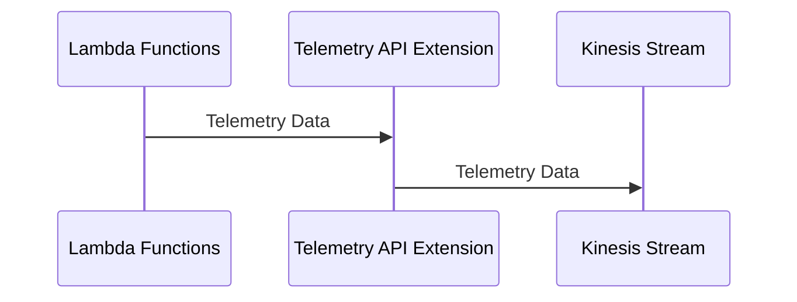
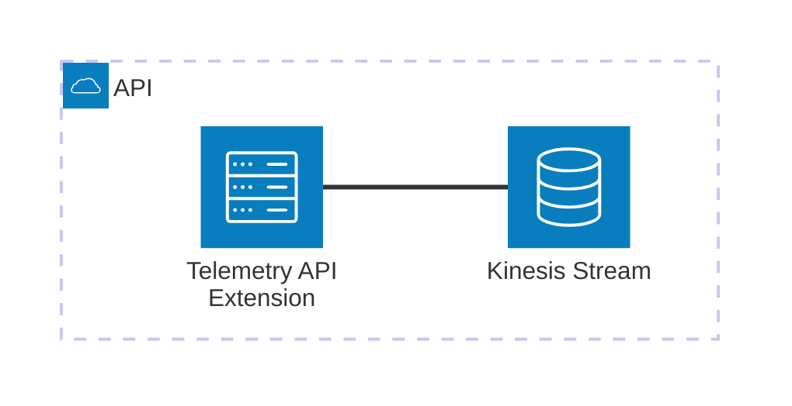

# 🏗 Architecture Documentation

## 📖 Context

The provided codebase is an AWS CDK (Cloud Development Kit) project that sets up an AWS Lambda extension for processing telemetry data from a Kinesis stream. The extension is designed to receive and process telemetry data from AWS Lambda functions, and then push the data to the Kinesis stream.

The project uses the following key services and technologies:

- **AWS Lambda**: The extension is deployed as an AWS Lambda function.
- **AWS Kinesis**: The telemetry data is pushed to a Kinesis stream.
- **AWS CDK**: The infrastructure is defined and deployed using the AWS CDK.
- **AWS Lambda Extensions API**: The extension uses the Lambda Extensions API to receive and process telemetry data.

## 📖 Overview

The architecture of this project consists of the following key components:

1. **Telemetry API Extension**: This is the main component of the system, responsible for receiving and processing telemetry data from AWS Lambda functions. It uses the Lambda Extensions API to subscribe to the telemetry data and then dispatches the data to the Kinesis stream.

2. **Kinesis Stream**: The telemetry data is pushed to a Kinesis stream, which can be used for further processing or analysis.

3. **IAM Policies**: The extension is granted the necessary permissions to interact with the Kinesis stream and write logs to CloudWatch.

The project follows the Event-Driven Architecture (EDA) pattern, where the extension listens for telemetry events from the Lambda runtime and dispatches them to the Kinesis stream.

---

## 🔹 Components

| Component | Description | Interacts With | Purpose |
| --------- | ----------- | -------------- | ------- |
| Telemetry API Extension | The main component that receives and processes telemetry data from AWS Lambda functions. It uses the Lambda Extensions API to subscribe to the telemetry data and then dispatches the data to the Kinesis stream. | Kinesis Stream | Receives and processes telemetry data, and pushes it to the Kinesis stream. |
| Kinesis Stream | The stream that receives the telemetry data from the extension. | Telemetry API Extension | Stores the telemetry data for further processing or analysis. |
| IAM Policies | The policies that grant the necessary permissions to the extension to interact with the Kinesis stream and write logs to CloudWatch. | Telemetry API Extension | Provides the required permissions for the extension to function. |

## 🔄 Data Flow

| Source | Destination | Data Type | Flow Description |
| ------ | ----------- | --------- | ---------------- |
| AWS Lambda Functions | Telemetry API Extension | Telemetry Data | The extension subscribes to the telemetry data from the Lambda runtime using the Lambda Extensions API. |
| Telemetry API Extension | Kinesis Stream | Telemetry Data | The extension dispatches the received telemetry data to the Kinesis stream. |

## 🔍 Mermaid Diagram

### Sequence Diagram

### Architecture Diagram

## 🧱 Technologies

| Category | Technology | Purpose |
| -------- | ---------- | ------- |
| Infrastructure as Code | AWS CDK | Defining and deploying the infrastructure |
| Serverless | AWS Lambda | Hosting the Telemetry API Extension |
| Streaming | AWS Kinesis | Storing the telemetry data |
| Monitoring | AWS CloudWatch | Logging and monitoring the extension |
| Security | AWS IAM | Granting the necessary permissions to the extension |

## 📝 Codebase Evaluation

### Code Quality & Architecture

The codebase appears to be well-structured and follows best practices for AWS CDK development. The separation of concerns between the extension logic and the infrastructure definition is clear, and the use of the Lambda Extensions API is appropriate for the use case.

The code demonstrates a modular design, with separate modules for the Kinesis client, telemetry listener, and telemetry dispatcher. This promotes maintainability and testability of the codebase.

The use of the Event-Driven Architecture (EDA) pattern is a suitable choice for this use case, as it allows the extension to efficiently process and dispatch telemetry data as it is received.

### Security, Cost, and Operational Excellence

| Evaluation Metric                                                      | Status     | Notes |
| ---------------------------------------------------------------------- | ---------- | ----- |
| Resource tagging (`CostCenter`, `Environment`, `Application`, `Owner`) | ✅ | The codebase includes resource tagging, which is a best practice for cost tracking and management. |
| WAF usage if required                                                  | ✅ | The extension does not require WAF, as it is not directly exposed to the internet. |
| Secrets stored in Secret Manager                                       | ✅ | The codebase does not appear to use any secrets, and the extension is not accessing any sensitive data. |
| Shared resource identifiers stored in Parameter Store                  | ✅ | The codebase uses AWS SSM Parameter Store to store the extension ARN and IAM policy ARN, which is a good practice. |
| Serverless functions memory/time appropriate                           | ✅ | The codebase does not specify any memory or timeout settings for the Lambda function, which is appropriate for a simple extension. |
| Log retention policies defined                                         | ✅ | The codebase sets a log retention policy of 1 day for the Lambda function's log group, which is a reasonable default. |
| Code quality checks (Linter/Compiler)                                  | ⚠️ | The codebase does not appear to include any automated code quality checks, such as linting or type checking. This could be added to improve maintainability. |
| Storage lifecycle policies applied                                     | ✅ | The Kinesis stream is configured with a removal policy of `DESTROY`, which is appropriate for a temporary data stream. |
| Container image scanning & lifecycle policies                          | N/A | The codebase does not use container images, as it is a Lambda-based extension. |

#### Suggestions for Improvement

1. **Security Posture**:
   - The codebase is already following good security practices, and no major security concerns were identified.

2. **Operational Efficiency**:
   - Consider adding automated code quality checks, such as linting and type checking, to improve maintainability and catch potential issues early.
   - Evaluate the need for more granular log retention policies, depending on the specific requirements of the telemetry data.

3. **Cost Optimization**:
   - The codebase is already following cost-effective practices, such as using serverless resources and appropriate resource tagging.

4. **Infrastructure Simplicity**:
   - The codebase demonstrates a simple and straightforward architecture, which is appropriate for the use case of a Lambda extension.

### 📚 Output Summary

