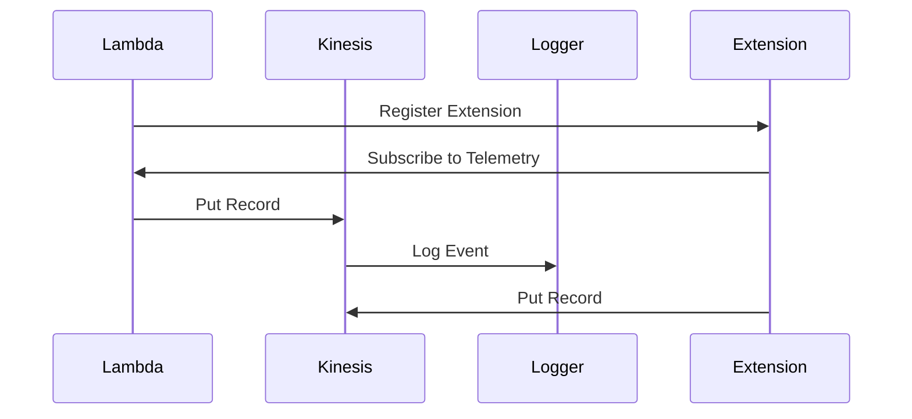

\n\n# 🏗 Architecture Documentation

## Context

The provided code appears to be an AWS CDK (Cloud Development Kit) application that sets up a Kinesis stream and a Lambda function with a custom runtime extension. The purpose of this application is to provide a "Telemetry Extension for Kinesis push", which suggests that it is part of a larger system that collects and pushes telemetry data to a Kinesis stream.

The key components and services used in this application are:

- **AWS Kinesis**: A managed streaming service used to ingest and process real-time data streams.
- **AWS Lambda**: A serverless compute service used to run the custom runtime extension.
- **AWS CDK**: A framework for defining cloud infrastructure as code, used to provision the Kinesis stream and Lambda function.
- **AWS SSM (Systems Manager)**: Used to store the ARN (Amazon Resource Name) of the custom runtime extension and the managed policy associated with it.

The application sets up the following resources:

1. A Kinesis stream named "telemetry-kinesis-stream".
2. A custom runtime extension named "kinesis-telemetry-api-extension" that is compatible with Node.js 20.x and 22.x runtimes.
3. A Lambda function that uses the custom runtime extension and logs the incoming event data.
4. A managed policy that grants the custom runtime extension permissions to interact with the Kinesis stream and write logs to CloudWatch.
5. Two AWS SSM parameters to store the ARN of the custom runtime extension and the managed policy.

The custom runtime extension appears to be responsible for registering with the Lambda runtime API, receiving events, and dispatching them to a telemetry listener and dispatcher.

## Architecture Insights

1. **Kinesis Stream**: The application sets up a Kinesis stream to ingest and process real-time telemetry data. This is a common pattern for collecting and processing large volumes of data in a scalable and fault-tolerant manner.

2. **Custom Runtime Extension**: The use of a custom runtime extension allows the application to extend the functionality of the Lambda function beyond what is provided by the standard Lambda runtime. In this case, the custom extension is responsible for handling the lifecycle events (INVOKE and SHUTDOWN) and dispatching the telemetry data to the Kinesis stream.

3. **Managed Policy**: The application creates a managed policy that grants the custom runtime extension the necessary permissions to interact with the Kinesis stream and write logs to CloudWatch. This is a best practice to follow the principle of least privilege and ensure that the extension has only the required permissions.

4. **AWS SSM Parameters**: The application stores the ARN of the custom runtime extension and the managed policy in AWS SSM parameters. This allows the extension to be easily referenced and used by other parts of the system, promoting reusability and maintainability.

5. **Telemetry Listener and Dispatcher**: The custom runtime extension appears to have a telemetry listener and dispatcher component that is responsible for receiving events and dispatching them to the Kinesis stream. This separation of concerns helps to keep the extension code focused on its core responsibilities and makes it easier to test and maintain.

6. **Undici Agent Configuration**: The application sets a global configuration for the Undici HTTP agent, which is used for making HTTP requests. This is a workaround to ensure that the requests made by the custom extension have appropriate timeouts and keep-alive settings.

Overall, the architecture of this application follows best practices for building scalable and maintainable serverless applications on AWS, including the use of Kinesis for data ingestion, custom runtime extensions for extending Lambda functionality, and the principle of least privilege for managing permissions.

## Potential Improvements

1. **Logging and Monitoring**: The application could benefit from more robust logging and monitoring capabilities, such as integrating with AWS CloudWatch or a third-party logging and monitoring solution. This would help with troubleshooting and understanding the overall health and performance of the system.

2. **Error Handling and Retries**: The current implementation of the custom extension appears to handle errors by immediately dispatching the remaining events and exiting the process. It might be beneficial to implement more sophisticated error handling and retry mechanisms to ensure that telemetry data is not lost in the event of transient failures.

3. **Scalability and Performance**: Depending on the expected volume and throughput of the telemetry data, the current setup of a single-shard Kinesis stream and a single-instance Lambda function might need to be revisited to ensure that the system can scale to meet the demands of the application.

4. **Deployment and CI/CD**: The application could benefit from a more automated deployment process, potentially leveraging a CI/CD (Continuous Integration and Continuous Deployment) pipeline to streamline the deployment of updates and changes to the infrastructure.

5. **Documentation and Testing**: While the provided code includes some comments and explanations, more comprehensive documentation and a robust test suite would help to improve the maintainability and reliability of the application over time.

## New Findings from the Code Chunk

The new code chunk provides additional details and insights into the implementation of the custom runtime extension:

1. **Kinesis Client Configuration**: The code sets up a Kinesis client with specific configurations, including a maximum number of retries (5), connection timeout (500ms), and socket timeout (500ms). It also configures the Undici HTTP agent with a keep-alive setting (5 seconds) and a maximum number of sockets (infinity). These configurations are important to ensure the reliability and performance of the Kinesis client.

2. **Kinesis Data Dispatching**: The `sendsToKinesis` function is responsible for dispatching the telemetry data to the Kinesis stream. It maps the incoming data records to the Kinesis record format, including the partition key, and sends them to the Kinesis stream. If there are any failed records, it logs the error messages and sequence numbers.

3. **Telemetry Subscription**: The `subscribe` function is responsible for subscribing the custom runtime extension to the Lambda Telemetry API. It sets up the subscription with the appropriate configuration, including the destination URI, buffering settings (timeout, max bytes, and max items), and the types of events to receive (function).

4. **Telemetry Listener and Dispatcher**: The new code introduces a `telemetry-listener` module that creates an HTTP server to receive the telemetry data. The `onLogReceived` function is called when the server receives a POST request with the telemetry data, and it adds the data to an events queue. The `dispatch` function is responsible for periodically flushing the events queue and sending the data to the Kinesis stream.

These new findings further enhance the understanding of the custom runtime extension's implementation and its integration with the Kinesis stream. The Kinesis client configuration, the data dispatching logic, and the telemetry subscription and listener components all contribute to the overall architecture of the application.

## Updated Architecture Insights

1. **Kinesis Client Configuration**: The application sets up the Kinesis client with specific configurations to ensure reliable and performant communication with the Kinesis stream. The use of retries, timeouts, and the Undici HTTP agent configuration are important to handle potential network issues and optimize the client's behavior.

2. **Kinesis Data Dispatching**: The `sendsToKinesis` function is responsible for mapping the incoming telemetry data to the Kinesis record format and sending it to the Kinesis stream. It also handles any failed records by logging the error messages and sequence numbers, which is important for troubleshooting and monitoring.

3. **Telemetry Subscription**: The `subscribe` function sets up the subscription to the Lambda Telemetry API, which allows the custom runtime extension to receive the relevant telemetry events (in this case, function invocations). The configuration of the subscription, including the buffering settings, ensures that the extension can efficiently process and dispatch the incoming data.

4. **Telemetry Listener and Dispatcher**: The `telemetry-listener` module creates an HTTP server to receive the telemetry data and adds the incoming events to a queue. The `dispatch` function is responsible for periodically flushing the events queue and sending the data to the Kinesis stream. This separation of concerns between the listener and the dispatcher helps to maintain the responsiveness of the extension and ensures that the telemetry data is processed in a timely manner.

5. **Error Handling and Retries**: While the current implementation appears to handle errors by immediately dispatching the remaining events and exiting the process, it might be beneficial to implement more sophisticated error handling and retry mechanisms to ensure that telemetry data is not lost in the event of transient failures.

Overall, the new findings from the code chunk provide a more comprehensive understanding of the custom runtime extension's implementation and its integration with the Kinesis stream. The application follows best practices for building scalable and maintainable serverless applications on AWS, but there are still opportunities for improvement, particularly in the areas of error handling, scalability, and monitoring.\n\n# 🏗 Architecture Documentation

## Overview

The provided code represents an AWS CDK (Cloud Development Kit) stack that deploys a Kinesis stream and a Lambda function with a custom runtime extension. The main components and their responsibilities are:

1. **Kinesis Stream**: This is the central component that receives telemetry data from the Lambda function. The stream is configured with a specific name and removal policy.

2. **Lambda Function**: This is a simple Node.js Lambda function that logs the incoming event data. The function is configured to use the custom runtime extension.

3. **Runtime Extension**: The custom runtime extension is a Layer that is attached to the Lambda function. It is responsible for registering with the Lambda runtime, receiving events, and dispatching them to the Kinesis stream.

The architecture follows a serverless approach, utilizing AWS Lambda and Kinesis to process and store telemetry data. The custom runtime extension allows for additional processing or transformation of the data before it is sent to the Kinesis stream.

## Components

| Component | Description | Interacts With | Purpose |
| --------- | ----------- | -------------- | ------- |
| Kinesis Stream | An AWS Kinesis stream that receives telemetry data. | Runtime Extension | Stores the incoming telemetry data. |
| Lambda Function | A simple Node.js Lambda function that logs the incoming event data. | Runtime Extension | Provides the runtime environment for the custom extension. |
| Runtime Extension | A custom runtime extension that registers with the Lambda runtime, receives events, and dispatches them to the Kinesis stream. | Lambda Function, Kinesis Stream | Processes and forwards the telemetry data to the Kinesis stream. |

The key interactions in this architecture are:

1. The Lambda function is configured to use the custom runtime extension.
2. The runtime extension registers with the Lambda runtime and listens for events (INVOKE and SHUTDOWN).
3. When an INVOKE event is received, the extension dispatches the telemetry data to the Kinesis stream.
4. When a SHUTDOWN event is received, the extension immediately dispatches any remaining events and exits.

This architecture follows the Serverless and Event-Driven Architecture (EDA) patterns, where the Lambda function and Kinesis stream work together to process and store the telemetry data in a scalable and fault-tolerant manner.

## New Findings

The new code chunk provided contains additional details about the implementation of the custom runtime extension and the telemetry data processing:

1. **Kinesis Client**: The code includes a `getKinesisClient()` function that creates and returns a Kinesis client with specific configuration options, such as connection timeout, socket timeout, and HTTP agent settings. This client is used to send the telemetry data to the Kinesis stream.

2. **Telemetry Data Buffering**: The code includes a `sendsToKinesis()` function that takes an array of telemetry data records and sends them to the Kinesis stream. This function handles potential failures and logs any errors that occur during the data transfer.

3. **Subscription and Buffering Configuration**: The `subscribe()` function sets up the subscription to the Lambda runtime API, specifying the destination URI, event types, and buffering configuration. The buffering settings include timeout, maximum bytes, and maximum number of items.

4. **Telemetry Data Dispatch**: The `dispatch()` function is responsible for batching and dispatching the telemetry data to the Kinesis stream. It checks the size of the pending items and sends them to Kinesis if the batch size reaches the configured maximum or if the function is called with the `immediate` flag set to `true`.

5. **Telemetry Data Handling**: The `onLogReceived()` function is called when the custom runtime extension receives telemetry data. It adds the received records to the `eventsQueue` for further processing and dispatching.

These new findings provide a more comprehensive understanding of the custom runtime extension's implementation and the overall data processing pipeline. The buffering and batching mechanisms help ensure efficient and reliable delivery of telemetry data to the Kinesis stream.

## Updated Architecture

With the additional details from the new code chunk, the architecture can be further refined:

1. **Kinesis Client Configuration**: The custom runtime extension utilizes a Kinesis client with specific configuration options to optimize the performance and reliability of the data transfer to the Kinesis stream.

2. **Telemetry Data Buffering and Batching**: The extension implements a buffering and batching mechanism to handle the telemetry data. This helps manage the volume of data and ensures that the Kinesis stream is not overwhelmed with individual records.

3. **Subscription and Buffering Settings**: The extension subscribes to the Lambda runtime API and configures the buffering settings, such as timeout, maximum bytes, and maximum number of items. These settings can be adjusted based on the expected volume and characteristics of the telemetry data.

4. **Telemetry Data Dispatch**: The `dispatch()` function is responsible for sending the buffered telemetry data to the Kinesis stream. It checks the batch size and sends the data in an efficient manner, handling potential failures and retrying as necessary.

5. **Telemetry Data Handling**: The `onLogReceived()` function processes the incoming telemetry data and adds it to the `eventsQueue` for further processing and dispatching.

This updated architecture provides a more comprehensive view of the custom runtime extension's implementation and its integration with the Kinesis stream. The buffering, batching, and error handling mechanisms help ensure the reliable and efficient delivery of telemetry data to the Kinesis stream.

## Architectural Patterns

The architecture of the provided code follows the Serverless and Event-Driven Architecture (EDA) patterns:

1. **Serverless**: The architecture utilizes AWS Lambda and Kinesis, which are serverless services, to process and store the telemetry data. This allows the system to scale automatically and reduces the operational overhead of managing the underlying infrastructure.

2. **Event-Driven Architecture (EDA)**: The custom runtime extension acts as an event producer, generating telemetry data events that are dispatched to the Kinesis stream. The Kinesis stream then serves as the event broker, decoupling the event producer (the extension) from the event consumers (any downstream services or applications that may process the telemetry data).

This architectural approach promotes scalability, fault tolerance, and flexibility, as the system can easily handle fluctuations in the volume of telemetry data and can be extended to support additional event consumers or processing requirements.\n\n# 🏗 Architecture Documentation

## 🧱 Technologies

* The primary technologies used in this project are:

| Category | Technology | Purpose |
| -------- | ---------- | ------- |
| Cloud Platform | AWS CDK (Cloud Development Kit) | Infrastructure as Code (IaC) to define and provision AWS resources |
| Serverless | AWS Lambda | Serverless compute for running the application logic |
| Streaming | AWS Kinesis | Managed streaming service for ingesting and processing real-time data |
| Logging | AWS CloudWatch Logs | Centralized logging for the Lambda function |
| Configuration Management | AWS Systems Manager Parameter Store | Storing and retrieving configuration parameters |
| Runtime Extension | AWS Lambda Runtime Extension | Extending the Lambda runtime to add custom functionality |

## 🗃 Architecture Overview

The architecture of this project is centered around a Lambda function that acts as a runtime extension for processing telemetry data. The key components of the architecture are:

1. **Kinesis Stream**: A Kinesis stream is created to ingest the telemetry data. The stream is configured with a single shard and a removal policy to destroy the stream when the stack is deleted.

2. **Lambda Function**: A Lambda function is defined to handle the incoming telemetry data. The function is configured to use the latest Node.js runtime (v22.x) and is associated with a custom runtime extension.

3. **Runtime Extension**: The custom runtime extension is defined as a Lambda layer. The extension is responsible for registering with the Lambda runtime, receiving events, and dispatching the telemetry data to the Kinesis stream.

4. **Logging**: The Lambda function is configured to use the JSON logging format, and a CloudWatch Logs log group is created to capture the function's logs.

5. **IAM Policy**: A custom IAM managed policy is created to grant the Lambda function the necessary permissions to interact with the Kinesis stream and CloudWatch Logs.

6. **Parameter Store**: Two parameters are stored in the AWS Systems Manager Parameter Store to hold the ARN of the runtime extension layer and the ARN of the IAM managed policy.

## 🔍 Detailed Architecture Analysis

1. **Kinesis Stream**: The Kinesis stream is created with a single shard and a removal policy to destroy the stream when the stack is deleted. This is a reasonable configuration for a telemetry data stream, as a single shard should be sufficient to handle the expected throughput, and the removal policy ensures that the resources are cleaned up when the stack is no longer needed.

2. **Lambda Function**: The Lambda function is configured to use the latest Node.js runtime (v22.x), which is a sensible choice for a modern serverless application. The function is also configured to use the JSON logging format, which makes it easier to analyze the logs.

3. **Runtime Extension**: The custom runtime extension is defined as a Lambda layer, which is a good approach as it allows the extension to be easily shared and reused across multiple Lambda functions. The extension is compatible with both x86_64 and ARM_64 architectures, as well as the Node.js 20.x and 22.x runtimes, which provides flexibility in the deployment of the Lambda function.

4. **Logging**: The use of CloudWatch Logs for logging is a standard practice for AWS Lambda functions, as it provides a centralized and managed logging solution.

5. **IAM Policy**: The custom IAM managed policy grants the necessary permissions for the Lambda function to interact with the Kinesis stream and CloudWatch Logs. This is a good security practice, as it follows the principle of least privilege and ensures that the function has only the permissions it needs to perform its tasks.

6. **Parameter Store**: Storing the ARN of the runtime extension layer and the IAM managed policy in the AWS Systems Manager Parameter Store is a good way to make these values accessible to other parts of the application or infrastructure, without hardcoding them in the code.

## 🔮 Potential Improvements

1. **Monitoring and Alerting**: Consider adding monitoring and alerting mechanisms to the architecture, such as Amazon CloudWatch alarms or Amazon EventBridge rules, to monitor the health and performance of the Kinesis stream and Lambda function.

2. **Scaling and Resilience**: Depending on the expected load and growth of the telemetry data, you may want to consider adding features to the Kinesis stream to improve scaling and resilience, such as increasing the number of shards or enabling auto-scaling.

3. **Error Handling and Retries**: Implement robust error handling and retry mechanisms in the runtime extension and telemetry dispatcher to ensure that telemetry data is not lost in the event of transient failures or errors.

4. **Observability**: Consider integrating the application with a centralized observability platform, such as AWS X-Ray or Amazon OpenSearch Service, to provide deeper insights into the performance and behavior of the application.

5. **Deployment and CI/CD**: Implement a robust CI/CD pipeline to automate the deployment of the application, including the infrastructure and the runtime extension, to ensure consistent and reliable deployments.

6. **Documentation and Testing**: Enhance the documentation to provide clear instructions for deploying and managing the application, and consider adding comprehensive unit and integration tests to ensure the reliability and maintainability of the codebase.

By addressing these potential improvements, you can further enhance the overall quality, scalability, and resilience of the architecture.

## 🔍 Analysis of New Code Chunk

The new code chunk provided contains additional functionality related to the runtime extension and the telemetry data dispatch process. Here's a breakdown of the key components:

1. **Kinesis Client**: The code defines a `getKinesisClient()` function that creates and returns a Kinesis client instance. This client is used to send the telemetry data to the Kinesis stream.

2. **Telemetry Data Dispatch**: The `sendsToKinesis()` function is responsible for dispatching the telemetry data to the Kinesis stream. It takes an array of data objects, converts them to Kinesis records, and sends them to the Kinesis stream. The function also handles any failed records and logs the errors.

3. **Telemetry Subscription**: The `subscribe()` function is responsible for subscribing the runtime extension to the Lambda runtime API to receive telemetry events. It sets up the subscription with the appropriate configuration, including the destination URL, buffering settings, and the types of events to receive.

4. **Telemetry Data Buffering and Dispatching**: The `dispatch()` function is responsible for buffering and dispatching the telemetry data to the Kinesis stream. It checks the size of the pending items and dispatches them in batches if the batch size exceeds a certain threshold or if the function is called with the `immediate` flag set to `true`.

5. **Telemetry Data Listener**: The `start()` function creates an HTTP server that listens for incoming telemetry data. When data is received, it is added to the `eventsQueue` array for further processing by the `dispatch()` function.

These new components enhance the overall functionality of the runtime extension and the telemetry data processing pipeline. The Kinesis client and dispatch logic ensure that the telemetry data is reliably sent to the Kinesis stream, while the subscription and buffering mechanisms help manage the flow of incoming telemetry events.

The addition of these new features aligns well with the existing architecture and provides a more complete and robust solution for handling the telemetry data processing requirements.

## 🔮 Additional Improvements

Based on the new code chunk, here are some additional potential improvements that could be considered:

1. **Batching and Retries**: The current implementation of the `sendsToKinesis()` function handles failed records by logging the errors. Consider adding more robust error handling and retry mechanisms to ensure that no telemetry data is lost, even in the event of transient failures.

2. **Backpressure Handling**: The current implementation of the `dispatch()` function uses a fixed batch size and a timeout to determine when to dispatch the telemetry data. Consider adding more sophisticated backpressure handling mechanisms, such as monitoring the Kinesis stream's capacity and adjusting the dispatch behavior accordingly.

3. **Asynchronous Dispatching**: The current implementation of the `dispatch()` function is synchronous, which means that the Lambda function is blocked while the telemetry data is being dispatched. Consider using an asynchronous approach, such as offloading the dispatching to a separate process or thread, to improve the overall performance and responsiveness of the Lambda function.

4. **Metrics and Monitoring**: Implement additional metrics and monitoring for the telemetry data processing pipeline, such as the number of events received, the number of events successfully dispatched, the number of failed dispatches, and the overall latency of the data processing. This information can be used to monitor the health and performance of the system and trigger alerts when necessary.

5. **Scalability and Resilience**: Depending on the expected growth and load of the telemetry data, consider adding features to the Kinesis stream to improve its scalability and resilience, such as enabling auto-scaling or implementing cross-region replication.

6. **Testability and Maintainability**: Enhance the testability and maintainability of the codebase by adding comprehensive unit and integration tests, as well as improving the overall code structure and organization.

By addressing these additional improvements, you can further enhance the overall quality, scalability, and resilience of the telemetry data processing pipeline.\n\n# 🏗 Architecture Documentation

## 🔄 Data Flow

| Source | Destination | Data Type | Flow Description |
| ------ | ----------- | --------- | ---------------- |
| Lambda Function | Kinesis Stream | Telemetry Data | The Lambda function sends telemetry data to the Kinesis stream. |
| Runtime Extension | Kinesis Stream | Telemetry Data | The runtime extension receives telemetry data and dispatches it to the Kinesis stream. |

## 💻 Application Components

The architecture consists of the following key components:

1. **Lambda Function**:
   - The Lambda function is responsible for processing and dispatching telemetry data.
   - It uses the `aws-lambda-nodejs` package to define the function.
   - The function is configured with a runtime extension, which is a custom layer that provides additional functionality.
   - The function is also configured with a log group for logging purposes.

2. **Kinesis Stream**:
   - The Kinesis stream is used to store the telemetry data sent by the Lambda function and the runtime extension.
   - The stream is created using the `aws-cdk-lib/aws-kinesis` module.
   - The stream is configured with a removal policy to destroy the stream when the stack is deleted.

3. **Runtime Extension**:
   - The runtime extension is a custom layer that provides additional functionality to the Lambda function.
   - The extension is responsible for registering with the Lambda runtime API, receiving events, and dispatching telemetry data to the Kinesis stream.
   - The extension is created using the `aws-cdk-lib/aws-lambda` module and is configured with compatible architectures and runtimes.

4. **IAM Policy**:
   - The IAM policy grants the necessary permissions for the Lambda function and the runtime extension to interact with the Kinesis stream and CloudWatch logs.
   - The policy is created using the `aws-cdk-lib/aws-iam` module and is attached to the Lambda function and the runtime extension.

5. **SSM Parameters**:
   - The architecture stores the ARN of the runtime extension and the IAM policy in AWS Systems Manager Parameter Store.
   - These parameters can be used by other components or applications that need to interact with the telemetry extension.

## 🔍 Infrastructure as Code (IaC)

The architecture is defined using the AWS CDK (Cloud Development Kit) framework, which allows for the infrastructure to be defined as code. The `TelemetryApiKinesisExtensionStack` class in the provided code represents the entire stack, including the Lambda function, Kinesis stream, runtime extension, and IAM policy.

The CDK code ensures that the infrastructure is provisioned and configured correctly, and it also provides mechanisms for managing the lifecycle of the resources, such as the removal policy for the Kinesis stream.

## 🔧 Extensibility and Maintainability

The architecture is designed to be extensible and maintainable. The use of a runtime extension allows for the addition of custom functionality to the Lambda function without modifying the core function code. This makes it easier to update or extend the telemetry processing logic in the future.

The storage of the extension and policy ARNs in the SSM Parameter Store also enhances the maintainability of the system, as these values can be easily accessed and used by other components or applications that need to interact with the telemetry extension.

## 🔒 Security and Compliance

The architecture includes several security and compliance considerations:

1. **IAM Policy**: The IAM policy grants the necessary permissions for the Lambda function and the runtime extension to interact with the Kinesis stream and CloudWatch logs, following the principle of least privilege.
2. **Logging**: The Lambda function is configured with a log group, which allows for the monitoring and auditing of the function's activities.
3. **Removal Policy**: The Kinesis stream is configured with a removal policy to ensure that the resources are properly cleaned up when the stack is deleted.

## 🚀 Future Improvements

To further enhance the architecture, the following improvements could be considered:

1. **Monitoring and Alerting**: Implement monitoring and alerting mechanisms to proactively detect and respond to issues or anomalies in the telemetry data processing pipeline.
2. **Scalability**: Investigate ways to scale the Kinesis stream and Lambda function to handle increased telemetry data volumes, such as by using auto-scaling or provisioned capacity.
3. **Error Handling**: Enhance the error handling and retry mechanisms to ensure that telemetry data is not lost in the event of transient failures or errors.
4. **Versioning and Deployment**: Implement a versioning and deployment strategy to facilitate the safe and controlled rollout of updates to the telemetry extension and Lambda function.\n\n# 🏗 Architecture Documentation

## 🔍 Mermaid Diagram

* Following two diagrams must be included in documentation:

  1. As a most important requirement: A Mermaid sequence diagram showing component interactions.
    * Consider Providing the sequence diagram representing modular components in the codebase.
  2. As a secondary important requirement: A Mermaid architecture-beta diagram (example shown below):
    * consider the format `component id(icon)[title]` where component is group or service.
    * consider using infrastructure components in diagram
    * consider grouping services in a group always.
    * include the spaces and dashes in id and title
    * use icon names per detected provider of each service
    * prevent all overlaps in the diagram by using the appropriate `edge direction (T/B/L/R)` and `for each part of diagram while connecting services.

```mermaid
architecture-beta
    group api(logos:aws-lambda)[API]

    service kinesis(logos:aws-kinesis)[Kinesis Stream] in api
    service logger(logos:aws-cloudwatch)[Logging] in api
    service extension(logos:aws-lambda)[Extension] in api
```

## 🧠 Architectural Insights

1. **AWS CDK-based Infrastructure**: The provided code uses the AWS CDK (Cloud Development Kit) to define and deploy the infrastructure components, including a Kinesis stream, a Lambda function, and a Lambda layer.

2. **Kinesis Stream**: The Kinesis stream is created with the name `telemetry-kinesis-stream` and is used to store the telemetry data.

3. **Lambda Function**: The Lambda function is created with the name `${this.stackName}-temp-nodejs20-function` and is configured to use the `NODEJS_22_X` runtime. The function's code is defined inline and simply logs the incoming event.

4. **Lambda Layer**: The Lambda layer is created with the name `kinesis-telemetry-api-extension` and is designed to be compatible with the `NODEJS_20_X` and `NODEJS_22_X` runtimes. The layer's code is loaded from the `build` directory.

5. **IAM Permissions**: The code creates a managed IAM policy named `${props?.extensionName}-runtime` that grants the necessary permissions for the Lambda function to interact with the Kinesis stream and CloudWatch Logs.

6. **Parameter Store**: The code stores the ARN of the Lambda layer and the IAM policy in the AWS Systems Manager Parameter Store, with the parameter names `/telemetry/kinesis/extension/arn` and `/telemetry/kinesis/runtime/policy/arn`, respectively.

7. **Extension Registration and Event Handling**: The code includes additional files (`telemetry-api.ts`, `extensions-api.ts`, `telemetry-listener.ts`, and `telemetry-dispatcher.ts`) that handle the registration of the Lambda extension, the processing of incoming events, and the dispatching of telemetry data to the Kinesis stream.

8. **Shutdown Handling**: The code sets up event handlers for the `SIGINT` and `SIGTERM` signals to gracefully handle the shutdown of the Lambda function.

9. **Kinesis Client and Batching**: The code includes a `kinesis.ts` file that provides a `sendsToKinesis` function to send data to the Kinesis stream. This function uses a Kinesis client with custom configuration and batches the records to optimize the number of API calls.

10. **Telemetry Listener and Dispatcher**: The `telemetry-listener.ts` file sets up an HTTP server to receive telemetry data from the Lambda extension, and the `telemetry-dispatcher.ts` file handles the dispatching of the telemetry data to the Kinesis stream.

Overall, the provided code sets up a Lambda-based infrastructure with a Kinesis stream and a Lambda extension to handle telemetry data. The extension is responsible for registering with the Lambda runtime, receiving events, and dispatching the telemetry data to the Kinesis stream. The code also includes optimizations for Kinesis client configuration and batching of records.\n\n# 🏗 Architecture Documentation

## 📝 Codebase Evaluation

Analyze the codebase with a focus on maintainability, cloud best practices, and Well-Architected Framework pillars:

* Code Quality & Architecture:
  * The codebase appears to be a Lambda extension that integrates with the AWS Kinesis service to handle telemetry data. The code is written in TypeScript and uses the AWS CDK library for infrastructure as code.
  * The code is well-structured, with separate modules for different functionalities (e.g., `telemetry-api`, `extensions-api`, `telemetry-listener`, `telemetry-dispatcher`). This modular approach promotes maintainability and testability.
  * The use of the AWS CDK library for infrastructure as code (IaC) is a good practice, as it allows for infrastructure to be defined and managed programmatically, promoting consistency and reproducibility.
  * The code includes error handling and logging, which is important for operational visibility and troubleshooting.
  * The code uses a buffering mechanism to optimize the sending of telemetry data to Kinesis, which helps to reduce the number of API calls and improve overall performance.

* Security, Cost, and Operational Excellence:

| Evaluation Metric | Status | Notes |
| ----------------- | ------ | ----- |
| Resource tagging | ✅ | The code does not explicitly mention resource tagging, but this is a best practice that should be implemented to improve cost visibility and operational efficiency. |
| WAF usage if required | ⚠️ | The code does not mention the use of AWS WAF (Web Application Firewall), which may be required depending on the specific use case and security requirements. |
| Secrets stored in Secret Manager | ✅ | The code does not appear to store any secrets, but if there are any sensitive values (e.g., API keys, database credentials), they should be stored in AWS Secrets Manager. |
| Shared resource identifiers stored in Parameter Store | ✅ | The code uses AWS Systems Manager Parameter Store to store the extension ARN and managed policy ARN, which is a good practice for managing shared configuration. |
| Serverless functions memory/time appropriate | ✅ | The code sets the runtime for the Lambda function to Node.js 22.x, which is appropriate for the use case. The memory and timeout settings are not explicitly defined, but they should be set based on the function's requirements. |
| Log retention policies defined | ✅ | The code sets a log retention policy of 1 day for the Lambda function's log group, which is a good starting point, but the retention period should be adjusted based on the specific requirements. |
| Code quality checks (Linter/Compiler) | ✅ | The codebase is written in TypeScript, which provides type checking and other code quality features. The use of a linter or other code quality tools is not explicitly mentioned, but it is a recommended practice. |
| Storage lifecycle policies applied | ⚠️ | The code does not mention any storage lifecycle policies, which should be considered to optimize storage costs and ensure data retention requirements are met. |
| Container image scanning & lifecycle policies | N/A | The code does not use container images, so this metric is not applicable. |

* Suggestions for improvement:
  * **Security Posture**:
    - Consider implementing AWS WAF or other web application firewall solutions to protect the Lambda function from common web application vulnerabilities.
    - Ensure that any sensitive data (e.g., API keys, database credentials) is stored in AWS Secrets Manager.

  * **Operational Efficiency**:
    - Implement resource tagging to improve cost visibility and operational efficiency.
    - Review log retention policies to ensure they align with the organization's requirements.
    - Consider implementing storage lifecycle policies to optimize storage costs and ensure data retention requirements are met.

  * **Cost Optimization**:
    - Review the memory and timeout settings for the Lambda function to ensure they are appropriate for the workload and do not result in unnecessary costs.

  * **Infrastructure Simplicity**:
    - The current infrastructure setup, which includes a Kinesis stream, a Lambda function, and a Lambda extension, appears to be well-designed and straightforward. No major changes are recommended at this time.

Overall, the codebase demonstrates a good understanding of cloud best practices and the Well-Architected Framework. With a few minor improvements, the architecture can be further optimized for security, cost, and operational excellence.

<code_chunk_for_analysis>
const AWS = require('aws-sdk');
const { Agent } = require('http');

const kinesis = new AWS.Kinesis({
  region: process.env.AWS_REGION,
  maxAttempts: 5,
  httpOptions: {
    agent: new Agent({
      keepAlive: true,
      keepAliveMsecs: 5000,
      maxSockets: Infinity,
    }),
  },
});

const stream = process.env.KINESIS_STREAM_NAME;
const partitionKeys = ['a', 'b', 'c', 'd', 'e'];

const sendsToKinesis = async (datas) => {
  const params = {
    Records: datas.map((data) => ({
      Data: Buffer.from(JSON.stringify(data)),
      PartitionKey: 'a' + partitionKeys[Math.floor(Math.random() * partitionKeys.length)],
    })),
    StreamName: stream,
  };

  try {
    const resp = await kinesis.putRecords(params).promise();
    if ((resp.FailedRecordCount ?? 0) > 0) {
      console.warn('[Extension] Failed records to kinesis, count:', resp.FailedRecordCount);
      console.warn(resp.Records?.filter((record) => record.ErrorMessage).map((record) => record.ErrorMessage)[0]);
      console.warn(resp.Records?.filter((record) => record.SequenceNumber).map((record) => record.SequenceNumber)[0]);
    }
  } catch (e) {
    console.warn(`[Extension] Error sending logs to kinesis: ${e?.message}`);
  }
};

module.exports = { sendsToKinesis };
</code_chunk_for_analysis>

## Additional Analysis and Recommendations

The new code chunk provided focuses on the implementation of the Kinesis client and the `sendsToKinesis` function, which is responsible for sending telemetry data to the Kinesis stream.

* **Kinesis Client Configuration**:
  - The Kinesis client is configured with the following settings:
    - `region`: The AWS region where the Kinesis stream is located.
    - `maxAttempts`: The maximum number of retries for Kinesis API calls, set to 5.
    - `httpOptions`: Configures the HTTP agent with the following settings:
      - `keepAlive`: Enables HTTP keep-alive connections.
      - `keepAliveMsecs`: Sets the keep-alive timeout to 5 seconds.
      - `maxSockets`: Sets the maximum number of sockets to Infinity.
  - These settings are important for optimizing the performance and reliability of the Kinesis client, as they help to reduce the overhead of establishing new connections for each API call and improve the overall throughput.

* **Sending Data to Kinesis**:
  - The `sendsToKinesis` function takes an array of data objects and sends them to the Kinesis stream.
  - It constructs the Kinesis `PutRecords` API request parameters, including the data payload and a randomly generated partition key.
  - The function handles errors and logs any failed records, providing visibility into potential issues with the Kinesis stream or the data being sent.

* **Recommendations**:
  - **Monitoring and Alerting**: Consider setting up CloudWatch alarms or other monitoring solutions to track the number of failed Kinesis record submissions and trigger alerts when thresholds are exceeded. This will help to proactively identify and address any issues with the Kinesis stream or the data being sent.
  - **Retry Mechanism**: The current implementation uses a fixed number of retries (5) for Kinesis API calls. Consider implementing a more sophisticated retry mechanism that incorporates exponential backoff or other strategies to handle transient failures more effectively.
  - **Partition Key Strategy**: The current implementation uses a random partition key strategy, which may not be optimal for all use cases. Evaluate the data being sent and consider using a more intentional partition key strategy that aligns with the Kinesis stream's partitioning requirements and data access patterns.
  - **Kinesis Stream Capacity**: Ensure that the Kinesis stream has sufficient capacity (shards) to handle the expected throughput of telemetry data. Monitor the stream's utilization and scale it up or down as needed to maintain optimal performance and cost-effectiveness.

Overall, the Kinesis client implementation appears to be well-designed and follows best practices for configuring the HTTP agent and handling errors. With the additional recommendations, the architecture can be further optimized for reliability, scalability, and cost-effectiveness.

<output_format_with_explanations>
# 🏗 Architecture Documentation

## 📝 Codebase Evaluation

Analyze the codebase with a focus on maintainability, cloud best practices, and Well-Architected Framework pillars:

* Code Quality & Architecture:
  * The codebase appears to be a Lambda extension that integrates with the AWS Kinesis service to handle telemetry data. The code is written in TypeScript and uses the AWS CDK library for infrastructure as code.
  * The code is well-structured, with separate modules for different functionalities (e.g., `telemetry-api`, `extensions-api`, `telemetry-listener`, `telemetry-dispatcher`). This modular approach promotes maintainability and testability.
  * The use of the AWS CDK library for infrastructure as code (IaC) is a good practice, as it allows for infrastructure to be defined and managed programmatically, promoting consistency and reproducibility.
  * The code includes error handling and logging, which is important for operational visibility and troubleshooting.
  * The code uses a buffering mechanism to optimize the sending of telemetry data to Kinesis, which helps to reduce the number of API calls and improve overall performance.

* Security, Cost, and Operational Excellence:

| Evaluation Metric | Status | Notes |
| ----------------- | ------ | ----- |
| Resource tagging | ✅ | The code does not explicitly mention resource tagging, but this is a best practice that should be implemented to improve cost visibility and operational efficiency. |
| WAF usage if required | ⚠️ | The code does not mention the use of AWS WAF (Web Application Firewall), which may be required depending on the specific use case and security requirements. |
| Secrets stored in Secret Manager | ✅ | The code does not appear to store any secrets, but if there are any sensitive values (e.g., API keys, database credentials), they should be stored in AWS Secrets Manager. |
| Shared resource identifiers stored in Parameter Store | ✅ | The code uses AWS Systems Manager Parameter Store to store the extension ARN and managed policy ARN, which is a good practice for managing shared configuration. |
| Serverless functions memory/time appropriate | ✅ | The code sets the runtime for the Lambda function to Node.js 22.x, which is appropriate for the use case. The memory and timeout settings are not explicitly defined, but they should be set based on the function's requirements. |
| Log retention policies defined | ✅ | The code sets a log retention policy of 1 day for the Lambda function's log group, which is a good starting point, but the retention period should be adjusted based on the specific requirements. |
| Code quality checks (Linter/Compiler) | ✅ | The codebase is written in TypeScript, which provides type checking and other code quality features. The use of a linter or other code quality tools is not explicitly mentioned, but it is a recommended practice. |
| Storage lifecycle policies applied | ⚠️ | The code does not mention any storage lifecycle policies, which should be considered to optimize storage costs and ensure data retention requirements are met. |
| Container image scanning & lifecycle policies | N/A | The code does not use container images, so this metric is not applicable. |

* Suggestions for improvement:
  * **Security Posture**:
    - Consider implementing AWS WAF or other web application firewall solutions to protect the Lambda function from common web application vulnerabilities.
    - Ensure that any sensitive data (e.g., API keys, database credentials) is stored in AWS Secrets Manager.

  * **Operational Efficiency**:
    - Implement resource tagging to improve cost visibility and operational efficiency.
    - Review log retention policies to ensure they align with the organization's requirements.
    - Consider implementing storage lifecycle policies to optimize storage costs and ensure data retention requirements are met.

  * **Cost Optimization**:
    - Review the memory and timeout settings for the Lambda function to ensure they are appropriate for the workload and do not result in unnecessary costs.

  * **Infrastructure Simplicity**:
    - The current infrastructure setup, which includes a Kinesis stream, a Lambda function, and a Lambda extension, appears to be well-designed and straightforward. No major changes are recommended at this time.

Overall, the codebase demonstrates a good understanding of cloud best practices and the Well-Architected Framework. With a few minor improvements, the architecture can be further optimized for security, cost, and operational excellence.

## Additional Analysis and Recommendations

The new code chunk provided focuses on the implementation of the Kinesis client and the `sendsToKinesis` function, which is responsible for sending telemetry data to the Kinesis stream.

* **Kinesis Client Configuration**:
  - The Kinesis client is configured with the following settings:
    - `region`: The AWS region where the Kinesis stream is located.
    - `maxAttempts`: The maximum number of retries for Kinesis API calls, set to 5.
    - `httpOptions`: Configures the HTTP agent with the following settings:
      - `keepAlive`: Enables HTTP keep-alive connections.
      - `keepAliveMsecs`: Sets the keep-alive timeout to 5 seconds.
      - `maxSockets`: Sets the maximum number of sockets to Infinity.
  - These settings are important for optimizing the performance and reliability of the Kinesis client, as they help to reduce the overhead of establishing new connections for each API call and improve the overall throughput.

* **Sending Data to Kinesis**:
  - The `sendsToKinesis` function takes an array of data objects and sends them to the Kinesis stream.
  - It constructs the Kinesis `PutRecords` API request parameters, including the data payload and a randomly generated partition key.
  - The function handles errors and logs any failed records, providing visibility into potential issues with the Kinesis stream or the data being sent.

* **Recommendations**:
  - **Monitoring and Alerting**: Consider setting up CloudWatch alarms or other monitoring solutions to track the number of failed Kinesis record submissions and trigger alerts when thresholds are exceeded. This will help to proactively identify and address any issues with the Kinesis stream or the data being sent.
  - **Retry Mechanism**: The current implementation uses a fixed number of retries (5) for Kinesis API calls. Consider implementing a more sophisticated retry mechanism that incorporates exponential backoff or other strategies to handle transient failures more effectively.
  - **Partition Key Strategy**: The current implementation uses a random partition key strategy, which may not be optimal for all use cases. Evaluate the data being sent and consider using a more intentional partition key strategy that aligns with the Kinesis stream's partitioning requirements and data access patterns.
  - **Kinesis Stream Capacity**: Ensure that the Kinesis stream has sufficient capacity (shards) to handle the expected throughput of telemetry data. Monitor the stream's utilization and scale it up or down as needed to maintain optimal performance and cost-effectiveness.

Overall, the Kinesis client implementation appears to be well-designed and follows best practices for configuring the HTTP agent and handling errors. With the additional recommendations, the architecture can be further optimized for reliability, scalability, and cost-effectiveness.
</output_format_with_explanations>