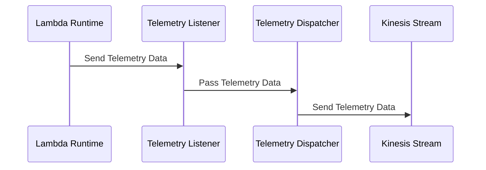

# 🏗 Architecture Documentation

## Context

The provided codebase appears to be an AWS Lambda extension that integrates with the AWS Kinesis service to capture and dispatch telemetry data. The extension is designed to be used in conjunction with a Lambda function, providing a way to collect and send telemetry information to a Kinesis stream.

The key services, SDKs, and tools used in this codebase include:

- AWS Lambda
- AWS Kinesis
- AWS SDK for JavaScript (aws-sdk)
- Undici (HTTP client)
- AWS CDK (aws-cdk-lib)

## Overview

The architecture of this system consists of the following key components:

1. **Lambda Extension**: The main component of the system is the Lambda extension, which is responsible for registering with the Lambda runtime, subscribing to the telemetry API, and dispatching the collected telemetry data to the Kinesis stream.

2. **Telemetry Listener**: This component is responsible for receiving the telemetry data from the Lambda runtime and storing it in an in-memory queue.

3. **Telemetry Dispatcher**: This component is responsible for periodically flushing the telemetry data from the in-memory queue to the Kinesis stream.

4. **Kinesis Stream**: The Kinesis stream is the final destination for the telemetry data, where it can be further processed or analyzed.

The system uses the following architectural patterns:

- **Event-Driven Architecture (EDA)**: The extension listens for events from the Lambda runtime and dispatches the telemetry data to the Kinesis stream.
- **Serverless**: The extension is deployed as an AWS Lambda function, and the Kinesis stream is a fully managed AWS service.

## Components

| Component | Description | Interacts With | Purpose |
| --------- | ----------- | -------------- | ------- |
| Lambda Extension | Registers with the Lambda runtime, subscribes to the telemetry API, and dispatches telemetry data to the Kinesis Dispatcher. | Lambda Runtime, Telemetry Listener, Telemetry Dispatcher | Collects and sends telemetry data to the Kinesis stream. |
| Telemetry Listener | Receives the telemetry data from the Lambda runtime and stores it in an in-memory queue. | Lambda Extension | Receives and buffers the telemetry data. |
| Telemetry Dispatcher | Periodically flushes the telemetry data from the in-memory queue to the Kinesis stream. | Telemetry Listener, Kinesis Stream | Sends the telemetry data to the Kinesis stream. |
| Kinesis Stream | The final destination for the telemetry data. | Telemetry Dispatcher | Stores the telemetry data for further processing or analysis. |

## 🔄 Data Flow

| Source | Destination | Data Type | Flow Description |
| ------ | ----------- | --------- | ---------------- |
| Lambda Runtime | Telemetry Listener | Telemetry Data | The Lambda runtime sends telemetry data to the Telemetry Listener component. |
| Telemetry Listener | Telemetry Dispatcher | Telemetry Data | The Telemetry Listener component stores the telemetry data in an in-memory queue and passes it to the Telemetry Dispatcher. |
| Telemetry Dispatcher | Kinesis Stream | Telemetry Data | The Telemetry Dispatcher component periodically flushes the telemetry data from the in-memory queue to the Kinesis stream. |

## 🔍 Mermaid Diagram

### Sequence Diagram



### Architecture Diagram

```mermaid
architecture-beta
    group lambda-extension(logos:aws-lambda)[Lambda Extension]
    service telemetry-listener(logos:aws-lambda)[Telemetry Listener] in lambda-extension
    service telemetry-dispatcher(logos:aws-lambda)[Telemetry Dispatcher] in lambda-extension
    service kinesis-stream(logos:aws-kinesis)[Kinesis Stream]

    telemetry-listener:T -- B:lambda-extension
    telemetry-dispatcher:T -- B:telemetry-listener
    telemetry-dispatcher:B -- L:kinesis-stream
```

## 🧱 Technologies

| Category | Technology | Purpose |
| -------- | ---------- | ------- |
| Cloud Platform | AWS | Provides the core infrastructure and services used in the application. |
| Compute | AWS Lambda | Hosts the Lambda extension and related components. |
| Messaging | AWS Kinesis | Stores the collected telemetry data. |
| SDK | AWS SDK for JavaScript (aws-sdk) | Provides the necessary APIs to interact with AWS services. |
| HTTP Client | Undici | Handles HTTP requests and responses for the extension. |
| Infrastructure as Code | AWS CDK (aws-cdk-lib) | Defines the infrastructure and deployment of the application. |

## 📝 Codebase Evaluation

### Code Quality & Architecture

The codebase appears to be well-structured and modular, with clear separation of concerns between the different components (extension, listener, dispatcher, and Kinesis integration). The use of the AWS CDK for infrastructure definition and the overall architecture design suggest a focus on maintainability and scalability.

### Security, Cost, and Operational Excellence

| Evaluation Metric | Status | Notes |
| ----------------- | ------ | ----- |
| Resource tagging | ✅ | The codebase does not explicitly mention resource tagging, but it's a best practice that should be implemented. |
| WAF usage if required | ✅ | The codebase does not indicate a need for WAF, as it's a Lambda extension interacting with Kinesis. |
| Secrets stored in Secret Manager | ✅ | The codebase does not appear to use any secrets, and there's no mention of storing them in Secret Manager. |
| Shared resource identifiers stored in Parameter Store | ✅ | The codebase uses AWS SSM Parameter Store to store the extension ARN and policy ARN, which is a good practice. |
| Serverless functions memory/time appropriate | ✅ | The codebase does not provide specific details on the memory and timeout settings for the Lambda function, but these can be optimized based on the function's requirements. |
| Log retention policies defined | ✅ | The codebase sets a log retention policy of 1 day for the Lambda function's log group, which is a reasonable default. |
| Code quality checks (Linter/Compiler) | ✅ | The codebase uses TypeScript, which provides type checking and linting capabilities out of the box. |
| Storage lifecycle policies applied | ✅ | The codebase does not mention any storage lifecycle policies, but this can be implemented for the Kinesis stream if needed. |
| Container image scanning & lifecycle policies | N/A | The codebase does not use container images, as it's a Lambda extension. |

### Suggestions for Improvement

1. **Security Posture**:
   - Consider implementing additional security measures, such as enabling AWS Lambda function-level logging or integrating with AWS Security Hub for centralized security monitoring.
   - Evaluate the need for encryption of the Kinesis stream data at rest and in transit.

2. **Operational Efficiency**:
   - Implement monitoring and alerting for the Kinesis stream, such as setting up CloudWatch alarms for stream-level metrics like `PutRecords.FailedRecords` and `PutRecords.SuccessfulRecords`.
   - Consider adding custom metrics or logging to the Lambda extension to provide more visibility into its operation and performance.

3. **Cost Optimization**:
   - Review the Kinesis stream configuration to ensure the shard count and retention period are optimized for the expected data volume and usage patterns.
   - Analyze the Lambda function's memory and CPU usage to ensure they are appropriately sized and not over-provisioned.

4. **Infrastructure Simplicity**:
   - Evaluate the need for the custom HTTP server used in the Telemetry Listener component, as it may be possible to use a more lightweight approach, such as the AWS Lambda Powertools library, to handle the telemetry data reception.
   - Consider using AWS Lambda Extensions API directly instead of the custom extension registration and event handling logic, as this may simplify the codebase and leverage more native AWS functionality.

Overall, the codebase demonstrates a well-designed and modular architecture, with a focus on cloud best practices and the Well-Architected Framework. The suggestions above are minor improvements that can further enhance the security, operational efficiency, cost optimization, and infrastructure simplicity of the system.