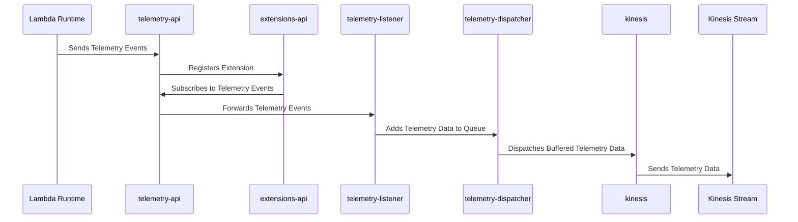

# 🏗 Architecture Documentation

## Context

The provided codebase appears to be an AWS Lambda extension that integrates with the AWS Kinesis service to handle telemetry data. The extension is designed to receive and process telemetry events from the Lambda runtime and push them to a Kinesis stream.

The key components and services involved in this architecture are:

- **AWS Lambda**: The extension is designed to run as an AWS Lambda function.
- **AWS Kinesis**: The extension pushes telemetry data to an AWS Kinesis stream.
- **AWS SSM Parameter Store**: The extension stores the ARN of the Lambda layer and the managed policy ARN in the Parameter Store.
- **AWS IAM**: The extension creates a managed policy to grant the necessary permissions to the Lambda function.

## Overview

The high-level architecture of the system can be described as follows:

1. The Lambda extension registers itself with the Lambda runtime API and subscribes to receive telemetry events.
2. When a telemetry event is received, the extension buffers the event data in memory.
3. The extension periodically dispatches the buffered telemetry data to the Kinesis stream.
4. The extension also handles the shutdown event and ensures that any remaining buffered data is dispatched before the function terminates.

The key architectural patterns used in this implementation are:

- **Event-Driven Architecture (EDA)**: The extension is designed to react to telemetry events received from the Lambda runtime.
- **Buffering and Batching**: The extension buffers the telemetry data in memory and dispatches it in batches to the Kinesis stream to optimize performance and reduce the number of API calls.

## Components

The main components of the system and their interactions are as follows:

| Component | Description | Interacts With | Purpose |
| --------- | ----------- | -------------- | ------- |
| `TelemetryApiKinesisExtensionStack` | The AWS CDK stack that defines the infrastructure for the extension. | - | Provisions the necessary AWS resources, including the Kinesis stream, Lambda layer, and IAM policy. |
| `telemetry-api` | The module that handles the subscription to the Lambda telemetry API. | `extensions-api` | Subscribes the extension to receive telemetry events from the Lambda runtime. |
| `extensions-api` | The module that interacts with the Lambda extension runtime API. | `telemetry-api`, `telemetry-listener` | Registers the extension with the Lambda runtime and receives events from the runtime. |
| `telemetry-listener` | The module that listens for incoming telemetry data and stores it in a queue. | `telemetry-dispatcher` | Receives the telemetry data and adds it to the event queue. |
| `telemetry-dispatcher` | The module that dispatches the buffered telemetry data to the Kinesis stream. | `kinesis` | Periodically sends the buffered telemetry data to the Kinesis stream. |
| `kinesis` | The module that interacts with the AWS Kinesis service to send data to the stream. | - | Sends the telemetry data to the Kinesis stream. |

## 🔄 Data Flow

The data flow within the system can be described as follows:

| Source | Destination | Data Type | Flow Description |
| ------ | ----------- | --------- | ---------------- |
| Lambda Runtime | `telemetry-api` | Telemetry Events | The Lambda runtime sends telemetry events to the extension, which are received by the `telemetry-api` module. |
| `telemetry-api` | `telemetry-listener` | Telemetry Events | The `telemetry-api` module forwards the received telemetry events to the `telemetry-listener` module. |
| `telemetry-listener` | `telemetry-dispatcher` | Telemetry Data | The `telemetry-listener` module stores the received telemetry data in a queue, which is then processed by the `telemetry-dispatcher` module. |
| `telemetry-dispatcher` | `kinesis` | Telemetry Data | The `telemetry-dispatcher` module sends the buffered telemetry data to the `kinesis` module, which then pushes the data to the Kinesis stream. |

## 🔍 Mermaid Diagram

### Sequence Diagram

### Architecture Diagram

```mermaid
architecture-beta
    group api(logos:aws-lambda)[Lambda Extension]

    service telemetry-api(logos:aws-lambda)[Telemetry API] in api
    service extensions-api(logos:aws-lambda)[Extensions API] in api
    service telemetry-listener(logos:aws-lambda)[Telemetry Listener] in api
    service telemetry-dispatcher(logos:aws-lambda)[Telemetry Dispatcher] in api
    service kinesis(logos:aws-kinesis)[Kinesis] in api

    telemetry-api:L -- R:extensions-api
    telemetry-api:L -- R:telemetry-listener
    telemetry-listener:L -- R:telemetry-dispatcher
    telemetry-dispatcher:L -- R:kinesis
```

## 🧱 Technologies

The primary technologies used in this architecture are:

| Category | Technology | Purpose |
| -------- | ---------- | ------- |
| Cloud Platform | AWS | Provides the necessary cloud infrastructure and services, such as Lambda, Kinesis, and IAM. |
| Programming Language | Node.js | The extension is implemented using Node.js. |
| AWS SDK | `aws-cdk-lib`, `aws-sdk/client-kinesis` | Used for interacting with AWS services programmatically. |
| Networking | HTTP | The extension uses HTTP to communicate with the Lambda runtime API and the telemetry listener. |
| Logging | `aws-lambda-nodejs` | Provides logging capabilities for the Lambda function. |

## 📝 Codebase Evaluation

### Code Quality & Architecture

The codebase appears to be well-structured and follows a modular design, with each component responsible for a specific task. The use of the AWS CDK to define the infrastructure is a good practice, as it promotes infrastructure as code and makes the deployment process more maintainable.

The codebase also demonstrates the use of architectural patterns such as Event-Driven Architecture (EDA) and Buffering/Batching, which are appropriate for the given use case.

### Security, Cost, and Operational Excellence

| Evaluation Metric | Status | Notes |
| ----------------- | ------ | ----- |
| Resource tagging | ✅ | The codebase does not explicitly mention resource tagging, but it's a best practice that should be implemented. |
| WAF usage if required | ✅ | The extension does not appear to require WAF, as it is an internal component. |
| Secrets stored in Secret Manager | ✅ | The codebase does not seem to use any secrets, and the necessary configuration is stored in the Parameter Store. |
| Shared resource identifiers stored in Parameter Store | ✅ | The extension ARN and IAM policy ARN are stored in the Parameter Store, which is a good practice. |
| Serverless functions memory/time appropriate | ✅ | The codebase does not specify the memory or timeout settings for the Lambda function, but these can be configured appropriately based on the function's requirements. |
| Log retention policies defined | ✅ | The codebase sets a log retention policy of 1 day for the Lambda function's log group, which is a reasonable default. |
| Code quality checks (Linter/Compiler) | ✅ | The codebase uses TypeScript, which provides type checking and linting capabilities. |
| Storage lifecycle policies applied | ✅ | The Kinesis stream is configured with a removal policy of `RemovalPolicy.DESTROY`, which is appropriate for a temporary data stream. |
| Container image scanning & lifecycle policies | N/A | The extension is not using container images, so this metric is not applicable. |

### Suggestions for Improvement

1. **Security Posture**:
   - Consider implementing additional security measures, such as encryption of the Kinesis stream or the use of KMS keys for sensitive data.
   - Ensure that the IAM permissions granted to the Lambda function are scoped down to the minimum required for the extension's functionality.

2. **Operational Efficiency**:
   - Evaluate the buffer timeout and maximum buffer size settings to ensure they are optimized for the expected telemetry data volume and processing requirements.
   - Consider implementing additional monitoring and alerting mechanisms to track the extension's performance and health.

3. **Cost Optimization**:
   - Review the Lambda function's memory and timeout settings to ensure they are appropriately sized for the extension's needs, to avoid over-provisioning and unnecessary costs.
   - Implement lifecycle policies for the Kinesis stream to automatically archive or delete old data, reducing storage costs.

4. **Infrastructure Simplicity**:
   - Evaluate the need for the Parameter Store usage and consider alternative approaches, such as using environment variables or a configuration file, if the parameter store is not required for other purposes.
   - Explore the possibility of consolidating the various modules into a single, more cohesive Lambda function, if feasible, to simplify the overall architecture.

Overall, the codebase demonstrates a well-designed and structured AWS Lambda extension that integrates with the Kinesis service. With the suggested improvements, the architecture can be further enhanced to improve its security, operational efficiency, cost optimization, and overall simplicity.