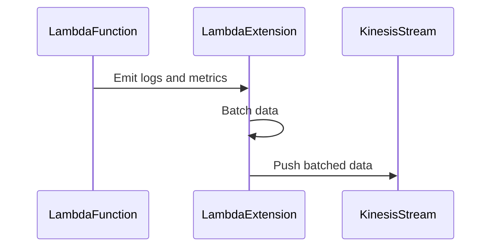

# 🏗 Architecture Documentation

## 📖 Context

* This repository contains an AWS CDK project that provisions an AWS Lambda Extension for capturing telemetry data from Lambda functions and pushing it to an Amazon Kinesis Data Stream.
* The extension is designed to subscribe to the AWS Lambda Telemetry API, receive logs and metrics from Lambda functions, and forward them to a Kinesis Data Stream for further processing or analysis.
* The project utilizes various AWS services, including AWS Lambda, AWS Kinesis Data Streams, AWS IAM, AWS SSM Parameter Store, and the AWS SDK for JavaScript.

## 📖 Overview

The key components of the architecture are:

1. **AWS CDK Stack**: Defines the infrastructure resources using AWS CDK constructs, including an Amazon Kinesis Data Stream, an AWS Lambda Layer containing the extension code, an AWS Lambda function for testing purposes, and necessary IAM policies and permissions.

2. **Lambda Extension**: A Node.js application that runs alongside Lambda functions. It subscribes to the Lambda Telemetry API, receives logs and metrics, and forwards them to the Kinesis Data Stream.

3. **Kinesis Data Stream**: A scalable and durable real-time data streaming service that ingests and stores the telemetry data pushed by the Lambda Extension.

4. **AWS Lambda Function**: A sample Lambda function used for testing and demonstrating the extension's functionality.

The main flow is as follows:

1. The CDK stack provisions the required resources, including the Kinesis Data Stream and the Lambda Extension Layer.
2. The Lambda Extension subscribes to the Lambda Telemetry API and starts listening for events.
3. When a Lambda function is invoked, the Extension receives logs and metrics from the Telemetry API.
4. The Extension batches and forwards the received data to the Kinesis Data Stream.
5. The data in the Kinesis Stream can be consumed and processed further by other services or applications.

---

## 🔹 Components

| Component | Description | Interacts With | Purpose |
| --------- | ----------- | -------------- | ------- |
| AWS CDK Stack | Defines the infrastructure resources using AWS CDK constructs. | AWS CloudFormation | Provision and manage the required resources. |
| Lambda Extension | Node.js application running alongside Lambda functions. | Lambda Telemetry API, Kinesis Data Stream | Subscribe to telemetry events, receive logs and metrics, and forward data to Kinesis. |
| Kinesis Data Stream | Scalable and durable real-time data streaming service. | Lambda Extension | Ingest and store the telemetry data pushed by the Extension. |
| Lambda Function | Sample Lambda function for testing and demonstration. | Lambda Extension (indirectly) | Generate logs and metrics that are captured by the Extension. |

## 🔄 Data Flow

| Source | Destination | Data Type | Flow Description |
| ------ | ----------- | --------- | ---------------- |
| Lambda Function | Lambda Extension | Logs, Metrics | The Lambda Telemetry API emits logs and metrics from the function to the Extension. |
| Lambda Extension | Kinesis Data Stream | JSON | The Extension batches and forwards the received telemetry data to the Kinesis Stream. |

## 🔍 Mermaid Diagram

1. Sequence Diagram:

2. Architecture Diagram:

```mermaid
architecture-beta
    group aws(cloud)[AWS Cloud]

    service lambda(lambda)[Lambda Function] in aws
    service extension(extension)[Lambda Extension] in aws
    service kinesis(kinesis)[Kinesis Data Stream] in aws

    lambda:R -- L:extension
    extension:R -- L:kinesis
```

## 🧱 Technologies

| Category | Technology | Purpose |
| -------- | ---------- | ------- |
| Infrastructure as Code | AWS CDK | Define and provision AWS resources using code. |
| Serverless | AWS Lambda | Run the Lambda Extension and sample function. |
| Streaming | AWS Kinesis Data Streams | Ingest and store the telemetry data pushed by the Extension. |
| IAM | AWS IAM | Manage permissions and policies for the Extension and other resources. |
| Configuration | AWS SSM Parameter Store | Store and retrieve configuration values, such as the Extension Layer ARN. |
| SDK | AWS SDK for JavaScript | Interact with AWS services from the Extension code. |

## 📝 Codebase Evaluation

### Code Quality & Architecture:

- The codebase follows a modular structure, separating concerns into different files and modules.
- The use of AWS CDK for infrastructure provisioning promotes infrastructure as code and declarative resource management.
- The Lambda Extension architecture allows for easy integration with Lambda functions and the Telemetry API.
- The codebase could benefit from better error handling and logging mechanisms.
- Dependency management and versioning could be improved for better maintainability.

### Security, Cost, and Operational Excellence:

| Evaluation Metric                                                      | Status | Notes |
| ---------------------------------------------------------------------- | ------ | ----- |
| Resource tagging (`CostCenter`, `Environment`, `Application`, `Owner`) | ⚠️     | No resource tagging observed in the provided code. |
| WAF usage if required                                                  | ✅     | Not applicable for this use case. |
| Secrets stored in Secret Manager                                       | ✅     | No secrets observed in the provided code. |
| Shared resource identifiers stored in Parameter Store                  | ✅     | The Extension Layer ARN and IAM policy ARN are stored in Parameter Store. |
| Serverless functions memory/time appropriate                           | ⚠️     | No memory or timeout configuration observed for the sample Lambda function. |
| Log retention policies defined                                         | ⚠️     | No log retention policies observed in the provided code. |
| Code quality checks (Linter/Compiler)                                  | ⚠️     | No linting or code quality checks observed in the provided code. |
| Storage lifecycle policies applied                                     | ✅     | Not applicable for this use case. |
| Container image scanning & lifecycle policies                          | ✅     | Not applicable for this use case. |

### Suggestions:

- **Security Posture**:
  - Implement resource tagging for better visibility and cost allocation.
  - Consider implementing AWS CloudTrail for auditing and monitoring API calls.
  - Implement proper error handling and logging mechanisms to aid in troubleshooting and security incident response.

- **Operational Efficiency**:
  - Define log retention policies for the Lambda function and the Extension to manage storage costs and compliance requirements.
  - Implement monitoring and alerting mechanisms for the Extension and Kinesis Data Stream to detect and respond to issues promptly.
  - Consider implementing automated deployment pipelines for the Extension and infrastructure changes.

- **Cost Optimization**:
  - Define appropriate memory and timeout configurations for the Lambda function to optimize costs based on workload requirements.
  - Implement cost allocation tags on resources for better cost tracking and optimization.
  - Consider implementing data lifecycle policies for the Kinesis Data Stream to move or archive older data to more cost-effective storage solutions.

- **Infrastructure Simplicity**:
  - The current architecture is relatively simple and focused on the core functionality of capturing and forwarding telemetry data.
  - As the project evolves, consider modularizing the infrastructure code and separating concerns into multiple CDK stacks or nested stacks for better maintainability and reusability.

