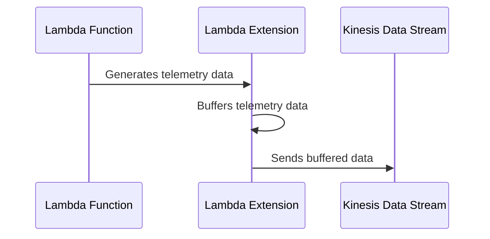

# 🏗 Architecture Documentation

#### ## 📖 Context

* This repository contains an AWS CDK project that provisions an AWS Lambda Extension for pushing telemetry data to an Amazon Kinesis Data Stream.
* The extension is designed to capture and forward logs and metrics from AWS Lambda functions to a Kinesis stream for further processing or analysis.
* It utilizes the AWS Lambda Extensions API to subscribe to telemetry events and the AWS SDK for Kinesis to send data to the stream.

#### ## 📖 Overview

* The main components are:
  - **TelemetryApiKinesisExtensionStack**: An AWS CDK stack that provisions the necessary AWS resources, including a Kinesis Data Stream, an AWS Lambda Layer containing the extension code, and an IAM policy for the extension.
  - **Lambda Extension**: A Node.js application that registers with the Lambda Extensions API, subscribes to telemetry events, and forwards the received data to the Kinesis Data Stream.

* The extension follows these steps:
  1. Registers with the Lambda Extensions API to receive `INVOKE` and `SHUTDOWN` events.
  2. Subscribes to the Lambda Telemetry API to receive logs and metrics from the Lambda function.
  3. Buffers the received telemetry data in memory.
  4. Periodically sends the buffered data to the Kinesis Data Stream.
  5. Handles the `SHUTDOWN` event by flushing any remaining buffered data before exiting.

* The extension uses the `undici` library to configure a global HTTP agent with custom timeouts for improved connection management.

---

#### ## 🔹 Components

| Component | Description | Interacts With | Purpose |
| --------- | ----------- | -------------- | ------- |
| TelemetryApiKinesisExtensionStack | AWS CDK stack | AWS CloudFormation | Provisions the Kinesis Data Stream, Lambda Layer, and IAM policy for the extension. |
| Lambda Extension | Node.js application | Lambda Extensions API, Telemetry API, Kinesis Data Stream | Registers with the Extensions API, subscribes to telemetry events, buffers data, and sends it to Kinesis. |
| Kinesis Data Stream | Amazon Kinesis Data Stream | Lambda Extension | Receives and stores the telemetry data sent by the extension. |

#### ## 🔄 Data Flow

| Source | Destination | Data Type | Flow Description |
| ------ | ----------- | --------- | ---------------- |
| AWS Lambda Function | Lambda Extension | Telemetry Logs and Metrics | The Lambda function generates telemetry data, which is captured by the extension. |
| Lambda Extension | Kinesis Data Stream | JSON Records | The extension buffers and sends the telemetry data as JSON records to the Kinesis Data Stream. |

#### ## 🔍 Mermaid Diagram

1. Sequence Diagram:

2. Architecture Diagram:

#### ## 🧱 Technologies

| Category | Technology | Purpose |
| -------- | ---------- | ------- |
| Cloud Provider | AWS | Hosting and provisioning resources |
| Infrastructure as Code | AWS CDK | Defining and deploying the infrastructure |
| Streaming | Amazon Kinesis Data Stream | Receiving and storing telemetry data |
| Runtime | Node.js | Executing the Lambda Extension code |
| Extensions | AWS Lambda Extensions API | Enabling the extension to receive telemetry events |
| SDK | AWS SDK for JavaScript | Interacting with AWS services (Kinesis) |

#### ## 📝 Codebase Evaluation

* **Code Quality & Architecture**:
  - The codebase follows a modular structure, separating concerns into different files (e.g., `telemetry-api`, `extensions-api`, `kinesis`, `telemetry-listener`, `telemetry-dispatcher`).
  - The use of AWS CDK for infrastructure provisioning promotes infrastructure as code and declarative resource management.
  - The extension buffers telemetry data in memory before sending it to Kinesis, which can improve performance and reduce the number of API calls.
  - The use of a global HTTP agent with custom timeouts can help manage connections more efficiently.

* **Security, Cost, and Operational Excellence**:

| Evaluation Metric                                                      | Status | Notes |
| ---------------------------------------------------------------------- | ------ | ----- |
| Resource tagging (`CostCenter`, `Environment`, `Application`, `Owner`) | ⚠️     | No resource tagging observed in the provided code. |
| WAF usage if required                                                  | ✅     | Not applicable for this use case. |
| Secrets stored in Secret Manager                                       | ✅     | No secrets observed in the provided code. |
| Shared resource identifiers stored in Parameter Store                  | ✅     | The Kinesis stream name and extension ARN are stored in Parameter Store. |
| Serverless functions memory/time appropriate                           | ✅     | No serverless functions observed in the provided code. |
| Log retention policies defined                                         | ⚠️     | No log retention policies observed in the provided code. |
| Code quality checks (Linter/Compiler)                                  | ⚠️     | No linting or code quality checks observed in the provided code. |
| Storage lifecycle policies applied                                     | ✅     | Not applicable for this use case. |
| Container image scanning & lifecycle policies                          | ✅     | Not applicable for this use case. |

* **Suggestions**:
  - **Security**:
    - Implement resource tagging for better resource identification and cost allocation.
    - Consider implementing log retention policies to control the retention period and cost of log storage.
  - **Operational Excellence**:
    - Introduce code quality checks (linting, static analysis) to improve code maintainability and catch potential issues early.
    - Implement logging and monitoring for the extension to aid in troubleshooting and operational visibility.
  - **Cost Optimization**:
    - Monitor and optimize the Kinesis Data Stream's shard count and retention period based on usage patterns and requirements.
  - **Infrastructure Simplicity**:
    - The current architecture appears relatively simple and focused on the core functionality of capturing and forwarding telemetry data.

### # 📚 Output Summary

