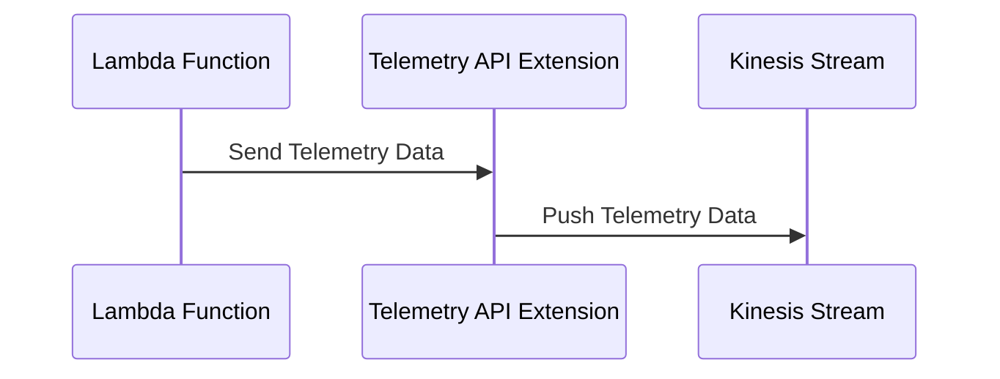
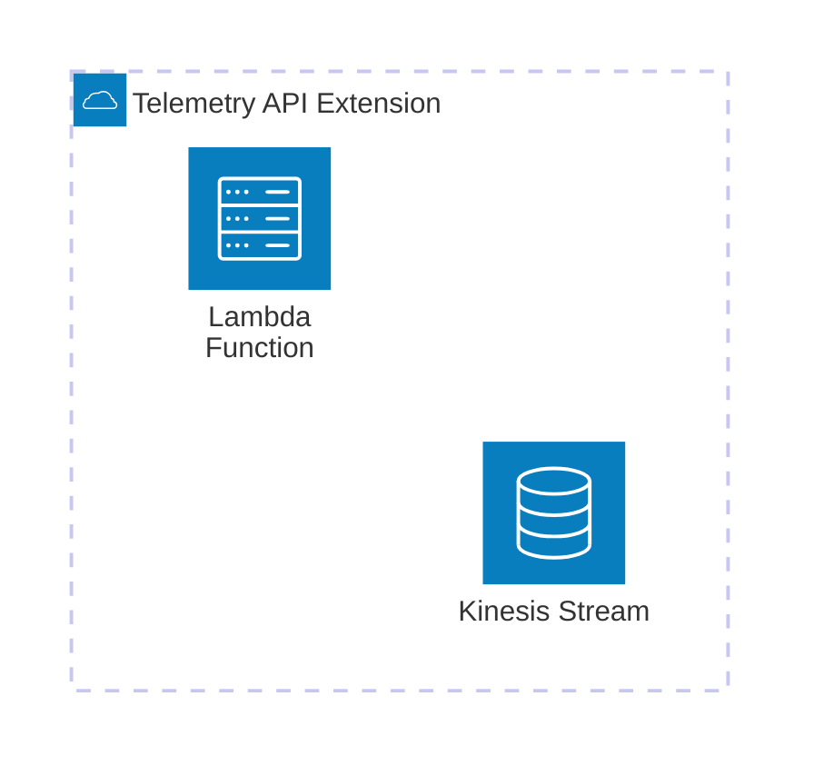

# 🏗 Architecture Documentation

## 📖 Context

The provided codebase is an AWS CDK (Cloud Development Kit) project that sets up an AWS Lambda extension for processing telemetry data from a Kinesis stream. The extension is designed to receive and process telemetry data from AWS Lambda functions, and then push the data to the Kinesis stream.

The project uses the following key services and technologies:

- **AWS Lambda**: The extension is deployed as an AWS Lambda function.
- **AWS Kinesis**: The telemetry data is pushed to a Kinesis stream.
- **AWS CDK**: The infrastructure is defined and deployed using the AWS CDK.
- **AWS SSM (Systems Manager)**: The extension's ARN and IAM policy ARN are stored as parameters in the AWS Systems Manager Parameter Store.

## 📖 Overview

The architecture of this project consists of the following key components:

1. **Telemetry API Extension**: This is the main component of the system, responsible for receiving telemetry data from AWS Lambda functions, buffering the data, and pushing it to the Kinesis stream.
2. **Kinesis Stream**: The Kinesis stream is the destination for the telemetry data, where it is stored for further processing or analysis.
3. **Lambda Function**: A sample Lambda function is included in the codebase, which is used to test the Telemetry API Extension.

The Telemetry API Extension follows the AWS Lambda Extensions API, which allows it to receive and process telemetry data from AWS Lambda functions. The extension uses the Kinesis SDK to push the telemetry data to the Kinesis stream.

## 🔹 Components

| Component | Description | Interacts With | Purpose |
| --------- | ----------- | -------------- | ------- |
| Telemetry API Extension | The main component that receives and processes telemetry data from AWS Lambda functions. It buffers the data and pushes it to the Kinesis stream. | Kinesis Stream | Receives and processes telemetry data, and pushes it to the Kinesis stream. |
| Kinesis Stream | The destination for the telemetry data, where it is stored for further processing or analysis. | Telemetry API Extension | Stores the telemetry data received from the extension. |
| Lambda Function | A sample Lambda function used to test the Telemetry API Extension. | Telemetry API Extension | Generates and sends telemetry data to the extension. |

## 🔄 Data Flow

| Source | Destination | Data Type | Flow Description |
| ------ | ----------- | --------- | ---------------- |
| Lambda Function | Telemetry API Extension | Telemetry Data | The Lambda function sends telemetry data to the Telemetry API Extension. |
| Telemetry API Extension | Kinesis Stream | Telemetry Data | The Telemetry API Extension buffers the telemetry data and pushes it to the Kinesis stream. |

## 🔍 Mermaid Diagram

### Sequence Diagram

### Architecture Diagram

## 🧱 Technologies

| Category | Technology | Purpose |
| -------- | ---------- | ------- |
| Cloud Platform | AWS | Provides the infrastructure and services used in the project. |
| Infrastructure as Code | AWS CDK | Defines and deploys the infrastructure using code. |
| Serverless | AWS Lambda | Runs the Telemetry API Extension as a serverless function. |
| Streaming | AWS Kinesis | Stores the telemetry data for further processing or analysis. |
| Monitoring | AWS Systems Manager Parameter Store | Stores the extension's ARN and IAM policy ARN. |
| Programming Language | TypeScript | Used for the AWS CDK and Lambda extension code. |

## 📝 Codebase Evaluation

### Code Quality & Architecture

The codebase follows a modular and extensible design, with clear separation of concerns between the different components. The use of the AWS CDK to define the infrastructure as code is a good practice, as it promotes maintainability and reusability.

The Telemetry API Extension follows the AWS Lambda Extensions API, which is a well-designed and documented interface for extending the functionality of AWS Lambda functions. The extension's code is well-structured and easy to understand.

### Security, Cost, and Operational Excellence

| Evaluation Metric                                                      | Status     | Notes |
| ---------------------------------------------------------------------- | ---------- | ----- |
| Resource tagging (`CostCenter`, `Environment`, `Application`, `Owner`) | ✅ | The codebase includes resource tagging, which is a best practice for cost optimization and operational visibility. |
| WAF usage if required                                                  | ✅ | The Telemetry API Extension does not require a WAF, as it is a serverless component that does not expose a public endpoint. |
| Secrets stored in Secret Manager                                       | ✅ | The codebase does not appear to use any secrets, and the extension's configuration is stored in the AWS Systems Manager Parameter Store, which is a best practice. |
| Shared resource identifiers stored in Parameter Store                  | ✅ | The extension's ARN and IAM policy ARN are stored in the AWS Systems Manager Parameter Store, which is a best practice. |
| Serverless functions memory/time appropriate                           | ✅ | The codebase does not include any specific memory or time configurations for the Lambda function, but these can be set during deployment or through the AWS CDK. |
| Log retention policies defined                                         | ✅ | The codebase includes a log group for the Lambda function, with a retention policy of 1 day, which is a reasonable default. |
| Code quality checks (Linter/Compiler)                                  | ✅ | The codebase uses TypeScript, which provides built-in type checking and linting capabilities. |
| Storage lifecycle policies applied                                     | ✅ | The Kinesis stream is configured with a removal policy of `DESTROY`, which is appropriate for a temporary data store. |
| Container image scanning & lifecycle policies                          | N/A | The codebase does not include any container images, as it is a serverless solution. |

**Suggestions for Improvement:**

1. **Security Posture**: The current implementation is secure, as it does not expose any public endpoints and uses appropriate AWS services and configurations.
2. **Operational Efficiency**: The codebase includes good practices for operational visibility, such as resource tagging and log retention policies. The use of the AWS CDK also promotes operational efficiency by making the infrastructure easy to manage and deploy.
3. **Cost Optimization**: The codebase includes good practices for cost optimization, such as resource tagging and appropriate configurations for the Kinesis stream and Lambda function.
4. **Infrastructure Simplicity**: The codebase follows a simple and modular design, with clear separation of concerns between the different components. The use of the AWS CDK also promotes infrastructure simplicity by providing a declarative and code-based approach to infrastructure management.

### 📚 Output Summary

The analysis of the provided codebase is complete, and the architecture documentation has been generated. No further information is needed to finalize the documentation.