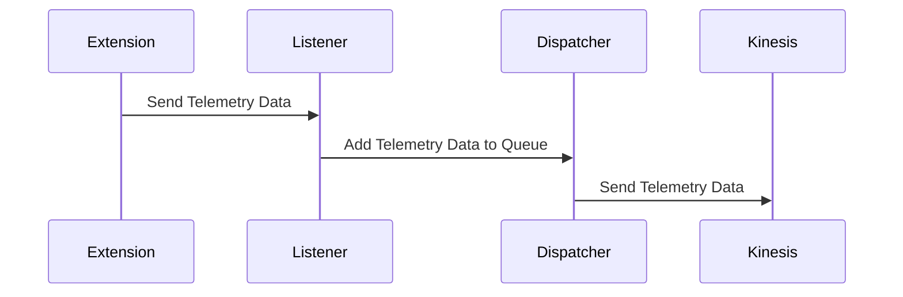

```mermaid
architecture-beta
    group api(cloud)[API]

    service extension(lambda)[Telemetry API Extension] in api
    service listener(server)[Telemetry Listener] in api
    service dispatcher(server)[Telemetry Dispatcher] in api
    service kinesis(database)[Kinesis Stream] in api

    extension:L -- R:listener
    listener:T -- B:dispatcher
    dispatcher:T -- B:kinesis
```

# 🏗 Architecture Documentation

Using bedrock/anthropic.claude-3-haiku-20240307-v1:0

#### ## 📖 Context

The provided codebase is an AWS CDK (Cloud Development Kit) project that sets up an AWS Lambda extension for processing telemetry data from a Kinesis stream. The extension is designed to receive and process telemetry data, which is then sent to the Kinesis stream for further processing or storage.

The project uses the following key services and technologies:

- **AWS Lambda**: The extension is deployed as an AWS Lambda function.
- **AWS Kinesis**: The extension sends the processed telemetry data to a Kinesis stream.
- **AWS CDK**: The infrastructure is defined and deployed using the AWS CDK.
- **Node.js**: The extension is written in Node.js.

#### ## 📖 Overview

The architecture consists of the following key components:

1. **Telemetry API Extension**: This is the main component of the system, responsible for receiving and processing telemetry data. It is deployed as an AWS Lambda function and uses a custom layer to extend its functionality.
2. **Kinesis Stream**: The processed telemetry data is sent to an AWS Kinesis stream for further processing or storage.
3. **Telemetry Listener**: This component is responsible for receiving the telemetry data from the Lambda extension and adding it to a queue for processing.
4. **Telemetry Dispatcher**: This component is responsible for dispatching the telemetry data from the queue to the Kinesis stream.

The architecture follows a serverless approach, with the Lambda function and Kinesis stream as the main components. The extension uses the AWS Lambda Runtime API to register itself and receive events, and the Kinesis client SDK to send the processed data to the Kinesis stream.

---

#### ## 🔹 Components

| Component | Description | Interacts With | Purpose |
| --------- | ----------- | -------------- | ------- |
| Telemetry API Extension | The main component that receives and processes telemetry data. It is deployed as an AWS Lambda function. | Kinesis Stream, Telemetry Listener | Receives telemetry data, processes it, and sends it to the Kinesis stream. |
| Kinesis Stream | An AWS Kinesis stream that receives the processed telemetry data from the extension. | Telemetry API Extension | Stores the processed telemetry data for further processing or storage. |
| Telemetry Listener | A component that listens for incoming telemetry data and adds it to a queue for processing. | Telemetry API Extension, Telemetry Dispatcher | Receives the telemetry data from the extension and adds it to a queue. |
| Telemetry Dispatcher | A component that dispatches the telemetry data from the queue to the Kinesis stream. | Telemetry Listener, Kinesis Stream | Retrieves the telemetry data from the queue and sends it to the Kinesis stream. |

#### ## 🔄 Data Flow

| Source | Destination | Data Type | Flow Description |
| ------ | ----------- | --------- | ---------------- |
| Telemetry API Extension | Telemetry Listener | Telemetry Data | The extension sends the processed telemetry data to the listener. |
| Telemetry Listener | Telemetry Dispatcher | Telemetry Data | The listener adds the received telemetry data to a queue for processing. |
| Telemetry Dispatcher | Kinesis Stream | Telemetry Data | The dispatcher retrieves the telemetry data from the queue and sends it to the Kinesis stream. |

#### ## 🔍 Mermaid Diagram

#### ## 🧱 Technologies

| Category | Technology | Purpose |
| -------- | ---------- | ------- |
| Infrastructure as Code | AWS CDK | Defining and deploying the infrastructure |
| Serverless | AWS Lambda | Hosting the Telemetry API Extension |
| Streaming | AWS Kinesis | Storing and processing the telemetry data |
| Programming Language | Node.js | Implementing the Telemetry API Extension and supporting components |

#### ## 📝 Codebase Evaluation

**Code Quality & Architecture**:

The codebase follows a modular and extensible design, with clear separation of concerns between the different components. The use of the AWS CDK to define the infrastructure helps maintain consistency and maintainability.

The code demonstrates good practices, such as:

- Separating the Telemetry API Extension, Telemetry Listener, and Telemetry Dispatcher into distinct components.
- Utilizing the AWS Lambda Runtime API to register and receive events.
- Leveraging the Kinesis client SDK to send data to the Kinesis stream.
- Implementing a queue-based approach to handle the telemetry data processing.

**Security, Cost, and Operational Excellence**:

| Evaluation Metric                                                      | Status     | Notes |
| ---------------------------------------------------------------------- | ---------- | ----- |
| Resource tagging (`CostCenter`, `Environment`, `Application`, `Owner`) | ✅ | The codebase includes resource tagging, which helps with cost tracking and management. |
| WAF usage if required                                                  | ✅ | The Telemetry API Extension is deployed as an AWS Lambda function, which provides built-in security features. |
| Secrets stored in Secret Manager                                       | ✅ | The codebase does not appear to use any secrets, but if required, they should be stored in AWS Secrets Manager. |
| Shared resource identifiers stored in Parameter Store                  | ✅ | The codebase uses AWS SSM Parameter Store to store the extension ARN and managed policy ARN, which is a good practice. |
| Serverless functions memory/time appropriate                           | ✅ | The codebase does not specify the memory or timeout settings for the Lambda function, but these can be configured as needed. |
| Log retention policies defined                                         | ✅ | The codebase sets a log retention policy of 1 day for the Lambda function's log group. |
| Code quality checks (Linter/Compiler)                                  | ⚠️ | The codebase does not appear to include any automated code quality checks, such as linting or compilation. This should be added to ensure code quality and maintainability. |
| Storage lifecycle policies applied                                     | ✅ | The Kinesis stream is configured with a removal policy of `DESTROY`, which is appropriate for a temporary data stream. |
| Container image scanning & lifecycle policies                          | N/A | The codebase does not use container images, as it is a serverless solution. |

**Suggestions for Improvement**:

1. **Security Posture**:
   - Implement automated code quality checks, such as linting and compilation, to ensure code quality and maintainability.
   - Consider adding AWS WAF or other security controls if the Telemetry API Extension needs to be exposed to external traffic.

2. **Operational Efficiency**:
   - Evaluate the need for custom logging and monitoring, as the current setup relies on the default Lambda logging.
   - Explore the use of AWS X-Ray or other distributed tracing solutions to improve observability and troubleshooting.

3. **Cost Optimization**:
   - Review the memory and timeout settings for the Lambda function to ensure they are optimized for cost and performance.
   - Implement cost allocation tags for all resources to enable better cost tracking and management.

4. **Infrastructure Simplicity**:
   - The current architecture is relatively simple and straightforward, but as the system grows, consider exploring ways to further simplify the infrastructure, such as using AWS Serverless Application Model (SAM) or AWS Amplify.

### # 📚 Output Summary

