```mermaid
architecture-beta
    group api(logos:aws-lambda)[API]

    service kinesis(logos:aws-kinesis)[Kinesis Stream] in api
    service lambda(logos:aws-lambda)[Lambda Function] in api
    service extension(logos:aws-lambda)[Lambda Extension] in api
    service iam(logos:aws-iam)[IAM Policy] in api
    service ssm(logos:aws-ssm)[SSM Parameters] in api
    
    kinesis:L -- R:lambda
    lambda:T -- B:extension
    extension:T -- B:kinesis
    iam:T -- B:lambda
    ssm:T -- B:lambda
```

# 🏗 Architecture Documentation

## Context

The provided code appears to be an extension for an AWS Lambda function that collects and dispatches telemetry data to an AWS Kinesis stream. The extension is designed to be used as a layer in the Lambda function, providing the necessary functionality to send telemetry data to Kinesis.

The key services, SDKs, and tools used in this project include:

- AWS CDK (Cloud Development Kit) for infrastructure as code
- AWS Lambda for serverless computing
- AWS Kinesis for real-time data streaming
- AWS SSM (Systems Manager) for storing parameter values
- AWS IAM for managing permissions
- Undici for HTTP client functionality

## Overview

The architecture of this project follows a serverless, event-driven approach. The main components and their responsibilities are:

1. **TelemetryApiKinesisExtensionStack**: This is the main CDK stack that sets up the necessary infrastructure, including the Kinesis stream, the Lambda function, and the extension layer.
2. **Extension Layer**: This is the core of the project, responsible for registering the extension with the Lambda runtime, subscribing to events, and dispatching telemetry data to the Kinesis stream.
3. **Telemetry Listener**: This component is responsible for receiving and buffering the telemetry data from the Lambda function.
4. **Telemetry Dispatcher**: This component is responsible for sending the buffered telemetry data to the Kinesis stream.

The interaction between these components is as follows:

1. The Lambda function invokes the extension layer, which registers the extension with the Lambda runtime.
2. The extension layer subscribes to the necessary events (INVOKE and SHUTDOWN) and starts the telemetry listener.
3. When the Lambda function is invoked, the extension layer receives the event and dispatches the buffered telemetry data to the Kinesis stream.
4. When the Lambda function is about to shut down, the extension layer receives the SHUTDOWN event and dispatches the remaining telemetry data before exiting.

The architecture follows a microservices-like pattern, with the extension layer and the Kinesis stream as separate components. This allows for better scalability, maintainability, and flexibility in the future.

## Components

| Component | Description | Interacts With | Purpose |
| --------- | ----------- | -------------- | ------- |
| TelemetryApiKinesisExtensionStack | The main CDK stack that sets up the necessary infrastructure | AWS Kinesis, AWS Lambda, AWS SSM | Provisions the Kinesis stream, the Lambda function, and the extension layer |
| Extension Layer | The core of the project, responsible for registering the extension and dispatching telemetry data | Telemetry Listener, Telemetry Dispatcher | Registers the extension, subscribes to events, and dispatches telemetry data to the Kinesis stream |
| Telemetry Listener | Responsible for receiving and buffering the telemetry data from the Lambda function | Extension Layer | Receives and buffers the telemetry data |
| Telemetry Dispatcher | Responsible for sending the buffered telemetry data to the Kinesis stream | Extension Layer, AWS Kinesis | Sends the buffered telemetry data to the Kinesis stream |

## 🧱 Technologies

| Category | Technology | Purpose |
| -------- | ---------- | ------- |
| Infrastructure as Code | AWS CDK | Provisioning the necessary AWS resources |
| Serverless Computing | AWS Lambda | Executing the Lambda function |
| Data Streaming | AWS Kinesis | Storing and processing the telemetry data |
| Parameter Store | AWS SSM | Storing the extension layer and policy ARNs |
| IAM Management | AWS IAM | Managing the permissions for the extension layer |
| HTTP Client | Undici | Handling HTTP requests and responses |

## New Code Analysis

The new code provided appears to be an implementation of the Telemetry Listener and Telemetry Dispatcher components.

The `Telemetry Listener` component is responsible for starting an HTTP server that listens for POST requests containing telemetry data. When a request is received, the `onLogReceived` function is called, which parses the request body and adds the telemetry data to the `eventsQueue` array.

The `Telemetry Dispatcher` component is responsible for dispatching the buffered telemetry data to the Kinesis stream. The `dispatch` function checks if the `eventsQueue` has enough items (based on the `MAX_BATCH_RECORDS_ITEMS` constant) or if it's been called with the `immediate` flag set to `true`. If either of these conditions is met, the function extracts the items from the `eventsQueue`, converts them to a JSON string, and calls the `kinesis.sendsToKinesis` function to send the data to the Kinesis stream.

These new components integrate with the existing architecture by providing the necessary functionality to receive and dispatch the telemetry data. The Telemetry Listener component receives the data from the Lambda function, and the Telemetry Dispatcher component sends the data to the Kinesis stream.

The overall architecture remains consistent with the previous iteration, with the new components seamlessly fitting into the existing microservices-like pattern.# 🏗 Architecture Documentation

## 🔍 Mermaid Diagram

## 🔍 Architecture Overview

The provided codebase appears to be an AWS CDK (Cloud Development Kit) application that sets up a Kinesis-based telemetry extension for a Lambda function. The main components of the architecture are:

1. **Kinesis Stream**: A Kinesis stream named `telemetry-kinesis-stream` is created to store the telemetry data.
2. **Lambda Function**: A Lambda function is created with a custom runtime extension that subscribes to the Kinesis stream and dispatches telemetry data to it.
3. **Lambda Extension**: A custom Lambda extension is created as a layer that is attached to the Lambda function. This extension is responsible for registering with the Lambda runtime, receiving events, and dispatching telemetry data to the Kinesis stream.
4. **IAM Policy**: A managed IAM policy is created to grant the Lambda function the necessary permissions to interact with the Kinesis stream and CloudWatch logs.
5. **SSM Parameters**: Two AWS Systems Manager (SSM) parameters are created to store the ARN of the Lambda extension layer and the ARN of the IAM policy.

The main flow of the application is as follows:

1. The `TelemetryApiKinesisExtensionStack` class in the CDK application creates the Kinesis stream, the Lambda extension layer, the Lambda function, the IAM policy, and the SSM parameters.
2. The Lambda function is configured to use the custom runtime extension layer.
3. The extension layer registers itself with the Lambda runtime and starts listening for events.
4. When the Lambda function is invoked, the extension layer receives an `INVOKE` event and dispatches any buffered telemetry data to the Kinesis stream.
5. When the Lambda function is about to be shut down, the extension layer receives a `SHUTDOWN` event and dispatches any remaining telemetry data to the Kinesis stream before exiting.

## 🔍 Key Design Decisions

1. **Kinesis Stream**: The use of a Kinesis stream to store the telemetry data provides a scalable and durable solution for handling the telemetry data. Kinesis streams can handle high volumes of data and provide built-in features for partitioning, replication, and durability.

2. **Lambda Extension**: The use of a custom Lambda extension allows the telemetry functionality to be decoupled from the main Lambda function logic. This separation of concerns makes the code more modular and easier to maintain.

3. **Buffering and Batching**: The extension layer buffers the telemetry data in memory and periodically dispatches it to the Kinesis stream. This helps to optimize the number of Kinesis API calls and reduce the overall latency of the telemetry data delivery.

4. **IAM Policy and SSM Parameters**: The use of a managed IAM policy and SSM parameters to store the extension layer and policy ARNs helps to centralize the configuration and make it easier to manage and update the application.

## 🔍 Potential Improvements

1. **Monitoring and Alerting**: Consider adding monitoring and alerting mechanisms to the application, such as CloudWatch alarms or Amazon EventBridge rules, to detect and respond to any issues with the Kinesis stream or the Lambda function.

2. **Error Handling**: Enhance the error handling in the application, particularly in the `telemetry-dispatcher.ts` module, to provide more detailed error reporting and potentially implement retry mechanisms for failed Kinesis API calls.

3. **Logging and Observability**: Improve the logging and observability of the application, potentially by integrating with a centralized logging solution like Amazon CloudWatch Logs or a third-party observability platform.

4. **Scalability and Performance**: Analyze the performance characteristics of the application, particularly the Kinesis stream and the Lambda function, and consider ways to optimize for scalability and high throughput, such as adjusting the number of Kinesis shards or the concurrency of the Lambda function.

5. **Testing and CI/CD**: Implement a comprehensive testing strategy, including unit tests, integration tests, and end-to-end tests, and integrate the application into a CI/CD pipeline to ensure consistent and reliable deployments.

## 🔍 Additional Insights from New Code

The new code provided includes the following additional components:

1. **Telemetry Dispatcher**: The `telemetry-dispatcher.ts` module contains a `dispatch` function that is responsible for batching and sending the telemetry data to the Kinesis stream. It checks if the pending items in the queue exceed a certain threshold (`MAX_BATCH_RECORDS_ITEMS`) or if an immediate dispatch is requested, and then sends the data to the Kinesis stream using the `kinesis.sendsToKinesis` function.

2. **Telemetry Listener**: The `telemetry-listener.ts` module sets up an HTTP server that listens for incoming telemetry data. When data is received, it is added to the `eventsQueue` array for later processing by the `telemetry-dispatcher.ts` module.

3. **Telemetry Types**: The `types.ts` file defines the data structures for the telemetry log model, including the `telemetryLogModel` and `telemetryLogModelRecord` types.

These new components provide additional functionality for the telemetry extension, including the ability to receive and buffer telemetry data before dispatching it to the Kinesis stream. The use of batching and buffering helps to optimize the performance and reduce the number of Kinesis API calls, which is an important consideration for high-volume telemetry data.

The addition of the telemetry listener also suggests that the application may be designed to receive telemetry data from multiple sources, not just the Lambda function itself. This could be useful for collecting and centralizing telemetry data from various parts of the application or infrastructure.

Overall, the new code provides a more complete picture of the telemetry extension's architecture and functionality, and the insights gained from this analysis can be used to further refine the architecture documentation.# 🏗 Architecture Documentation

## 🔄 Data Flow

| Source | Destination | Data Type | Flow Description |
| ------ | ----------- | --------- | ---------------- |
| Lambda Function | Kinesis Stream | JSON | The Lambda function sends telemetry data in JSON format to the Kinesis stream named "telemetry-kinesis-stream". |
| Lambda Extension | Lambda Function | Telemetry Events | The Lambda extension subscribes to the Lambda runtime API to receive telemetry events, such as "INVOKE" and "SHUTDOWN". The extension then dispatches these events to the Lambda function for processing. |
| Listener | Lambda Extension | Telemetry Events | The listener module starts an HTTP server that receives telemetry events from the Lambda runtime API and passes them to the Lambda extension for processing. |

## 🗃️ Components

### AWS CDK Stack: `TelemetryApiKinesisExtensionStack`

This stack creates the following resources:

1. **Kinesis Stream**: A Kinesis stream named "telemetry-kinesis-stream" to store the telemetry data.
2. **Lambda Layer**: A Lambda layer named "kinesis-telemetry-api-extension" that contains the code for the Lambda extension.
3. **Lambda Function**: A Lambda function that receives the telemetry events from the extension and processes them.
4. **IAM Managed Policy**: A managed policy that grants the necessary permissions for the Lambda function to interact with the Kinesis stream and CloudWatch logs.
5. **SSM Parameters**: Two SSM parameters that store the ARN of the Lambda layer and the IAM managed policy, respectively.

### Lambda Extension

The Lambda extension is responsible for the following tasks:

1. **Registration**: The extension registers itself with the Lambda runtime API to receive events.
2. **Event Handling**: The extension listens for "INVOKE" and "SHUTDOWN" events from the Lambda runtime API.
3. **Telemetry Dispatch**: When an "INVOKE" event is received, the extension dispatches the telemetry data to the Kinesis stream.
4. **Shutdown Handling**: When a "SHUTDOWN" event is received, the extension immediately dispatches any remaining telemetry data and exits.

### Telemetry Dispatcher

The Telemetry Dispatcher module is responsible for sending the telemetry data to the Kinesis stream. It uses the AWS SDK for JavaScript to interact with the Kinesis service.

### Listener

The Listener module starts an HTTP server that receives telemetry events from the Lambda runtime API and passes them to the Lambda extension for processing.

## 🔒 Security and Permissions

The IAM Managed Policy created by the `TelemetryApiKinesisExtensionStack` grants the following permissions:

- `kinesis:PutRecord` and `kinesis:PutRecords` on the "telemetry-kinesis-stream" Kinesis stream.
- `logs:CreateLogGroup`, `logs:CreateLogStream`, and `logs:PutLogEvents` on all CloudWatch log groups.

These permissions are necessary for the Lambda function to write telemetry data to the Kinesis stream and log any errors or warnings.

## 🧠 Scalability and Resilience

The architecture is designed to be scalable and resilient:

1. **Kinesis Stream**: Kinesis streams are designed to handle high-throughput data streams and can automatically scale to accommodate increasing data volumes.
2. **Lambda Function**: Lambda functions can automatically scale to handle increasing workloads, and the use of a Lambda extension ensures that the telemetry processing is decoupled from the main application logic.
3. **Retries and Error Handling**: The Telemetry Dispatcher module uses the AWS SDK's built-in retry mechanism to handle transient errors when sending data to Kinesis. It also logs any errors or warnings to help with troubleshooting.

## 🔍 Observability

The architecture provides the following observability features:

1. **CloudWatch Logs**: The Lambda function logs its activities to CloudWatch Logs, which can be used for debugging and monitoring.
2. **SSM Parameters**: The ARN of the Lambda layer and the IAM managed policy are stored in SSM Parameters, which can be used to retrieve these values programmatically.

## 🚀 Future Improvements

1. **Monitoring and Alerting**: Implement CloudWatch alarms or other monitoring solutions to detect and alert on any issues with the Kinesis stream or the Lambda function.
2. **Automated Deployment**: Integrate the CDK stack with a CI/CD pipeline to automate the deployment of the architecture.
3. **Versioning and Rollback**: Implement a versioning strategy for the Lambda layer and function to enable easy rollbacks in case of issues.
4. **Performance Optimization**: Analyze the performance of the Kinesis stream and the Lambda function, and optimize them as needed to handle increasing data volumes.
5. **Listener Scalability**: Evaluate the scalability of the Listener module and consider alternative approaches, such as using a message queue or a serverless event-driven architecture, to handle increasing volumes of telemetry events.# 🏗 Architecture Documentation

## 📝 Codebase Evaluation

Evaluate based on maintainability and Well-Architected pillars:

* Code & Architecture:
  - The new code introduces a `telemetry-listener` module that sets up an HTTP server to receive telemetry logs from the AWS Lambda extension.
  - The `onLogReceived` function in the `telemetry-listener` module processes the incoming logs and adds them to an `eventsQueue` array.
  - The `dispatch` function in the `telemetry-dispatcher` module is responsible for sending the accumulated logs to the Kinesis stream, either immediately or in batches.
  - The new code appears to be well-integrated with the existing codebase, maintaining the modular and structured approach.

* Security:
  ✅ The new code does not introduce any obvious security concerns. The codebase continues to handle security aspects well, as noted in the previous evaluation.

* Cost:
  ✅ The new code does not appear to have any significant impact on the cost-effectiveness of the system. The batch-based dispatching of logs to Kinesis helps to optimize costs by reducing the number of Kinesis put-record calls.

* Operational Excellence:
  ✅ The new code enhances the operational excellence of the system by introducing a dedicated `telemetry-listener` module to handle the reception and processing of telemetry logs. This separation of concerns improves the overall maintainability and scalability of the system.
  - The `dispatch` function in the `telemetry-dispatcher` module demonstrates good operational practices by batching log records and sending them to Kinesis, which helps to optimize the use of the Kinesis service.
  - The error handling and logging in the new code are consistent with the existing codebase, providing visibility into potential issues.

| Evaluation Metric | Status | Notes |
| ----------------- | ------ | ----- |
| Code & Architecture | ✅ | The new code is well-integrated with the existing codebase, maintaining a modular and structured approach. |
| Security | ✅ | The new code does not introduce any obvious security concerns. |
| Cost | ✅ | The new code does not have a significant impact on the cost-effectiveness of the system. |
| Operational Excellence | ✅ | The new code enhances the operational excellence of the system by introducing a dedicated `telemetry-listener` module and optimizing the dispatching of logs to Kinesis. |