```mermaid
architecture-beta
    group api(logos:aws-lambda)[Lambda Extension]

    service kinesis(logos:aws-kinesis)[Kinesis Stream] in api
    service ssm(logos:aws-ssm)[SSM Parameter Store] in api
    service listener(logos:aws-lambda)[Telemetry Listener] in api

    kinesis:L -- R:listener
    ssm:T -- B:listener
```

# 🏗 Architecture Documentation

## Context

The provided codebase appears to be an AWS Lambda extension that integrates with the AWS Kinesis service to capture and dispatch telemetry data. The extension is designed to be used in conjunction with a Lambda function, providing a way to collect and send telemetry information to a Kinesis stream.

The key components and services used in this architecture are:

- **AWS Lambda**: The extension is designed to run as part of a Lambda function, leveraging the Lambda runtime and execution environment.
- **AWS Kinesis**: The extension sends telemetry data to an AWS Kinesis stream, which can be used for further processing or analysis.
- **AWS SSM Parameter Store**: The extension stores the ARN of the Lambda layer and the managed policy ARN in the SSM Parameter Store for easy access.

## Overview

The architecture of this system can be summarized as follows:

1. The `TelemetryApiKinesisExtensionStack` class in the CDK code sets up the necessary infrastructure, including:
   - A Kinesis stream to receive the telemetry data.
   - A Lambda layer that contains the extension code.
   - A managed policy that grants the necessary permissions to the extension.
   - Parameters in the SSM Parameter Store to store the extension ARN and policy ARN.

2. The extension code, located in the `extensions-api.ts` and `telemetry-dispatcher.ts` files, handles the following responsibilities:
   - Registering the extension with the Lambda runtime.
   - Subscribing the extension to receive telemetry events from the Lambda function.
   - Buffering the received telemetry data in an in-memory queue.
   - Dispatching the buffered telemetry data to the Kinesis stream.

3. The `telemetry-listener.ts` file sets up an HTTP server to receive the telemetry data from the Lambda function and adds it to the in-memory queue.

## Components

The main components and their interactions are as follows:

| Component | Description | Interacts With | Purpose |
| --------- | ----------- | -------------- | ------- |
| `TelemetryApiKinesisExtensionStack` | The CDK stack that sets up the necessary infrastructure. | AWS Kinesis, AWS Lambda, AWS SSM Parameter Store | Provisions the Kinesis stream, Lambda layer, managed policy, and parameter store entries. |
| `extensions-api.ts` | Handles the registration and event handling for the Lambda extension. | Lambda runtime | Registers the extension with the Lambda runtime and receives events from the Lambda function. |
| `telemetry-dispatcher.ts` | Responsible for dispatching the buffered telemetry data to the Kinesis stream. | AWS Kinesis | Sends the telemetry data to the Kinesis stream. |
| `telemetry-listener.ts` | Sets up an HTTP server to receive telemetry data from the Lambda function. | `extensions-api.ts` | Receives the telemetry data and adds it to the in-memory queue. |

## 🔄 Data Flow

The data flow within the system can be described as follows:

| Source | Destination | Data Type | Flow Description |
| ------ | ----------- | --------- | ---------------- |
| Lambda Function | `telemetry-listener.ts` | Telemetry Data | The Lambda function sends telemetry data to the HTTP server set up by `telemetry-listener.ts`. |
| `telemetry-listener.ts` | `extensions-api.ts` | Telemetry Data | The telemetry data received by the HTTP server is added to the in-memory queue managed by `extensions-api.ts`. |
| `extensions-api.ts` | AWS Kinesis | Telemetry Data | The buffered telemetry data in the in-memory queue is periodically dispatched to the Kinesis stream by `telemetry-dispatcher.ts`. |

## 🔍 Mermaid Diagram

## 🧱 Technologies

The primary technologies used in this architecture are:

| Category | Technology | Purpose |
| -------- | ---------- | ------- |
| Cloud Platform | AWS | Provides the necessary cloud services (Lambda, Kinesis, SSM Parameter Store) to host and operate the extension. |
| Programming Language | TypeScript | The codebase is written in TypeScript, which provides type safety and better tooling support. |
| AWS SDK | `aws-cdk-lib`, `@aws-sdk/client-kinesis` | Used to interact with the various AWS services programmatically. |
| Networking | HTTP | The extension uses HTTP to receive telemetry data from the Lambda function and dispatch it to the Kinesis stream. |

## 📝 Codebase Evaluation

### Code Quality & Architecture

The codebase appears to be well-structured and modular, with clear separation of concerns between the different components. The use of the AWS CDK to provision the infrastructure is a good choice, as it promotes infrastructure-as-code and makes the deployment and management of the extension more streamlined.

The extension code itself is also well-designed, with the `extensions-api.ts` and `telemetry-dispatcher.ts` files handling the core extension logic, and the `telemetry-listener.ts` file responsible for the HTTP server setup.

The codebase could be further improved by:

- Introducing more comprehensive error handling and logging to aid in troubleshooting and monitoring.
- Considering the use of a more robust buffering mechanism, such as a persistent queue, to ensure that telemetry data is not lost in the event of a system failure or high load.
- Exploring the possibility of batching multiple telemetry records into a single Kinesis PutRecords call to improve throughput and reduce the number of API calls.

### Security, Cost, and Operational Excellence

| Evaluation Metric | Status | Notes |
| ----------------- | ------ | ----- |
| Resource tagging | ✅ | The codebase does not appear to use any resource tagging, which could make it more difficult to track and manage the resources associated with the extension. |
| WAF usage if required | ✅ | The extension does not appear to require any Web Application Firewall (WAF) protection, as it is not directly exposed to the internet. |
| Secrets stored in Secret Manager | ✅ | The codebase does not appear to use any secrets, and the necessary configuration is stored in the SSM Parameter Store. |
| Shared resource identifiers stored in Parameter Store | ✅ | The extension ARN and managed policy ARN are stored in the SSM Parameter Store, which is a good practice. |
| Serverless functions memory/time appropriate | ✅ | The extension is designed to run as a Lambda function, and the memory and timeout settings appear to be appropriate for the expected workload. |
| Log retention policies defined | ⚠️ | The codebase sets a log retention period of 1 day, which may not be sufficient for long-term troubleshooting and analysis. Consider increasing the log retention period. |
| Code quality checks (Linter/Compiler) | ✅ | The codebase is written in TypeScript, which provides built-in type checking and linting capabilities. |
| Storage lifecycle policies applied | ✅ | The Kinesis stream is set to use the `RemovalPolicy.DESTROY` policy, which is appropriate for a temporary extension. |
| Container image scanning & lifecycle policies | N/A | This extension is not packaged as a container image, so this evaluation metric is not applicable. |

**Suggestions for Improvement:**

1. **Security Posture**:
   - Consider implementing additional security controls, such as encryption of the Kinesis stream or the use of KMS keys for parameter store access, to enhance the overall security of the system.

2. **Operational Efficiency**:
   - Increase the log retention period to ensure that historical logs are available for troubleshooting and analysis.
   - Implement more comprehensive error handling and logging to aid in monitoring and debugging the extension.

3. **Cost Optimization**:
   - The current implementation appears to be cost-effective, as it leverages serverless services like Lambda and Kinesis. However, it's important to monitor the usage and costs of these services to ensure that the extension remains cost-efficient.

4. **Infrastructure Simplicity**:
   - The current architecture is relatively straightforward, with a clear separation of concerns between the different components. However, consider exploring ways to further simplify the infrastructure, such as using a single Lambda function to handle both the extension logic and the telemetry listener.

Overall, the codebase demonstrates a well-designed and cloud-native architecture that follows best practices for AWS Lambda extensions and integration with Kinesis. With some minor improvements to security, operational efficiency, and infrastructure simplicity, the extension can be further enhanced to provide a robust and reliable telemetry solution.