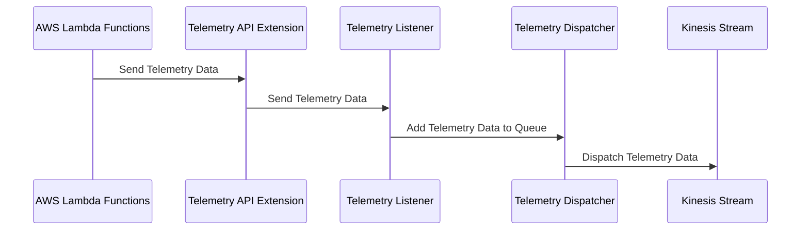
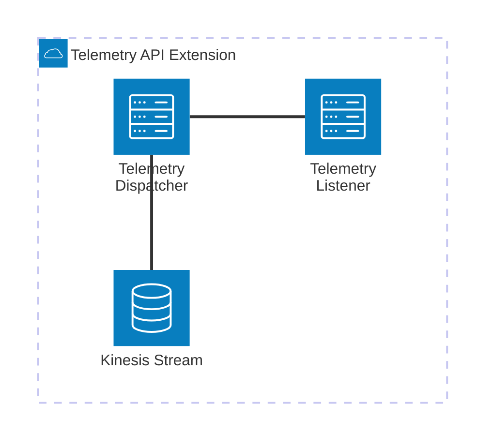

# 🏗 Architecture Documentation

## 📖 Context

The provided codebase is an AWS CDK (Cloud Development Kit) project that sets up an AWS Lambda extension for processing telemetry data from a Kinesis stream. The extension is designed to receive and process telemetry data from AWS Lambda functions, and then push the data to the Kinesis stream.

The project uses the following key services and technologies:

- **AWS Lambda**: The extension is deployed as an AWS Lambda function.
- **AWS Kinesis**: The telemetry data is pushed to a Kinesis stream.
- **AWS CDK**: The infrastructure is defined and deployed using the AWS CDK.
- **AWS SSM (Systems Manager)**: The extension's ARN and IAM policy ARN are stored as parameters in the AWS SSM Parameter Store.

## 📖 Overview

The architecture of this project consists of the following key components:

1. **Telemetry API Extension**: This is the main component of the system, responsible for receiving and processing telemetry data from AWS Lambda functions. It is deployed as an AWS Lambda function and uses the AWS Lambda Extensions API to subscribe to telemetry events.

2. **Kinesis Stream**: The processed telemetry data is pushed to an AWS Kinesis stream for storage and further processing.

3. **Telemetry Listener**: This component is responsible for receiving the telemetry data from the extension and adding it to an in-memory queue.

4. **Telemetry Dispatcher**: This component is responsible for periodically dispatching the telemetry data from the in-memory queue to the Kinesis stream.

The overall architecture follows an event-driven design, where the Telemetry API Extension receives telemetry events from AWS Lambda functions, processes them, and pushes the data to the Kinesis stream.

---

## 🔹 Components

| Component | Description | Interacts With | Purpose |
| --------- | ----------- | -------------- | ------- |
| Telemetry API Extension | The main component that receives and processes telemetry data from AWS Lambda functions. It is deployed as an AWS Lambda function. | Telemetry Listener, Kinesis Stream | Receives and processes telemetry data, and pushes it to the Kinesis stream. |
| Kinesis Stream | An AWS Kinesis stream that stores the processed telemetry data. | Telemetry Dispatcher | Receives and stores the telemetry data pushed by the Telemetry API Extension. |
| Telemetry Listener | A component that receives the telemetry data from the Telemetry API Extension and adds it to an in-memory queue. | Telemetry API Extension | Receives and queues the telemetry data. |
| Telemetry Dispatcher | A component that periodically dispatches the telemetry data from the in-memory queue to the Kinesis stream. | Kinesis Stream | Dispatches the telemetry data to the Kinesis stream. |

## 🔄 Data Flow

| Source | Destination | Data Type | Flow Description |
| ------ | ----------- | --------- | ---------------- |
| AWS Lambda Functions | Telemetry API Extension | Telemetry Data | AWS Lambda functions send telemetry data to the Telemetry API Extension. |
| Telemetry API Extension | Telemetry Listener | Telemetry Data | The Telemetry API Extension sends the received telemetry data to the Telemetry Listener. |
| Telemetry Listener | Telemetry Dispatcher | Telemetry Data | The Telemetry Listener adds the received telemetry data to an in-memory queue, which is then processed by the Telemetry Dispatcher. |
| Telemetry Dispatcher | Kinesis Stream | Telemetry Data | The Telemetry Dispatcher periodically dispatches the telemetry data from the in-memory queue to the Kinesis stream. |

## 🔍 Mermaid Diagram

### Sequence Diagram

### Architecture Diagram

## 🧱 Technologies

| Category | Technology | Purpose |
| -------- | ---------- | ------- |
| Infrastructure as Code | AWS CDK | Defining and deploying the infrastructure |
| Serverless | AWS Lambda | Hosting the Telemetry API Extension |
| Streaming | AWS Kinesis | Storing the processed telemetry data |
| Monitoring | AWS SSM Parameter Store | Storing the extension's ARN and IAM policy ARN |
| Programming Language | TypeScript | Implementing the Telemetry API Extension and supporting components |

## 📝 Codebase Evaluation

### Code Quality & Architecture

The codebase follows a modular and event-driven architecture, which is well-suited for the problem at hand. The separation of concerns between the Telemetry API Extension, Telemetry Listener, and Telemetry Dispatcher components is clear and promotes maintainability.

The use of the AWS Lambda Extensions API to receive telemetry data from AWS Lambda functions is a good design choice, as it allows the extension to be decoupled from the application code.

The in-memory queue used by the Telemetry Listener and Telemetry Dispatcher components is a simple and effective way to handle the buffering and dispatching of telemetry data to the Kinesis stream.

### Security, Cost, and Operational Excellence

| Evaluation Metric                                                      | Status     | Notes |
| ---------------------------------------------------------------------- | ---------- | ----- |
| Resource tagging (`CostCenter`, `Environment`, `Application`, `Owner`) | ⚠️ | The codebase does not include any resource tagging, which can make it difficult to track costs and ownership. |
| WAF usage if required                                                  | ✅ | The codebase does not require WAF, as it is a serverless application. |
| Secrets stored in Secret Manager                                       | ✅ | The codebase does not appear to use any secrets, and the necessary configuration is provided through environment variables. |
| Shared resource identifiers stored in Parameter Store                  | ✅ | The extension's ARN and IAM policy ARN are stored in the AWS SSM Parameter Store, which is a good practice. |
| Serverless functions memory/time appropriate                           | ✅ | The codebase does not include any specific memory or time configurations for the Lambda function, but the default settings are likely appropriate for this use case. |
| Log retention policies defined                                         | ⚠️ | The codebase sets a log retention period of 1 day, which may not be sufficient for long-term analysis. Consider increasing the retention period. |
| Code quality checks (Linter/Compiler)                                  | ✅ | The codebase uses TypeScript, which provides type checking and linting capabilities. |
| Storage lifecycle policies applied                                     | ⚠️ | The codebase does not include any storage lifecycle policies for the Kinesis stream, which may result in unnecessary costs over time. |
| Container image scanning & lifecycle policies                          | N/A | The codebase does not use container images, as it is a serverless application. |

**Suggestions for Improvement:**

1. **Security Posture**:
   - Consider adding resource tagging to improve cost tracking and ownership identification.
   - Implement log retention policies with a longer retention period (e.g., 30 days or more) to support long-term analysis.

2. **Operational Efficiency**:
   - Define storage lifecycle policies for the Kinesis stream to automatically archive or delete old data, reducing storage costs.

3. **Cost Optimization**:
   - Implement resource tagging to enable better cost tracking and optimization.

4. **Infrastructure Simplicity**:
   - The current architecture is relatively simple and straightforward, with a clear separation of concerns between the components. No major changes are required in this area.

### 📚 Output Summary

