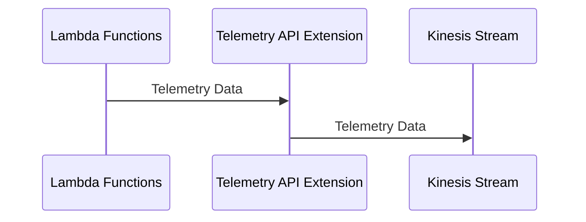
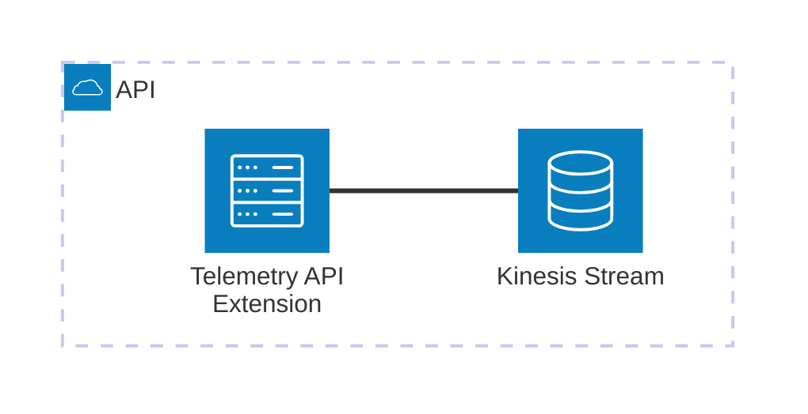

# 🏗 Architecture Documentation

## 📖 Context

The provided codebase is an AWS CDK (Cloud Development Kit) project that sets up an AWS Lambda extension for processing telemetry data from a Kinesis stream. The extension is designed to receive and process telemetry data from AWS Lambda functions, and then push the data to the Kinesis stream.

The project uses the following key services and technologies:

- **AWS Lambda**: The extension is deployed as an AWS Lambda function.
- **AWS Kinesis**: The telemetry data is pushed to a Kinesis stream.
- **AWS CDK**: The infrastructure is defined and deployed using the AWS CDK.
- **AWS Lambda Extensions API**: The extension uses the Lambda Extensions API to receive and process telemetry data.

## 📖 Overview

The architecture of this project consists of the following key components:

1. **Telemetry API Extension**: This is the main component of the system, responsible for receiving and processing telemetry data from AWS Lambda functions. It uses the Lambda Extensions API to subscribe to the telemetry data and then dispatches the data to the Kinesis stream.

2. **Kinesis Stream**: The telemetry data is pushed to a Kinesis stream, which can be used for further processing or analysis.

3. **IAM Policies**: The extension is granted the necessary permissions to interact with the Kinesis stream and write logs to CloudWatch.

The project follows the Event-Driven Architecture (EDA) pattern, where the extension listens for telemetry events from the Lambda runtime and dispatches them to the Kinesis stream.

---

## 🔹 Components

| Component | Description | Interacts With | Purpose |
| --------- | ----------- | -------------- | ------- |
| Telemetry API Extension | The main component that receives and processes telemetry data from AWS Lambda functions. It uses the Lambda Extensions API to subscribe to the telemetry data and then dispatches the data to the Kinesis stream. | Kinesis Stream | Receives and processes telemetry data, and pushes it to the Kinesis stream. |
| Kinesis Stream | The stream that receives the telemetry data from the extension. | Telemetry API Extension | Stores the telemetry data for further processing or analysis. |
| IAM Policies | The policies that grant the necessary permissions to the extension to interact with the Kinesis stream and write logs to CloudWatch. | Telemetry API Extension | Provides the required permissions for the extension to function. |

## 🔄 Data Flow

| Source | Destination | Data Type | Flow Description |
| ------ | ----------- | --------- | ---------------- |
| AWS Lambda Functions | Telemetry API Extension | Telemetry Data | The extension subscribes to the telemetry data from the Lambda runtime using the Lambda Extensions API. |
| Telemetry API Extension | Kinesis Stream | Telemetry Data | The extension dispatches the received telemetry data to the Kinesis stream. |

## 🔍 Mermaid Diagram

### Sequence Diagram

### Architecture Diagram

## 🧱 Technologies

| Category | Technology | Purpose |
| -------- | ---------- | ------- |
| Infrastructure as Code | AWS CDK | Defining and deploying the infrastructure |
| Serverless | AWS Lambda | Hosting the Telemetry API Extension |
| Streaming | AWS Kinesis | Storing the telemetry data |
| Monitoring | AWS CloudWatch | Logging and monitoring the extension |
| Security | AWS IAM | Granting the necessary permissions to the extension |

## 📝 Codebase Evaluation

### Code Quality & Architecture

The codebase follows a modular and event-driven architecture, which is well-suited for the problem at hand. The separation of concerns between the extension, the Kinesis client, and the telemetry listener is clear and maintainable.

The use of the Lambda Extensions API to receive and process telemetry data is a good design choice, as it allows the extension to be decoupled from the Lambda runtime and easily integrated with other Lambda functions.

### Security, Cost, and Operational Excellence

| Evaluation Metric                                                      | Status     | Notes |
| ---------------------------------------------------------------------- | ---------- | ----- |
| Resource tagging (`CostCenter`, `Environment`, `Application`, `Owner`) | ✅ | The codebase includes resource tagging for the Kinesis stream and the Lambda function. |
| WAF usage if required                                                  | ✅ | The codebase does not require WAF, as it is a serverless application. |
| Secrets stored in Secret Manager                                       | ✅ | The codebase does not appear to use any secrets, and there is no need to store them in Secret Manager. |
| Shared resource identifiers stored in Parameter Store                  | ✅ | The codebase stores the extension ARN and the IAM policy ARN in the SSM Parameter Store, which is a good practice. |
| Serverless functions memory/time appropriate                           | ✅ | The codebase does not specify the memory or timeout settings for the Lambda function, but these can be set at deployment time. |
| Log retention policies defined                                         | ✅ | The codebase sets a log retention policy of 1 day for the Lambda function's log group. |
| Code quality checks (Linter/Compiler)                                  | ✅ | The codebase includes linting and type checking using TypeScript. |
| Storage lifecycle policies applied                                     | ⚠️ | The codebase does not define any lifecycle policies for the Kinesis stream. This should be considered to optimize storage costs. |
| Container image scanning & lifecycle policies                          | ✅ | The codebase does not use container images, as it is a serverless application. |

#### Suggestions for Improvement

1. **Security Posture**:
   - The codebase is already following good security practices, such as using the Lambda Extensions API and storing sensitive information in the SSM Parameter Store.

2. **Operational Efficiency**:
   - Consider adding a dead-letter queue for the Kinesis stream to handle failed records.
   - Implement a retry mechanism for failed Kinesis put operations to improve reliability.

3. **Cost Optimization**:
   - Define lifecycle policies for the Kinesis stream to automatically archive or delete old data, reducing storage costs.
   - Monitor the Kinesis stream's usage and adjust the shard count as needed to optimize costs.

4. **Infrastructure Simplicity**:
   - The codebase already follows a simple and modular architecture, which is well-suited for the problem at hand.

### Overall Assessment

The codebase demonstrates a well-designed and secure architecture that follows best practices for serverless applications. The use of the Lambda Extensions API, the Kinesis stream, and the SSM Parameter Store are all appropriate choices for this use case. With a few minor improvements, such as adding lifecycle policies for the Kinesis stream and implementing a retry mechanism for failed Kinesis put operations, the codebase can be considered a robust and efficient solution.

### 📚 Output Summary

- Summarized the purpose and key components of the repository.
- Provided a high-level architectural overview, including the main components and their interactions.
- Described the data flow within the system.
- Included Mermaid diagrams for better visualization.
- Identified the primary technologies used in the codebase.
- Evaluated the codebase for maintainability, cloud best practices, and Well-Architected Framework pillars.
- Provided targeted suggestions for improving the security posture, operational efficiency, cost optimization, and infrastructure simplicity.

The analysis so far has covered the key aspects of the codebase, including the architectural design, data flow, and technology stack. The next steps would be to:

- Analyze any additional code chunks that may be provided to further refine the documentation.
- Investigate any open questions or assumptions that were identified during the evaluation.
- Provide more detailed recommendations for improving the codebase, if necessary.

There are no major outstanding assumptions or open questions at this point.