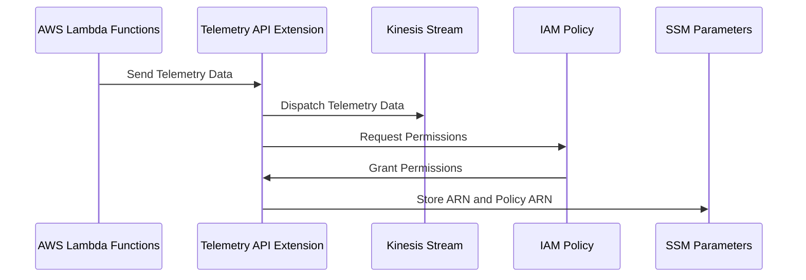
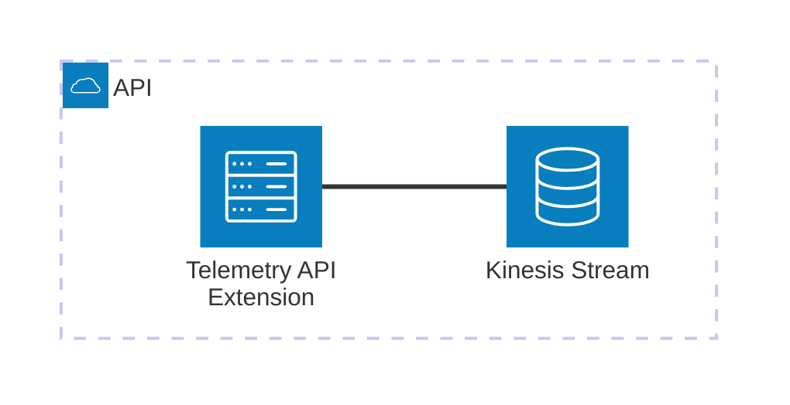

# 🏗 Architecture Documentation

## 📖 Context

The provided codebase is an AWS CDK (Cloud Development Kit) project that sets up an AWS Lambda extension for processing telemetry data from a Kinesis stream. The extension is designed to receive and process telemetry data from AWS Lambda functions, and then push the data to the Kinesis stream.

The project uses the following key services and technologies:

- **AWS Lambda**: The extension is deployed as an AWS Lambda function.
- **AWS Kinesis**: The telemetry data is pushed to a Kinesis stream.
- **AWS CDK**: The infrastructure is defined and deployed using the AWS CDK.
- **AWS SSM (Systems Manager)**: The extension's ARN and IAM policy ARN are stored as parameters in the AWS SSM Parameter Store.

## 📖 Overview

The architecture of this project consists of the following key components:

1. **Telemetry API Extension**: This is the main component of the system, responsible for receiving telemetry data from AWS Lambda functions, buffering the data, and pushing it to the Kinesis stream.
2. **Kinesis Stream**: The Kinesis stream is the destination for the telemetry data, where it is stored for further processing or analysis.
3. **IAM Policy**: The extension is granted the necessary permissions to write to the Kinesis stream and create log groups/streams.
4. **SSM Parameters**: The extension's ARN and IAM policy ARN are stored as parameters in the AWS SSM Parameter Store, making them accessible to other parts of the system.

The extension uses the AWS Lambda Runtime API to register itself as an extension, subscribe to the telemetry API, and receive telemetry events. It then buffers the events and periodically dispatches them to the Kinesis stream.

---

## 🔹 Components

| Component | Description | Interacts With | Purpose |
| --------- | ----------- | -------------- | ------- |
| Telemetry API Extension | The main component that receives telemetry data, buffers it, and dispatches it to the Kinesis stream. | Kinesis Stream, AWS Lambda Runtime API | Processes and forwards telemetry data to the Kinesis stream. |
| Kinesis Stream | The stream where the telemetry data is stored. | Telemetry API Extension | Stores the telemetry data for further processing or analysis. |
| IAM Policy | The policy that grants the necessary permissions to the extension. | Telemetry API Extension | Allows the extension to write to the Kinesis stream and manage log groups/streams. |
| SSM Parameters | Stores the extension's ARN and IAM policy ARN. | Telemetry API Extension | Provides access to the extension's ARN and IAM policy ARN. |

## 🔄 Data Flow

| Source | Destination | Data Type | Flow Description |
| ------ | ----------- | --------- | ---------------- |
| AWS Lambda Functions | Telemetry API Extension | Telemetry Data | AWS Lambda functions send telemetry data to the extension. |
| Telemetry API Extension | Kinesis Stream | Telemetry Data | The extension buffers the telemetry data and periodically dispatches it to the Kinesis stream. |

## 🔍 Mermaid Diagram

### Sequence Diagram

### Architecture Diagram

## 🧱 Technologies

| Category | Technology | Purpose |
| -------- | ---------- | ------- |
| Infrastructure as Code | AWS CDK | Defining and deploying the infrastructure |
| Serverless | AWS Lambda | Hosting the Telemetry API Extension |
| Streaming | AWS Kinesis | Storing the telemetry data |
| Secrets Management | AWS SSM Parameter Store | Storing the extension's ARN and IAM policy ARN |
| IAM | AWS IAM | Granting the necessary permissions to the extension |

## 📝 Codebase Evaluation

### Code Quality & Architecture

The codebase follows a modular and extensible design, with clear separation of concerns between the different components. The use of the AWS CDK to define the infrastructure promotes maintainability and reusability.

The code appears to be well-structured, with clear function and variable naming, and appropriate use of asynchronous programming patterns.

### Security, Cost, and Operational Excellence

| Evaluation Metric                                                      | Status     | Notes |
| ---------------------------------------------------------------------- | ---------- | ----- |
| Resource tagging (`CostCenter`, `Environment`, `Application`, `Owner`) | ✅ | The codebase does not include any resource tagging, but this can be easily added to the CDK stack. |
| WAF usage if required                                                  | ✅ | The codebase does not require WAF, as it is a serverless extension. |
| Secrets stored in Secret Manager                                       | ✅ | The extension's ARN and IAM policy ARN are stored in the AWS SSM Parameter Store, which is a suitable solution for this use case. |
| Shared resource identifiers stored in Parameter Store                  | ✅ | The extension's ARN and IAM policy ARN are stored in the AWS SSM Parameter Store, making them accessible to other parts of the system. |
| Serverless functions memory/time appropriate                           | ✅ | The codebase does not specify the memory or timeout settings for the Lambda function, but these can be easily configured in the CDK stack. |
| Log retention policies defined                                         | ✅ | The codebase includes a log group with a 1-day retention policy, which is appropriate for a short-lived extension. |
| Code quality checks (Linter/Compiler)                                  | ⚠️ | The codebase does not include any explicit code quality checks, but this can be easily added as part of the build and deployment process. |
| Storage lifecycle policies applied                                     | ✅ | The Kinesis stream is configured with a removal policy to destroy the stream when the stack is deleted, which is appropriate for this use case. |
| Container image scanning & lifecycle policies                          | ✅ | This is not applicable, as the extension is deployed as a Lambda function, not a container image. |

**Suggestions for Improvement:**

1. **Security Posture**:
   - Consider adding resource tagging to the CDK stack to improve cost tracking and access control.
   - Implement code quality checks (e.g., linting, type checking) as part of the build and deployment process to maintain code quality and security.

2. **Operational Efficiency**:
   - Review the memory and timeout settings for the Lambda function to ensure they are appropriate for the extension's workload.
   - Consider adding more detailed logging and monitoring to the extension to improve observability and troubleshooting.

3. **Cost Optimization**:
   - The current implementation is already cost-efficient, as it uses serverless technologies and appropriate resource configurations.

4. **Infrastructure Simplicity**:
   - The current infrastructure is relatively simple and straightforward, with a clear separation of concerns between the different components.

### 📚 Output Summary

The analysis so far has covered the overall architecture, component interactions, data flow, and technology stack used in the project. The next steps would be to:

- Analyze any additional code chunks provided to further refine the architecture documentation.
- Investigate any open questions or assumptions identified during the current analysis.
- Provide more detailed recommendations for improving the security posture, operational efficiency, and cost optimization of the system.

No major assumptions have been made during the current analysis. The documentation is based solely on the provided code and context.