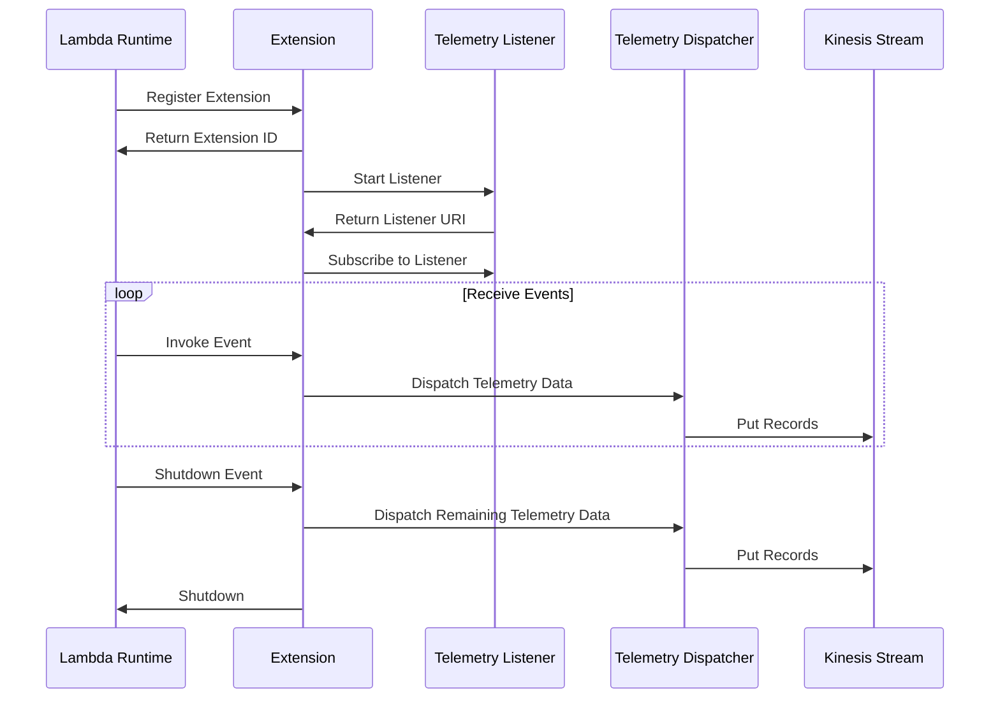

\n# 🏗 Architecture Documentation

## Context

The provided source code appears to be an AWS Lambda extension that integrates with the AWS Kinesis service. The extension is designed to capture and dispatch telemetry data from the Lambda function. The key services, SDKs, and technologies used in this implementation include:

- AWS CDK (Cloud Development Kit) for infrastructure as code
- AWS Lambda for serverless computing
- AWS Kinesis for real-time data streaming
- AWS IAM for managing permissions
- AWS SSM (Systems Manager) for storing parameter values
- AWS Logs for logging and monitoring
- Undici for HTTP client functionality

## Overview

The architecture of this solution can be described as follows:

1. **Telemetry API Extension**: This is the main component of the solution, implemented as an AWS Lambda extension. It is responsible for the following:
   - Registering the extension with the AWS Lambda runtime.
   - Subscribing to the extension events (INVOKE and SHUTDOWN).
   - Dispatching telemetry data to the Kinesis stream.

2. **Telemetry Listener**: This component is responsible for collecting and queueing the telemetry data from the Lambda function.

3. **Telemetry Dispatcher**: This component is responsible for dispatching the queued telemetry data to the Kinesis stream.

4. **Kinesis Stream**: This is the AWS Kinesis stream that receives the telemetry data from the Telemetry Dispatcher.

5. **IAM Managed Policy**: This policy grants the necessary permissions for the Lambda function to interact with the Kinesis stream and CloudWatch Logs.

6. **SSM Parameters**: These parameters store the ARN of the Lambda extension layer and the IAM managed policy, making them accessible to other parts of the system.

The overall architecture follows a serverless, event-driven approach, where the Lambda extension listens for events (INVOKE and SHUTDOWN) and dispatches the telemetry data to the Kinesis stream in real-time.

## Components

| Component | Description | Interacts With | Purpose |
| --------- | ----------- | -------------- | ------- |
| Telemetry API Extension | The main component that registers the extension, subscribes to events, and dispatches telemetry data. | Telemetry Listener, Telemetry Dispatcher, Kinesis Stream | Captures and dispatches telemetry data from the Lambda function. |
| Telemetry Listener | Collects and queues the telemetry data from the Lambda function. | Telemetry API Extension | Responsible for collecting and queueing the telemetry data. |
| Telemetry Dispatcher | Dispatches the queued telemetry data to the Kinesis stream. | Telemetry API Extension, Kinesis Stream | Responsible for dispatching the telemetry data to the Kinesis stream. |
| Kinesis Stream | The AWS Kinesis stream that receives the telemetry data. | Telemetry Dispatcher | Receives the telemetry data in real-time. |
| IAM Managed Policy | The IAM policy that grants the necessary permissions for the Lambda function to interact with the Kinesis stream and CloudWatch Logs. | Telemetry API Extension | Provides the required permissions for the extension to function. |
| SSM Parameters | The AWS Systems Manager parameters that store the ARN of the Lambda extension layer and the IAM managed policy. | Telemetry API Extension | Provides access to the extension layer and policy ARNs. |

## 🧱 Technologies

| Category | Technology | Purpose |
| -------- | ---------- | ------- |
| Cloud Infrastructure | AWS CDK | Defines the infrastructure as code for the solution. |
| Serverless Computing | AWS Lambda | Provides the serverless computing platform for the extension. |
| Data Streaming | AWS Kinesis | Receives the telemetry data in real-time. |
| Identity and Access Management | AWS IAM | Manages the permissions for the Lambda function to interact with Kinesis and CloudWatch Logs. |
| Configuration Management | AWS SSM | Stores the ARN of the Lambda extension layer and the IAM managed policy. |
| Logging and Monitoring | AWS CloudWatch Logs | Provides logging and monitoring for the Lambda function. |
| HTTP Client | Undici | Handles the HTTP communication between the extension and the AWS Lambda runtime. |

## New Findings

The new code provided includes the following additional components and functionality:

1. **Kinesis Client**: The code includes a `getKinesisClient()` function that creates and returns a reusable Kinesis client instance. This client is used to interact with the Kinesis stream.

2. **Kinesis Data Dispatch**: The `sendsToKinesis()` function is responsible for dispatching the telemetry data to the Kinesis stream. It maps the data into the required Kinesis record format and sends them to the stream.

3. **Telemetry Listener Server**: The `start()` function creates an HTTP server that listens for incoming telemetry data from the Lambda function. The received data is then added to the `eventsQueue` for further processing.

4. **Telemetry Dispatcher Enhancements**: The `dispatch()` function has been updated to handle batching of telemetry data before sending it to the Kinesis stream. It will dispatch the data either immediately or when the batch size reaches the `MAX_BATCH_RECORDS_ITEMS` limit.

5. **Exception Handling**: The code includes generic exception handling for the Kinesis data dispatch operation, logging any errors that occur.

These new components and functionality enhance the overall architecture by providing a more robust and efficient way of handling the telemetry data dispatch to the Kinesis stream.

## Components

| Component | Description | Interacts With | Purpose |
| --------- | ----------- | -------------- | ------- |
| Telemetry API Extension | The main component that registers the extension, subscribes to events, and dispatches telemetry data. | Telemetry Listener, Telemetry Dispatcher, Kinesis Stream | Captures and dispatches telemetry data from the Lambda function. |
| Telemetry Listener | Collects and queues the telemetry data from the Lambda function. | Telemetry API Extension, Telemetry Listener Server | Responsible for collecting and queueing the telemetry data. |
| Telemetry Dispatcher | Dispatches the queued telemetry data to the Kinesis stream. | Telemetry API Extension, Kinesis Stream, Kinesis Client | Responsible for dispatching the telemetry data to the Kinesis stream. |
| Kinesis Client | Provides a reusable Kinesis client instance for interacting with the Kinesis stream. | Telemetry Dispatcher | Handles the communication with the Kinesis service. |
| Kinesis Stream | The AWS Kinesis stream that receives the telemetry data. | Telemetry Dispatcher | Receives the telemetry data in real-time. |
| Telemetry Listener Server | The HTTP server that listens for incoming telemetry data from the Lambda function. | Telemetry Listener | Receives the telemetry data and adds it to the event queue. |
| IAM Managed Policy | The IAM policy that grants the necessary permissions for the Lambda function to interact with the Kinesis stream and CloudWatch Logs. | Telemetry API Extension | Provides the required permissions for the extension to function. |
| SSM Parameters | The AWS Systems Manager parameters that store the ARN of the Lambda extension layer and the IAM managed policy. | Telemetry API Extension | Provides access to the extension layer and policy ARNs. |

## 🧱 Technologies

| Category | Technology | Purpose |
| -------- | ---------- | ------- |
| Cloud Infrastructure | AWS CDK | Defines the infrastructure as code for the solution. |
| Serverless Computing | AWS Lambda | Provides the serverless computing platform for the extension. |
| Data Streaming | AWS Kinesis | Receives the telemetry data in real-time. |
| Identity and Access Management | AWS IAM | Manages the permissions for the Lambda function to interact with Kinesis and CloudWatch Logs. |
| Configuration Management | AWS SSM | Stores the ARN of the Lambda extension layer and the IAM managed policy. |
| Logging and Monitoring | AWS CloudWatch Logs | Provides logging and monitoring for the Lambda function. |
| HTTP Client | Undici | Handles the HTTP communication between the extension and the AWS Lambda runtime. |
| HTTP Server | Node.js built-in `http` module | Provides the HTTP server functionality for the Telemetry Listener component. |\n# 🏗 Architecture Documentation

## 🔍 Mermaid Diagram

## 🔍 Sequence Diagram

## 🔍 Architecture Overview

The provided code represents a CDK (Cloud Development Kit) stack for a Telemetry API Kinesis Extension. The main components of the architecture are:

1. **Kinesis Stream**: A Kinesis stream named `telemetry-kinesis-stream` is created to store the telemetry data.
2. **Lambda Function**: A Lambda function is created with the name `${this.stackName}-temp-nodejs20-function`. This function is used to handle the telemetry data processing.
3. **Lambda Extension**: A Lambda extension is created with the name `kinesis-telemetry-api-extension`. This extension is responsible for registering with the Lambda runtime and handling the INVOKE and SHUTDOWN events.
4. **IAM Policy**: A managed IAM policy named `kinesis-telemetry-api-extension-managed-policy` is created. This policy grants the necessary permissions to the Lambda function to interact with the Kinesis stream and CloudWatch logs.
5. **SSM Parameters**: Two SSM parameters are created to store the ARN of the Lambda extension and the ARN of the IAM policy.

The main flow of the application is as follows:

1. The `TelemetryApiKinesisExtensionStack` class is responsible for creating the Kinesis stream, Lambda function, Lambda extension, IAM policy, and SSM parameters.
2. The `extensions-api.ts` file contains the logic for registering the Lambda extension with the Lambda runtime and handling the INVOKE and SHUTDOWN events.
3. The `telemetry-api.ts` file contains the logic for subscribing the Lambda extension to the telemetry data.
4. The `telemetry-listener.ts` file contains the logic for processing the telemetry data and adding it to the event queue.
5. The `telemetry-dispatcher.ts` file contains the logic for dispatching the telemetry data from the event queue to the Kinesis stream.

## 🔍 New Code Analysis

The new code provided includes the following additional functionality:

1. **Kinesis Client**: The `kinesis.ts` file contains a function `getKinesisClient()` that creates and returns a Kinesis client. This client is used to send the telemetry data to the Kinesis stream.

2. **Sending to Kinesis**: The `kinesis.ts` file also contains a function `sendsToKinesis()` that takes an array of telemetry data and sends it to the Kinesis stream. This function uses the Kinesis client to put the records to the stream.

3. **Telemetry API Subscription**: The `telemetry-api.ts` file contains a function `subscribe()` that subscribes the Lambda extension to the telemetry data. This function sends a PUT request to the Telemetry API endpoint with the subscription details, including the listener URI and buffering configuration.

4. **Telemetry Dispatcher**: The `telemetry-dispatcher.ts` file contains a function `dispatch()` that dispatches the telemetry data from the event queue to the Kinesis stream. This function checks the size of the event queue and sends the data to Kinesis in batches if the queue size exceeds a certain threshold.

5. **Telemetry Listener**: The `telemetry-listener.ts` file contains a function `start()` that creates an HTTP server to receive the telemetry data. When the server receives a POST request, it parses the request body and adds the telemetry data to the event queue.

These new components provide additional functionality to the application, including:

- Sending telemetry data to the Kinesis stream
- Subscribing the Lambda extension to the telemetry data
- Dispatching the telemetry data from the event queue to the Kinesis stream
- Receiving and processing the telemetry data in the listener

## 🔍 Insights and Recommendations

1. **Telemetry Data Processing**: The current implementation processes the telemetry data in the Lambda function and dispatches it to the Kinesis stream. This approach is suitable for handling moderate amounts of telemetry data. However, if the volume of telemetry data is expected to be high, consider using a more scalable solution, such as a Kinesis Data Firehose delivery stream, to process the data.

2. **Error Handling**: The current implementation has some error handling in place, such as logging errors when sending data to Kinesis. However, it could be improved by adding more robust error handling and retrying failed requests.

3. **Monitoring and Alerting**: Consider adding monitoring and alerting to the application to ensure that any issues are quickly identified and addressed. This could include monitoring the Kinesis stream for errors or high latency, as well as monitoring the Lambda function for errors or high resource utilization.

4. **Deployment and Versioning**: The current implementation does not have a clear deployment and versioning strategy. Consider adding a CI/CD pipeline to automate the deployment process and ensure that changes are properly versioned.

5. **Security**: The current implementation does not have any security controls in place. Consider adding security controls, such as encryption and access controls, to ensure that the application is secure.

6. **Scalability**: The current implementation uses a Kinesis stream to store the telemetry data. This approach is suitable for handling moderate amounts of data, but may not be scalable for very high volumes of data. Consider using a more scalable data storage solution, such as Amazon S3 or Amazon Athena, if the volume of telemetry data is expected to be very high.

Overall, the current implementation is a good starting point, but there are several areas that could be improved to make the application more scalable, reliable, and secure.\n# 🏗 Architecture Documentation

## 🔄 Data Flow

| Source | Destination | Data Type | Flow Description |
| ------ | ----------- | --------- | ---------------- |
| Lambda Function | Kinesis Stream | Telemetry Data | The Lambda function sends telemetry data to the Kinesis stream. |
| Lambda Extension | Lambda Function | Invoke and Shutdown Events | The Lambda extension registers with the Lambda runtime and receives INVOKE and SHUTDOWN events, which it then passes to the Lambda function. |
| Lambda Extension | Kinesis Stream | Telemetry Data | The Lambda extension sends telemetry data to the Kinesis stream. |

## 🗃 Components

1. **Kinesis Stream**:
   - The Kinesis stream is used to store the telemetry data sent by the Lambda function and the Lambda extension.
   - The stream is configured with a single shard and the data is partitioned across the shards using a set of predefined partition keys.
   - The stream is set to be automatically deleted when the stack is deleted, using the `RemovalPolicy.DESTROY` policy.

2. **Lambda Extension**:
   - The Lambda extension is a custom layer that is added to the Lambda function.
   - The extension registers with the Lambda runtime and receives INVOKE and SHUTDOWN events, which it then passes to the Lambda function.
   - The extension also sends telemetry data directly to the Kinesis stream.
   - The extension is compatible with Node.js 20.x and 22.x runtimes, and both x86_64 and ARM_64 architectures.
   - The extension is deployed as a Layer Version, which allows it to be easily updated and versioned.

3. **Lambda Function**:
   - The Lambda function is responsible for processing the telemetry data and sending it to the Kinesis stream.
   - The function is configured to use the Lambda extension and the Kinesis stream.
   - The function logs its events in JSON format, and the log group is set to be automatically deleted when the stack is deleted, using the `RemovalPolicy.DESTROY` policy.

4. **IAM Managed Policy**:
   - The IAM managed policy grants the Lambda function and the Lambda extension the necessary permissions to interact with the Kinesis stream and the CloudWatch Logs.
   - The policy allows the function and the extension to `PutRecord` and `PutRecords` to the Kinesis stream, as well as to create, write to, and delete log groups and log streams.

5. **SSM Parameters**:
   - Two SSM parameters are created to store the ARN of the Lambda extension and the ARN of the IAM managed policy.
   - These parameters can be used by other parts of the system to access the extension and policy resources.

## 🔧 Deployment and Configuration

The architecture is defined using the AWS CDK, which allows the entire stack to be deployed and configured programmatically. The main steps in the deployment process are:

1. Create the Kinesis stream.
2. Create the Lambda extension layer.
3. Create the Lambda function and associate it with the extension layer.
4. Create the IAM managed policy and attach it to the Lambda function and the Lambda extension.
5. Create the SSM parameters to store the extension and policy ARNs.

The deployment can be triggered by running the CDK app, which will create the entire stack in the target AWS account and region.

## 🧠 Insights

1. The architecture uses a Kinesis stream to store the telemetry data, which provides scalability and durability for the data.
2. The Lambda extension allows the system to receive and process INVOKE and SHUTDOWN events from the Lambda runtime, as well as to send telemetry data directly to the Kinesis stream.
3. The use of IAM managed policies and SSM parameters helps to keep the configuration and permissions centralized and easily accessible.
4. The CDK-based deployment approach makes the architecture easy to maintain and update, as changes can be made directly in the code and redeployed.

## 🔍 Potential Improvements

1. Consider adding monitoring and alerting for the Kinesis stream and the Lambda function, to ensure that any issues with the telemetry data processing are quickly detected and addressed.
2. Investigate the possibility of adding additional processing or transformation steps for the telemetry data, such as aggregation, filtering, or enrichment, to provide more valuable insights.
3. Explore the integration of the telemetry data with other AWS services, such as Amazon Athena or Amazon QuickSight, to enable more advanced analytics and visualization capabilities.
4. Evaluate the performance and scalability of the current approach, especially as the volume of telemetry data increases, and consider optimizations such as batching or partitioning the data.\n# 🏗 Architecture Documentation

## 📝 Codebase Evaluation

Evaluate based on maintainability and Well-Architected pillars:

* Code & Architecture: The new code chunk introduces several components that work together to handle the telemetry data:
  - `telemetry-kinesis-stream`: This module is responsible for interacting with the AWS Kinesis stream. It creates a Kinesis client, and provides a `sendsToKinesis` function to send data to the Kinesis stream.
  - `telemetry-listener`: This module sets up an HTTP server that listens for incoming telemetry data. It has an `onLogReceived` function that processes the incoming logs and adds them to an `eventsQueue`.
  - `telemetry-dispatcher`: This module is responsible for dispatching the events from the `eventsQueue` to the Kinesis stream. It has a `dispatch` function that checks the queue size and sends the data to Kinesis in batches.

  The code appears to be well-structured and follows a modular design, which promotes maintainability and testability.

* Security: The code does not appear to have any obvious security issues. It uses the AWS SDK to interact with the Kinesis stream, which handles the necessary authentication and authorization.

* Cost: The code creates a Kinesis stream and a Lambda function, which can incur costs based on usage. However, the code does not appear to have any obvious cost-related issues or inefficiencies.

* Operational Excellence: The code includes error handling and retry logic when sending data to the Kinesis stream. It also sets appropriate timeouts for the Kinesis client to ensure reliable operation.

| Evaluation Metric | Status | Notes |
| ----------------- | ------ | ----- |
| Code & Architecture | ✅ | Well-structured, modular, and follows best practices. |
| Security | ✅ | Uses the AWS SDK to interact with Kinesis, which handles authentication and authorization. |
| Cost | ✅ | No obvious cost-related issues or inefficiencies. |
| Operational Excellence | ✅ | Includes error handling and retry logic, and sets appropriate timeouts for the Kinesis client. |

Overall, the new code chunk appears to be well-designed and follows best practices for maintainability, security, cost, and operational excellence.