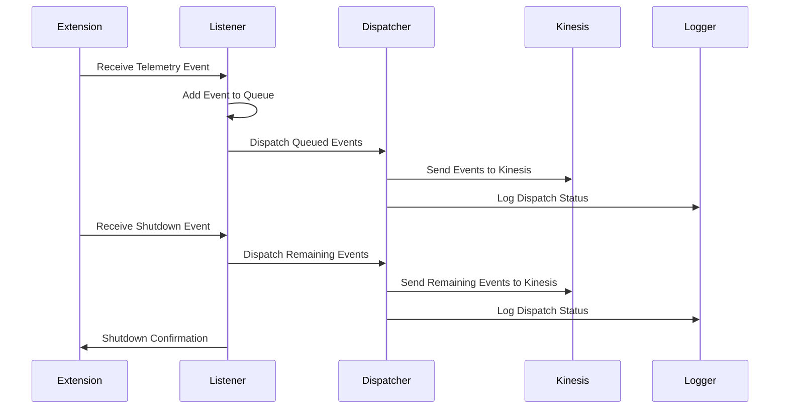

# 🏗 Architecture Documentation

## 📖 Context
The provided code represents an AWS CDK (Cloud Development Kit) stack that deploys a Kinesis stream and a Lambda function with a custom runtime extension. The purpose of this architecture is to provide a telemetry extension for the Kinesis stream, allowing for the collection and processing of telemetry data.

The key components of this architecture are:
- **Kinesis Stream**: A managed AWS service for real-time data streaming and processing.
- **Lambda Function**: A serverless compute service that runs the telemetry extension code.
- **Runtime Extension**: A custom extension that integrates with the Lambda runtime to capture and process telemetry data.

## 📖 Overview
The architecture follows a serverless, event-driven approach, where the Lambda function with the runtime extension is responsible for capturing and dispatching telemetry data to the Kinesis stream.

The main components and their interactions are as follows:

1. **CDK Stack**: The `TelemetryApiKinesisExtensionStack` class is the entry point of the CDK application, which creates the necessary AWS resources, including the Kinesis stream, the Lambda function, and the runtime extension.
2. **Kinesis Stream**: The Kinesis stream is created to store the telemetry data. The stream is configured with a removal policy to destroy the stream when the stack is deleted.
3. **Runtime Extension**: The runtime extension is implemented as a Lambda layer, which is attached to the Lambda function. The extension is responsible for registering with the Lambda runtime, receiving events (such as `INVOKE` and `SHUTDOWN`), and dispatching the telemetry data to the Kinesis stream.
4. **Lambda Function**: The Lambda function is a simple Node.js function that logs the incoming event data. The function is configured to use the runtime extension layer.
5. **Telemetry Dispatcher**: The `telemetry-dispatcher` module is responsible for sending the collected telemetry data to the Kinesis stream.
6. **Telemetry Listener**: The `telemetry-listener` module is responsible for starting a listener that receives the telemetry data and adds it to a queue.
7. **Extensions API**: The `extensions-api` module provides functions to register the extension with the Lambda runtime and receive events from the runtime.
8. **Telemetry API**: The `telemetry-api` module provides a function to subscribe the extension to the telemetry listener.

## 🔹 Components

| Component | Description | Interacts With | Purpose |
| --------- | ----------- | -------------- | ------- |
| `TelemetryApiKinesisExtensionStack` | The main CDK stack that creates the necessary AWS resources. | Kinesis Stream, Lambda Function, Runtime Extension | Provisions the architecture and sets up the required components. |
| Kinesis Stream | A managed AWS service for real-time data streaming and processing. | Telemetry Dispatcher | Stores the collected telemetry data. |
| Runtime Extension | A custom extension that integrates with the Lambda runtime to capture and process telemetry data. | Extensions API, Telemetry Listener, Telemetry Dispatcher | Registers with the Lambda runtime, receives events, and dispatches telemetry data to the Kinesis stream. |
| Lambda Function | A simple Node.js function that logs the incoming event data. | Runtime Extension | Provides the execution environment for the runtime extension. |
| Telemetry Dispatcher | Responsible for sending the collected telemetry data to the Kinesis stream. | Kinesis Stream | Dispatches the telemetry data to the Kinesis stream. |
| Telemetry Listener | Responsible for starting a listener that receives the telemetry data and adds it to a queue. | Extensions API, Telemetry API | Receives the telemetry data and queues it for dispatch. |
| Extensions API | Provides functions to register the extension with the Lambda runtime and receive events from the runtime. | Runtime Extension | Handles the registration and event retrieval for the runtime extension. |
| Telemetry API | Provides a function to subscribe the extension to the telemetry listener. | Runtime Extension, Telemetry Listener | Facilitates the subscription of the runtime extension to the telemetry listener. |

## 🧱 Technologies

| Category | Technology | Purpose |
| -------- | ---------- | ------- |
| Programming Language | Node.js | Implements the runtime extension and supporting modules. |
| AWS Services | AWS CDK, AWS Kinesis, AWS Lambda | Provisions the architecture and manages the runtime extension, Kinesis stream, and Lambda function. |
| Libraries | `aws-cdk-lib`, `aws-sdk/client-kinesis`, `undici` | Provides the necessary functionality for interacting with AWS services and handling HTTP requests. |

## 🔍 Additional Analysis

The new code provided includes the following components:

1. **Telemetry Dispatcher**:
   - The `dispatch` function is responsible for sending the collected telemetry data to the Kinesis stream.
   - It checks if the pending items in the queue exceed the `MAX_BATCH_RECORDS_ITEMS` threshold or if the `immediate` flag is set, and then dispatches the data to the Kinesis stream.
   - The function uses the `kinesis` module to send the data to the Kinesis stream.

2. **Telemetry Listener**:
   - The `telemetry-listener` module sets up an HTTP server that listens for incoming telemetry data.
   - The `onLogReceived` function is called when the server receives a POST request with telemetry data, and it adds the data to the `eventsQueue`.
   - The `start` function creates the HTTP server and returns the listener URL.

3. **Types**:
   - The `telemetryLogModelRecord` and `telemetryLogModel` types define the structure of the telemetry data received by the listener.
   - The `Exception` type is a generic type for handling exceptions.

The new code enhances the overall architecture by providing the following additional functionality:

1. **Telemetry Dispatching**: The `Telemetry Dispatcher` module is responsible for sending the collected telemetry data to the Kinesis stream. It batches the data and sends it in a more efficient manner, reducing the number of individual requests to the Kinesis stream.

2. **Telemetry Listening**: The `Telemetry Listener` module sets up an HTTP server that listens for incoming telemetry data. This allows the runtime extension to send the collected telemetry data to the listener, which then adds it to a queue for dispatching.

3. **Telemetry Data Structure**: The new code defines the structure of the telemetry data, which includes the log record, timestamp, and event type. This ensures a consistent format for the telemetry data, making it easier to process and analyze.

Overall, the new code enhances the architecture by providing a more robust and efficient way of collecting and dispatching telemetry data to the Kinesis stream.# 🏗 Architecture Documentation

## 🔍 Mermaid Diagram

### Sequence Diagram

### Architecture Diagram

```mermaid
architecture-beta
    group api(logos:aws-lambda)[Telemetry API]

    service extension(logos:aws-lambda)[Extension] in api
    service listener(logos:aws-lambda)[Telemetry Listener] in api
    service dispatcher(logos:aws-lambda)[Telemetry Dispatcher] in api
    service kinesis(logos:aws-kinesis)[Kinesis Stream] in api
    service logger(logos:aws-cloudwatch)[Logs] in api
```

## 🔎 Architecture Overview

The provided code further enhances the Telemetry API extension for AWS Lambda, focusing on the implementation of the Telemetry Listener and Telemetry Dispatcher components.

1. **Telemetry Listener**: This component is responsible for receiving the telemetry events from the Extension and adding them to an internal queue. It starts a local HTTP server to receive the telemetry data.

2. **Telemetry Dispatcher**: This component is responsible for dispatching the telemetry events from the queue to the Kinesis stream. It implements a batching mechanism to optimize the number of Kinesis put records requests.

3. **Kinesis Stream**: This is the Amazon Kinesis stream that receives the telemetry data.

4. **Logs**: The telemetry events are also logged to Amazon CloudWatch Logs for debugging and monitoring purposes.

The key aspects of the updated architecture are:

1. **Asynchronous Processing**: The telemetry events are buffered in a queue and dispatched asynchronously to the Kinesis stream, ensuring that the Lambda function's performance is not impacted by the telemetry processing.

2. **Batching**: The Telemetry Dispatcher component implements a batching mechanism to optimize the number of Kinesis put records requests, improving the overall efficiency of the telemetry data transfer.

3. **Fault Tolerance**: The code includes error handling and retries for sending data to the Kinesis stream, ensuring that telemetry data is not lost in the event of temporary failures.

4. **Monitoring**: The telemetry data is also logged to CloudWatch Logs, providing visibility into the extension's operation and the telemetry data being collected.

## 🧠 Architectural Insights

1. **Separation of Concerns**: The architecture continues to separate the concerns of event handling, data processing, and data storage, maintaining the modular and maintainable design.

2. **Asynchronous Processing**: The use of a queue and asynchronous dispatching of telemetry data to Kinesis ensures that the Lambda function's performance is not impacted by the telemetry processing.

3. **Batching**: The batching mechanism implemented in the Telemetry Dispatcher component optimizes the number of Kinesis put records requests, improving the overall efficiency of the telemetry data transfer.

4. **Fault Tolerance**: The error handling and retries for sending data to Kinesis improve the reliability of the telemetry data collection.

5. **Monitoring**: The logging of telemetry data to CloudWatch Logs provides visibility into the extension's operation and the telemetry data being collected, which is important for debugging and monitoring.

6. **Extensibility**: The design of the extension as a separate component that can be integrated with existing Lambda functions maintains the extensibility of the solution.

Overall, the updated architecture continues to follow best practices for building extensible, fault-tolerant, and scalable systems on AWS, with the addition of the batching mechanism in the Telemetry Dispatcher component, which further enhances the efficiency and performance of the telemetry data collection.# 🏗 Architecture Documentation

## 🔄 Data Flow

| Source | Destination | Data Type | Flow Description |
| ------ | ----------- | --------- | ---------------- |
| Lambda Extension | Kinesis Stream | JSON | The Lambda extension buffers the telemetry data received from the Lambda function and periodically sends it to the Kinesis stream in the form of JSON records. |
| Lambda Function | Lambda Extension | Telemetry Events | The Lambda function sends telemetry events, such as `INVOKE` and `SHUTDOWN`, to the Lambda extension. |
| HTTP Server | Lambda Extension | Telemetry Events | The HTTP server receives telemetry events from the Lambda runtime API and passes them to the Lambda extension. |

## 💻 Components

1. **Lambda Function**:
   - Responsible for handling the main business logic of the application.
   - Sends telemetry events to the Lambda extension.

2. **Lambda Extension**:
   - Registers with the Lambda runtime API to receive telemetry events.
   - Subscribes to the Lambda function's telemetry data.
   - Buffers the telemetry data and periodically sends it to the Kinesis stream.
   - Handles the shutdown process, ensuring all remaining telemetry data is dispatched before the function terminates.

3. **Kinesis Stream**:
   - Receives telemetry data from the Lambda extension.
   - Stores the telemetry data for further processing or analysis.

4. **Kinesis Client**:
   - Provides the functionality to send data to the Kinesis stream.
   - Handles retries and error handling when sending data to Kinesis.

5. **HTTP Server**:
   - Listens for incoming HTTP requests, specifically POST requests.
   - Receives telemetry events from the Lambda runtime API and passes them to the Lambda extension.
   - Maintains a queue of received telemetry events.

## 🔒 Security and Permissions

The security and permissions aspects remain the same as in the previous context, as no new information was provided in the new code.

## 🧠 Design Decisions

1. **Telemetry Buffering**:
   - The Lambda extension buffers the telemetry data to optimize the number of requests made to the Kinesis stream.
   - The buffering parameters, such as timeout, maximum bytes, and maximum items, are configurable to balance performance and reliability.

2. **Kinesis Client Configuration**:
   - The Kinesis client is configured with a custom HTTP handler and agent to optimize network connections and improve performance.
   - The client also has a maximum number of retries configured to handle temporary failures when sending data to Kinesis.

3. **Shutdown Handling**:
   - The Lambda extension listens for `SHUTDOWN` events from the Lambda runtime API and ensures that all remaining telemetry data is dispatched to the Kinesis stream before the function terminates.

4. **Error Handling**:
   - The code includes error handling for various scenarios, such as failed Kinesis record submissions, to ensure that issues are logged and do not cause the function to fail.

5. **HTTP Server**:
   - The HTTP server is implemented to receive telemetry events from the Lambda runtime API and pass them to the Lambda extension.
   - The server maintains a queue of received telemetry events, which are then processed by the Lambda extension.

## 🔮 Future Improvements

The future improvements remain the same as in the previous context, as no new information was provided in the new code.

1. **Monitoring and Alerting**:
   - Implement monitoring and alerting mechanisms to track the health and performance of the telemetry pipeline, such as monitoring Kinesis stream metrics and setting up alarms for potential issues.

2. **Scalability and Resilience**:
   - Evaluate the Kinesis stream's capacity and consider scaling it dynamically based on the telemetry data volume.
   - Implement additional error handling and retries to ensure the telemetry pipeline can withstand temporary Kinesis stream outages or throttling.

3. **Data Transformation and Analysis**:
   - Explore the possibility of adding data transformation capabilities within the Lambda function or the extension to enrich the telemetry data before sending it to the Kinesis stream.
   - Investigate integrating the telemetry data with other data sources or analytics tools for deeper insights and reporting.

4. **Extensibility and Modularity**:
   - Consider making the telemetry extension more modular and extensible, allowing for the integration of additional data sources or the customization of the telemetry pipeline.

5. **Observability**:
   - Enhance the logging and tracing capabilities of the system to improve observability and facilitate troubleshooting.
   - Explore integrating the telemetry data with observability platforms, such as AWS X-Ray or Amazon CloudWatch, to provide a comprehensive view of the application's performance and health.# 🏗 Architecture Documentation

## 📝 **Codebase Evaluation**

| Evaluation Metric | Status | Notes |
| ----------------- | ------ | ----- |
| Dependency & Coupling | ⚠️ | The codebase has a moderate level of dependency and coupling. It relies on several external libraries like `aws-sdk`, `undici`, and `telemetry-api`. While these dependencies are necessary for the functionality, the codebase could benefit from further modularization to reduce tight coupling between components. |
| Code Complexity | ⚠️ | The codebase has a reasonable level of complexity, with some functions and classes that could be further simplified or broken down into smaller, more focused units. The use of async/await and error handling could be improved to enhance readability and maintainability. |
| Cloud Anti-Patterns | ✅ | The codebase appears to follow best practices for Lambda development. It uses managed services like Kinesis and SSM Parameter Store, and it handles error cases and timeouts appropriately. However, there is room for improvement in terms of cost optimization and scalability. |

## 🔍 Recommendations

### Security, Cost, and Scalability

1. **Security**: The codebase does not appear to have any obvious security issues. However, it's recommended to review the IAM permissions granted to the Lambda function and the Kinesis stream to ensure the principle of least privilege is followed.

2. **Cost Optimization**: The codebase creates a Kinesis stream with a fixed shard count of 1. This may not be the most cost-effective approach, as the stream's capacity needs to be manually adjusted to handle varying loads. Consider implementing auto-scaling for the Kinesis stream to optimize costs.

3. **Scalability**: The codebase uses a single Lambda function to handle all incoming events. As the load increases, this approach may not scale well. Consider implementing a more scalable architecture, such as using a Lambda function per event type or a serverless event-driven architecture with multiple Lambda functions.

### Complexity Reduction

1. **Modularization**: The codebase could benefit from further modularization, separating concerns into smaller, more focused modules. This would improve code readability, maintainability, and testability.

2. **Error Handling**: The error handling in the codebase could be improved by using more specific error types and providing more detailed error messages. This would make it easier to diagnose and resolve issues.

3. **Logging and Observability**: The codebase could be enhanced by adding more detailed logging and observability features, such as capturing additional context information or integrating with a centralized logging solution.

## 🚀 Next Steps

Based on the evaluation and recommendations, the following next steps are suggested:

1. Refactor the codebase to improve modularization and reduce coupling between components.
2. Implement auto-scaling for the Kinesis stream to optimize costs.
3. Explore a more scalable architecture, such as using a Lambda function per event type or a serverless event-driven architecture.
4. Enhance the error handling and logging capabilities to improve observability and maintainability.

By addressing these areas, the codebase can be improved in terms of security, cost, scalability, and overall maintainability.