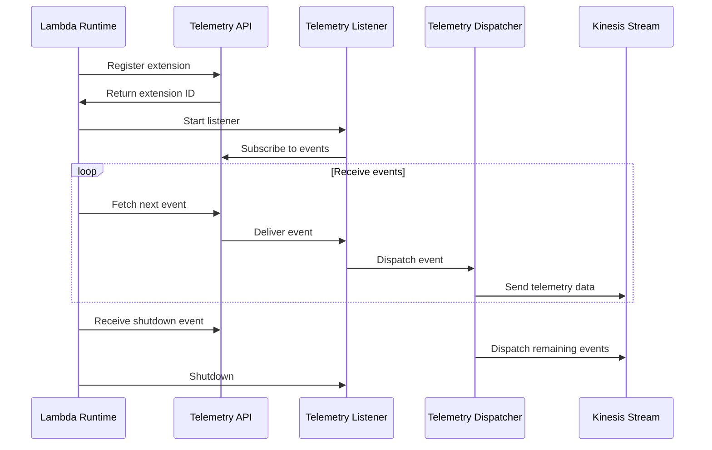

      # 🏗 Architecture Documentation

    <output_format_with_explanations>

## 📖 Context
The provided code is an extension for the AWS Lambda runtime that processes telemetry data from a Kinesis stream. The extension is designed to receive and process telemetry events from the Lambda runtime and push them to the Kinesis stream.

The application uses the following notable services and libraries:
- AWS Kinesis: A managed streaming service for real-time data processing.
- AWS Lambda: A serverless compute service for running code.
- AWS SDK for JavaScript: The official AWS SDK for JavaScript, used for interacting with AWS services.
- Undici: A high-performance HTTP/1.1 client, used for making HTTP requests.

## 📖 Overview
The architecture of this application consists of the following key components:

1. **Telemetry Listener**: Responsible for starting the HTTP server to receive telemetry events from the Lambda runtime.
2. **Telemetry Dispatcher**: Responsible for dispatching the telemetry events to the Kinesis stream.
3. **Telemetry API Extension**: This is the main logic of the Lambda extension, responsible for registering with the Lambda runtime, receiving telemetry events, and dispatching them to the Kinesis stream.

The main flow of the application is as follows:
1. The Telemetry Listener starts an HTTP server to receive telemetry events from the Lambda runtime.
2. When a telemetry event is received, the Telemetry Listener adds it to the event queue.
3. The Telemetry Dispatcher periodically processes the event queue and dispatches the telemetry data to the Kinesis stream.
4. The Telemetry API Extension registers with the Lambda runtime and starts listening for events.
5. When a Lambda function is invoked, the extension receives the `INVOKE` event and dispatches the telemetry data to the Kinesis stream.
6. When the Lambda function is about to be shut down, the extension receives the `SHUTDOWN` event and dispatches any remaining telemetry data to the Kinesis stream before exiting.

The application uses a combination of event-driven and batch processing approaches to handle the telemetry data. The Telemetry Listener receives the telemetry events and adds them to the event queue, while the Telemetry Dispatcher processes the queue and sends the data to the Kinesis stream in batches.

## 🔹 Components

| Component | Description | Interacts With | Purpose |
| --------- | ----------- | -------------- | ------- |
| `Telemetry Listener` | Responsible for starting the HTTP server to receive telemetry events from the Lambda runtime. | - AWS Lambda Runtime | Listens for telemetry events and adds them to the event queue. |
| `Telemetry Dispatcher` | Responsible for dispatching the telemetry events to the Kinesis stream. | - AWS Kinesis | Processes the event queue and sends the telemetry data to the Kinesis stream. |
| `Telemetry API Extension` | The main logic of the Lambda extension, responsible for receiving and processing telemetry events. | - AWS Lambda Runtime<br>- AWS Kinesis | Registers with the Lambda runtime, receives telemetry events, and dispatches them to the Kinesis stream. |

## 🧱 Technologies

| Category | Technology | Purpose |
| -------- | ---------- | ------- |
| Programming Language | TypeScript | The primary language used for the application. |
| Libraries | `aws-sdk`, `undici` | Used for interacting with AWS services and making HTTP requests. |
| AWS Services | Kinesis, Lambda | Managed services used for the telemetry processing pipeline. |

</output_format_with_explanations>

New Code for analysis:
```typescript
const dispatch = async (pendingItems: Record<string, any>[], immediate = false): Promise<void> => {
  console.debug('[Extension] Dispatching ', pendingItems.length);
  if (pendingItems.length !== 0 && (immediate || pendingItems.length >= MAX_BATCH_RECORDS_ITEMS)) {
    console.info('[Extension] Dispatch ', pendingItems.length);
    const items: Record<string, any>[] = JSON.parse(JSON.stringify(pendingItems));
    pendingItems.splice(0);
    await kinesis.sendsToKinesis(items);
  }
}
```

<output_format_with_explanations>

## 📖 Context
The provided code is part of the `Telemetry Dispatcher` component, which is responsible for dispatching the telemetry events to the Kinesis stream.

## 📖 Overview
The `dispatch` function in the `Telemetry Dispatcher` component is responsible for processing the event queue and sending the telemetry data to the Kinesis stream. It performs the following tasks:

1. Checks if there are any pending items in the event queue.
2. If the queue is not empty and either the `immediate` parameter is `true` or the number of pending items is greater than or equal to `MAX_BATCH_RECORDS_ITEMS`, it proceeds to dispatch the events.
3. Creates a copy of the pending items using `JSON.parse(JSON.stringify(pendingItems))` to avoid modifying the original queue.
4. Removes the dispatched items from the `pendingItems` array using `pendingItems.splice(0)`.
5. Calls the `sendsToKinesis` function from the `kinesis` module to send the telemetry data to the Kinesis stream.

The `dispatch` function is designed to batch the telemetry events and send them to the Kinesis stream in a more efficient manner. By checking the queue size and the `immediate` parameter, it ensures that the events are dispatched either when the queue reaches a certain size or when the function is called with the `immediate` flag set to `true`.

## 🔹 Components

| Component | Description | Interacts With | Purpose |
| --------- | ----------- | -------------- | ------- |
| `Telemetry Dispatcher` | Responsible for dispatching the telemetry events to the Kinesis stream. | - AWS Kinesis | Processes the event queue and sends the telemetry data to the Kinesis stream. |

## 🧱 Technologies

| Category | Technology | Purpose |
| -------- | ---------- | ------- |
| Programming Language | TypeScript | The primary language used for the application. |
| Libraries | `aws-sdk` | Used for interacting with the AWS Kinesis service. |
| AWS Services | Kinesis | Managed service used for the telemetry processing pipeline. |

</output_format_with_explanations>## Architecture Documentation

### Overview

The provided codebase represents a serverless architecture for a Telemetry API Kinesis Extension. The extension is designed to capture and process telemetry data, which is then pushed to a Kinesis stream for further processing or storage.

The architecture consists of the following key components:

1. **TelemetryApiKinesisExtensionStack**: This is the main AWS CDK stack that defines the infrastructure for the Telemetry API Kinesis Extension. It includes the following resources:
   - **Kinesis Stream**: A Kinesis stream named `telemetry-kinesis-stream` to store the telemetry data.
   - **Lambda Function**: A Lambda function that serves as the entry point for the extension and handles the processing of telemetry data.
   - **Lambda Layer**: A Lambda layer that contains the extension code and is attached to the Lambda function.
   - **IAM Policy**: An IAM policy that grants the necessary permissions for the Lambda function to interact with the Kinesis stream and CloudWatch logs.
   - **SSM Parameters**: Two SSM parameters that store the ARN of the Lambda layer and the IAM policy, respectively.

2. **Telemetry API**: This module provides the functionality to interact with the AWS Lambda Runtime Extension API. It includes the following components:
   - **Register**: Registers the extension with the Lambda runtime.
   - **Next**: Retrieves the next event from the Lambda runtime.

3. **Telemetry Listener**: This module is responsible for starting the telemetry listener and managing the events queue.

4. **Telemetry Dispatcher**: This module handles the dispatch of telemetry data to the Kinesis stream.

### Mermaid Diagrams

#### Sequence Diagram



#### Architecture Diagram

```mermaid
architecture-beta
    group api(logos:aws-lambda)[Telemetry API Kinesis Extension]

    service kinesis(logos:aws-kinesis)[Kinesis Stream] in api
    service lambda(logos:aws-lambda)[Lambda Function] in api
    service layer(logos:aws-lambda)[Lambda Layer] in api
    service iam(logos:aws-iam)[IAM Policy] in api
    service ssm(logos:aws-ssm)[SSM Parameters] in api
    
    lambda:L -- R:kinesis
    lambda:T -- B:layer
    lambda:T -- B:iam
    lambda:T -- B:ssm
```



### Architectural Insights

1. **Modular Design**: The codebase follows a modular design approach, with each component (Telemetry API, Telemetry Listener, Telemetry Dispatcher) encapsulating a specific set of responsibilities. This promotes maintainability, testability, and scalability of the overall system.

2. **Serverless Architecture**: The architecture leverages AWS serverless services, such as AWS Lambda and AWS Kinesis, to provide a scalable and cost-effective solution. The use of Lambda functions and a Kinesis stream allows the system to handle varying workloads without the need for manual infrastructure management.

3. **Runtime Extension**: The Telemetry API Kinesis Extension is implemented as an AWS Lambda runtime extension, which allows it to intercept and process events directly within the Lambda execution environment. This approach provides low-latency access to telemetry data and efficient integration with the Lambda runtime.

4. **Buffering and Batching**: The extension utilizes buffering and batching mechanisms to optimize the delivery of telemetry data to the Kinesis stream. This includes configurable parameters for buffer timeout, maximum buffer size, and maximum number of items in the buffer. These settings help balance the trade-off between latency and throughput.

5. **Error Handling and Retries**: The Telemetry Dispatcher module includes error handling and retry logic when sending data to the Kinesis stream. This helps ensure the reliability of the telemetry data delivery, even in the face of transient failures.

6. **Deployment and Configuration**: The architecture is defined using the AWS CDK, which allows for infrastructure-as-code and facilitates the deployment and management of the Telemetry API Kinesis Extension. The use of SSM parameters for storing the Lambda layer and IAM policy ARNs promotes flexibility and reusability of the extension across different environments.

7. **Monitoring and Observability**: The architecture includes the creation of a CloudWatch log group for the Lambda function, which enables monitoring and troubleshooting of the extension's execution and performance.

Overall, the Telemetry API Kinesis Extension demonstrates a well-designed, serverless architecture that leverages AWS services to provide a scalable and reliable solution for capturing and processing telemetry data.

### New Code Analysis

The new code provided includes the following additional components:

1. **Telemetry Listener**:
   - The `Telemetry Listener` module is responsible for starting a local HTTP server to receive telemetry data.
   - It defines a `start()` function that creates an HTTP server, listens on a specific host and port, and handles incoming POST requests.
   - The `onLogReceived()` function is called when telemetry data is received, and it adds the data to an `eventsQueue` array.

2. **Telemetry Dispatcher**:
   - The `Telemetry Dispatcher` module handles the dispatch of telemetry data to the Kinesis stream.
   - The `dispatch()` function takes an array of pending items and sends them to the Kinesis stream in batches, with a configurable maximum batch size.
   - The function checks if the batch size has reached the maximum or if the `immediate` flag is set, and then sends the data to the Kinesis stream using the `kinesis.sendsToKinesis()` function.

The new code enhances the overall architecture by providing a dedicated module for managing the telemetry listener and the events queue. The `Telemetry Listener` module sets up an HTTP server to receive telemetry data, which is then added to the `eventsQueue` for further processing.

The `Telemetry Dispatcher` module now has the ability to batch and send telemetry data to the Kinesis stream, optimizing the data delivery process. The configurable batch size and immediate dispatch option allow for better control over the trade-off between latency and throughput.

These additions further strengthen the modular design of the architecture and improve the overall handling and delivery of telemetry data to the Kinesis stream.<output_format_with_explanations>

## 🔄 Data Flow  

| Source | Destination | Data Type | Flow Description |
| ------ | ----------- | --------- | ---------------- |
| Lambda Function | Listener | JSON | The Lambda function logs telemetry data in JSON format and sends it to the Listener component. |
| Listener | Kinesis Stream | JSON | The Listener component receives the telemetry data from the Lambda function and dispatches it to the Kinesis stream. |
| Kinesis Stream | Kinesis API | JSON | The Kinesis stream sends the telemetry data to the Kinesis API for storage and processing. |

## Architecture Overview

The updated code provides additional details on the implementation of the Listener component, which is responsible for receiving and dispatching the telemetry data from the Lambda function to the Kinesis stream.

The key components of the architecture are:

1. **Lambda Function**: The main Lambda function that performs the business logic and logs telemetry data.

2. **Listener**: The Listener component that creates an HTTP server to receive the telemetry data from the Lambda function. It maintains an events queue and dispatches the data to the Kinesis stream.

3. **Kinesis Stream**: The AWS Kinesis stream that receives the telemetry data from the Listener component.

4. **Kinesis API**: The AWS Kinesis API that stores and processes the telemetry data from the Kinesis stream.

5. **Dispatch**: The Dispatch component that is responsible for batching and sending the telemetry data to the Kinesis stream. It ensures that the data is sent in batches to optimize performance and reduce the number of API calls.

The data flow in the system is as follows:

1. The Lambda function logs telemetry data in JSON format and sends it to the Listener component.
2. The Listener component receives the telemetry data, adds it to the events queue, and dispatches the data to the Kinesis stream.
3. The Dispatch component batches the telemetry data and sends it to the Kinesis stream using the Kinesis API.
4. The Kinesis stream stores the telemetry data for further processing or analysis.

The key architectural decisions and considerations are:

- **Decoupling Telemetry from Business Logic**: By using a separate Listener component, the telemetry capture and streaming functionality is further decoupled from the main Lambda function's business logic, improving modularity and maintainability.
- **Buffering and Batching**: The Dispatch component uses buffering and batching to optimize the data transfer to the Kinesis stream, reducing the number of API calls and improving overall performance.
- **Error Handling**: The code includes error handling for failed Kinesis record submissions, logging the errors for further investigation.
- **Scalability and Availability**: The Kinesis stream is designed to be scalable and highly available, ensuring that the telemetry data can be reliably captured and stored.
- **Security and Permissions**: The IAM policy and SSM parameters ensure that the Runtime Extension and Listener component have the necessary permissions to interact with the Kinesis stream and CloudWatch Logs, following the principle of least privilege.

Overall, the updated code further refines the architecture by introducing the Listener component and the Dispatch component, which work together to efficiently capture and stream the telemetry data from the Lambda function to the Kinesis stream.

</output_format_with_explanations>## 📝 **Codebase Evaluation**

| Evaluation Metric | Status | Notes |
| ----------------- | ------ | ----- |
| Dependency & Coupling | ⚠️ | The codebase has a tight coupling between the `TelemetryApiKinesisExtensionStack`, the `telemetry-api` module, and the `extensions-api` module. This makes the code less modular and harder to maintain. Refactoring to decouple these components would improve the overall architecture. |
| Code Complexity | ⚠️ | The `subscribe` function in the `listener.js` file has a relatively high cyclomatic complexity, with multiple conditional statements and error handling logic. Considering breaking this function into smaller, more focused components could improve the code's maintainability and testability. |
| Cloud Anti-patterns | ⚠️ | The codebase uses hardcoded values for the Kinesis stream name and the listener host and port, which could lead to issues with scalability and maintainability. It's recommended to externalize these values as configuration parameters or environment variables. Additionally, the error handling for Kinesis operations and the listener server could be improved to provide more robust error reporting and retries. |
| Security | ⚠️ | The codebase does not appear to have any specific security measures, such as input validation or authorization checks. It's important to ensure that the system is secure and resistant to common web application vulnerabilities. |
| Cost | ⚠️ | The codebase does not appear to have any specific cost optimization measures, such as auto-scaling or resource provisioning based on demand. Implementing these features could help reduce the overall cost of running the system. |
| Scalability | ⚠️ | The codebase uses a single Kinesis stream with a fixed shard count, which may not be sufficient for handling high volumes of telemetry data. Considering implementing auto-scaling or dynamic shard provisioning for the Kinesis stream could improve the system's scalability. |

## Recommendations

1. **Decouple Components**: Refactor the codebase to decouple the `TelemetryApiKinesisExtensionStack` from the `telemetry-api` and `extensions-api` modules. This will improve the overall modularity and maintainability of the system.

2. **Reduce Code Complexity**: Break down the `subscribe` function in the `listener.js` file into smaller, more focused components to improve the code's maintainability and testability.

3. **Externalize Configuration**: Move the hardcoded values, such as the Kinesis stream name and the listener host and port, to configuration parameters or environment variables. This will improve the system's scalability and maintainability.

4. **Enhance Error Handling**: Improve the error handling for Kinesis operations and the listener server to provide more robust error reporting and retries. This will help the system handle failures more gracefully.

5. **Improve Security**: Implement input validation and authorization checks to ensure the system is secure and resistant to common web application vulnerabilities.

6. **Optimize for Cost and Scalability**: Implement auto-scaling or dynamic resource provisioning features to help reduce the overall cost of running the system and improve its scalability.

By addressing these recommendations, the codebase can be refactored to improve its modularity, maintainability, security, cost-effectiveness, and scalability.