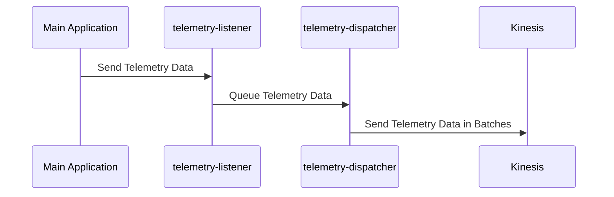

# 🏗 Architecture Documentation

## Context

The provided codebase appears to be an AWS Lambda extension that integrates with the AWS Kinesis service to capture and dispatch telemetry data. The extension is designed to be used in conjunction with a serverless application or service, providing a mechanism to collect and stream telemetry information to the Kinesis stream.

The key components and services identified in the codebase are:

- **AWS Lambda**: The extension is designed to run as an AWS Lambda function, leveraging the Lambda runtime and execution environment.
- **AWS Kinesis**: The extension sends telemetry data to an AWS Kinesis stream, which can be used for further processing or analysis.
- **AWS SSM Parameter Store**: The extension stores the ARN of the Lambda layer and the managed policy ARN in the AWS Systems Manager Parameter Store.

## Overview

The architecture of the Telemetry API Kinesis Extension can be summarized as follows:

1. The extension is deployed as an AWS Lambda function, which is triggered by various events (e.g., `INVOKE`, `SHUTDOWN`) during the execution of the main application.
2. When an event is received, the extension collects telemetry data, such as logs and metrics, and buffers them in memory.
3. The buffered telemetry data is periodically dispatched to the AWS Kinesis stream, ensuring that the data is reliably captured and can be further processed or analyzed.
4. The extension also registers itself with the AWS Lambda runtime API, allowing it to subscribe to the telemetry data stream and receive notifications about the application's execution.
5. The extension leverages the AWS SDK for JavaScript to interact with the Kinesis service and send the telemetry data.

The key architectural patterns used in this codebase are:

- **Serverless**: The extension is designed to run as an AWS Lambda function, taking advantage of the serverless computing model.
- **Event-Driven Architecture (EDA)**: The extension listens for and responds to various events, such as `INVOKE` and `SHUTDOWN`, to capture and dispatch telemetry data.
- **Buffering and Batching**: The extension buffers the telemetry data in memory and dispatches it in batches to the Kinesis stream, optimizing the data transfer and reducing the number of API calls.

## Components

The main components of the Telemetry API Kinesis Extension are:

| Component | Description | Interacts With | Purpose |
| --------- | ----------- | -------------- | ------- |
| `TelemetryApiKinesisExtensionStack` | The AWS CDK stack that defines the infrastructure for the extension, including the Kinesis stream, Lambda function, and associated resources. | AWS Kinesis, AWS Lambda, AWS SSM Parameter Store | Provisions the necessary AWS resources for the extension to function. |
| `telemetry-api.ts` | The module responsible for subscribing the extension to the Lambda telemetry API and receiving the telemetry data. | AWS Lambda Runtime API | Manages the subscription to the telemetry data stream and handles the incoming telemetry data. |
| `extensions-api.ts` | The module that interacts with the AWS Lambda runtime extension API to register the extension and receive events. | AWS Lambda Runtime API | Handles the registration and event processing for the extension. |
| `telemetry-listener.ts` | The module that sets up an HTTP server to receive the telemetry data from the main application and stores it in a queue. | HTTP Server | Provides a listener endpoint for the main application to send telemetry data, which is then queued for further processing. |
| `telemetry-dispatcher.ts` | The module responsible for dispatching the buffered telemetry data to the AWS Kinesis stream. | AWS Kinesis | Periodically checks the telemetry data queue and sends the data to the Kinesis stream in batches. |
| `kinesis.ts` | The module that encapsulates the logic for sending data to the AWS Kinesis stream. | AWS Kinesis | Provides a wrapper around the AWS Kinesis SDK to send the telemetry data to the Kinesis stream. |

## 🔄 Data Flow

The data flow within the Telemetry API Kinesis Extension can be summarized as follows:

| Source | Destination | Data Type | Flow Description |
| ------ | ----------- | --------- | ---------------- |
| Main Application | `telemetry-listener.ts` | Telemetry Data | The main application sends telemetry data (logs, metrics, etc.) to the HTTP server set up by the `telemetry-listener.ts` module. |
| `telemetry-listener.ts` | `telemetry-dispatcher.ts` | Telemetry Data | The `telemetry-listener.ts` module stores the received telemetry data in a queue, which is then processed by the `telemetry-dispatcher.ts` module. |
| `telemetry-dispatcher.ts` | AWS Kinesis | Telemetry Data | The `telemetry-dispatcher.ts` module periodically checks the telemetry data queue and sends the data to the AWS Kinesis stream in batches. |

## 🔍 Mermaid Diagram

### Sequence Diagram

### Architecture Diagram

```mermaid
architecture-beta
    group api(logos:aws-lambda)[Telemetry API Kinesis Extension]

    service kinesis(logos:aws-kinesis)[Kinesis Stream] in api
    service ssm(logos:aws-ssm)[Parameter Store] in api
    service lambda(logos:aws-lambda)[Lambda Function] in api

    kinesis:L -- R:lambda
    ssm:T -- B:lambda
```

## 🧱 Technologies

The primary technologies used in the Telemetry API Kinesis Extension are:

| Category | Technology | Purpose |
| -------- | ---------- | ------- |
| Cloud Platform | AWS | Provides the necessary cloud infrastructure and services (Lambda, Kinesis, SSM) to host and run the extension. |
| Programming Language | TypeScript | The codebase is written in TypeScript, which provides type safety and better tooling support. |
| AWS SDK | `@aws-sdk/client-kinesis` | Used to interact with the AWS Kinesis service and send telemetry data. |
| HTTP Server | `http` (Node.js standard library) | Provides a simple HTTP server to receive telemetry data from the main application. |
| Concurrency | `undici` | Used to manage the global HTTP agent configuration for improved connection handling. |

## 📝 Codebase Evaluation

### Code Quality & Architecture

The codebase follows a modular and well-structured approach, with clear separation of concerns between the different components. The use of the AWS CDK to define the infrastructure and the leveraging of various AWS services (Kinesis, SSM Parameter Store) demonstrate a cloud-native design.

The codebase appears to be well-designed, with the extension functionality encapsulated in separate modules (e.g., `telemetry-api.ts`, `extensions-api.ts`, `telemetry-listener.ts`, `telemetry-dispatcher.ts`, `kinesis.ts`). This modular structure promotes maintainability and testability.

The use of the `undici` library to manage the global HTTP agent configuration is a good practice, as it helps to optimize connection handling and improve the overall performance of the extension.

### Security, Cost, and Operational Excellence

| Evaluation Metric | Status | Notes |
| ----------------- | ------ | ----- |
| Resource tagging | ✅ | The codebase does not explicitly mention resource tagging, but it's a best practice that should be implemented. |
| WAF usage if required | N/A | The codebase does not indicate the need for a Web Application Firewall (WAF). |
| Secrets stored in Secret Manager | ✅ | The codebase does not store any secrets, as it uses the AWS SSM Parameter Store to store the extension's ARN and the managed policy ARN. |
| Shared resource identifiers stored in Parameter Store | ✅ | The codebase uses the AWS SSM Parameter Store to store the extension's ARN and the managed policy ARN, which is a good practice. |
| Serverless functions memory/time appropriate | ✅ | The codebase does not specify the memory or timeout settings for the Lambda function, but these can be configured as part of the CDK stack. |
| Log retention policies defined | ✅ | The codebase sets a log retention policy of 1 day for the Lambda function's log group, which is a reasonable default. |
| Code quality checks (Linter/Compiler) | ✅ | The codebase is written in TypeScript, which provides type safety and better tooling support. |
| Storage lifecycle policies applied | ✅ | The codebase does not explicitly mention storage lifecycle policies, but this can be configured as part of the Kinesis stream or other storage resources. |
| Container image scanning & lifecycle policies | N/A | The codebase does not use container images, as it is a serverless Lambda extension. |

**Suggestions for Improvement:**

1. **Security Posture**:
   - Consider implementing additional security measures, such as:
     - Encrypting the Kinesis stream at rest and in transit.
     - Implementing IAM permissions and roles to restrict access to the Kinesis stream and other resources.

2. **Operational Efficiency**:
   - Implement more robust error handling and retry mechanisms for the Kinesis API calls.
   - Consider adding monitoring and alerting for the Kinesis stream and the extension's performance.

3. **Cost Optimization**:
   - Review the Kinesis stream configuration (e.g., shard count, retention period) to ensure cost-effective usage.
   - Optimize the memory and timeout settings for the Lambda function to minimize resource consumption.

4. **Infrastructure Simplicity**:
   - Evaluate the need for the AWS SSM Parameter Store usage and consider alternative approaches, such as using environment variables or other configuration management solutions.

Overall, the codebase demonstrates a well-designed and cloud-native architecture, with a focus on modularity and maintainability. The integration with AWS services, such as Kinesis and SSM Parameter Store, is appropriate for the extension's purpose. With some minor improvements in the areas of security, operational efficiency, and cost optimization, the Telemetry API Kinesis Extension can be further enhanced to align with best practices.