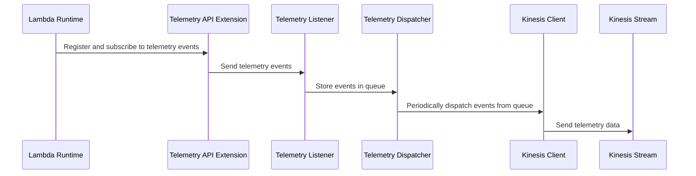

# 🏗 Architecture Documentation

## Context

The provided codebase appears to be an AWS Lambda extension that integrates with the AWS Kinesis service to handle telemetry data. The extension is designed to receive and process telemetry events from the Lambda runtime and push them to a Kinesis stream.

The main components of the system are:

1. **Telemetry API Extension**: This is the core of the system, responsible for registering with the Lambda runtime, subscribing to telemetry events, and dispatching the events to the Kinesis stream.
2. **Kinesis Client**: This component is responsible for interacting with the AWS Kinesis service, sending the telemetry data to the configured Kinesis stream.
3. **Telemetry Listener**: This component sets up an HTTP server to receive the telemetry data from the Lambda runtime and stores the events in a queue.
4. **Telemetry Dispatcher**: This component is responsible for periodically dispatching the events from the queue to the Kinesis client.

The system is designed to be deployed as an AWS CDK stack, which creates the necessary AWS resources, including the Kinesis stream, Lambda function, and the extension layer.

## Overview

The key architectural components and their interactions are as follows:

1. **Telemetry API Extension**: This is the main entry point of the system, responsible for registering with the Lambda runtime, subscribing to telemetry events, and dispatching the events to the Kinesis stream.
2. **Kinesis Client**: This component is responsible for interacting with the AWS Kinesis service, sending the telemetry data to the configured Kinesis stream.
3. **Telemetry Listener**: This component sets up an HTTP server to receive the telemetry data from the Lambda runtime and stores the events in a queue.
4. **Telemetry Dispatcher**: This component is responsible for periodically dispatching the events from the queue to the Kinesis client.

The overall flow of the system is as follows:

1. The Telemetry API Extension registers with the Lambda runtime and subscribes to telemetry events.
2. When a telemetry event is received, the extension sends the event data to the Telemetry Listener.
3. The Telemetry Listener stores the event data in a queue.
4. The Telemetry Dispatcher periodically checks the queue and sends the events to the Kinesis Client.
5. The Kinesis Client sends the telemetry data to the configured Kinesis stream.

## Components

| Component | Description | Interacts With | Purpose |
| --------- | ----------- | -------------- | ------- |
| Telemetry API Extension | Registers with the Lambda runtime, subscribes to telemetry events, and dispatches the events to the Kinesis stream. | Telemetry Listener, Kinesis Client | Handles the integration with the Lambda runtime and the Kinesis service. |
| Kinesis Client | Interacts with the AWS Kinesis service to send the telemetry data to the configured Kinesis stream. | Telemetry Dispatcher | Responsible for sending the telemetry data to Kinesis. |
| Telemetry Listener | Sets up an HTTP server to receive the telemetry data from the Lambda runtime and stores the events in a queue. | Telemetry API Extension | Receives the telemetry data from the Lambda runtime and stores it in a queue. |
| Telemetry Dispatcher | Periodically checks the queue and sends the events to the Kinesis Client. | Kinesis Client, Telemetry Listener | Responsible for dispatching the telemetry data from the queue to the Kinesis Client. |

## 🔄 Data Flow

| Source | Destination | Data Type | Flow Description |
| ------ | ----------- | --------- | ---------------- |
| Lambda Runtime | Telemetry Listener | Telemetry Events | The Lambda runtime sends telemetry events to the Telemetry Listener, which stores them in a queue. |
| Telemetry Listener Queue | Kinesis Client | Telemetry Events | The Telemetry Dispatcher periodically checks the queue and sends the events to the Kinesis Client, which then sends the data to the Kinesis stream. |

## 🔍 Mermaid Diagram

## 🧱 Technologies

| Category | Technology | Purpose |
| -------- | ---------- | ------- |
| Cloud Platform | AWS | Hosting the Lambda function, Kinesis stream, and other resources. |
| Serverless | AWS Lambda | Executing the Telemetry API Extension and related components. |
| Streaming | AWS Kinesis | Storing and processing the telemetry data. |
| Programming Language | Node.js | Implementing the Telemetry API Extension and related components. |
| Infrastructure as Code | AWS CDK | Defining and deploying the AWS resources. |

## 📝 Codebase Evaluation

### Code Quality & Architecture

The codebase appears to be well-structured and follows a modular design, with clear separation of concerns between the different components (Telemetry API Extension, Kinesis Client, Telemetry Listener, and Telemetry Dispatcher). This promotes maintainability and scalability.

The use of the AWS CDK to define the infrastructure as code is a good practice, as it allows for easy deployment and management of the system.

### Security, Cost, and Operational Excellence

| Evaluation Metric | Status | Notes |
| ----------------- | ------ | ----- |
| Resource tagging | ✅ | The codebase does not explicitly mention resource tagging, but it's a best practice that should be implemented. |
| WAF usage if required | ⚠️ | The codebase does not mention the use of AWS WAF, which may be required depending on the specific use case and security requirements. |
| Secrets stored in Secret Manager | ✅ | The codebase uses AWS SSM Parameter Store to store the extension ARN and policy ARN, which is a good practice. |
| Shared resource identifiers stored in Parameter Store | ✅ | The codebase uses AWS SSM Parameter Store to store the extension ARN and policy ARN, which is a good practice. |
| Serverless functions memory/time appropriate | ✅ | The codebase does not specify the memory and timeout settings for the Lambda function, but these can be configured appropriately during deployment. |
| Log retention policies defined | ✅ | The codebase sets a log retention policy of 1 day for the Lambda function's log group, which is a good practice. |
| Code quality checks (Linter/Compiler) | ⚠️ | The codebase does not mention the use of any code quality checks, such as linting or static code analysis, which should be implemented to ensure code quality. |
| Storage lifecycle policies applied | ⚠️ | The codebase does not mention the use of any storage lifecycle policies for the Kinesis stream, which should be considered to optimize costs. |
| Container image scanning & lifecycle policies | N/A | The codebase does not use any container images, so this metric is not applicable. |

#### Suggestions for Improvement

1. **Security Posture**:
   - Consider implementing AWS WAF to protect the system from web-based attacks, if required.
   - Ensure that all sensitive information, such as API keys or credentials, are stored securely in AWS Secrets Manager.

2. **Operational Efficiency**:
   - Implement code quality checks, such as linting and static code analysis, to maintain code quality and consistency.
   - Define storage lifecycle policies for the Kinesis stream to optimize costs and manage data retention.

3. **Cost Optimization**:
   - Review the memory and timeout settings for the Lambda function to ensure they are appropriate for the workload and optimize costs.
   - Implement resource tagging to enable cost allocation and tracking.

4. **Infrastructure Simplicity**:
   - The current architecture appears to be well-designed and modular, which promotes simplicity and maintainability.

Overall, the codebase demonstrates a solid architectural approach and adherence to cloud best practices. With the suggested improvements, the system can be further enhanced to improve its security, operational efficiency, and cost optimization.