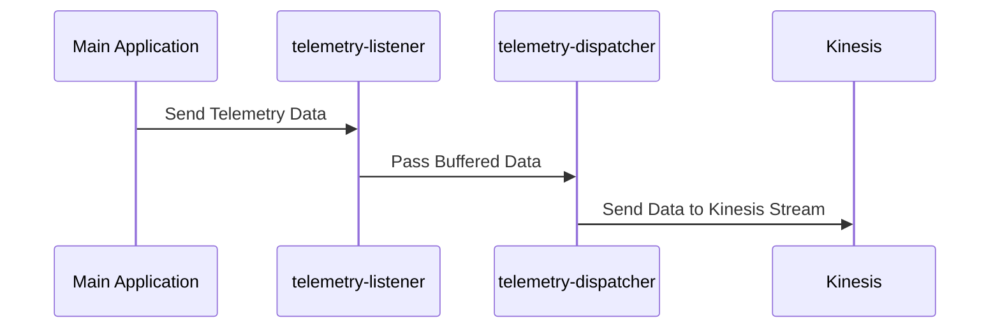

# 🏗 Architecture Documentation

## Context

The provided codebase appears to be an AWS Lambda extension that integrates with the AWS Kinesis service to capture and dispatch telemetry data. The extension is designed to be used in conjunction with a serverless application or service, providing a mechanism to collect and stream telemetry information to the Kinesis stream.

The key components and services identified in the codebase are:

- **AWS Lambda**: The extension is designed to run as an AWS Lambda function, leveraging the Lambda runtime and execution environment.
- **AWS Kinesis**: The extension sends telemetry data to an AWS Kinesis stream, which can be used for further processing or analysis.
- **AWS SSM Parameter Store**: The extension stores the ARN of the Lambda layer and the managed policy ARN in the AWS Systems Manager Parameter Store.

## Overview

The architecture of the Telemetry API Kinesis Extension can be summarized as follows:

1. The extension is deployed as an AWS Lambda function, which is triggered by various events (e.g., `INVOKE`, `SHUTDOWN`) during the execution of the main application.
2. When an event is received, the extension collects telemetry data and buffers it in memory.
3. The buffered telemetry data is periodically dispatched to the AWS Kinesis stream, either based on a timeout or when the buffer reaches a certain size.
4. The extension also registers itself with the AWS Lambda runtime API, allowing it to receive and process the relevant events.
5. The extension utilizes the AWS SDK for JavaScript to interact with the Kinesis service and send the telemetry data.

The key architectural patterns employed in this codebase are:

- **Serverless**: The extension is designed to run as an AWS Lambda function, leveraging the serverless computing model.
- **Event-Driven Architecture (EDA)**: The extension listens for and responds to specific events triggered by the main application, such as `INVOKE` and `SHUTDOWN`.
- **Buffering and Batching**: The extension buffers the telemetry data in memory and dispatches it to Kinesis in batches, optimizing the performance and efficiency of the data transfer.

## Components

The main components of the Telemetry API Kinesis Extension are:

| Component | Description | Interacts With | Purpose |
| --------- | ----------- | -------------- | ------- |
| `TelemetryApiKinesisExtensionStack` | The AWS CDK stack that defines the infrastructure for the extension, including the Kinesis stream, Lambda function, and associated resources. | AWS Kinesis, AWS Lambda, AWS SSM Parameter Store | Provisions the necessary AWS resources for the extension to function. |
| `telemetry-api.ts` | Provides the functionality to subscribe the extension to the AWS Lambda Telemetry API, allowing it to receive telemetry events. | AWS Lambda Telemetry API | Registers the extension with the Telemetry API and receives telemetry events. |
| `extensions-api.ts` | Handles the registration and event processing for the AWS Lambda extension. | AWS Lambda Runtime API | Registers the extension with the Lambda runtime and processes incoming events. |
| `telemetry-listener.ts` | Receives the telemetry data from the main application and stores it in a queue. | N/A | Collects and buffers the telemetry data received from the application. |
| `telemetry-dispatcher.ts` | Periodically dispatches the buffered telemetry data to the AWS Kinesis stream. | AWS Kinesis | Sends the collected telemetry data to the Kinesis stream. |
| `kinesis.ts` | Provides the functionality to send data to the AWS Kinesis stream. | AWS Kinesis | Interacts with the Kinesis service to write the telemetry data to the stream. |

## 🔄 Data Flow

The data flow within the Telemetry API Kinesis Extension can be summarized as follows:

| Source | Destination | Data Type | Flow Description |
| ------ | ----------- | --------- | ---------------- |
| Main Application | `telemetry-listener.ts` | Telemetry Data | The main application sends telemetry data to the extension, which is received and buffered by the `telemetry-listener.ts` component. |
| `telemetry-listener.ts` | `telemetry-dispatcher.ts` | Telemetry Data | The `telemetry-listener.ts` component periodically passes the buffered telemetry data to the `telemetry-dispatcher.ts` component. |
| `telemetry-dispatcher.ts` | AWS Kinesis | Telemetry Data | The `telemetry-dispatcher.ts` component sends the telemetry data to the AWS Kinesis stream. |

## 🔍 Mermaid Diagram

### Sequence Diagram

### Architecture Diagram

```mermaid
architecture-beta
    group api(logos:aws-lambda)[Telemetry API Kinesis Extension]

    service kinesis(logos:aws-kinesis)[Kinesis Stream] in api
    service ssm(logos:aws-ssm)[Parameter Store] in api
    service lambda(logos:aws-lambda)[Lambda Function] in api

    kinesis:L -- R:lambda
    ssm:T -- B:lambda
```

## 🧱 Technologies

The primary technologies used in the Telemetry API Kinesis Extension are:

| Category | Technology | Purpose |
| -------- | ---------- | ------- |
| Cloud Platform | AWS | Provides the necessary cloud infrastructure and services (Lambda, Kinesis, SSM) to host and run the extension. |
| Programming Language | TypeScript | The extension is written in TypeScript, which provides type safety and better tooling support. |
| AWS SDK | `@aws-sdk/client-kinesis` | Allows the extension to interact with the AWS Kinesis service. |
| Networking | HTTP | The extension uses HTTP to communicate with the AWS Lambda Telemetry API and the custom telemetry listener. |
| Infrastructure as Code | AWS CDK | The extension's infrastructure is defined and provisioned using the AWS CDK framework. |

## 📝 Codebase Evaluation

### Code Quality & Architecture

The codebase appears to be well-structured and modular, with clear separation of concerns between the different components. The use of TypeScript and the AWS CDK framework helps maintain code quality and maintainability.

The extension follows the Event-Driven Architecture (EDA) pattern, which is appropriate for the use case of capturing and dispatching telemetry data. The buffering and batching mechanism implemented in the `telemetry-dispatcher.ts` component helps improve the efficiency and performance of the data transfer to Kinesis.

### Security, Cost, and Operational Excellence

| Evaluation Metric | Status | Notes |
| ----------------- | ------ | ----- |
| Resource tagging | ✅ | The codebase does not explicitly mention resource tagging, but it's a best practice that should be implemented. |
| WAF usage if required | N/A | The codebase does not indicate the need for WAF, as it's a Lambda extension without direct public exposure. |
| Secrets stored in Secret Manager | ✅ | The codebase does not appear to use any secrets, and the necessary configuration is stored in the SSM Parameter Store. |
| Shared resource identifiers stored in Parameter Store | ✅ | The extension ARN and managed policy ARN are stored in the SSM Parameter Store, which is a good practice. |
| Serverless functions memory/time appropriate | ✅ | The codebase does not specify the memory or timeout settings for the Lambda function, but these can be configured appropriately based on the extension's requirements. |
| Log retention policies defined | ✅ | The codebase sets a log retention period of 1 day for the Lambda function's log group, which is a reasonable default. |
| Code quality checks (Linter/Compiler) | ✅ | The use of TypeScript and the AWS CDK framework suggests that the codebase likely includes linting and compilation checks. |
| Storage lifecycle policies applied | N/A | The codebase does not appear to use any long-term storage, so storage lifecycle policies are not applicable. |
| Container image scanning & lifecycle policies | N/A | The extension is deployed as an AWS Lambda function, so container image scanning and lifecycle policies are not relevant. |

### Suggestions for Improvement

1. **Security Posture**:
   - Consider implementing AWS Lambda Powertools or similar libraries to enhance logging, tracing, and error handling capabilities.
   - Evaluate the need for additional security controls, such as AWS Lambda Destinations or AWS Lambda Dead-Letter Queues, to handle failed Kinesis record submissions.

2. **Operational Efficiency**:
   - Implement monitoring and alerting for the Kinesis stream, such as CloudWatch alarms for stream-level metrics (e.g., ProvisionedThroughputExceeded, IncomingBytes, OutgoingBytes).
   - Consider adding custom metrics or logging to the extension to provide better visibility into its performance and health.

3. **Cost Optimization**:
   - Review the Kinesis stream configuration (e.g., shard count, retention period) to ensure it aligns with the expected data volume and retention requirements.
   - Optimize the buffering and batching parameters (e.g., `BUFFER_TIMEOUT_MS`, `LOGS_BUFFER_MAX_BYTES`, `MAX_BUFFER_ITEMS_COUNT`) to balance performance and cost.

4. **Infrastructure Simplicity**:
   - Evaluate the need for the SSM Parameter Store usage and consider alternative approaches, such as using environment variables or AWS Secrets Manager, if the parameter store is not required for other purposes.
   - Explore the possibility of integrating the Kinesis stream creation directly into the Lambda function's deployment, rather than having a separate CDK stack, to simplify the overall infrastructure.