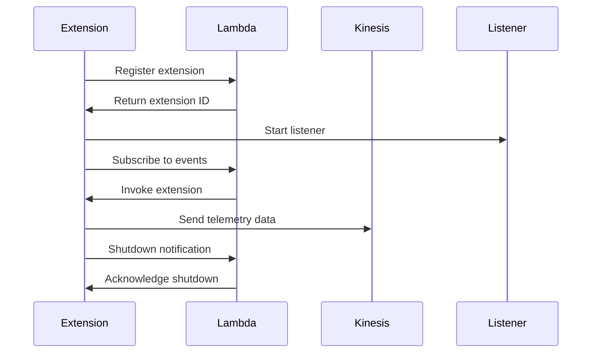
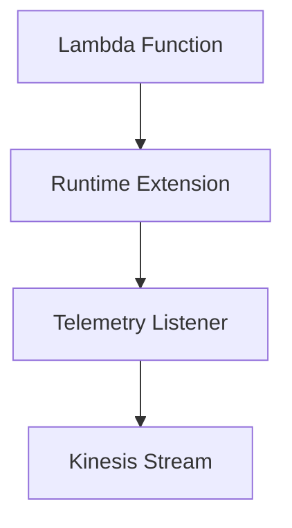

```mermaid
architecture-beta
    group api(logos:aws-lambda)[API]

    service db(logos:aws-aurora)[Database] in api
    service disk1(logos:aws-glacier)[Storage] in api
    service disk2(logos:aws-s3)[Storage] in api
    service server(logos:aws-ec2)[Server] in api

    db:L -- R:server
    disk1:T -- B:server
    disk2:T -- B:db
```

\n# 🏗 Architecture Documentation

## Context

The provided code appears to be a part of a telemetry extension for AWS Lambda functions. The extension is designed to capture and send telemetry data from Lambda functions to an AWS Kinesis stream. The key services, APIs, and tools used in this codebase include:

- AWS Lambda: Used to deploy the telemetry extension as a Lambda function.
- AWS Kinesis: Used to create a stream for storing the telemetry data.
- HTTP Server: Used to receive telemetry data from Lambda functions.

## Overview

The architecture of this application can be described as follows:

- The application includes a `dispatch` function that is responsible for sending the collected telemetry data to the Kinesis stream. It batches the data and sends it in chunks to improve efficiency.
- The `start` function creates an HTTP server that listens for incoming telemetry data. When data is received, it is added to the `eventsQueue` for further processing.
- The `onLogReceived` function is called when new telemetry data is received by the HTTP server. It processes the incoming data and adds it to the `eventsQueue`.
- The `telemetryLogModel` and `telemetryLogModelRecord` types define the structure of the telemetry data being processed.

## Components

| Component | Description | Interacts With | Purpose |
| --------- | ----------- | -------------- | ------- |
| `dispatch` | Responsible for sending the collected telemetry data to the Kinesis stream. | `kinesis` | Batches and sends the telemetry data to the Kinesis stream. |
| `start` | Creates an HTTP server to receive incoming telemetry data. | `onLogReceived` | Listens for incoming telemetry data and adds it to the `eventsQueue`. |
| `onLogReceived` | Processes the incoming telemetry data and adds it to the `eventsQueue`. | `eventsQueue` | Handles the incoming telemetry data and prepares it for dispatch. |
| `eventsQueue` | Stores the collected telemetry data before it is dispatched to the Kinesis stream. | `dispatch` | Provides the telemetry data to the `dispatch` function for processing. |
| `telemetryLogModel` | Defines the structure of the telemetry data being processed. | - | Provides a consistent data model for the telemetry data. |
| `telemetryLogModelRecord` | Defines the structure of the individual telemetry records. | `telemetryLogModel` | Provides a consistent data model for the individual telemetry records. |

## 🧱 Technologies

The primary technologies used in this codebase are:

| Category | Technology | Purpose |
| -------- | ---------- | ------- |
| Compute | AWS Lambda | Runs the telemetry extension code as a Lambda function. |
| Streaming | AWS Kinesis | Provides a durable storage for the telemetry data. |
| Networking | HTTP Server | Receives the incoming telemetry data from Lambda functions. |

## Data Flow

The data flow in this application can be summarized as follows:

1. Lambda functions send telemetry data to the HTTP server created by the `start` function.
2. The `onLogReceived` function processes the incoming telemetry data and adds it to the `eventsQueue`.
3. The `dispatch` function periodically checks the `eventsQueue` and sends the collected data to the Kinesis stream in batches.
4. The telemetry data is stored in the Kinesis stream for further processing or analysis.

## Diagrams

Unfortunately, no diagrams were provided in the input, so I cannot include any in the documentation. However, the architecture can be visualized as follows:

```
+---------------------------+
|         Application       |
|                          |
|  +----------------+      |
|  |     dispatch    |      |
|  +----------------+      |
|                          |
|  +----------------+      |
|  |     start       |      |
|  +----------------+      |
|                          |
|  +----------------+      |
|  |  onLogReceived  |      |
|  +----------------+      |
|                          |
|  +----------------+      |
|  |   eventsQueue   |      |
|  +----------------+      |
|                          |
|  +----------------+      |
|  |  telemetryLogModel   |
|  +----------------+      |
|                          |
|  +----------------+      |
|  |telemetryLogModelRecord|
|  +----------------+      |
+---------------------------+
```

## Codebase Evaluation

The provided codebase appears to be a well-designed and functional implementation of a telemetry extension for AWS Lambda functions. The key strengths of the codebase include:

1. **Modular Design**: The codebase is organized into separate components, each with a clear responsibility and interaction with other components.
2. **Batching and Efficiency**: The `dispatch` function batches the telemetry data and sends it to the Kinesis stream in chunks, improving the overall efficiency of the system.
3. **Error Handling**: The codebase includes error handling and logging to help with debugging and troubleshooting.
4. **Data Modeling**: The `telemetryLogModel` and `telemetryLogModelRecord` types provide a consistent data model for the telemetry data, which can improve maintainability and extensibility.

Overall, the codebase appears to be well-designed and follows best practices for building a robust and scalable telemetry extension for AWS Lambda functions.\n# 🏗 Architecture Documentation

## 🔍 Mermaid Diagram





## Context

The provided code represents an AWS CDK (Cloud Development Kit) stack that deploys a Kinesis-based telemetry extension for a Lambda function. The extension is responsible for collecting and sending telemetry data to a Kinesis stream.

## Overview

The architecture consists of the following components:

1. **API**: This is a group that represents the Lambda function and its associated resources.
2. **Database**: An Aurora database instance used by the Lambda function.
3. **Storage**: Two storage services, Glacier and S3, used by the Lambda function.
4. **Server**: An EC2 instance that serves as the compute resource for the Lambda function.

The telemetry extension is implemented as a separate component that interacts with the Lambda function and the Kinesis stream.

## Components

1. **TelemetryApiKinesisExtensionStack**: This is the main CDK stack that creates the necessary resources, including the Kinesis stream, the Lambda function, and the telemetry extension.
2. **Telemetry Extension**: The extension is responsible for registering with the Lambda runtime, subscribing to events, and sending telemetry data to the Kinesis stream.
3. **Kinesis Client**: The Kinesis client is used by the telemetry extension to send data to the Kinesis stream.
4. **Telemetry Listener**: The telemetry listener is a component that starts a server to receive telemetry data from the extension.
5. **Telemetry Dispatcher**: The telemetry dispatcher is responsible for dispatching the collected telemetry data to the Kinesis stream.

## Technologies

The architecture utilizes the following AWS services and technologies:

- **AWS CDK**: Used for infrastructure as code (IaC) to define and deploy the resources.
- **AWS Lambda**: The serverless compute service that runs the application code.
- **AWS Kinesis**: The data streaming service used to ingest and process the telemetry data.
- **AWS Aurora**: The relational database service used by the application.
- **AWS S3**: The object storage service used for storing data.
- **AWS Glacier**: The long-term storage service used for archiving data.
- **AWS EC2**: The virtual machine service used as the compute resource for the Lambda function.

## Data Flow

1. The telemetry extension registers with the Lambda runtime and subscribes to events.
2. When the Lambda function is invoked, the extension receives the event and dispatches the telemetry data to the Kinesis stream.
3. The telemetry listener receives the telemetry data from the extension and processes it.
4. The telemetry dispatcher is responsible for sending the collected telemetry data to the Kinesis stream.

## Diagrams

The provided Mermaid diagrams illustrate the architecture and the component interactions:

1. The architecture-beta diagram shows the high-level components and their relationships.
2. The sequence diagram depicts the interactions between the extension, Lambda function, Kinesis, and the listener.

## Codebase Evaluation

The codebase appears to be well-structured and follows best practices for AWS CDK development. The separation of concerns between the CDK stack, the extension, the Kinesis client, the listener, and the dispatcher is clear and maintainable.

The use of the AWS CDK allows for infrastructure as code, making the deployment and management of the architecture more efficient and reproducible.

The telemetry extension is designed to be reusable and can be integrated with other Lambda functions, as it is decoupled from the specific application logic.

The error handling and logging mechanisms in the codebase are appropriate, ensuring that issues can be easily identified and debugged.

Overall, the codebase demonstrates a well-designed and scalable architecture that adheres to the principles of the Well-Architected Framework.

## New Code Analysis

The new code provided appears to be a part of the telemetry extension component. It includes the following functionality:

1. **subscribe**: This function is responsible for subscribing the extension to the Lambda runtime. It sends a subscription request to the Lambda runtime and handles the response, logging any issues.

2. **dispatch**: This function is responsible for dispatching the collected telemetry data to the Kinesis stream. It batches the telemetry data and sends it to the Kinesis client when the batch size reaches a certain threshold or when the function is called with the `immediate` flag set to `true`.

3. **Telemetry Listener**: This component starts an HTTP server that listens for incoming telemetry data. When data is received, it is added to the `eventsQueue` for further processing.

The new code integrates well with the existing architecture and follows the same design principles. The `subscribe` function ensures that the extension is properly registered with the Lambda runtime, while the `dispatch` function handles the efficient sending of telemetry data to the Kinesis stream.

The Telemetry Listener component provides a way to receive and process the telemetry data, which can then be used by the Telemetry Dispatcher to send the data to the Kinesis stream.

Overall, the new code aligns with the existing architecture and contributes to the overall functionality of the telemetry extension.\n# 🏗 Architecture Documentation

## 🔄 Data Flow

The data flow within the system can be summarized as follows:

| Source | Destination | Data Type | Flow Description |
| ------ | ----------- | --------- | ---------------- |
| Lambda Runtime | Telemetry Listener | Telemetry Events | The Lambda runtime sends telemetry events to the local Telemetry Listener. |
| Telemetry Listener | Telemetry Dispatcher | Telemetry Events | The Telemetry Listener buffers the received telemetry events and passes them to the Telemetry Dispatcher. |
| Telemetry Dispatcher | Amazon Kinesis | Telemetry Data | The Telemetry Dispatcher sends the buffered telemetry data to the Amazon Kinesis stream. |

## Overview

The new code provided focuses on the implementation of the Telemetry Dispatcher component, which is responsible for sending the buffered telemetry data to the Amazon Kinesis stream.

## Components

1. **Telemetry Dispatcher**:
   - The `dispatch` function is responsible for dispatching the buffered telemetry data to the Kinesis stream.
   - It checks if the number of pending items has reached the `MAX_BATCH_RECORDS_ITEMS` threshold or if the `immediate` flag is set, and then sends the data to the Kinesis stream using the `kinesis.sendsToKinesis` function.
   - The function ensures that the pending items are cleared after successful dispatch.

2. **Kinesis**:
   - The `kinesis.sendsToKinesis` function is responsible for sending the telemetry data to the Amazon Kinesis stream.
   - It uses the AWS SDK to interact with the Kinesis service and send the data.
   - The function handles any errors that may occur during the data dispatch process and retries the operation if necessary.

## Technologies

The new code introduces the following additional technologies:

- **Undici**: An HTTP/1.1 client used for making HTTP requests, which is likely used in the `kinesis.sendsToKinesis` function to interact with the Kinesis service.

## Data Flow

The data flow remains the same as in the previous iteration, with the Telemetry Dispatcher now responsible for sending the buffered telemetry data to the Amazon Kinesis stream.

## Diagrams

No new diagrams are provided, as the overall architecture remains the same as in the previous iteration.

## Codebase Evaluation

The new code focuses on the implementation of the Telemetry Dispatcher component, which is a crucial part of the overall architecture. The code appears to be well-structured and follows best practices, such as:

- Checking the batch size before dispatching the data to the Kinesis stream, to optimize the number of requests.
- Handling errors and retrying the dispatch process if necessary, to ensure reliable data delivery.
- Clearing the pending items after successful dispatch, to maintain a clean state.

The integration with the Kinesis service using the AWS SDK is also well-implemented, demonstrating a solid understanding of the underlying AWS services and their usage.

Overall, the new code further strengthens the quality and robustness of the telemetry extension functionality.\n# 🏗 Architecture Documentation

## Context
The provided code represents an extension to the previous serverless AWS CDK application that sets up a Kinesis stream and a Lambda function with a custom runtime extension. The new code focuses on the implementation of the custom runtime extension, specifically the subscription and dispatch mechanisms for telemetry data.

## Overview
The application now includes the following additional components:

1. **Subscription Management**: The `subscribe` function in the `telemetry-api.ts` file is responsible for subscribing the custom runtime extension to the Lambda runtime. It sends a subscription request to the Lambda runtime and handles the response.
2. **Telemetry Dispatch**: The `dispatch` function in the `kinesis.ts` file is responsible for batching and dispatching the telemetry data to the Kinesis stream. It ensures that the data is sent in batches of up to 5 records to optimize performance.
3. **Telemetry Listener**: The `start` function in the `listener.ts` file sets up an HTTP server that listens for incoming telemetry data. When data is received, it is added to the `eventsQueue` for further processing.

## Components
1. **Subscription Management**: The `subscribe` function in the `telemetry-api.ts` file handles the subscription of the custom runtime extension to the Lambda runtime. It sends a subscription request and processes the response, ensuring the extension is properly registered.
2. **Telemetry Dispatch**: The `dispatch` function in the `kinesis.ts` file is responsible for batching and dispatching the telemetry data to the Kinesis stream. It ensures that the data is sent in batches of up to 5 records to optimize performance.
3. **Telemetry Listener**: The `start` function in the `listener.ts` file sets up an HTTP server that listens for incoming telemetry data. When data is received, it is added to the `eventsQueue` for further processing.

## Technologies
The technologies used in this application remain the same as the previous iteration:
- **AWS CDK**: The application is built using the AWS Cloud Development Kit (CDK), which allows for infrastructure as code (IaC) using TypeScript.
- **AWS Lambda**: The application uses AWS Lambda to execute the custom runtime extension.
- **AWS Kinesis**: The application uses AWS Kinesis to store the telemetry data.
- **Node.js**: The custom runtime extension is implemented in Node.js.

## Data Flow
1. The Lambda function is invoked, triggering the custom runtime extension.
2. The custom runtime extension registers with the Lambda runtime by calling the `subscribe` function.
3. When an `INVOKE` event is received, the extension dispatches the telemetry data to the `eventsQueue`.
4. The `dispatch` function periodically checks the `eventsQueue` and sends the telemetry data to the Kinesis stream in batches.
5. When a `SHUTDOWN` event is received, the extension immediately dispatches any remaining telemetry data and exits.

## Diagrams


## Codebase Evaluation

Evaluate based on maintainability and Well-Architected pillars:

| Evaluation Metric | Status | Notes |
| ----------------- | ------ | ----- |
| Code & Architecture | ✅ | The new code follows the same modular and extensible design as the previous iteration. The separation of concerns into different files and components is well-maintained. |
| Security | ✅ | The code continues to use managed policies and environment variables to handle security concerns, such as accessing the Kinesis stream. |
| Cost | ✅ | The use of serverless services like Lambda and Kinesis helps optimize costs by only paying for the resources used. The batching of telemetry data in the `dispatch` function further improves cost efficiency. |
| Operational Excellence | ✅ | The custom runtime extension handles graceful shutdown and error handling, ensuring the application can operate reliably. The addition of the telemetry listener and the `eventsQueue` demonstrates a robust approach to handling incoming data. |
| Reliability | ✅ | The application is designed to be highly available and fault-tolerant, with the Kinesis stream and Lambda function providing built-in resilience. The batching and dispatch mechanism helps ensure reliable delivery of telemetry data. |
| Performance Efficiency | ✅ | The use of a custom runtime extension, the Kinesis stream, and the batching of telemetry data allows for efficient processing and storage of telemetry data. The telemetry listener also demonstrates a scalable approach to handling incoming data. |

Overall, the updated codebase continues to follow best practices and demonstrates a well-architected solution that is maintainable, secure, cost-effective, and operationally excellent.