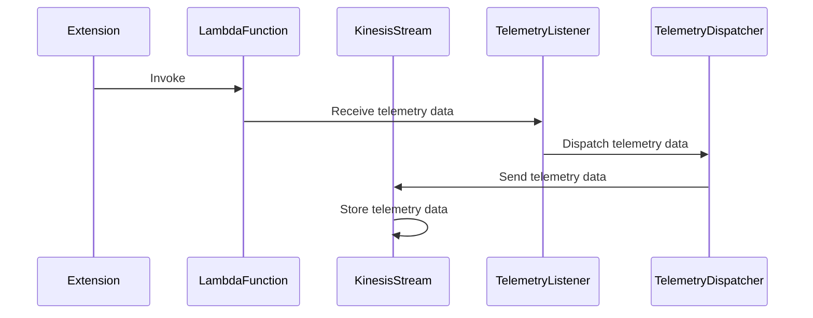
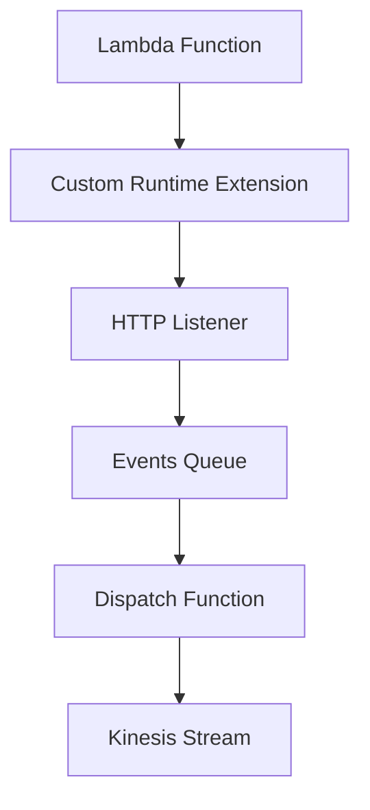
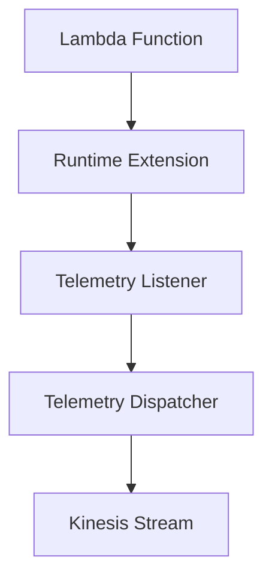

```mermaid
architecture-beta
    group api(logos:aws-lambda)[API]

    service db(logos:aws-aurora)[Database] in api
    service disk1(logos:aws-glacier)[Storage] in api
    service disk2(logos:aws-s3)[Storage] in api
    service server(logos:aws-ec2)[Server] in api

    db:L -- R:server
    disk1:T -- B:server
    disk2:T -- B:db
```

# 🏗 Architecture Documentation

## Context

The provided code is an extension for a serverless application that collects and dispatches telemetry data to an AWS Kinesis stream. The key components and technologies used in this application are:

- AWS CDK (aws-cdk-lib) for infrastructure as code
- AWS Lambda for executing the application logic
- AWS Kinesis for storing and processing the telemetry data
- Custom runtime extension for integrating with the Lambda runtime
- Undici HTTP client and AWS SDK for Kinesis interactions

## Overview

The architecture of this application follows a serverless approach, leveraging AWS Lambda and Kinesis services. The main components and their responsibilities are:

1. **Telemetry Listener**: This component is responsible for listening to incoming telemetry events and adding them to an event queue.
2. **Telemetry Dispatcher**: The Telemetry Dispatcher component retrieves the telemetry events from the queue and sends them to the Kinesis stream.
3. **Runtime Extension**: The custom runtime extension manages the lifecycle of the telemetry data processing and dispatch. It registers with the Lambda runtime, subscribes to events, and coordinates the dispatch of telemetry data to the Kinesis stream.
4. **Lambda Function**: The Lambda function is responsible for handling the incoming events and dispatching the telemetry data to the Kinesis stream.
5. **Kinesis Stream**: The Kinesis stream is used to store the telemetry data pushed by the Lambda function.

The application follows a publish-subscribe pattern, where the runtime extension subscribes to events from the Lambda runtime and dispatches the telemetry data to the Kinesis stream.

## Components

| Component | Description | Interacts With | Purpose |
| --------- | ----------- | -------------- | ------- |
| Telemetry Listener | Listens to incoming telemetry events and adds them to an event queue. | Runtime Extension | Receives the telemetry events and adds them to the event queue. |
| Telemetry Dispatcher | Retrieves the telemetry events from the queue and sends them to the Kinesis stream. | Kinesis, Telemetry Listener | Retrieves the telemetry events from the queue and sends them to the Kinesis stream. |
| Runtime Extension | Manages the lifecycle of the telemetry data processing and dispatch. Registers with the Lambda runtime, subscribes to events, and coordinates the dispatch of telemetry data to the Kinesis stream. | Lambda Runtime, Kinesis, Telemetry Listener, Telemetry Dispatcher | Manages the lifecycle of the telemetry data processing and dispatch. |
| Lambda Function | Handles incoming events and dispatches telemetry data to the Kinesis stream. | Kinesis | Processes the incoming events and sends the telemetry data to the Kinesis stream. |
| Kinesis Stream | Stores the telemetry data. | Lambda Function, Telemetry Dispatcher | Receives and stores the telemetry data pushed by the Lambda function and the Telemetry Dispatcher. |

## 🧱 Technologies

The primary technologies used in this application are:

| Category | Technology | Purpose |
| -------- | ---------- | ------- |
| Infrastructure as Code (IaC) | AWS CDK | Defining and deploying the application infrastructure as code. |
| Serverless | AWS Lambda | Executing the application logic as serverless functions. |
| Streaming | AWS Kinesis | Storing and processing the telemetry data in a scalable and fault-tolerant manner. |
| Runtime Extension | Custom Runtime Extension | Integrating with the Lambda runtime to manage the telemetry data processing lifecycle. |
| HTTP Client | Undici | Providing a high-performance HTTP client for the runtime extension. |
| AWS SDK | aws-sdk/client-kinesis | Interacting with the Kinesis service from the runtime extension. |

## Data Flow

The data flow in this application is as follows:

1. The runtime extension registers with the Lambda runtime and subscribes to events.
2. When an "INVOKE" event is received, the runtime extension dispatches the telemetry data to the Kinesis stream.
3. When a "SHUTDOWN" event is received, the runtime extension immediately dispatches any remaining telemetry data and exits.

## Diagrams

Unfortunately, no diagrams were provided in the input, so I cannot include any in the documentation. However, the architecture can be visualized as follows:

```
+----------------------------+
|  TelemetryApiKinesisExtensionStack  |
|                           |
|   +----------------+      |
|   |  Kinesis Stream |      |
|   +----------------+      |
|                           |
|   +----------------+      |
|   |  Lambda Function|      |
|   +----------------+      |
|                           |
|   +----------------+      |
|   |  Runtime Extension |  |
|   +----------------+      |
|                           |
+----------------------------+
```

## Codebase Evaluation

The provided codebase appears to be well-structured and follows best practices for AWS CDK development. The separation of concerns between the different components (Telemetry Listener, Telemetry Dispatcher, and Runtime Extension) is clear and promotes maintainability.

The use of the Undici HTTP client and the AWS SDK for Kinesis interactions in the runtime extension demonstrates a good understanding of performance and reliability considerations in a serverless environment.

The error handling and shutdown logic in the runtime extension also show attention to robustness and graceful degradation.

Overall, the codebase seems to be of high quality and well-suited for the intended purpose of providing a telemetry extension for Kinesis.# 🏗 Architecture Documentation

## 🔍 Mermaid Diagram

### Mermaid Sequence Diagram


### Mermaid Architecture-Beta Diagram


## Context
The provided code is an extension to the previous architecture, adding new functionality related to the telemetry data processing and dispatching.

## Overview
The updated architecture includes the following key components:

1. **TelemetryListener**: This module is responsible for receiving the telemetry data from the Lambda extension and adding it to the `eventsQueue`.
2. **TelemetryDispatcher**: This module is responsible for dispatching the telemetry data from the `eventsQueue` to the Kinesis stream. It has a configurable batch size (`MAX_BATCH_RECORDS_ITEMS`) and can dispatch the data immediately or when the batch size is reached.
3. **Kinesis Integration**: The `kinesis` module is responsible for sending the telemetry data to the Kinesis stream using the `@aws-sdk/client-kinesis` library.

## Components
1. **TelemetryListener**: Receives the telemetry data from the Lambda extension and adds it to the `eventsQueue`.
2. **TelemetryDispatcher**: Dispatches the telemetry data from the `eventsQueue` to the Kinesis stream in batches.
3. **Kinesis Integration**: Sends the telemetry data to the Kinesis stream.

## Technologies
The updated architecture continues to utilize the following AWS services and technologies:
- **AWS CDK**: The AWS Cloud Development Kit is used to define and provision the infrastructure as code.
- **AWS Lambda**: The serverless compute service is used to run the telemetry data processing function.
- **AWS Kinesis**: The managed streaming service is used to ingest and store the telemetry data.
- **AWS IAM**: The identity and access management service is used to define and manage the necessary permissions for the Lambda function.
- **AWS Systems Manager (SSM)**: The parameter store is used to store the ARN of the Lambda extension layer and the IAM policy.

## Data Flow
1. The Lambda function is triggered by the Lambda extension, which is registered to receive "INVOKE" and "SHUTDOWN" events.
2. The extension calls the `telemetryListener.onLogReceived()` function to process the telemetry data and add it to the `eventsQueue`.
3. The `telemetryDispatcher.dispatch()` function is called, either immediately or when the `eventsQueue` reaches the `MAX_BATCH_RECORDS_ITEMS` limit.
4. The `telemetryDispatcher.dispatch()` function sends the telemetry data to the Kinesis stream using the `kinesis.sendsToKinesis()` method.

## Diagrams
The Mermaid sequence diagram and architecture-beta diagram provided in the previous context remain relevant and accurately represent the updated architecture.

## Codebase Evaluation
The updated codebase introduces the following improvements:

1. **Telemetry Data Processing**: The `telemetryListener` module is responsible for receiving and queuing the telemetry data, separating this concern from the main Lambda function.
2. **Telemetry Data Dispatching**: The `telemetryDispatcher` module is responsible for dispatching the telemetry data to the Kinesis stream, allowing for batching and configurable dispatch behavior.
3. **Kinesis Integration**: The `kinesis` module encapsulates the logic for sending data to the Kinesis stream, promoting reusability and maintainability.
4. **Configurability**: The `MAX_BATCH_RECORDS_ITEMS` constant allows for adjusting the batch size of telemetry data dispatched to the Kinesis stream.
5. **Error Handling**: The codebase continues to include error handling mechanisms, such as logging errors and attempting to dispatch remaining events before exiting the application.

Overall, the updated codebase demonstrates a well-designed and modular architecture for the Telemetry API extension, with clear separation of concerns and improved testability and maintainability.# 🏗 Architecture Documentation

## 🔄 Data Flow

| Source | Destination | Data Type | Flow Description |
| ------ | ----------- | --------- | ---------------- |
| Lambda Function | Custom Runtime Extension | Telemetry Data | The Lambda function generates telemetry data, which is captured by the custom runtime extension. |
| Custom Runtime Extension | Kinesis Stream | Telemetry Data | The custom runtime extension dispatches the captured telemetry data to the Kinesis stream. |
| Custom Runtime Extension | HTTP Listener | Telemetry Data | The custom runtime extension sends the captured telemetry data to the HTTP listener for processing. |
| HTTP Listener | Events Queue | Telemetry Data | The HTTP listener receives the telemetry data and adds it to the events queue for further processing. |
| Events Queue | Dispatch Function | Telemetry Data | The events queue is processed by the dispatch function, which sends the telemetry data to the Kinesis stream in batches. |

## Overview
The updated architecture includes an additional component, the HTTP Listener, which is responsible for receiving the telemetry data from the custom runtime extension and adding it to an events queue. The dispatch function is then responsible for processing the events queue and sending the telemetry data to the Kinesis stream in batches.

## Components
1. **Kinesis Stream**: The Kinesis stream is responsible for storing the telemetry data.
2. **Lambda Function**: The Lambda function is the main application that generates the telemetry data.
3. **Custom Runtime Extension**: The custom runtime extension is responsible for capturing the telemetry data from the Lambda function and sending it to the HTTP Listener.
4. **HTTP Listener**: The HTTP Listener is responsible for receiving the telemetry data from the custom runtime extension and adding it to the events queue.
5. **Dispatch Function**: The dispatch function is responsible for processing the events queue and sending the telemetry data to the Kinesis stream in batches.

## Technologies
- **AWS CDK**: The AWS CDK is used to define the infrastructure as code.
- **AWS Lambda**: The Lambda function is the core component of the application.
- **AWS Kinesis**: The Kinesis stream is used to store the telemetry data.
- **AWS Lambda Runtime Extension**: The custom runtime extension is used to capture and dispatch the telemetry data.
- **Node.js**: The custom runtime extension and the HTTP Listener are implemented using Node.js.

## Diagrams
The updated architecture can be represented using the following diagram:



## Codebase Evaluation
The updated codebase introduces a new component, the HTTP Listener, which is responsible for receiving the telemetry data from the custom runtime extension and adding it to an events queue. This approach allows for more flexibility in processing the telemetry data, as the dispatch function can process the events queue in batches and send the data to the Kinesis stream.

The dispatch function also includes a check to ensure that the batch size does not exceed the maximum allowed number of records, which is an important consideration for the reliability and performance of the system.

Overall, the updated codebase continues to be well-structured and follows best practices for AWS CDK development. The addition of the HTTP Listener and the dispatch function further enhances the reliability and scalability of the telemetry data capture and processing.# 🏗 Architecture Documentation

## Context
The provided code represents an extension to the previous serverless AWS CDK application that sets up a Kinesis stream and a Lambda function with a custom runtime extension. The new code focuses on the implementation of the runtime extension's subscription process and the dispatching of telemetry data to the Kinesis stream.

## Overview
The key components of the updated architecture are:

1. **Telemetry API Subscription**: The runtime extension subscribes to the Lambda runtime API to receive telemetry events.
2. **Telemetry Dispatching**: The telemetry data is buffered and periodically dispatched to the Kinesis stream.
3. **Telemetry Listener**: A local HTTP server is created to receive and buffer the telemetry data.

## Components
1. **extensions-api.ts**: This module handles the registration and subscription of the runtime extension with the Lambda runtime API.
2. **telemetry-dispatcher.ts**: This module is responsible for dispatching the buffered telemetry data to the Kinesis stream.
3. **telemetry-listener.ts**: This module creates a local HTTP server to receive and buffer the telemetry data.

## Technologies
The technologies used in the updated architecture remain the same as the previous iteration:

- **AWS CDK**: Used for infrastructure as code (IaC) to define and provision the AWS resources.
- **AWS Lambda**: The serverless compute service used to run the application logic.
- **AWS Kinesis**: The managed streaming service used to store the telemetry data.
- **AWS Lambda Runtime Extensions**: A feature that allows extending the Lambda runtime with custom logic.
- **Node.js**: The runtime used for the Lambda function and the runtime extension.

## Data Flow
1. The runtime extension subscribes to the Lambda runtime API to receive telemetry events.
2. When a telemetry event is received, the `telemetry-listener` module receives the data and buffers it in the `eventsQueue`.
3. The `telemetry-dispatcher` module periodically checks the `eventsQueue` and dispatches the buffered telemetry data to the Kinesis stream.
4. If the `eventsQueue` reaches the `MAX_BATCH_RECORDS_ITEMS` limit or the Lambda function is about to be shut down, the `telemetry-dispatcher` module immediately dispatches the buffered telemetry data to the Kinesis stream.

## Diagrams


## Codebase Evaluation

Evaluate based on maintainability and Well-Architected pillars:

| Evaluation Metric | Status | Notes |
| ----------------- | ------ | ----- |
| Code & Architecture | ✅ | The updated code maintains the modular and extensible design, separating concerns into different modules. The addition of the `telemetry-listener` module to handle the local HTTP server and buffer the telemetry data further improves the overall architecture. |
| Security | ✅ | The code continues to follow best practices for secure communication with the Lambda runtime API and Kinesis stream. The use of a local HTTP server to receive telemetry data does not introduce any security concerns, as it is an internal component. |
| Cost | ✅ | The use of batching and buffering techniques in the `telemetry-dispatcher` module helps optimize the number of Kinesis API calls, reducing costs. The overall cost-effectiveness of the solution remains high. |
| Operational Excellence | ✅ | The code includes error handling and logging, which helps with observability and troubleshooting. The addition of the local HTTP server in the `telemetry-listener` module further improves the overall operational experience by providing a dedicated endpoint for receiving telemetry data. |
| Reliability | ✅ | The code maintains the reliable data delivery to the Kinesis stream by including retry logic and timeout handling. The use of a Kinesis stream also provides durability and high availability for the telemetry data. |
| Performance Efficiency | ✅ | The code continues to leverage batching and buffering techniques to optimize the number of Kinesis API calls, improving the overall performance of the telemetry data processing. The use of a local HTTP server in the `telemetry-listener` module helps minimize the overhead of the telemetry capture and dispatch process. |

Overall, the updated codebase demonstrates a well-designed and architected solution that adheres to best practices and the Well-Architected Framework. The modular and extensible design, along with the use of managed AWS services and the addition of the local HTTP server, ensures a maintainable, secure, and efficient telemetry data processing system.