# 🏗 Architecture Documentation

```mermaid
architecture-beta
    group api(logos:aws-lambda)[API]

    service db(logos:aws-aurora)[Database] in api
    service disk1(logos:aws-glacier)[Storage] in api
    service disk2(logos:aws-s3)[Storage] in api
    service server(logos:aws-ec2)[Server] in api

    db:L -- R:server
    disk1:T -- B:server
    disk2:T -- B:db
```

## Context

The provided codebase appears to be an AWS Lambda extension that integrates with the AWS Kinesis stream. The extension is designed to capture and dispatch telemetry data from the Lambda function to the Kinesis stream. This extension can be used to enhance the observability and monitoring capabilities of the Lambda-based application.

The key services, SDKs, and tools used in this codebase include:

- AWS Lambda
- AWS Kinesis
- AWS SDK for JavaScript (aws-sdk)
- Undici (HTTP client)
- AWS CDK (Cloud Development Kit) for infrastructure as code

## Overview

The architecture of this system consists of the following key components:

1. **Lambda Extension**: The main component of the system is the Lambda extension, which is responsible for registering with the Lambda runtime, subscribing to the telemetry API, and dispatching the collected telemetry data to the Kinesis stream.

2. **Telemetry Listener**: This component is a simple HTTP server that listens for incoming telemetry data from the Lambda runtime and stores it in a queue.

3. **Telemetry Dispatcher**: This component is responsible for periodically flushing the telemetry data queue and sending the data to the Kinesis stream.

4. **Kinesis Stream**: The Kinesis stream is the final destination for the telemetry data, where it can be further processed, analyzed, or stored for long-term retention.

The key architectural patterns used in this system are:

- **Event-Driven Architecture (EDA)**: The system uses an event-driven approach, where the Lambda extension listens for events from the Lambda runtime and dispatches the telemetry data accordingly.
- **Serverless**: The system is built using serverless technologies, such as AWS Lambda and Kinesis, which simplify the infrastructure and reduce operational overhead.

## Components

| Component | Description | Interacts With | Purpose |
| --------- | ----------- | -------------- | ------- |
| Lambda Extension | Registers with the Lambda runtime, subscribes to the telemetry API, and dispatches telemetry data to the Telemetry Dispatcher. | Telemetry Listener, Telemetry Dispatcher | Collects and forwards telemetry data from the Lambda function. |
| Telemetry Listener | Listens for incoming telemetry data from the Lambda runtime and stores it in a queue. | Lambda Extension | Receives and buffers the telemetry data. |
| Telemetry Dispatcher | Periodically flushes the telemetry data queue and sends the data to the Kinesis stream. | Kinesis Stream | Dispatches the collected telemetry data to the Kinesis stream. |
| Kinesis Stream | The final destination for the telemetry data, where it can be further processed, analyzed, or stored. | Telemetry Dispatcher | Receives and stores the telemetry data. |

## 🔄 Data Flow

| Source | Destination | Data Type | Flow Description |
| ------ | ----------- | --------- | ---------------- |
| Lambda Function | Telemetry Listener | Telemetry Data | The Lambda extension collects telemetry data from the Lambda function and sends it to the Telemetry Listener. |
| Telemetry Listener | Telemetry Dispatcher | Telemetry Data | The Telemetry Listener buffers the incoming telemetry data and passes it to the Telemetry Dispatcher. |
| Telemetry Dispatcher | Kinesis Stream | Telemetry Data | The Telemetry Dispatcher periodically flushes the telemetry data queue and sends the data to the Kinesis stream. |

## 🔍 Mermaid Diagram

## 🧱 Technologies

| Category | Technology | Purpose |
| -------- | ---------- | ------- |
| Cloud Platform | AWS | Provides the core infrastructure services (Lambda, Kinesis) used in the system. |
| SDK | AWS SDK for JavaScript | Enables interaction with AWS services from the Node.js codebase. |
| HTTP Client | Undici | Provides a high-performance HTTP client for making requests to the Lambda runtime API. |
| Infrastructure as Code | AWS CDK | Allows defining the infrastructure components (Kinesis stream, Lambda function, etc.) programmatically. |

## 📝 Codebase Evaluation

### Code Quality & Architecture

The codebase appears to be well-structured and modular, with clear separation of concerns between the different components (extension, listener, dispatcher, and Kinesis integration). The use of the AWS CDK for infrastructure as code is a good practice, as it promotes maintainability and reusability.

However, there are a few areas that could be improved:

1. **Testability**: The codebase lacks unit tests, which could make it more difficult to ensure the reliability and correctness of the system.
2. **Error Handling**: The error handling could be more robust, with better logging and error reporting to aid in troubleshooting and debugging.
3. **Configurability**: Some of the configuration values, such as the Kinesis stream name and the buffer timeout, are hardcoded. It would be better to make these configurable, either through environment variables or a separate configuration file.

### Security, Cost, and Operational Excellence

| Evaluation Metric | Status | Notes |
| ----------------- | ------ | ----- |
| Resource tagging | ✅ | The Kinesis stream and Lambda function are properly tagged. |
| WAF usage if required | N/A | Not applicable in this case, as the system does not expose a public-facing API. |
| Secrets stored in Secret Manager | ✅ | The Kinesis stream ARN and the managed policy ARN are stored in the SSM Parameter Store, which is a good practice. |
| Shared resource identifiers stored in Parameter Store | ✅ | The Kinesis stream ARN and the managed policy ARN are stored in the SSM Parameter Store. |
| Serverless functions memory/time appropriate | ✅ | The Lambda function appears to have appropriate memory and timeout settings. |
| Log retention policies defined | ✅ | The Lambda function's log group has a retention policy of 1 day, which is a reasonable default. |
| Code quality checks (Linter/Compiler) | ⚠️ | The codebase does not appear to have any automated code quality checks, such as linting or type checking. |
| Storage lifecycle policies applied | N/A | Not applicable in this case, as the system does not use any long-term storage. |
| Container image scanning & lifecycle policies | N/A | Not applicable, as the system does not use container images. |

### Suggestions for Improvement

1. **Security Posture**:
   - Implement automated code quality checks, such as linting and type checking, to ensure the codebase adheres to best practices and reduces the risk of security vulnerabilities.
   - Consider using AWS Secrets Manager to store sensitive information, such as the Kinesis stream name, instead of the SSM Parameter Store.

2. **Operational Efficiency**:
   - Implement unit tests to improve the reliability and maintainability of the codebase.
   - Enhance the error handling and logging mechanisms to provide better visibility into the system's behavior and facilitate troubleshooting.

3. **Cost Optimization**:
   - Review the Kinesis stream configuration to ensure that the shard count and other settings are optimized for the expected workload, to avoid over-provisioning and unnecessary costs.
   - Investigate the possibility of using AWS Lambda destinations to directly send the telemetry data to Kinesis, instead of using a separate Telemetry Dispatcher component, which could simplify the architecture and reduce operational overhead.

4. **Infrastructure Simplicity**:
   - Consider making the Kinesis stream name and other configuration values more easily configurable, either through environment variables or a separate configuration file, to improve the flexibility and reusability of the system.
   - Explore the possibility of using AWS Lambda destinations to directly send the telemetry data to Kinesis, which could simplify the overall architecture.
