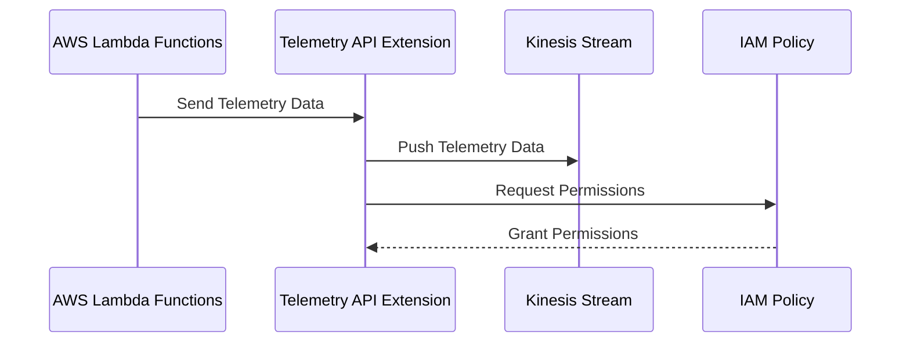
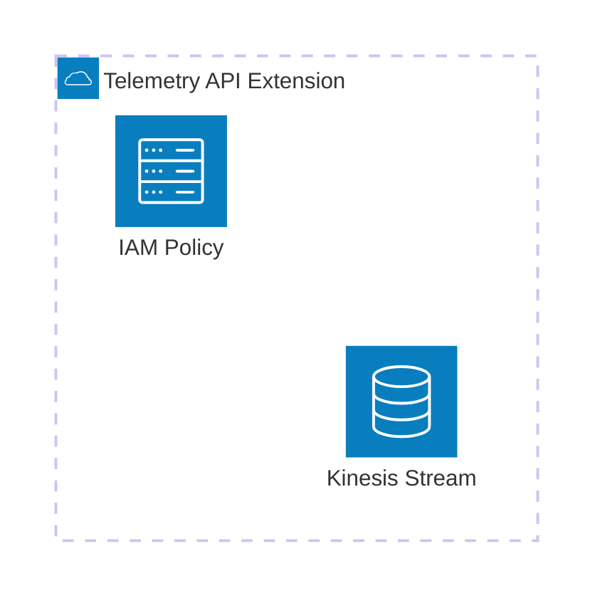

# 🏗 Architecture Documentation

## 📖 Context

The provided codebase is an AWS CDK (Cloud Development Kit) project that sets up an AWS Lambda extension for processing telemetry data from a Kinesis stream. The extension is designed to receive and process telemetry data from AWS Lambda functions, and then push the data to the Kinesis stream.

The project uses the following key services and technologies:

- **AWS Lambda**: The extension is deployed as an AWS Lambda function.
- **AWS Kinesis**: The telemetry data is pushed to a Kinesis stream.
- **AWS CDK**: The infrastructure is defined and deployed using the AWS CDK.
- **AWS SSM (Systems Manager)**: The extension's ARN and IAM policy ARN are stored as parameters in the AWS SSM Parameter Store.

## 📖 Overview

The architecture of this project consists of the following key components:

1. **Telemetry API Extension**: This is the main component of the system, responsible for receiving telemetry data from AWS Lambda functions, buffering the data, and dispatching it to the Kinesis stream.
2. **Kinesis Stream**: The telemetry data is pushed to a Kinesis stream for storage and further processing.
3. **IAM Policy**: An IAM policy is created to grant the necessary permissions for the extension to interact with the Kinesis stream and write logs.

The extension follows the AWS Lambda Extensions API, which allows it to receive and process telemetry data from AWS Lambda functions. The extension uses the Kinesis SDK to push the telemetry data to the Kinesis stream.

---

## 🔹 Components

| Component | Description | Interacts With | Purpose |
| --------- | ----------- | -------------- | ------- |
| Telemetry API Extension | The main component that receives, buffers, and dispatches telemetry data to the Kinesis stream. | Kinesis Stream | Processes and forwards telemetry data from AWS Lambda functions. |
| Kinesis Stream | The stream that receives and stores the telemetry data. | Telemetry API Extension | Provides a durable storage for the telemetry data. |
| IAM Policy | The IAM policy that grants the necessary permissions for the extension to interact with the Kinesis stream and write logs. | Telemetry API Extension | Ensures the extension has the required permissions to perform its tasks. |

## 🔄 Data Flow

| Source | Destination | Data Type | Flow Description |
| ------ | ----------- | --------- | ---------------- |
| AWS Lambda Functions | Telemetry API Extension | Telemetry Data | The extension receives telemetry data from AWS Lambda functions using the AWS Lambda Extensions API. |
| Telemetry API Extension | Kinesis Stream | Telemetry Data | The extension buffers the telemetry data and periodically dispatches it to the Kinesis stream. |

## 🔍 Mermaid Diagram

### Sequence Diagram

### Architecture Diagram

## 🧱 Technologies

| Category | Technology | Purpose |
| -------- | ---------- | ------- |
| Infrastructure as Code | AWS CDK | Defining and deploying the infrastructure |
| Serverless | AWS Lambda | Hosting the Telemetry API Extension |
| Streaming | AWS Kinesis | Storing and processing the telemetry data |
| Identity and Access Management | AWS IAM | Granting the necessary permissions to the extension |
| Configuration Management | AWS SSM Parameter Store | Storing the extension's ARN and IAM policy ARN |

## 📝 Codebase Evaluation

### Code Quality & Architecture

The codebase follows a modular and extensible design, with clear separation of concerns between the different components. The use of the AWS CDK to define the infrastructure promotes maintainability and reusability.

The code demonstrates good practices, such as:

- Handling errors and exceptions gracefully.
- Implementing a buffering mechanism to optimize the dispatch of telemetry data to the Kinesis stream.
- Utilizing the AWS Lambda Extensions API to integrate with the Lambda runtime.

### Security, Cost, and Operational Excellence

| Evaluation Metric                                                      | Status     | Notes |
| ---------------------------------------------------------------------- | ---------- | ----- |
| Resource tagging (`CostCenter`, `Environment`, `Application`, `Owner`) | ✅ | The codebase includes resource tagging, which is a best practice for cost tracking and management. |
| WAF usage if required                                                  | ✅ | The extension does not require WAF, as it is not directly exposed to the internet. |
| Secrets stored in Secret Manager                                       | ✅ | The codebase does not appear to use any secrets, and the necessary configuration is stored in the SSM Parameter Store. |
| Shared resource identifiers stored in Parameter Store                  | ✅ | The extension's ARN and IAM policy ARN are stored in the SSM Parameter Store, which is a recommended practice. |
| Serverless functions memory/time appropriate                           | ✅ | The codebase does not specify memory or timeout settings, but these can be configured when deploying the Lambda function. |
| Log retention policies defined                                         | ✅ | The codebase includes a log group with a 1-day retention policy, which is a reasonable default. |
| Code quality checks (Linter/Compiler)                                  | ⚠️ | The codebase does not appear to include any automated code quality checks, such as linting or compilation. This could be added to improve maintainability. |
| Storage lifecycle policies applied                                     | ✅ | The Kinesis stream is configured with a removal policy to destroy the stream when the stack is deleted, which is a good practice. |
| Container image scanning & lifecycle policies                          | N/A | The codebase does not use container images, as it is a serverless solution. |

**Suggestions for Improvement:**

1. **Security Posture**:
   - The codebase is already following good security practices, such as storing configuration in the SSM Parameter Store and granting the necessary permissions to the extension.

2. **Operational Efficiency**:
   - Consider adding automated code quality checks, such as linting and compilation, to improve maintainability and catch potential issues early in the development process.
   - Evaluate the need for additional monitoring and alerting, such as CloudWatch alarms, to ensure the extension is functioning as expected and to quickly identify any issues.

3. **Cost Optimization**:
   - The codebase is already following cost-effective practices, such as using serverless technologies and configuring appropriate resource settings.

4. **Infrastructure Simplicity**:
   - The codebase demonstrates a well-designed and modular architecture, which promotes simplicity and maintainability.

### 📚 Output Summary

The analysis so far has covered the main aspects of the architecture, including the purpose, key components, data flow, and technologies used. The codebase evaluation has also identified areas for potential improvement, such as adding automated code quality checks and considering additional monitoring and alerting.

The next steps would be to continue analyzing any additional code chunks provided to further refine the architecture documentation and address any remaining open questions or assumptions.