# 🏗 Architecture Documentation

```mermaid
architecture-beta
    group api(logos:aws-lambda)[API]

    service db(logos:aws-aurora)[Database] in api
    service disk1(logos:aws-glacier)[Storage] in api
    service disk2(logos:aws-s3)[Storage] in api
    service server(logos:aws-ec2)[Server] in api

    db:L -- R:server
    disk1:T -- B:server
    disk2:T -- B:db
```

## Context

The provided source code appears to be an AWS CDK (Cloud Development Kit) application that sets up an AWS Lambda extension for processing telemetry data from a Kinesis stream. The extension is designed to receive and process events from the Lambda runtime, and then dispatch the events to the Kinesis stream.

The key services, APIs, and tools used in this application include:

- AWS CDK: Used for defining the infrastructure as code.
- AWS Lambda: The serverless compute service used to run the extension.
- AWS Kinesis: The managed streaming service used to store the telemetry data.
- AWS SSM (Systems Manager): Used to store the ARN of the Lambda extension and the managed policy.
- AWS IAM: Used to define the managed policy for the Lambda extension.
- Undici: An HTTP client used to handle the HTTP requests and responses for the extension.
- AWS SDK for JavaScript: Used to interact with AWS services (Kinesis, Lambda, IAM, SSM).

## Overview

The architecture of this application can be described as follows:

- **Components and Responsibilities**:
  - **TelemetryApiKinesisExtensionStack**: The main CDK stack that sets up the necessary infrastructure, including the Kinesis stream, Lambda extension, and associated resources.
  - **TelemetryApiExtension**: The Lambda extension that receives events from the Lambda runtime, processes the telemetry data, and dispatches it to the Kinesis stream.
  - **TelemetryListener**: The component that starts the listener for the Lambda extension and manages the event queue.
  - **TelemetryDispatcher**: The component responsible for dispatching the telemetry data to the Kinesis stream.

- **Interactions**:
  - The Lambda extension registers itself with the Lambda runtime and subscribes to receive events.
  - When an event is received, the extension processes the telemetry data and dispatches it to the Kinesis stream.
  - The Kinesis stream is used to store the telemetry data for further processing or analysis.

- **Patterns**:
  - The application uses the Lambda extension pattern to integrate with the Lambda runtime and process telemetry data.
  - The application also uses the Kinesis stream to store the telemetry data, which can be considered a form of the event-driven architecture pattern.

## Components

| Component | Description | Interacts With | Purpose |
| --------- | ----------- | -------------- | ------- |
| TelemetryApiKinesisExtensionStack | The main CDK stack that sets up the necessary infrastructure | AWS Kinesis, AWS Lambda, AWS IAM, AWS SSM | Defines the infrastructure for the telemetry API extension |
| TelemetryApiExtension | The Lambda extension that receives events from the Lambda runtime, processes the telemetry data, and dispatches it to the Kinesis stream | AWS Lambda Runtime, TelemetryListener, TelemetryDispatcher | Processes the telemetry data and dispatches it to the Kinesis stream |
| TelemetryListener | The component that starts the listener for the Lambda extension and manages the event queue | AWS Lambda Runtime, TelemetryApiExtension | Manages the event queue and provides the listener URI for the extension |
| TelemetryDispatcher | The component responsible for dispatching the telemetry data to the Kinesis stream | AWS Kinesis | Dispatches the telemetry data to the Kinesis stream |

## 🧱 Technologies

| Category | Technology | Purpose |
| -------- | ---------- | ------- |
| Infrastructure as Code | AWS CDK | Defines the infrastructure for the telemetry API extension |
| Serverless Computing | AWS Lambda | Runs the telemetry API extension |
| Streaming | AWS Kinesis | Stores the telemetry data |
| Identity and Access Management | AWS IAM | Manages the permissions for the telemetry API extension |
| Configuration Management | AWS SSM | Stores the ARN of the Lambda extension and the managed policy |
| HTTP Client | Undici | Handles the HTTP requests and responses for the extension |
| AWS SDK | AWS SDK for JavaScript | Interacts with AWS services (Kinesis, Lambda, IAM, SSM) |

The new code provided appears to be related to the `TelemetryListener` component, which is responsible for starting the listener for the Lambda extension and managing the event queue.

The key changes and additions are:

1. The `subscribe` function in the `TelemetryListener` module, which is responsible for subscribing the Lambda extension to the Lambda runtime and setting up the event listener.
2. The `dispatch` function in the `TelemetryDispatcher` module, which is responsible for dispatching the telemetry data to the Kinesis stream in batches.
3. The `start` function in the `TelemetryListener` module, which creates an HTTP server to receive the telemetry data from the Lambda runtime and adds it to the event queue.
4. The `telemetryLogModel` and related types, which define the structure of the telemetry data received from the Lambda runtime.

These changes and additions further enhance the functionality of the application by:

1. Providing a way to subscribe the Lambda extension to the Lambda runtime and set up the event listener.
2. Implementing a batching mechanism to dispatch the telemetry data to the Kinesis stream, which can improve performance and reduce the number of API calls.
3. Creating an HTTP server to receive the telemetry data from the Lambda runtime and manage the event queue.
4. Defining the structure of the telemetry data, which can help with processing and analysis.

Overall, the new code strengthens the architecture of the application by adding more robust event handling and data dispatching capabilities.# 🏗 Architecture Documentation

## 🔍 Mermaid Diagram

* Following two diagrams must be included in documentation:

  1. As a most important requirement: A Mermaid sequence diagram showing component interactions.
    * Consider Providing the sequence diagram representing modular components in the codebase.
  2. As a secondary important requirement: A Mermaid architecture-beta diagram (example shown below):
    * consider the format `component id(icon)[title]` where component is group or service.
    * consider using infrastructure components in diagram
    * consider grouping services in a group always.
    * include the spaces and dashes in id and title
    * use icon names per detected provider of each service
    * prevent all overlaps in the diagram by using the appropriate `edge direction (T/B/L/R)` and `for each part of diagram while connecting services.

* Avoid any assumptions realated to Context, technologies or Architecture best practices.

## 🗒️ Architecture Summary

The provided code represents an AWS CDK (Cloud Development Kit) stack that deploys a Kinesis-based telemetry extension for a Lambda function. The key components and their interactions are as follows:

1. **TelemetryApiKinesisExtensionStack**: This is the main CDK stack that creates the necessary resources for the telemetry extension.
   - It creates a Kinesis stream named `telemetry-kinesis-stream` to store the telemetry data.
   - It creates a Lambda layer named `kinesis-telemetry-api-extension` that contains the extension code.
   - It creates a Lambda function named `${this.stackName}-temp-nodejs20-function` that uses the extension layer.
   - It creates an IAM managed policy named `${props?.extensionName}-runtime` that grants the necessary permissions to the Lambda function to interact with the Kinesis stream and CloudWatch logs.
   - It stores the ARNs of the extension layer and the IAM policy in SSM Parameter Store for later use.

2. **telemetry-api.ts**: This file contains the code for the telemetry extension, which is responsible for registering the extension with the Lambda runtime, receiving events, and dispatching telemetry data to the Kinesis stream.
   - The `register()` function registers the extension with the Lambda runtime.
   - The `next()` function retrieves the next event from the Lambda runtime.
   - The `subscribe()` function subscribes the extension to receive telemetry data from the Lambda runtime.

3. **telemetry-dispatcher.ts**: This file contains the code for dispatching the telemetry data to the Kinesis stream.
   - The `sendsToKinesis()` function sends the telemetry data to the Kinesis stream.

4. **telemetry-listener.ts**: This file contains the code for the telemetry listener, which receives the telemetry data from the Lambda runtime and adds it to a queue.
   - The `start()` function starts the telemetry listener and returns the listener URI.
   - The `eventsQueue` property holds the queue of telemetry events.

5. **extensions-api.ts**: This file contains the code for interacting with the Lambda runtime extension API.
   - The `register()` function registers the extension with the Lambda runtime.
   - The `next()` function retrieves the next event from the Lambda runtime.

The overall architecture consists of a Lambda function that uses the telemetry extension to collect and dispatch telemetry data to a Kinesis stream. The extension is deployed as a Lambda layer, and the necessary permissions are granted to the Lambda function through an IAM managed policy.

## 🔑 Key Design Decisions

1. **Kinesis Stream**: The use of a Kinesis stream to store the telemetry data provides a scalable and durable solution for handling the telemetry data.
2. **Lambda Layer**: The telemetry extension is deployed as a Lambda layer, which allows for easy reuse and versioning of the extension code.
3. **IAM Managed Policy**: The use of an IAM managed policy to grant the necessary permissions to the Lambda function ensures that the permissions are centrally managed and can be easily updated if needed.
4. **SSM Parameter Store**: Storing the ARNs of the extension layer and the IAM policy in the SSM Parameter Store allows for easy retrieval and use of these values in other parts of the application.
5. **Telemetry Listener and Dispatcher**: The separation of the telemetry listener and dispatcher components allows for better modularity and testability of the code.

## 🧠 Potential Improvements

1. **Error Handling**: The code could be improved by adding more robust error handling, such as retrying failed Kinesis record submissions and handling other potential errors that may occur during the extension's execution.
2. **Monitoring and Alerting**: Implementing monitoring and alerting mechanisms, such as CloudWatch alarms, could help detect and respond to issues with the telemetry extension or the Kinesis stream.
3. **Performance Optimization**: The code could be analyzed for potential performance bottlenecks, such as the Kinesis client configuration or the buffer size and timeout settings, and optimized accordingly.
4. **Automated Testing**: Implementing automated tests, such as unit tests and integration tests, could help ensure the reliability and maintainability of the telemetry extension.
5. **Deployment Automation**: Automating the deployment of the telemetry extension, such as through a CI/CD pipeline, could improve the consistency and reliability of the deployment process.

## 🗒️ Updated Architecture Summary

The new code provided adds additional functionality to the telemetry extension, specifically related to the telemetry listener and dispatcher components.

1. **telemetry-listener.ts**:
   - The `start()` function now creates an HTTP server that listens for POST requests on the specified host and port.
   - When a POST request is received, the `onLogReceived()` function is called, which parses the request body and adds the telemetry data to the `eventsQueue`.

2. **telemetry-dispatcher.ts**:
   - The `dispatch()` function now checks the length of the `pendingItems` array and dispatches the telemetry data to the Kinesis stream if the array length meets the `MAX_BATCH_RECORDS_ITEMS` threshold or if the `immediate` parameter is set to `true`.
   - The function creates a copy of the `pendingItems` array, removes the dispatched items from the original array, and then sends the data to the Kinesis stream using the `kinesis.sendsToKinesis()` function.

These updates enhance the telemetry extension by providing a dedicated listener component to receive and queue the telemetry data, and a dispatcher component to efficiently send the data to the Kinesis stream in batches. This separation of concerns improves the modularity and testability of the codebase.

## 🔑 Updated Key Design Decisions

6. **Telemetry Listener**: The addition of the telemetry listener component, which receives and queues the telemetry data, improves the overall architecture by separating the concerns of data reception and data dispatch.
7. **Telemetry Dispatcher**: The telemetry dispatcher component, which sends the telemetry data to the Kinesis stream in batches, helps optimize the performance and efficiency of the telemetry data processing.

## 🧠 Updated Potential Improvements

6. **Backpressure Handling**: The current implementation of the telemetry listener and dispatcher may not handle high-volume telemetry data effectively. Implementing backpressure mechanisms, such as limiting the size of the `eventsQueue` or using a bounded buffer, could help prevent data loss and improve the overall reliability of the system.
7. **Asynchronous Dispatching**: The current synchronous dispatching of telemetry data to the Kinesis stream may impact the performance of the Lambda function. Exploring asynchronous dispatching mechanisms, such as using a message queue or a serverless workflow, could help decouple the telemetry processing from the main Lambda function execution.# 🏗 Architecture Documentation

## 🔄 Data Flow

* Use a table to explain how data moves within the system components:

| Source | Destination | Data Type | Flow Description |
| ------ | ----------- | --------- | ---------------- |
| Lambda Function | Kinesis Stream | JSON | The Lambda function sends telemetry data in JSON format to the Kinesis stream named "telemetry-kinesis-stream". |
| Kinesis Stream | Lambda Function | JSON | The Lambda function receives telemetry data in JSON format from the Kinesis stream. |
| Lambda Extension | HTTP Listener | JSON | The Lambda extension sends telemetry data in JSON format to the HTTP listener running on the local machine. |
| HTTP Listener | Kinesis Dispatcher | JSON | The HTTP listener passes the received telemetry data to the Kinesis dispatcher for further processing. |
| Kinesis Dispatcher | Kinesis Stream | JSON | The Kinesis dispatcher sends the telemetry data in batches to the Kinesis stream. |

## 🗃️ Components

### AWS Lambda Function
- The Lambda function is responsible for processing and sending telemetry data to the Kinesis stream.
- The function is written in Node.js and uses the `aws-sdk` and `undici` libraries.
- The function is deployed as a Lambda layer, which can be used by other Lambda functions.
- The function is configured to use the latest Node.js runtime (currently 22.x).
- The function logs its activity to CloudWatch Logs for debugging and monitoring purposes.

### AWS Kinesis Stream
- The Kinesis stream is used to store the telemetry data sent by the Lambda function and the Kinesis dispatcher.
- The stream is configured with a single shard and a retention period of 1 day.
- The stream is set to be automatically deleted when the stack is deleted, to avoid leaving unused resources.

### AWS IAM
- The Lambda function is granted the necessary permissions to write to the Kinesis stream and to create and write to CloudWatch Logs.
- These permissions are managed through an IAM managed policy, which is attached to the Lambda function's execution role.
- The policy allows the `kinesis:PutRecord`, `kinesis:PutRecords`, `logs:CreateLogGroup`, `logs:CreateLogStream`, and `logs:PutLogEvents` actions.

### AWS SSM Parameter Store
- Two parameters are stored in the SSM Parameter Store:
  1. The ARN of the Lambda layer that contains the telemetry extension.
  2. The ARN of the IAM managed policy that grants the necessary permissions to the Lambda function.
- These parameters can be used by other parts of the system to access the telemetry extension and its associated permissions.

### Lambda Extension
- The Lambda extension is responsible for collecting and sending telemetry data to the HTTP listener.
- The extension subscribes to the Telemetry API to receive function invocation events.
- The extension sends the collected telemetry data to the HTTP listener running on the local machine.

### HTTP Listener
- The HTTP listener is a local server that receives the telemetry data from the Lambda extension.
- The listener processes the received data and passes it to the Kinesis dispatcher for further processing.
- The listener is running on the local machine, listening on the `sandbox:4243` endpoint.

### Kinesis Dispatcher
- The Kinesis dispatcher is responsible for batching and sending the telemetry data to the Kinesis stream.
- The dispatcher receives the telemetry data from the HTTP listener and buffers it until a certain threshold is reached (e.g., maximum number of items or timeout).
- The dispatcher then sends the batched data to the Kinesis stream.

## 🔍 Observability

- The Lambda function logs its activity to CloudWatch Logs, which can be used for debugging and monitoring purposes.
- The Kinesis stream can be monitored using CloudWatch metrics, such as the number of records put, the number of failed records, and the stream's capacity utilization.
- The HTTP listener and the Kinesis dispatcher can log their activity to help with debugging and monitoring the overall system.

## 🔒 Security

- The Lambda function is granted the minimum necessary permissions to perform its tasks, using the IAM managed policy.
- The Kinesis stream is set to be automatically deleted when the stack is deleted, to avoid leaving unused resources.
- The Lambda function uses the `undici` library to configure the HTTP agent with appropriate timeouts, to ensure reliable connections to the Kinesis stream.
- The HTTP listener is running on the local machine and is not exposed to the internet, which helps to mitigate potential security risks.

## 🚀 Deployment

- The entire architecture is defined as an AWS CDK stack, which can be deployed using the AWS CDK CLI.
- The stack includes the Lambda function, the Kinesis stream, the IAM managed policy, and the SSM parameters.
- The Lambda function's code is packaged as a Lambda layer, which can be easily updated and deployed independently of the stack.
- The Lambda extension is also packaged as a separate component, which can be deployed and updated independently.
- The HTTP listener and the Kinesis dispatcher are part of the Lambda extension and are deployed together with the extension.# 🏗 Architecture Documentation

## 📝 Codebase Evaluation

Evaluate based on maintainability and Well-Architected pillars:

* Code & Architecture:
  - The code appears to be well-structured and follows best practices for AWS Lambda runtime extension development.
  - The use of modular design, with separate modules for Kinesis, telemetry, and subscription handling, promotes maintainability and extensibility.
  - The code is well-documented and follows a consistent coding style.
  - There are no obvious signs of tight coupling or complex anti-patterns.

* Security:
  ✅ The code does not expose any sensitive information or make use of hardcoded credentials.
  ✅ The code follows security best practices, such as using the `fetch` API with appropriate headers and request body.

* Cost:
  ✅ The code optimizes costs by batching Kinesis records and limiting the number of records per batch.
  ✅ The code does not create any long-running resources that could incur unnecessary costs.

* Operational Excellence:
  ✅ The code includes error handling and logging to help with operational visibility and troubleshooting.
  ✅ The code uses the AWS Lambda runtime extension pattern, which helps with the operational aspects of the application.
  ✅ The code includes a custom HTTP server to receive telemetry data, which can be useful for monitoring and observability.

| Evaluation Metric | Status | Notes |
| ----------------- | ------ | ----- |
| Code & Architecture | ✅ | Well-structured, modular, and maintainable code. |
| Security | ✅ | Secure API usage and no sensitive information exposure. |
| Cost | ✅ | Cost-optimized through batching and resource management. |
| Operational Excellence | ✅ | Includes error handling, logging, and custom telemetry server. |