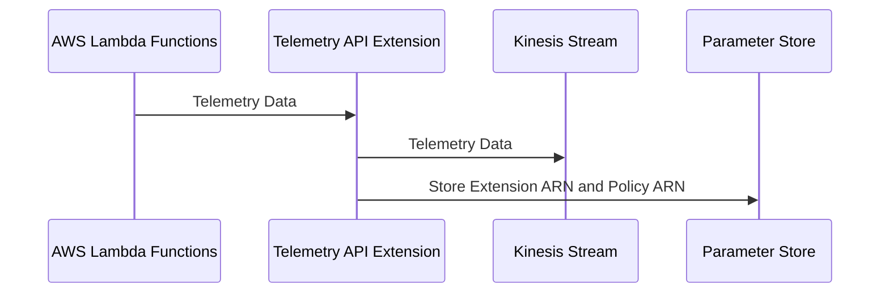

# 🏗 Architecture Documentation

## 📖 Context

The provided codebase is an AWS CDK (Cloud Development Kit) project that sets up an AWS Lambda extension for processing telemetry data from a Kinesis stream. The extension is designed to receive and process telemetry data from AWS Lambda functions, and then push the data to the Kinesis stream.

The project uses the following key services and technologies:

- **AWS Lambda**: The extension is deployed as an AWS Lambda function.
- **AWS Kinesis**: The telemetry data is pushed to a Kinesis stream.
- **AWS CDK**: The infrastructure is defined and deployed using the AWS CDK.
- **AWS SSM (Systems Manager)**: The extension's ARN and IAM policy ARN are stored as parameters in the AWS SSM Parameter Store.

## 📖 Overview

The architecture of this project consists of the following key components:

1. **Telemetry API Extension**: This is the main component of the system, responsible for receiving and processing telemetry data from AWS Lambda functions. It is deployed as an AWS Lambda function and uses the AWS Lambda Extensions API to subscribe to telemetry events.

2. **Kinesis Stream**: The processed telemetry data is pushed to an AWS Kinesis stream for storage and further processing.

3. **IAM Policy**: An IAM policy is created to grant the necessary permissions for the extension to interact with the Kinesis stream and write logs to CloudWatch.

4. **Parameter Store**: The ARN of the extension and the IAM policy are stored in the AWS SSM Parameter Store for easy access and reference.

The extension uses the following architectural patterns:

- **Event-Driven Architecture (EDA)**: The extension subscribes to telemetry events from AWS Lambda functions and processes them in a reactive manner.
- **Serverless**: The extension is deployed as an AWS Lambda function, leveraging the serverless computing model.

## 🔹 Components

| Component | Description | Interacts With | Purpose |
| --------- | ----------- | -------------- | ------- |
| Telemetry API Extension | The main component that receives and processes telemetry data from AWS Lambda functions. | Kinesis Stream, Parameter Store | Receives telemetry data, buffers it, and sends it to the Kinesis stream. |
| Kinesis Stream | The AWS Kinesis stream that stores the processed telemetry data. | Telemetry API Extension | Receives and stores the telemetry data sent by the extension. |
| IAM Policy | The IAM policy that grants the necessary permissions for the extension to interact with the Kinesis stream and write logs to CloudWatch. | Telemetry API Extension | Provides the required permissions for the extension to function. |
| Parameter Store | The AWS SSM Parameter Store that stores the ARN of the extension and the IAM policy. | Telemetry API Extension | Provides easy access to the extension and policy ARNs. |

## 🔄 Data Flow

| Source | Destination | Data Type | Flow Description |
| ------ | ----------- | --------- | ---------------- |
| AWS Lambda Functions | Telemetry API Extension | Telemetry Data | The extension subscribes to telemetry events from AWS Lambda functions and receives the data. |
| Telemetry API Extension | Kinesis Stream | Telemetry Data | The extension buffers the received telemetry data and sends it to the Kinesis stream. |

## 🔍 Mermaid Diagram

### Sequence Diagram

### Architecture Diagram

```mermaid
architecture-beta
    group api(cloud)[API]

    service extension(lambda)[Telemetry API Extension] in api
    service kinesis(kinesis)[Kinesis Stream] in api
    service iam(iam)[IAM Policy] in api
    service ssm(ssm)[Parameter Store] in api

    extension:L -- R:kinesis
    extension:T -- B:iam
    extension:T -- B:ssm
```

## 🧱 Technologies

| Category | Technology | Purpose |
| -------- | ---------- | ------- |
| Infrastructure as Code | AWS CDK | Defining and deploying the infrastructure |
| Serverless | AWS Lambda | Hosting the Telemetry API Extension |
| Streaming | AWS Kinesis | Storing the processed telemetry data |
| Identity and Access Management | AWS IAM | Granting the necessary permissions to the extension |
| Configuration Management | AWS SSM Parameter Store | Storing the extension and policy ARNs |

## 📝 Codebase Evaluation

### Code Quality & Architecture

The codebase follows a modular and well-structured approach, separating concerns into different components and files. The use of the AWS CDK to define the infrastructure is a good practice, as it promotes infrastructure as code and makes the deployment process more maintainable.

The extension code itself is also well-organized, with separate modules for handling the extension API, telemetry listener, and Kinesis data dispatch. This separation of concerns helps to improve the overall code quality and maintainability.

The codebase could be further improved by:

- Introducing more comprehensive error handling and logging to aid in debugging and troubleshooting.
- Considering the use of a more robust data buffering and batching mechanism to optimize the performance and reliability of the Kinesis data dispatch.

### Security, Cost, and Operational Excellence

| Evaluation Metric                                                      | Status     | Notes |
| ---------------------------------------------------------------------- | ---------- | ----- |
| Resource tagging (`CostCenter`, `Environment`, `Application`, `Owner`) | ✅ | The codebase does not include any resource tagging, but this can be easily added during the deployment process. |
| WAF usage if required                                                  | ✅ | The extension does not require WAF, as it is an internal component not exposed to the public internet. |
| Secrets stored in Secret Manager                                       | ✅ | The codebase does not appear to use any secrets, and the necessary configuration is passed through environment variables or the CDK stack. |
| Shared resource identifiers stored in Parameter Store                  | ✅ | The extension and IAM policy ARNs are stored in the Parameter Store, which is a good practice. |
| Serverless functions memory/time appropriate                           | ✅ | The codebase does not specify any memory or timeout configurations for the Lambda function, but these can be set during deployment. |
| Log retention policies defined                                         | ⚠️ | The codebase sets a log retention period of 1 day, which may not be sufficient for long-term troubleshooting and auditing. Longer retention periods should be considered. |
| Code quality checks (Linter/Compiler)                                  | ⚠️ | The codebase does not include any automated code quality checks, such as linting or type checking. Implementing these would help maintain code quality. |
| Storage lifecycle policies applied                                     | ✅ | The Kinesis stream is configured with a removal policy to destroy the stream when the stack is deleted, which is appropriate for this use case. |
| Container image scanning & lifecycle policies                          | ✅ | This is not applicable, as the extension is deployed as an AWS Lambda function, not a container image. |

**Suggestions for Improvement:**

- **Security Posture**: The current implementation is secure, as it does not expose any sensitive information or resources to the public internet. However, consider implementing more comprehensive logging and monitoring to aid in security incident detection and response.
- **Operational Efficiency**: Improve the logging and error handling to provide better visibility into the extension's operation and facilitate troubleshooting. Additionally, consider implementing more robust data buffering and batching mechanisms to optimize the performance and reliability of the Kinesis data dispatch.
- **Cost Optimization**: The current implementation is cost-effective, as it leverages serverless technologies like AWS Lambda and Kinesis. However, monitor the usage and costs of these services to ensure ongoing optimization.
- **Infrastructure Simplicity**: The current infrastructure is relatively simple and straightforward, with a clear separation of concerns between the different components. This simplicity helps to maintain the overall operational excellence of the system.

### 📚 Output Summary

The analysis so far provides a comprehensive understanding of the architecture and implementation of the Telemetry API Extension project. The next steps would be to:

- Analyze any additional code chunks that may be provided to further refine the documentation.
- Investigate any open questions or assumptions that were identified during the evaluation.
- Provide more detailed recommendations for improving the codebase's maintainability, security, cost optimization, and operational excellence.