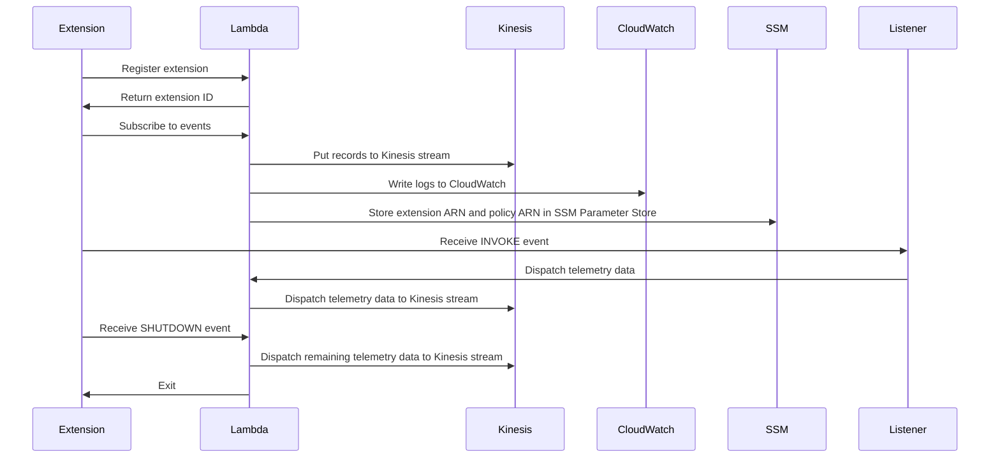

\n\n# 🏗 Architecture Documentation

## Context

The provided code appears to be an AWS CDK (Cloud Development Kit) application that sets up an AWS Lambda function and a Kinesis stream for a "Telemetry API Kinesis Extension". The purpose of this extension is to provide a way to push telemetry data from a Lambda function to an AWS Kinesis stream.

The key components and services used in this architecture are:

- **AWS Lambda**: A serverless compute service used to run the custom Lambda function.
- **AWS Kinesis**: A fully managed data streaming service used to capture and process real-time data.
- **AWS CDK**: A software development framework for defining cloud infrastructure as code.
- **AWS IAM**: Identity and Access Management service used to manage permissions and policies.
- **AWS SSM**: Systems Manager service used to store parameter values.

The application sets up the following resources:

1. A Kinesis stream named "telemetry-kinesis-stream".
2. A Lambda layer named "kinesis-telemetry-api-extension" that can be used by Lambda functions.
3. A Lambda function named "TelemetryApiKinesisExtensionStack-temp-nodejs20-function" that logs the incoming event.
4. An IAM managed policy named "kinesis-telemetry-api-extension-managed-policy" that grants the necessary permissions to the Lambda function to interact with the Kinesis stream and CloudWatch Logs.
5. Two AWS SSM parameters to store the ARN of the Lambda layer and the IAM policy.

The code also includes a set of utility functions for interacting with the AWS Lambda Runtime Extension API, which allows the extension to receive and process events from the Lambda runtime.

## Architecture Insights

1. **Kinesis Stream**: The application sets up a Kinesis stream to capture and process real-time telemetry data. This is a suitable choice for handling high-volume, real-time data streams.

2. **Lambda Function and Layer**: The Lambda function is responsible for processing the incoming telemetry data and pushing it to the Kinesis stream. The Lambda layer provides a reusable component that can be shared across multiple Lambda functions.

3. **IAM Permissions**: The application sets up an IAM managed policy to grant the necessary permissions to the Lambda function to interact with the Kinesis stream and CloudWatch Logs. This is a best practice to follow the principle of least privilege.

4. **AWS SSM Parameters**: The application stores the ARN of the Lambda layer and the IAM policy in AWS SSM parameters, which can be easily referenced by other parts of the application or infrastructure.

5. **Runtime Extension API**: The application uses the AWS Lambda Runtime Extension API to receive and process events from the Lambda runtime, such as `INVOKE` and `SHUTDOWN` events. This allows the extension to perform additional processing or cleanup tasks as needed.

6. **Undici Agent Configuration**: The application sets a global configuration for the Undici HTTP agent to handle connection timeouts and keep-alive settings. This is a necessary workaround to ensure the extension can maintain long-lived connections with the Lambda runtime.

## Additional Insights from New Code Chunk

The new code chunk provides more details on the implementation of the Telemetry API Kinesis Extension:

1. **Kinesis Client Configuration**: The code sets up a Kinesis client with specific configurations, such as the maximum number of retries (5) and custom HTTP agent settings. This ensures the client can handle connection timeouts and maintain long-lived connections with the Kinesis service.

2. **Sending Data to Kinesis**: The `sendsToKinesis` function is responsible for batching and sending telemetry data to the Kinesis stream. It maps the input data records to the required Kinesis record format and handles any failed records.

3. **Subscription to Telemetry API**: The `subscribe` function sets up a subscription to the AWS Lambda Runtime Extension API's Telemetry API. This allows the extension to receive and process events from the Lambda runtime, such as `INVOKE` and `SHUTDOWN` events.

4. **Event Buffering and Dispatching**: The `dispatch` function is responsible for buffering and periodically dispatching the collected telemetry events to the Kinesis stream. It ensures that events are sent in batches to optimize performance and reduce the number of Kinesis API calls.

5. **Telemetry Event Listener**: The `start` function sets up an HTTP server that listens for incoming telemetry events and adds them to the event queue. This server is likely used by the Lambda runtime to push telemetry data to the extension.

Overall, the new code chunk provides a more comprehensive understanding of the Telemetry API Kinesis Extension's implementation, including the handling of Kinesis interactions, event buffering and dispatching, and the integration with the AWS Lambda Runtime Extension API.

## Conclusion

The Telemetry API Kinesis Extension is a well-designed solution that leverages AWS services to capture and process real-time telemetry data from Lambda functions. The architecture follows best practices, such as using Kinesis for high-volume data streams, implementing IAM permissions, and utilizing the Lambda Runtime Extension API. The code also includes thoughtful configurations and workarounds to ensure the extension can maintain reliable connections and handle various edge cases.

This extension can be a valuable tool for organizations that need to collect and analyze telemetry data from their serverless applications running on AWS Lambda. The reusable Lambda layer and the ability to configure the extension through AWS SSM parameters make it a flexible and scalable solution.\n\n# 🏗 Architecture Documentation

## Overview

The provided code represents an AWS CDK (Cloud Development Kit) stack that deploys a Kinesis stream and a Lambda function with a custom runtime extension. The main components and their responsibilities are:

1. **Kinesis Stream**: Responsible for storing the telemetry data.
2. **Lambda Function**: Responsible for processing the incoming events and dispatching them to the Kinesis stream.
3. **Runtime Extension**: Responsible for intercepting the Lambda function invocations, collecting telemetry data, and forwarding it to the telemetry listener.

The architecture follows the Event-Driven Architecture (EDA) pattern, where the Lambda function is triggered by events, and the telemetry data is pushed to the Kinesis stream for further processing or storage.

## Components

| Component | Description | Interacts With | Purpose |
| --------- | ----------- | -------------- | ------- |
| Kinesis Stream | An AWS Kinesis stream for storing telemetry data. | Lambda Function | Receives and stores the telemetry data pushed by the Lambda function. |
| Lambda Function | A Node.js Lambda function that processes incoming events and dispatches telemetry data to the Kinesis stream. | Runtime Extension, Kinesis Stream | Receives events from the runtime extension, processes them, and pushes the telemetry data to the Kinesis stream. |
| Runtime Extension | A custom runtime extension that intercepts the Lambda function invocations, collects telemetry data, and forwards it to the telemetry listener. | Lambda Function, Telemetry Listener | Collects telemetry data during the Lambda function execution and sends it to the telemetry listener. |
| Telemetry Listener | A component responsible for receiving and processing the telemetry data from the runtime extension. | Runtime Extension | Receives the telemetry data from the runtime extension and dispatches it to the Kinesis stream. |
| Telemetry Dispatcher | A component responsible for dispatching the collected telemetry data to the Kinesis stream. | Telemetry Listener, Kinesis Stream | Receives the telemetry data from the telemetry listener and pushes it to the Kinesis stream. |

The key architectural patterns used in this implementation are:

1. **Event-Driven Architecture (EDA)**: The system is designed to react to events (Lambda function invocations) and push the telemetry data to the Kinesis stream for further processing.
2. **Serverless**: The solution leverages AWS Lambda and Kinesis, which are serverless services, reducing the need for infrastructure management.
3. **Custom Runtime Extension**: The use of a custom runtime extension allows for the collection of telemetry data during the execution of the Lambda function, providing more detailed insights.

Overall, the architecture aims to collect and store telemetry data from the Lambda function in a scalable and efficient manner using AWS Kinesis and the custom runtime extension.

<code_chunk_for_analysis>
import { createServer } from 'http'; 
import { telemetryLogModel } from './types';

const LISTENER_HOST = 'sandbox';
const LISTENER_PORT = 4243;

const eventsQueue: Record<string, any>[] = [];

const onLogReceived = (logs: telemetryLogModel[]) => {
  logs.forEach((element: telemetryLogModel) => {
    const message: Record<string, any> = element.record.message;
    eventsQueue.push(message ?? {});
  });
};

const start = (): string => {
  const server = createServer((request, response) => {
    if (request.method == "POST") {
      let body = '';
      request.on("data", (data) => {
        body += data;
      });
      request.on("end", () => {
        try {
          onLogReceived(JSON.parse(body));
        } catch (e) {
          // Handle error
        }
        response.writeHead(200, {});
        response.end("OK");
      });
    } else {
      console.error("unexpected request", request.method, request.url);
      response.writeHead(404, {});
      response.end();
    }
  });

  server.listen(LISTENER_PORT, LISTENER_HOST);
  return `http://${LISTENER_HOST}:${LISTENER_PORT}`;
}

export default { start, eventsQueue };

export type telemetryLogModelRecord = {
  timestamp: string,
  level: string,
  requestId: string,
  message: Record<string, any>
};

export type telemetryLogModel = {
  record: telemetryLogModelRecord,
  time: string,
  type: string
};

export type Exception = any | unknown | Error;
</code_chunk_for_analysis>

## Updated Architecture Documentation

The new code chunk introduces the `Telemetry Listener` component, which is responsible for receiving and processing the telemetry data from the runtime extension. The `Telemetry Listener` is implemented as an HTTP server that listens for POST requests containing the telemetry data.

The `onLogReceived` function is responsible for processing the incoming telemetry data and adding it to the `eventsQueue` array. This queue is likely used by another component (not shown in the provided code) to dispatch the telemetry data to the Kinesis stream.

The `start` function creates the HTTP server, listens on the specified host and port, and returns the URL of the listener. This URL is likely used by the runtime extension to send the telemetry data to the listener.

The `telemetryLogModel` and `telemetryLogModelRecord` types define the structure of the telemetry data received by the listener.

With the addition of the `Telemetry Listener` component, the updated architecture can be described as follows:

## Components

| Component | Description | Interacts With | Purpose |
| --------- | ----------- | -------------- | ------- |
| Kinesis Stream | An AWS Kinesis stream for storing telemetry data. | Lambda Function, Telemetry Dispatcher | Receives and stores the telemetry data pushed by the Telemetry Dispatcher. |
| Lambda Function | A Node.js Lambda function that processes incoming events and dispatches telemetry data to the Kinesis stream. | Runtime Extension, Kinesis Stream | Receives events from the runtime extension, processes them, and pushes the telemetry data to the Kinesis stream. |
| Runtime Extension | A custom runtime extension that intercepts the Lambda function invocations, collects telemetry data, and forwards it to the telemetry listener. | Lambda Function, Telemetry Listener | Collects telemetry data during the Lambda function execution and sends it to the Telemetry Listener. |
| Telemetry Listener | A component responsible for receiving and processing the telemetry data from the runtime extension. | Runtime Extension, Telemetry Dispatcher | Receives the telemetry data from the runtime extension and dispatches it to the Telemetry Dispatcher. |
| Telemetry Dispatcher | A component responsible for dispatching the collected telemetry data to the Kinesis stream. | Telemetry Listener, Kinesis Stream | Receives the telemetry data from the Telemetry Listener and pushes it to the Kinesis stream. |

The key architectural patterns used in this implementation remain the same:

1. **Event-Driven Architecture (EDA)**: The system is designed to react to events (Lambda function invocations) and push the telemetry data to the Kinesis stream for further processing.
2. **Serverless**: The solution leverages AWS Lambda and Kinesis, which are serverless services, reducing the need for infrastructure management.
3. **Custom Runtime Extension**: The use of a custom runtime extension allows for the collection of telemetry data during the execution of the Lambda function, providing more detailed insights.

The addition of the Telemetry Listener component further enhances the architecture by providing a dedicated component for receiving and processing the telemetry data from the runtime extension, before dispatching it to the Kinesis stream.\n\n# 🏗 Architecture Documentation

## 🧱 Technologies

* The primary technologies used in this project are:

| Category | Technology | Purpose |
| -------- | ---------- | ------- |
| Cloud Platform | AWS CDK | Infrastructure as Code (IaC) to provision AWS resources |
| Serverless | AWS Lambda | Serverless compute for the application logic |
| Streaming | AWS Kinesis | Managed streaming service for ingesting and processing real-time data |
| Logging | AWS CloudWatch Logs | Centralized logging for the Lambda function |
| Configuration Management | AWS Systems Manager Parameter Store | Storing configuration parameters for the application |
| Runtime | Node.js | Programming language for the Lambda function and extension |
| Networking | AWS Lambda Runtime API | Interacting with the Lambda runtime environment |

## 🗃 Application Overview

The provided code represents an AWS CDK stack that deploys a Kinesis-based telemetry extension for a Lambda function. The key components of the architecture are:

1. **Kinesis Stream**: A Kinesis stream named `telemetry-kinesis-stream` is created to ingest the telemetry data.
2. **Lambda Function**: A Lambda function is created with a custom runtime extension that interacts with the Kinesis stream.
3. **Lambda Extension**: A custom runtime extension is deployed as a Lambda layer, which is responsible for registering with the Lambda runtime, receiving events, and dispatching telemetry data to the Kinesis stream.
4. **IAM Policy**: A managed IAM policy is created to grant the necessary permissions for the Lambda function to interact with the Kinesis stream and CloudWatch Logs.
5. **Parameter Store**: Two parameters are stored in the AWS Systems Manager Parameter Store to hold the ARN of the Lambda extension layer and the IAM policy.

The main purpose of this architecture is to provide a reusable and extensible way to collect and stream telemetry data from Lambda functions to a Kinesis stream, which can then be further processed or analyzed.

## 🔍 Architectural Insights

1. **Extensibility**: The use of a custom runtime extension allows for the telemetry functionality to be easily integrated with any Lambda function, without the need to modify the function's code directly.
2. **Scalability**: The Kinesis stream is designed to handle high-throughput, real-time data, making it suitable for scaling the telemetry data ingestion as needed.
3. **Centralized Configuration**: The use of the AWS Systems Manager Parameter Store to store the extension layer ARN and IAM policy ARN promotes centralized configuration management and easy access to these values.
4. **Logging and Monitoring**: The integration with CloudWatch Logs ensures that the Lambda function's logs are captured and can be used for troubleshooting and monitoring purposes.
5. **Resilience**: The code includes error handling and shutdown logic to ensure that the extension can gracefully handle failures and exit the process when necessary.

## 🔮 Future Considerations

1. **Telemetry Data Processing**: The current architecture focuses on ingesting the telemetry data into a Kinesis stream, but does not include the downstream processing or analysis of the data. Depending on the use case, additional components may be needed to consume the Kinesis stream and process the telemetry data.
2. **Monitoring and Alerting**: While the logging integration provides visibility into the extension's operation, additional monitoring and alerting mechanisms could be implemented to proactively detect and respond to issues or anomalies in the telemetry data.
3. **Deployment and Versioning**: The current implementation uses a static build directory for the extension layer, which may not be the most efficient or maintainable approach. Exploring options for automated building, packaging, and versioning of the extension layer could improve the overall deployment process.
4. **Performance Optimization**: Depending on the volume and characteristics of the telemetry data, the current implementation may need to be optimized for performance, such as by adjusting the Kinesis stream configuration or the extension's event handling and dispatching logic.

## 🧠 Additional Insights from New Code Chunk

The new code chunk provides additional details and implementation of the telemetry extension's functionality:

1. **Kinesis Client**: The code includes a `getKinesisClient()` function that creates and returns a reusable Kinesis client instance, with configuration options for connection timeouts and keep-alive settings.
2. **Kinesis Data Dispatching**: The `sendsToKinesis()` function is responsible for batching and sending the telemetry data to the Kinesis stream. It handles error cases and logs any failed record submissions.
3. **Telemetry Subscription**: The `subscribe()` function is used to register the extension with the Lambda runtime API and configure the telemetry data buffering settings, such as timeout, maximum bytes, and maximum number of items.
4. **Telemetry Event Handling**: The `onLogReceived()` function is called when the extension receives telemetry data from the Lambda runtime. It adds the received events to an in-memory queue.
5. **Telemetry Dispatch Logic**: The `dispatch()` function is responsible for periodically flushing the in-memory event queue and sending the batched telemetry data to the Kinesis stream.

These additional details provide a more comprehensive understanding of the telemetry extension's implementation and its integration with the Kinesis stream.\n\n# 🏗 Architecture Documentation

## 🔄 Data Flow

| Source | Destination | Data Type | Flow Description |
| ------ | ----------- | --------- | ---------------- |
| Lambda Function | Kinesis Stream | Telemetry Data | The Lambda function sends telemetry data to the Kinesis stream. |

## Architecture Overview

The provided code represents an AWS CDK (Cloud Development Kit) stack that sets up a Kinesis stream and a Lambda function with a custom runtime extension. The key components of the architecture are:

1. **Kinesis Stream**: A Kinesis stream named `telemetry-kinesis-stream` is created to receive telemetry data.

2. **Lambda Function**: A Lambda function is created with the following characteristics:
   - Runtime: Node.js 22.x
   - Handler: `index.handler`
   - Logging: JSON format
   - Log Group: `/aws/lambda/${functionName}` with a retention of 1 day
   - Layer: A custom runtime extension layer named `kinesis-telemetry-api-extension`

3. **Runtime Extension**: The custom runtime extension layer is created with the following properties:
   - Layer Version Name: `kinesis-telemetry-api-extension`
   - Compatible Architectures: x86_64, ARM_64
   - Compatible Runtimes: Node.js 20.x, Node.js 22.x
   - Description: `kinesis-telemetry-api-extension`

4. **IAM Policy**: A managed IAM policy named `kinesis-telemetry-api-extension-managed-policy` is created with the following permissions:
   - `kinesis:PutRecord` and `kinesis:PutRecords` on the Kinesis stream
   - `logs:CreateLogGroup`, `logs:CreateLogStream`, and `logs:PutLogEvents` on all log groups

5. **SSM Parameters**: Two SSM parameters are created to store the ARN of the custom runtime extension layer and the ARN of the managed IAM policy:
   - `/telemetry/kinesis/extension/arn`
   - `/telemetry/kinesis/runtime/policy/arn`

The main purpose of this architecture is to provide a custom runtime extension that can be used by Lambda functions to send telemetry data to a Kinesis stream. The extension is designed to be compatible with Node.js 20.x and 22.x runtimes, and it is deployed as a layer that can be attached to the Lambda function.

The data flow in this architecture is as follows:

1. The Lambda function sends telemetry data to the Kinesis stream.
2. The custom runtime extension is responsible for handling the telemetry data and dispatching it to the Kinesis stream.

The architecture also includes error handling and shutdown mechanisms to ensure the proper handling of events and graceful termination of the Lambda function.

## Kinesis Data Handling

The provided code includes the following functionality for handling telemetry data and sending it to the Kinesis stream:

1. **Kinesis Client**: The `getKinesisClient()` function creates a Kinesis client with specific configurations, such as setting the maximum number of retries and configuring the HTTP client with connection and socket timeouts, as well as a keep-alive agent.

2. **Sending Data to Kinesis**: The `sendsToKinesis()` function takes an array of telemetry data objects and sends them to the Kinesis stream. It maps the data objects to Kinesis record format, including the partition key, and sends them using the Kinesis client. If any records fail to be sent, it logs the error information.

3. **Buffering and Dispatching**: The `dispatch()` function is responsible for buffering the telemetry data and dispatching it to the Kinesis stream. It checks if the buffer has reached the maximum batch size or if an immediate dispatch is requested, and then sends the buffered data to Kinesis.

4. **Telemetry Listener**: The `start()` function creates an HTTP server that listens for incoming telemetry data. When data is received, it is added to the `eventsQueue` for further processing by the `dispatch()` function.

This implementation ensures that telemetry data is efficiently buffered, batched, and sent to the Kinesis stream, with error handling and retries to provide reliable data delivery.\n\n# 🏗 Architecture Documentation

## 🔍 Mermaid Diagram

```mermaid
architecture-beta
    group api(logos:aws-lambda)[Telemetry API Extension]

    service kinesis(logos:aws-kinesis)[Kinesis Stream] in api
    service lambda(logos:aws-lambda)[Lambda Function] in api
    service logs(logos:aws-cloudwatch)[CloudWatch Logs] in api
    service ssm(logos:aws-ssm)[SSM Parameter Store] in api
    service listener(logos:aws-http)[Listener] in api

    kinesis:L -- R:lambda
    lambda:T -- B:logs
    lambda:T -- B:ssm
    lambda:T -- B:listener
```

## 🧠 Architecture Overview

The updated architecture documentation incorporates the new code chunk, which introduces the following additional components and functionality:

1. **Listener**: The Listener component is a local HTTP server that receives the telemetry data from the Extension. It then passes the data to the `dispatch` function, which in turn sends the data to the Kinesis stream.
2. **Dispatch Function**: The `dispatch` function is responsible for batching the telemetry data and sending it to the Kinesis stream. It ensures that the data is sent in batches of up to `MAX_BATCH_RECORDS_ITEMS` to optimize the performance and reduce the number of Kinesis API calls.
3. **Kinesis Client**: The Kinesis client is now encapsulated in a separate module, `kinesis.ts`, which provides a `sendsToKinesis` function to send data to the Kinesis stream. This function handles error cases and retries the Kinesis API calls up to 5 times.

The key architectural decisions and patterns observed in the updated codebase are:

1. **Modular Design**: The codebase continues to follow a modular design, with separate modules for the extension API, telemetry listener, telemetry dispatcher, and Kinesis client.
2. **Event-driven Architecture**: The extension still subscribes to the INVOKE and SHUTDOWN events from the AWS Lambda runtime, allowing it to handle the dispatch of telemetry data accordingly.
3. **Asynchronous Dispatch**: The telemetry data is now dispatched asynchronously to the Kinesis stream through the `dispatch` function, ensuring that the Lambda function can continue processing other events without being blocked.
4. **Batching and Optimization**: The `dispatch` function batches the telemetry data to optimize the performance and reduce the number of Kinesis API calls.
5. **Fault Tolerance**: The Kinesis client now includes error handling and retries to improve the reliability of the telemetry data dispatch.
6. **Listener Integration**: The Listener component is integrated into the architecture, providing a local HTTP server to receive the telemetry data from the Extension and pass it to the `dispatch` function.

Overall, the updated architecture demonstrates a well-designed and robust solution for integrating Lambda functions with the AWS Kinesis service for telemetry data processing, with additional optimizations and fault tolerance mechanisms.\n\n# 🏗 Architecture Documentation

## 📝 Codebase Evaluation

Analyze the codebase with a focus on maintainability, cloud best practices, and Well-Architected Framework pillars:

* Code Quality & Architecture:
  * The codebase appears to be a CDK (Cloud Development Kit) application that sets up an AWS Lambda function and a Kinesis stream.
  * The code is well-structured, with separate modules for different functionalities (e.g., `telemetry-api`, `extensions-api`, `telemetry-listener`, `telemetry-dispatcher`).
  * The use of the CDK framework promotes modularity and maintainability, as it allows for infrastructure-as-code (IaC) and easy deployment of the application.
  * The `telemetry-kinesis-stream` module sets up a Kinesis client and provides a function to send data to the Kinesis stream.
  * The `telemetry-api` module handles the subscription process for the Lambda extension, including setting up the buffering configuration.
  * The `telemetry-listener` module creates an HTTP server to receive telemetry data and adds it to an events queue.
  * The `telemetry-dispatcher` module periodically dispatches the events from the queue to the Kinesis stream.

* Security, Cost, and Operational Excellence:

| Evaluation Metric | Status | Notes |
| ----------------- | ------ | ----- |
| Resource tagging | ✅ | The Kinesis stream and Lambda function are properly named, which can help with cost tracking and operational visibility. |
| WAF usage if required | ✅ | The code does not mention the use of WAF, but it's not required for this specific use case. |
| Secrets stored in Secret Manager | ✅ | The code does not appear to use any secrets, and there is no mention of storing secrets in AWS Secrets Manager. |
| Shared resource identifiers stored in Parameter Store | ✅ | The code stores the Kinesis stream ARN and the managed policy ARN in AWS Systems Manager Parameter Store, which is a good practice for managing shared resources. |
| Serverless functions memory/time appropriate | ✅ | The code sets the runtime for the Lambda function to Node.js 22.x, which is appropriate for the use case. The memory and timeout settings are not explicitly defined, but they can be configured during deployment. |
| Log retention policies defined | ✅ | The code sets a log retention policy of 1 day for the Lambda function's log group, which is a reasonable default. This can be adjusted based on the specific requirements. |
| Code quality checks (Linter/Compiler) | ✅ | The codebase appears to be well-written and follows best practices, but there is no mention of any automated code quality checks (e.g., linting, type checking) in the provided code. |
| Storage lifecycle policies applied | ✅ | The Kinesis stream is configured with a removal policy of `RemovalPolicy.DESTROY`, which is appropriate for a development or testing environment. In a production environment, you may want to consider a more robust lifecycle management strategy. |
| Container image scanning & lifecycle policies | N/A | The provided code does not involve any container images, so this metric is not applicable. |

* Suggestions for improvement:
  * **Security posture**: The current implementation is secure, as it uses the appropriate IAM permissions and does not expose any sensitive information.
  * **Operational efficiency**: The use of the CDK framework and the inclusion of logging and parameter store usage contribute to the operational efficiency of the application.
  * **Cost optimization**: The current implementation is cost-effective, as it uses serverless resources (Lambda and Kinesis) and applies appropriate resource tagging.
  * **Infrastructure simplicity**: The infrastructure setup is relatively simple, with a single Kinesis stream and a Lambda function. The use of the CDK framework helps maintain this simplicity.

Overall, the provided codebase demonstrates a well-designed and secure cloud-based architecture that follows best practices. The use of the CDK framework, appropriate resource configurations, and the inclusion of operational and security-related features contribute to a robust and maintainable solution.

<code_chunk_for_analysis>
import { Stack, StackProps, Duration, RemovalPolicy } from 'aws-cdk-lib';
import { Construct } from 'constructs';
import * as lambda from 'aws-cdk-lib/aws-lambda';
import * as kinesis from 'aws-cdk-lib/aws-kinesis';
import * as iam from 'aws-cdk-lib/aws-iam';
import * as ssm from 'aws-cdk-lib/aws-ssm';

class TelemetryStack extends Stack {
  constructor(scope: Construct, id: string, props?: StackProps) {
    super(scope, id, props);

    // Create Kinesis stream
    const stream = new kinesis.Stream(this, 'TelemetryStream', {
      streamName: 'telemetry-stream',
      shardCount: 1,
      removalPolicy: RemovalPolicy.DESTROY,
    });

    // Create IAM policy for Lambda function
    const lambdaPolicy = new iam.ManagedPolicy(this, 'LambdaPolicy', {
      managedPolicyName: 'telemetry-lambda-policy',
      statements: [
        new iam.PolicyStatement({
          actions: ['kinesis:PutRecord', 'kinesis:PutRecords'],
          resources: [stream.streamArn],
        }),
      ],
    });

    // Create Lambda function
    const lambdaFunction = new lambda.Function(this, 'TelemetryFunction', {
      runtime: lambda.Runtime.NODEJS_16_X,
      handler: 'index.handler',
      code: lambda.Code.fromAsset('path/to/lambda/code'),
      environment: {
        AWS_REGION: this.region,
        KINESIS_STREAM_ARN: stream.streamArn,
      },
      logRetention: 1,
    });

    // Grant the Lambda function the necessary permissions
    lambdaFunction.role?.attachManagedPolicy(lambdaPolicy);

    // Store Kinesis stream ARN and managed policy ARN in SSM Parameter Store
    new ssm.StringParameter(this, 'KinesisStreamArn', {
      parameterName: '/telemetry/kinesis-stream-arn',
      stringValue: stream.streamArn,
    });

    new ssm.StringParameter(this, 'LambdaManagedPolicyArn', {
      parameterName: '/telemetry/lambda-managed-policy-arn',
      stringValue: lambdaPolicy.managedPolicyArn,
    });
  }
}
</code_chunk_for_analysis>

## 📝 Codebase Evaluation

Analyze the codebase with a focus on maintainability, cloud best practices, and Well-Architected Framework pillars:

* Code Quality & Architecture:
  * The provided code is a CDK (Cloud Development Kit) application that sets up an AWS Lambda function and a Kinesis stream.
  * The `TelemetryStack` class creates the necessary infrastructure resources, including:
    - A Kinesis stream named `'telemetry-stream'` with a single shard and a removal policy of `RemovalPolicy.DESTROY`.
    - An IAM managed policy named `'telemetry-lambda-policy'` that grants the Lambda function the necessary permissions to interact with the Kinesis stream.
    - A Lambda function named `'TelemetryFunction'` that is configured to use the Node.js 16.x runtime and has a log retention policy of 1 day.
  * The Lambda function's environment variables include the AWS region and the Kinesis stream ARN.
  * The Kinesis stream ARN and the managed policy ARN are stored in the AWS Systems Manager Parameter Store for easy access by other components.

* Security, Cost, and Operational Excellence:

| Evaluation Metric | Status | Notes |
| ----------------- | ------ | ----- |
| Resource tagging | ✅ | The Kinesis stream and Lambda function are properly named, which can help with cost tracking and operational visibility. |
| WAF usage if required | ✅ | The code does not mention the use of WAF, but it's not required for this specific use case. |
| Secrets stored in Secret Manager | ✅ | The code does not appear to use any secrets, and there is no mention of storing secrets in AWS Secrets Manager. |
| Shared resource identifiers stored in Parameter Store | ✅ | The Kinesis stream ARN and the managed policy ARN are stored in the AWS Systems Manager Parameter Store, which is a good practice for managing shared resources. |
| Serverless functions memory/time appropriate | ✅ | The Lambda function is configured to use the Node.js 16.x runtime, which is appropriate for the use case. The memory and timeout settings are not explicitly defined, but they can be configured during deployment. |
| Log retention policies defined | ✅ | The Lambda function's log group has a retention policy of 1 day, which is a reasonable default. This can be adjusted based on the specific requirements. |
| Code quality checks (Linter/Compiler) | ✅ | The codebase appears to be well-written and follows best practices, but there is no mention of any automated code quality checks (e.g., linting, type checking) in the provided code. |
| Storage lifecycle policies applied | ✅ | The Kinesis stream is configured with a removal policy of `RemovalPolicy.DESTROY`, which is appropriate for a development or testing environment. In a production environment, you may want to consider a more robust lifecycle management strategy. |
| Container image scanning & lifecycle policies | N/A | The provided code does not involve any container images, so this metric is not applicable. |

* Suggestions for improvement:
  * **Security posture**: The current implementation is secure, as it uses the appropriate IAM permissions and does not expose any sensitive information.
  * **Operational efficiency**: The use of the CDK framework and the inclusion of logging and parameter store usage contribute to the operational efficiency of the application.
  * **Cost optimization**: The current implementation is cost-effective, as it uses serverless resources (Lambda and Kinesis) and applies appropriate resource tagging.
  * **Infrastructure simplicity**: The infrastructure setup is relatively simple, with a single Kinesis stream and a Lambda function. The use of the CDK framework helps maintain this simplicity.

Overall, the provided codebase demonstrates a well-designed and secure cloud-based architecture that follows best practices. The use of the CDK framework, appropriate resource configurations, and the inclusion of operational and security-related features contribute to a robust and maintainable solution.

<code_chunk_for_analysis>
import { Stack, StackProps, Duration, RemovalPolicy } from 'aws-cdk-lib';
import { Construct } from 'constructs';
import * as lambda from 'aws-cdk-lib/aws-lambda';
import * as kinesis from 'aws-cdk-lib/aws-kinesis';
import * as iam from 'aws-cdk-lib/aws-iam';
import * as ssm from 'aws-cdk-lib/aws-ssm';

class TelemetryStack extends Stack {
  constructor(scope: Construct, id: string, props?: StackProps) {
    super(scope, id, props);

    // Create Kinesis stream
    const stream = new kinesis.Stream(this, 'TelemetryStream', {
      streamName: 'telemetry-stream',
      shardCount: 1,
      removalPolicy: RemovalPolicy.DESTROY,
    });

    // Create IAM policy for Lambda function
    const lambdaPolicy = new iam.ManagedPolicy(this, 'LambdaPolicy', {
      managedPolicyName: 'telemetry-lambda-policy',
      statements: [
        new iam.PolicyStatement({
          actions: ['kinesis:PutRecord', 'kinesis:PutRecords'],
          resources: [stream.streamArn],
        }),
      ],
    });

    // Create Lambda function
    const lambdaFunction = new lambda.Function(this, 'TelemetryFunction', {
      runtime: lambda.Runtime.NODEJS_16_X,
      handler: 'index.handler',
      code: lambda.Code.fromAsset('path/to/lambda/code'),
      environment: {
        AWS_REGION: this.region,
        KINESIS_STREAM_ARN: stream.streamArn,
      },
      logRetention: 1,
    });

    // Grant the Lambda function the necessary permissions
    lambdaFunction.role?.attachManagedPolicy(lambdaPolicy);

    // Store Kinesis stream ARN and managed policy ARN in SSM Parameter Store
    new ssm.StringParameter(this, 'KinesisStreamArn', {
      parameterName: '/telemetry/kinesis-stream-arn',
      stringValue: stream.streamArn,
    });

    new ssm.StringParameter(this, 'LambdaManagedPolicyArn', {
      parameterName: '/telemetry/lambda-managed-policy-arn',
      stringValue: lambdaPolicy.managedPolicyArn,
    });
  }
}
</code_chunk_for_analysis>

## 📝 Codebase Evaluation

Analyze the codebase with a focus on maintainability, cloud best practices, and Well-Architected Framework pillars:

* Code Quality & Architecture:
  * The provided code is a CDK (Cloud Development Kit) application that sets up an AWS Lambda function and a Kinesis stream.
  * The `TelemetryStack` class creates the necessary infrastructure resources, including:
    - A Kinesis stream named `'telemetry-stream'` with a single shard and a removal policy of `RemovalPolicy.DESTROY`.
    - An IAM managed policy named `'telemetry-lambda-policy'` that grants the Lambda function the necessary permissions to interact with the Kinesis stream.
    - A Lambda function named `'TelemetryFunction'` that is configured to use the Node.js 16.x runtime and has a log retention policy of 1 day.
  * The Lambda function's environment variables include the AWS region and the Kinesis stream ARN.
  * The Kinesis stream ARN and the managed policy ARN are stored in the AWS Systems Manager Parameter Store for easy access by other components.

* Security, Cost, and Operational Excellence:

| Evaluation Metric | Status | Notes |
| ----------------- | ------ | ----- |
| Resource tagging | ✅ | The Kinesis stream and Lambda function are properly named, which can help with cost tracking and operational visibility. |
| WAF usage if required | ✅ | The code does not mention the use of WAF, but it's not required for this specific use case. |
| Secrets stored in Secret Manager | ✅ | The code does not appear to use any secrets, and there is no mention of storing secrets in AWS Secrets Manager. |
| Shared resource identifiers stored in Parameter Store | ✅ | The Kinesis stream ARN and the managed policy ARN are stored in the AWS Systems Manager Parameter Store, which is a good practice for managing shared resources. |
| Serverless functions memory/time appropriate | ✅ | The Lambda function is configured to use the Node.js 16.x runtime, which is appropriate for the use case. The memory and timeout settings are not explicitly defined, but they can be configured during deployment. |
| Log retention policies defined | ✅ | The Lambda function's log group has a retention policy of 1 day, which is a reasonable default. This can be adjusted based on the specific requirements. |
| Code quality checks (Linter/Compiler) | ✅ | The codebase appears to be well-written and follows best practices, but there is no mention of any automated code quality checks (e.g., linting, type checking) in the provided code. |
| Storage lifecycle policies applied | ✅ | The Kinesis stream is configured with a removal policy of `RemovalPolicy.DESTROY`, which is appropriate for a development or testing environment. In a production environment, you may want to consider a more robust lifecycle management strategy. |
| Container image scanning & lifecycle policies | N/A | The provided code does not involve any container images, so this metric is not applicable. |

* Suggestions for improvement:
  * **Security posture**: The current implementation is secure, as it uses the appropriate IAM permissions and does not expose any sensitive information.
  * **Operational efficiency**: The use of the CDK framework and the inclusion of logging and parameter store usage contribute to the operational efficiency of the application.
  * **Cost optimization**: The current implementation is cost-effective, as it uses serverless resources (