```mermaid
architecture-beta
    group api(logos:aws-lambda)[Lambda Extension]

    service kinesis(logos:aws-kinesis)[Kinesis Stream] in api
    service ssm(logos:aws-ssm)[SSM Parameter Store] in api
    service lambda(logos:aws-lambda)[Lambda Function] in api

    lambda:L -- R:kinesis
    lambda:L -- R:ssm
```

# 🏗 Architecture Documentation

## Context

The provided codebase appears to be an AWS Lambda extension that integrates with the AWS Kinesis service. The extension is designed to capture and dispatch telemetry data from the Lambda function to the Kinesis stream.

The key components and services involved are:

- **AWS Lambda**: The extension is designed to run as part of the Lambda runtime, capturing and processing telemetry data.
- **AWS Kinesis**: The extension sends the captured telemetry data to an AWS Kinesis stream for further processing or storage.
- **AWS SSM Parameter Store**: The extension stores the ARN of the Lambda layer and the managed policy ARN in the Parameter Store for easy access.

## Overview

The architecture of the provided codebase can be summarized as follows:

1. **Extension Registration**: The extension registers itself with the AWS Lambda runtime, subscribing to the `INVOKE` and `SHUTDOWN` events.
2. **Telemetry Capture**: The extension listens for incoming telemetry data and stores it in an in-memory queue.
3. **Telemetry Dispatch**: The extension periodically dispatches the accumulated telemetry data to the Kinesis stream, either based on a timeout or when the queue reaches a certain size.
4. **Kinesis Integration**: The extension uses the AWS SDK for Kinesis to send the telemetry data to the configured Kinesis stream.
5. **Persistence and Configuration**: The extension stores the ARN of the Lambda layer and the managed policy ARN in the AWS SSM Parameter Store for easy access and reuse.

The key architectural patterns used in this codebase are:

- **Event-Driven Architecture (EDA)**: The extension listens for and responds to specific events from the Lambda runtime.
- **Buffering and Batching**: The extension buffers the telemetry data in an in-memory queue and dispatches it in batches to the Kinesis stream, optimizing the number of API calls.
- **Dependency Injection**: The extension uses the AWS SDK for Kinesis, which is injected as a dependency, allowing for easier testing and maintainability.

## Components

| Component | Description | Interacts With | Purpose |
| --------- | ----------- | -------------- | ------- |
| `TelemetryApiKinesisExtensionStack` | The main CDK stack that creates the Kinesis stream, Lambda layer, and associated resources. | AWS Kinesis, AWS Lambda, AWS SSM Parameter Store | Provisions the necessary infrastructure for the telemetry extension. |
| `telemetry-api` | Handles the subscription of the extension to the Lambda runtime telemetry API. | AWS Lambda Runtime API | Registers the extension and subscribes it to receive telemetry events. |
| `telemetry-listener` | Listens for incoming telemetry data and stores it in an in-memory queue. | N/A | Captures the telemetry data generated by the Lambda function. |
| `telemetry-dispatcher` | Periodically dispatches the accumulated telemetry data to the Kinesis stream. | AWS Kinesis | Sends the telemetry data to the Kinesis stream. |
| `kinesis` | Provides the functionality to send data to the Kinesis stream. | AWS Kinesis | Handles the communication with the Kinesis service. |
| `extensions-api` | Interacts with the AWS Lambda runtime extension API. | AWS Lambda Runtime API | Registers the extension and receives events from the runtime. |

## 🔄 Data Flow

| Source | Destination | Data Type | Flow Description |
| ------ | ----------- | --------- | ---------------- |
| Lambda Function | `telemetry-listener` | Telemetry Data | The Lambda function generates telemetry data, which is captured by the `telemetry-listener` component. |
| `telemetry-listener` | `telemetry-dispatcher` | Telemetry Data | The `telemetry-listener` component stores the captured telemetry data in an in-memory queue, which is then dispatched by the `telemetry-dispatcher` component. |
| `telemetry-dispatcher` | AWS Kinesis | Telemetry Data | The `telemetry-dispatcher` component sends the accumulated telemetry data to the AWS Kinesis stream. |

## 🔍 Mermaid Diagram

## 🧱 Technologies

| Category | Technology | Purpose |
| -------- | ---------- | ------- |
| Cloud Platform | AWS | Provides the necessary cloud infrastructure and services (Lambda, Kinesis, SSM Parameter Store) to host and operate the telemetry extension. |
| Programming Language | TypeScript | The codebase is written in TypeScript, which provides type safety and better tooling support. |
| AWS SDK | `@aws-sdk/client-kinesis` | Used to interact with the AWS Kinesis service. |
| HTTP Client | `undici` | Used for making HTTP requests to the AWS Lambda runtime API. |
| Logging | `console` | Used for logging and debugging purposes. |

## 📝 Codebase Evaluation

### Code Quality & Architecture

The codebase follows a modular and well-structured approach, with clear separation of concerns between the different components (extension registration, telemetry capture, telemetry dispatch, and Kinesis integration). This promotes maintainability and testability of the codebase.

The use of the AWS CDK to provision the necessary infrastructure resources (Kinesis stream, Lambda layer, and SSM parameters) is a good practice, as it allows for infrastructure-as-code and facilitates deployment and versioning.

The codebase also demonstrates good practices in terms of error handling, with appropriate logging and error reporting to help with debugging and troubleshooting.

### Security, Cost, and Operational Excellence

| Evaluation Metric | Status | Notes |
| ----------------- | ------ | ----- |
| Resource tagging | ✅ | The codebase does not explicitly set any resource tags, but this can be easily added to the CDK stack. |
| WAF usage if required | N/A | The codebase does not appear to require WAF, as it is an internal Lambda extension. |
| Secrets stored in Secret Manager | ✅ | The codebase does not store any sensitive information, and the ARN and policy ARN are stored in the SSM Parameter Store, which is a suitable approach. |
| Shared resource identifiers stored in Parameter Store | ✅ | The codebase stores the ARN of the Lambda layer and the managed policy ARN in the SSM Parameter Store, which is a good practice. |
| Serverless functions memory/time appropriate | ✅ | The codebase does not define any specific memory or timeout settings for the Lambda function, but these can be easily added to the CDK stack. |
| Log retention policies defined | ✅ | The codebase sets a log retention policy of 1 day for the Lambda function's log group, which is a reasonable default. |
| Code quality checks (Linter/Compiler) | ✅ | The codebase is written in TypeScript, which provides built-in type checking and linting capabilities. |
| Storage lifecycle policies applied | N/A | The codebase does not appear to use any long-term storage, so storage lifecycle policies are not applicable. |
| Container image scanning & lifecycle policies | N/A | The codebase does not use any container images, as it is a Lambda extension. |

### Suggestions for Improvement

1. **Security Posture**:
   - Consider adding resource tags to the provisioned resources for better identification and cost tracking.
   - Evaluate the need for any additional security controls, such as VPC integration or IAM role restrictions, based on the specific use case and deployment environment.

2. **Operational Efficiency**:
   - Implement more robust error handling and retry mechanisms for the Kinesis API calls to ensure reliable delivery of telemetry data.
   - Consider adding metrics and alarms to monitor the extension's performance and health, such as the size of the telemetry queue, dispatch latency, and Kinesis stream throughput.

3. **Cost Optimization**:
   - Analyze the Kinesis stream's capacity and provisioning to ensure it is appropriately sized for the expected telemetry data volume and traffic patterns.
   - Investigate the possibility of using Kinesis Data Streams' auto-scaling capabilities to dynamically adjust the stream's capacity based on the workload.

4. **Infrastructure Simplicity**:
   - Evaluate the need for the SSM Parameter Store usage and consider alternative approaches, such as using environment variables or other configuration management solutions, if the parameter store is not required for other use cases.
   - Explore the possibility of consolidating the various components (telemetry listener, dispatcher, Kinesis integration) into a single Lambda function to simplify the overall architecture.

Overall, the codebase demonstrates a well-designed and structured approach to implementing a telemetry extension for AWS Lambda. With the suggested improvements, the architecture can be further enhanced to improve security, operational efficiency, cost optimization, and infrastructure simplicity.