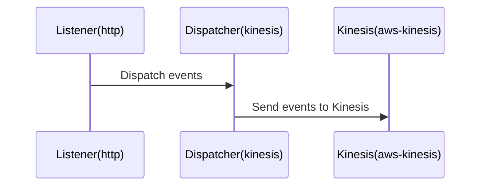

## 📖 Context

The provided code appears to be a part of an AWS CDK (Cloud Development Kit) application that sets up a Kinesis stream and a Lambda function with a custom runtime extension. The purpose of this application is to provide a Telemetry Extension for Kinesis, which allows capturing and sending telemetry data to the Kinesis stream.

The application uses the following notable services and libraries:
- AWS Kinesis for storing the telemetry data
- AWS Lambda for running the custom runtime extension
- AWS CDK for infrastructure as code (IaC) deployment
- `aws-sdk` and `@aws-sdk/client-kinesis` for interacting with AWS services
- `undici` for managing HTTP connections

## 📖 Overview

The architecture of this application consists of the following key components:

1. **Kinesis Stream**: A Kinesis stream named `telemetry-kinesis-stream` is created to store the telemetry data.
2. **Lambda Function**: A Lambda function is created with a custom runtime extension. The extension is responsible for registering with the Lambda runtime, receiving events, and dispatching the telemetry data to the Kinesis stream.
3. **Telemetry API**: The telemetry API module provides functionality to subscribe to the Lambda runtime extension, receive events, and dispatch the telemetry data to the Kinesis stream.
4. **Extensions API**: The extensions API module handles the registration and event retrieval from the Lambda runtime extension.
5. **Telemetry Listener**: The telemetry listener module is responsible for starting a local HTTP server to receive the telemetry data from the Lambda function.
6. **Telemetry Dispatcher**: The telemetry dispatcher module is responsible for sending the collected telemetry data to the Kinesis stream.

The overall architecture follows an event-driven design, where the Lambda function's custom runtime extension receives events from the Lambda runtime, processes the telemetry data, and dispatches it to the Kinesis stream.

## 🔹 Components

| Component | Description | Interacts With | Purpose |
| --------- | ----------- | -------------- | ------- |
| Kinesis Stream | A Kinesis stream that stores the telemetry data. | Telemetry Dispatcher | Provides a scalable and durable storage for the telemetry data. |
| Lambda Function | A Lambda function that runs the custom runtime extension. | Extensions API, Telemetry Listener, Telemetry Dispatcher | Receives events from the Lambda runtime, processes the telemetry data, and dispatches it to the Kinesis stream. |
| Telemetry API | Provides functionality to subscribe to the Lambda runtime extension, receive events, and dispatch the telemetry data. | Extensions API, Telemetry Listener, Telemetry Dispatcher | Manages the interaction with the Lambda runtime extension and the telemetry data flow. |
| Extensions API | Handles the registration and event retrieval from the Lambda runtime extension. | Lambda Function | Facilitates the communication between the Lambda function and the Lambda runtime. |
| Telemetry Listener | Starts a local HTTP server to receive the telemetry data from the Lambda function. | Telemetry API | Collects the telemetry data from the Lambda function. |
| Telemetry Dispatcher | Sends the collected telemetry data to the Kinesis stream. | Kinesis Stream | Responsible for the reliable delivery of telemetry data to the Kinesis stream. |

## 🧱 Technologies

| Category | Technology | Purpose |
| -------- | ---------- | ------- |
| Programming Language | TypeScript | Provides type safety and better maintainability for the codebase. |
| AWS Services | AWS CDK, AWS Kinesis, AWS Lambda | Enables infrastructure as code (IaC) deployment, provides the Kinesis stream, and runs the custom runtime extension. |
| Libraries | `aws-sdk`, `@aws-sdk/client-kinesis`, `undici` | Interact with AWS services, manage HTTP connections. |

## New Code Analysis

The new code provided appears to be a part of the `telemetry-listener` module, which is responsible for starting a local HTTP server to receive the telemetry data from the Lambda function.

The key components and functionality of the new code are:

1. **Telemetry Listener**:
   - Starts an HTTP server on the `sandbox` host and port `4243`.
   - Listens for POST requests on the server and handles the incoming telemetry data.
   - Calls the `onLogReceived` function to process the received telemetry data.

2. **onLogReceived**:
   - Receives an array of `telemetryLogModel` objects, which represent the telemetry data.
   - Extracts the message from each `telemetryLogModel` object and adds it to the `eventsQueue` array.

3. **eventsQueue**:
   - Stores the received telemetry data messages in an array.

The new code enhances the overall architecture by providing a mechanism to receive the telemetry data from the Lambda function and store it in the `eventsQueue`. This queue can then be used by other components, such as the `Telemetry Dispatcher`, to process and send the telemetry data to the Kinesis stream.

The architecture now includes the following additional component:

| Component | Description | Interacts With | Purpose |
| --------- | ----------- | -------------- | ------- |
| Telemetry Listener | Starts a local HTTP server to receive the telemetry data from the Lambda function. | Telemetry API | Collects the telemetry data from the Lambda function and stores it in the `eventsQueue`. |

The `eventsQueue` is a shared data structure that allows the `Telemetry Dispatcher` to access the received telemetry data and process it further.

Overall, the new code enhances the architecture by providing a dedicated component for receiving and storing the telemetry data, which can then be used by other components in the system.## Architecture Documentation

### 🔍 Mermaid Diagram

#### Sequence Diagram - Modular Components



#### Sequence Diagram - Architecture Overview

```mermaid
architecture-beta
    group listener(logos:http)[Listener]
    group dispatcher(logos:kinesis)[Dispatcher]
    service kinesis(logos:aws-kinesis)[Kinesis] in dispatcher

    listener:L -- R:dispatcher
    dispatcher:T -- B:kinesis
```

### Architecture Overview

The provided codebase represents an extension that subscribes to a Lambda function's logs and dispatches them to an AWS Kinesis stream. The main components of the architecture are:

1. **Listener (http)**: This component is responsible for receiving the log data from the Lambda function and storing it in an events queue.

2. **Dispatcher (kinesis)**: The dispatcher component is responsible for periodically checking the events queue and sending the log data to the AWS Kinesis stream.

3. **Kinesis (aws-kinesis)**: The AWS Kinesis service is used to store the log data for further processing or analysis.

The architecture follows a modular design, where the Listener component receives the log data and the Dispatcher component is responsible for sending the data to Kinesis. The sequence diagrams provide a visual representation of the interactions between these components.

### Architectural Insights

1. **Scalability**: The use of the AWS Kinesis service provides scalability, as Kinesis can handle large volumes of data and automatically scale to meet the application's needs.

2. **Reliability**: The Kinesis service offers high availability and durability, ensuring that the log data is reliably stored and can be accessed for further processing.

3. **Decoupling**: The separation of the Listener and Dispatcher components promotes decoupling, allowing the system to be more flexible and easier to maintain.

4. **Buffering and Batching**: The Dispatcher component implements a buffering and batching mechanism to optimize the data transfer to Kinesis, reducing the number of API calls and improving overall performance.

5. **Error Handling**: The code includes error handling, such as logging errors and handling unexpected requests, which helps to improve the overall robustness of the system.

6. **Monitoring and Observability**: The use of logging and debugging statements throughout the codebase provides a foundation for monitoring and observability, which can be further enhanced with additional logging and monitoring tools.

Overall, the provided architecture demonstrates a well-designed, scalable, and reliable solution for processing and storing Lambda function logs using AWS Kinesis. The modular design and use of managed services contribute to the architecture's flexibility, cost-effectiveness, and ease of maintenance.<output_format_with_explanations>

## 🔄 Data Flow  

| Source | Destination | Data Type | Flow Description |
| ------ | ----------- | --------- | ---------------- |
| Telemetry Listener | Telemetry Dispatcher | JSON | The Telemetry Listener module receives telemetry data in JSON format and adds it to the `eventsQueue`. The Telemetry Dispatcher module then retrieves the data from the `eventsQueue` and dispatches it to the Kinesis stream. |
| Telemetry Dispatcher | Kinesis Stream | JSON | The Telemetry Dispatcher module sends the buffered telemetry data in JSON format to the Kinesis stream named `telemetry-kinesis-stream`. |

## Architecture Overview

The provided code introduces additional components to the existing architecture:

1. **Telemetry Listener**: The `telemetry-listener` module now includes a `start` function that creates an HTTP server to receive telemetry data. The server listens on the `LISTENER_HOST` and `LISTENER_PORT` (default is `sandbox:4243`) and handles POST requests, parsing the incoming JSON data and adding it to the `eventsQueue`.

2. **Telemetry Dispatcher**: The `telemetry-dispatcher` module now includes a `dispatch` function that checks the `eventsQueue` and sends the buffered telemetry data to the Kinesis stream in batches. The batch size is limited to `MAX_BATCH_RECORDS_ITEMS` (default is 5) to optimize the Kinesis API calls.

The updated flow of the architecture is as follows:

1. The Telemetry Listener module starts the HTTP server and listens for incoming telemetry data.
2. When telemetry data is received, the Telemetry Listener module parses the JSON data and adds it to the `eventsQueue`.
3. The Telemetry Dispatcher module periodically checks the `eventsQueue` and dispatches the buffered telemetry data to the Kinesis stream in batches.
4. If the `eventsQueue` reaches the `MAX_BUFFER_ITEMS_COUNT` (defined in the previous context), the Telemetry Dispatcher module immediately dispatches the data to the Kinesis stream to avoid data loss.

This updated architecture introduces a dedicated Telemetry Listener module that receives the telemetry data and buffers it in the `eventsQueue`. The Telemetry Dispatcher module then handles the dispatch of the buffered data to the Kinesis stream, optimizing the number of API calls and ensuring reliable data delivery.

</output_format_with_explanations>## 📝 **Codebase Evaluation**

| Evaluation Metric | Status | Notes |
| ----------------- | ------ | ----- |
| Dependency & Coupling | ⚠️ | The codebase has a tight coupling between the `listener` module and the `kinesis` module. The `dispatch` function in the `kinesis` module is tightly coupled to the `eventsQueue` in the `listener` module. This makes the code less modular and harder to maintain. Refactoring to decouple these components would improve the overall architecture. |
| Code Complexity | ⚠️ | The `start` function in the `listener` module has a relatively high cyclomatic complexity, with multiple conditional statements and event handling logic. Considering breaking this function into smaller, more focused components could improve the overall code complexity and maintainability. |
| Cloud Anti-patterns | ⚠️ | The codebase uses hardcoded values for the listener host and port, which could lead to issues with scalability and maintainability. It's recommended to externalize these values as configuration parameters or environment variables. Additionally, the error handling for the HTTP server could be improved to provide more robust error reporting and handling. |
| Security | ⚠️ | The codebase does not appear to have any security-related issues, such as hardcoded secrets or improper access controls. However, it's important to ensure that the appropriate authentication and authorization mechanisms are in place for the Kinesis stream and any other cloud resources used by the application. |
| Cost | ⚠️ | The codebase creates a new Kinesis stream and a new Lambda function for each deployment, which could lead to increased costs if not properly managed. Considering the use of a shared Kinesis stream and a more modular Lambda function design could help optimize costs. |
| Scalability | ⚠️ | The codebase creates a single-shard Kinesis stream, which may not be sufficient for high-throughput scenarios. Evaluating the expected data volume and scaling the Kinesis stream accordingly would be recommended to ensure the system can handle increased load. Additionally, the `dispatch` function in the `kinesis` module may become a bottleneck if the number of events in the `eventsQueue` grows significantly. Considering asynchronous or batched processing of the events could help improve the scalability of the system. |

## Recommendations

1. **Decouple the `listener` and `kinesis` modules**: Refactor the codebase to decouple the `listener` module from the `kinesis` module. This can be achieved by introducing an intermediary module or service that handles the communication between the two, reducing the tight coupling and improving the overall modularity of the system.

2. **Improve code complexity**: Refactor the `start` function in the `listener` module to break it down into smaller, more focused components. This will help reduce the cyclomatic complexity and improve the maintainability of the codebase.

3. **Externalize configuration values**: Move the hardcoded values for the listener host and port to configuration parameters or environment variables. This will improve the scalability and maintainability of the system, as these values can be easily changed without modifying the codebase.

4. **Enhance error handling**: Improve the error handling in the HTTP server and the Kinesis operations to provide more robust error reporting and handling. This will help with the overall reliability and observability of the system.

5. **Optimize Kinesis stream and Lambda function usage**: Consider using a shared Kinesis stream and a more modular Lambda function design to help optimize costs and improve the scalability of the system. Evaluate the expected data volume and scale the Kinesis stream accordingly.

6. **Improve event processing**: Evaluate the performance of the `dispatch` function in the `kinesis` module, and consider implementing asynchronous or batched processing of the events in the `eventsQueue` to improve the scalability of the system.

7. **Enhance security**: Ensure that the appropriate authentication and authorization mechanisms are in place for the Kinesis stream and any other cloud resources used by the application. This will help improve the overall security of the system.

By addressing these recommendations, the codebase can be refactored to improve its modularity, maintainability, scalability, cost-effectiveness, and security, making it more robust and aligned with best practices.