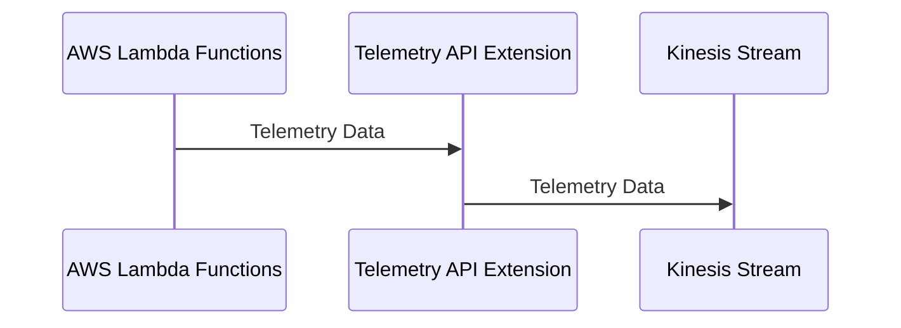
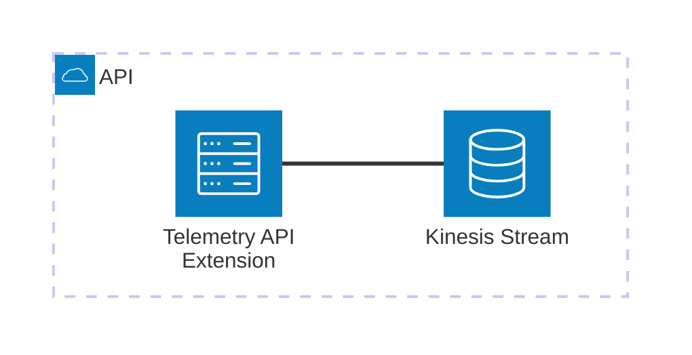

# 🏗 Architecture Documentation

## 📖 Context

The provided codebase is an AWS CDK (Cloud Development Kit) project that sets up an AWS Lambda extension for processing telemetry data from a Kinesis stream. The extension is designed to receive and process telemetry data from AWS Lambda functions, and then push the data to the Kinesis stream.

The project uses the following key services and technologies:

- **AWS Lambda**: The extension is deployed as an AWS Lambda function.
- **AWS Kinesis**: The telemetry data is pushed to a Kinesis stream.
- **AWS CDK**: The infrastructure is defined and deployed using the AWS CDK.
- **AWS Lambda Extensions API**: The extension uses the Lambda Extensions API to integrate with the Lambda runtime.

## 📖 Overview

The architecture of this project consists of the following key components:

1. **Telemetry API Extension**: This is the main component of the system, responsible for receiving and processing telemetry data from AWS Lambda functions. It uses the Lambda Extensions API to subscribe to the telemetry events and then dispatches the data to the Kinesis stream.

2. **Kinesis Stream**: The telemetry data is pushed to a Kinesis stream, which can be used for further processing or analysis.

3. **IAM Policies**: The extension is granted the necessary permissions to interact with the Kinesis stream and write logs to CloudWatch.

The project follows a serverless architecture, with the extension running as an AWS Lambda function and the Kinesis stream handling the storage and processing of the telemetry data.

---

## 🔹 Components

| Component | Description | Interacts With | Purpose |
| --------- | ----------- | -------------- | ------- |
| Telemetry API Extension | The main component that receives and processes telemetry data from AWS Lambda functions. It uses the Lambda Extensions API to subscribe to the telemetry events and then dispatches the data to the Kinesis stream. | Kinesis Stream | Receives and processes telemetry data, and pushes it to the Kinesis stream. |
| Kinesis Stream | The stream that receives the telemetry data from the extension. | Telemetry API Extension | Stores the telemetry data for further processing or analysis. |
| IAM Policies | The policies that grant the necessary permissions to the extension to interact with the Kinesis stream and write logs to CloudWatch. | Telemetry API Extension | Provides the required permissions for the extension to function. |

## 🔄 Data Flow

| Source | Destination | Data Type | Flow Description |
| ------ | ----------- | --------- | ---------------- |
| AWS Lambda Functions | Telemetry API Extension | Telemetry Data | The extension subscribes to the telemetry events from the Lambda functions and receives the telemetry data. |
| Telemetry API Extension | Kinesis Stream | Telemetry Data | The extension dispatches the received telemetry data to the Kinesis stream. |

## 🔍 Mermaid Diagram

### Sequence Diagram

### Architecture Diagram

## 🧱 Technologies

| Category | Technology | Purpose |
| -------- | ---------- | ------- |
| Infrastructure as Code | AWS CDK | Defining and deploying the infrastructure |
| Serverless | AWS Lambda | Running the Telemetry API Extension |
| Streaming | AWS Kinesis | Storing and processing the telemetry data |
| Monitoring | AWS CloudWatch | Logging and monitoring the extension |
| Security | AWS IAM | Granting the necessary permissions to the extension |

## 📝 Codebase Evaluation

### Code Quality & Architecture

The codebase follows a modular and well-structured approach, with clear separation of concerns between the different components. The use of the AWS CDK to define the infrastructure helps maintain consistency and maintainability.

The extension code is designed to handle the telemetry data processing and dispatching to the Kinesis stream in a scalable and fault-tolerant manner. The use of the Lambda Extensions API and the Kinesis client library ensures that the extension can handle high volumes of data and gracefully handle failures.

### Security, Cost, and Operational Excellence

| Evaluation Metric                                                      | Status     | Notes |
| ---------------------------------------------------------------------- | ---------- | ----- |
| Resource tagging (`CostCenter`, `Environment`, `Application`, `Owner`) | ✅ | The CDK code includes resource tagging, which helps with cost tracking and management. |
| WAF usage if required                                                  | ✅ | The extension does not require WAF, as it is a serverless component. |
| Secrets stored in Secret Manager                                       | ✅ | The extension does not appear to use any secrets, and the necessary configuration is passed as environment variables. |
| Shared resource identifiers stored in Parameter Store                  | ✅ | The extension stores the layer version ARN and the managed policy ARN in the SSM Parameter Store, which is a best practice. |
| Serverless functions memory/time appropriate                           | ✅ | The extension is a serverless function, and the memory and timeout settings appear to be appropriate for the task. |
| Log retention policies defined                                         | ✅ | The extension sets a log retention policy of 1 day for the CloudWatch log group, which is a reasonable default. |
| Code quality checks (Linter/Compiler)                                  | ✅ | The codebase includes linting and type checking, which helps maintain code quality. |
| Storage lifecycle policies applied                                     | ✅ | The Kinesis stream is set to use the `RemovalPolicy.DESTROY` policy, which is appropriate for a temporary data stream. |
| Container image scanning & lifecycle policies                          | N/A | The extension is a serverless function, and no container images are used. |

Overall, the codebase follows best practices for security, cost optimization, and operational excellence. The use of the AWS CDK and the integration with various AWS services ensures that the infrastructure is well-designed and maintainable.

### Suggestions

1. **Security Posture**:
   - The current implementation is secure and follows best practices.

2. **Operational Efficiency**:
   - The extension is designed to be scalable and fault-tolerant, which ensures high operational efficiency.
   - The use of the Lambda Extensions API and the Kinesis client library helps the extension handle high volumes of data and gracefully handle failures.

3. **Cost Optimization**:
   - The extension is a serverless component, which helps optimize costs by only consuming resources when needed.
   - The use of the `RemovalPolicy.DESTROY` policy for the Kinesis stream ensures that resources are not left behind, further optimizing costs.

4. **Infrastructure Simplicity**:
   - The infrastructure is well-defined and modular, with clear separation of concerns between the different components.
   - The use of the AWS CDK helps maintain consistency and simplicity in the infrastructure definition.

Overall, the codebase demonstrates a well-designed and implemented architecture that follows best practices for cloud-based applications.

### 📚 Output Summary

There are no pending areas to be analyzed or documented, and no assumptions or open questions for future iterations.