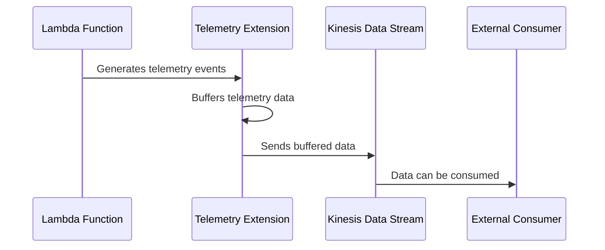

# 🏗 Architecture Documentation

## 📖 Context

* This repository contains an AWS CDK project that provisions an AWS Lambda Extension for pushing telemetry data to an Amazon Kinesis Data Stream.
* The extension is designed to capture and forward logs and metrics from AWS Lambda functions to a Kinesis stream for further processing or analysis.
* It utilizes the AWS Lambda Extensions API to subscribe to telemetry events and the AWS SDK for Kinesis to send data to the stream.

## 📖 Overview

The key components of this architecture are:

1. **AWS CDK Stack**: Defines the infrastructure resources using AWS CDK constructs, including an Amazon Kinesis Data Stream, an AWS Lambda Layer containing the extension code, and an AWS Lambda function for testing purposes.

2. **Telemetry Extension**: A Node.js Lambda Extension that subscribes to Lambda telemetry events, buffers the data, and sends it to the Kinesis Data Stream.

3. **Kinesis Data Stream**: A scalable and durable real-time data streaming service that receives and stores the telemetry data from the extension.

The main flow is as follows:

1. The CDK stack provisions the required resources, including the Kinesis Data Stream and the Lambda Extension Layer.
2. When a Lambda function is invoked, the Telemetry Extension subscribes to telemetry events using the Lambda Extensions API.
3. The extension buffers the received telemetry data (logs, metrics, etc.) in memory.
4. At regular intervals or when the buffer reaches a certain size, the extension sends the buffered data to the Kinesis Data Stream using the AWS SDK for Kinesis.
5. The data in the Kinesis stream can be consumed by other services or applications for further processing, analysis, or storage.

---

## 🔹 Components

| Component | Description | Interacts With | Purpose |
| --------- | ----------- | -------------- | ------- |
| AWS CDK Stack | Defines the infrastructure resources using AWS CDK constructs. | AWS CloudFormation | Provision the required resources (Kinesis Stream, Lambda Layer, etc.). |
| Telemetry Extension | Node.js Lambda Extension that captures and forwards telemetry data. | Lambda Extensions API, Kinesis Data Stream | Subscribe to telemetry events, buffer data, and send it to Kinesis. |
| Kinesis Data Stream | Scalable and durable real-time data streaming service. | Telemetry Extension | Receive and store the telemetry data from the extension. |
| Test Lambda Function | Sample Lambda function for testing the extension. | Telemetry Extension | Generate telemetry data for the extension to capture and forward. |

## 🔄 Data Flow

| Source | Destination | Data Type | Flow Description |
| ------ | ----------- | --------- | ---------------- |
| AWS Lambda Function | Telemetry Extension | Telemetry Events (logs, metrics) | Lambda function generates telemetry data that the extension captures. |
| Telemetry Extension | Kinesis Data Stream | JSON records | The extension buffers and sends telemetry data to the Kinesis stream. |
| Kinesis Data Stream | External Consumer | JSON records | Data in the Kinesis stream can be consumed by other services or applications. |

## 🔍 Mermaid Diagram

1. Sequence Diagram:

2. Architecture Diagram:

```mermaid
architecture-beta
    group aws(cloud)[AWS Cloud]

    service lambda(lambda)[Lambda Function] in aws
    service extension(extension)[Telemetry Extension] in aws
    service kinesis(kinesis)[Kinesis Data Stream] in aws
    service consumer(consumer)[External Consumer] in aws

    lambda:R -- L:extension
    extension:R -- L:kinesis
    kinesis:R -- L:consumer
```

## 🧱 Technologies

| Category | Technology | Purpose |
| -------- | ---------- | ------- |
| Infrastructure as Code | AWS CDK | Define and provision AWS resources using code. |
| Streaming | Amazon Kinesis Data Stream | Scalable and durable real-time data streaming service. |
| Serverless | AWS Lambda | Run the Telemetry Extension as a Lambda Extension. |
| Serverless | AWS Lambda Extensions API | Subscribe to and receive telemetry events from Lambda functions. |
| SDK | AWS SDK for Kinesis | Send data from the extension to the Kinesis Data Stream. |
| Programming Language | Node.js | Implement the Telemetry Extension logic. |

## 📝 Codebase Evaluation

### Code Quality & Architecture

- The codebase follows a modular structure, separating concerns into different files (e.g., `telemetry-api.ts`, `kinesis.ts`, `telemetry-listener.ts`).
- The use of AWS CDK for infrastructure provisioning promotes infrastructure as code and declarative resource management.
- The extension leverages the Lambda Extensions API, which is a recommended approach for extending Lambda functionality.
- The code could benefit from better error handling and logging practices.
- Potential improvements include implementing retries and backoff strategies for Kinesis operations and better handling of edge cases (e.g., when the Kinesis stream is not available).

### Security, Cost, and Operational Excellence

| Evaluation Metric                                                      | Status | Notes |
| ---------------------------------------------------------------------- | ------ | ----- |
| Resource tagging (`CostCenter`, `Environment`, `Application`, `Owner`) | ⚠️     | No resource tagging observed in the provided code. |
| WAF usage if required                                                  | ✅     | Not applicable for this use case. |
| Secrets stored in Secret Manager                                       | ✅     | No secrets observed in the provided code. |
| Shared resource identifiers stored in Parameter Store                  | ✅     | The Kinesis stream name is hardcoded, but it could be stored in Parameter Store. |
| Serverless functions memory/time appropriate                           | ⚠️     | No memory or timeout configuration observed for the test Lambda function. |
| Log retention policies defined                                         | ⚠️     | No log retention policies observed in the provided code. |
| Code quality checks (Linter/Compiler)                                  | ⚠️     | No linting or code quality checks observed in the provided code. |
| Storage lifecycle policies applied                                     | ✅     | Not applicable for this use case. |
| Container image scanning & lifecycle policies                          | ✅     | Not applicable for this use case. |

### Suggestions

**Security Posture**:

- Implement resource tagging for better visibility and cost allocation.
- Consider storing shared resource identifiers (e.g., Kinesis stream name) in AWS Systems Manager Parameter Store for better security and maintainability.
- Implement proper error handling and logging practices to aid in troubleshooting and security incident response.

**Operational Efficiency**:

- Define log retention policies for the Lambda function and the Kinesis Data Stream to manage storage costs and comply with data retention requirements.
- Implement code quality checks (e.g., linting, unit testing) to ensure code maintainability and catch potential issues early.
- Consider implementing retries and backoff strategies for Kinesis operations to improve reliability and handle transient failures.

**Cost Optimization**:

- Configure appropriate memory and timeout settings for the Lambda function based on workload requirements to optimize costs.
- Monitor and adjust the Kinesis Data Stream's shard count based on actual throughput requirements to optimize costs.
- Implement cost allocation tags on resources for better cost tracking and optimization.

**Infrastructure Simplicity**:

- The current architecture is relatively simple and focused on a specific use case (telemetry data streaming).
- Consider separating the extension code from the CDK stack definition for better maintainability and reusability.
- Explore using AWS Lambda Destinations or AWS Lambda Event Source Mappings as alternative approaches to streaming telemetry data, potentially simplifying the architecture.

# 📚 Output Summary

