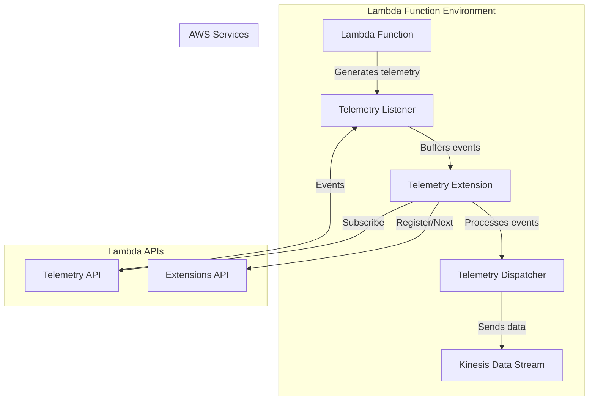
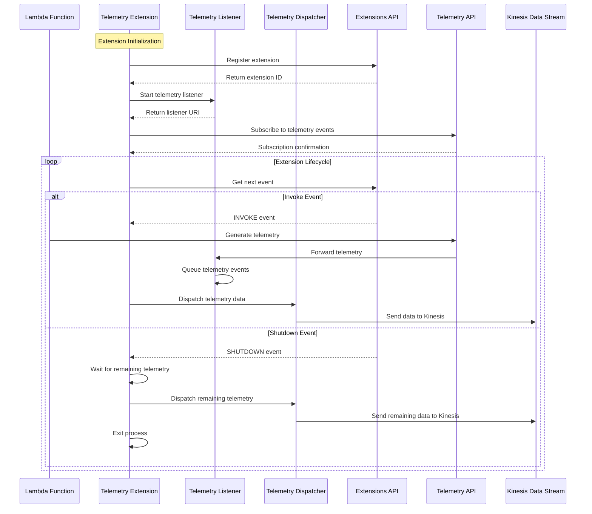

# Kinesis Telemetry Extension

## Overview

The Kinesis Telemetry Extension is an AWS Lambda Extension that captures telemetry data from Lambda functions and forwards it to Amazon Kinesis Data Streams. This extension leverages the Lambda Extensions API and Telemetry API to collect and process telemetry events during the Lambda function lifecycle.

## Architecture

### Component Diagram



### Sequence Diagram



## Implementation Details

### Components

1. **Extensions API Client**: Handles registration and lifecycle events with the Lambda Extensions API
2. **Telemetry API Client**: Subscribes to and receives telemetry events from the Lambda Telemetry API
3. **Telemetry Listener**: HTTP server that receives telemetry events from the Telemetry API
4. **Telemetry Dispatcher**: Processes and sends telemetry data to Kinesis
5. **Kinesis Client**: Handles the communication with Amazon Kinesis Data Streams

### Configuration Parameters

| Parameter | Description | Default Value |
|-----------|-------------|---------------|
| `BUFFER_TIMEOUT_MS` | Timeout for buffering telemetry events | 100ms |
| `LOGS_BUFFER_MAX_BYTES` | Maximum buffer size in bytes | 256KB |
| `MAX_BUFFER_ITEMS_COUNT` | Maximum number of events in buffer | 1000 |
| `MAX_BATCH_RECORDS_ITEMS` | Threshold for dispatching events to Kinesis | 5 |
| `CONNECTION_TIMEOUT_MS` | HTTP connection timeout | 3600000ms (1 hour) |

## Infrastructure

The extension is deployed as a Lambda Layer using AWS CDK. The infrastructure includes:

1. **Lambda Layer**: Contains the extension code
2. **Kinesis Data Stream**: Destination for telemetry data
3. **IAM Managed Policy**: Grants permissions for the extension to write to Kinesis
4. **SSM Parameters**: Store the ARN of the extension layer and managed policy

### Dependencies

| Dependency | Type | Purpose |
|------------|------|---------|
| `@aws-sdk/client-kinesis` | npm package | AWS SDK for Kinesis |
| `@smithy/node-http-handler` | npm package | HTTP handler for AWS SDK |
| `undici` | npm package | HTTP client |

## Usage

To use this extension:

1. Deploy the extension using CDK: `pnpm run app:dev`
2. Retrieve the extension ARN from SSM Parameter Store: `/telemetry/kinesis/extension/arn`
3. Retrieve the managed policy ARN from SSM Parameter Store: `/telemetry/kinesis/runtime/policy/arn`
4. Add the extension as a layer to your Lambda function
5. Attach the managed policy to your Lambda function's execution role

## Development

### Building the Extension

```bash
# Clean up previous builds
pnpm run prebuild

# Build the extension
pnpm run build

# Deploy the extension
pnpm run app:dev
```

### Testing

The extension includes a test Lambda function that demonstrates its usage. The function is deployed as part of the CDK stack.